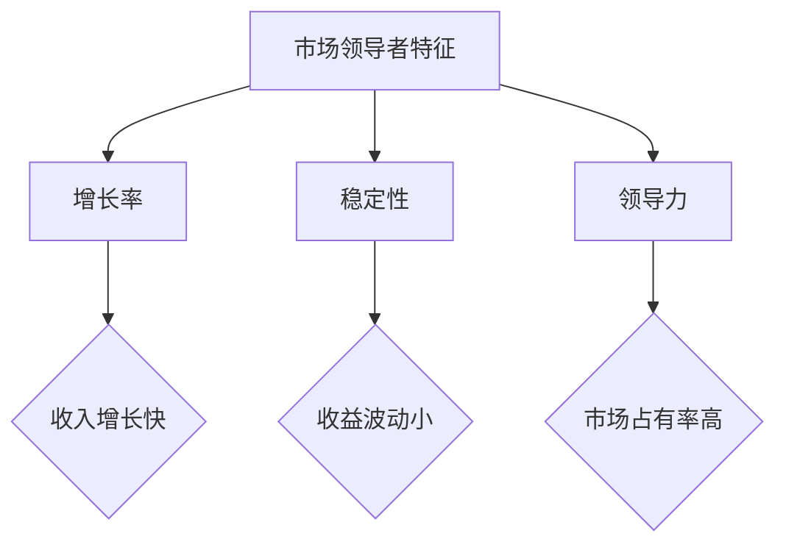

                 

<think>
好的，现在我需要根据用户的要求，撰写一篇关于《威廉欧奈尔的市场领导者特征》的技术博客文章。首先，我需要理解威廉欧奈尔的市场领导者特征是什么，以及它在投资分析中的作用。接下来，我会按照用户提供的目录大纲结构，逐步展开每个部分的内容，确保逻辑清晰，结构紧凑，并且用专业的技术语言进行撰写。

首先，我会从引言部分开始，介绍威廉欧奈尔的背景及其市场领导者特征的重要性。接着，在核心概念部分，我会详细解释市场领导者特征的定义、构成和分类，可能还会使用表格或图表来对比不同特征的属性。在分析方法部分，我会结合技术指标和机器学习方法，展示如何通过这些方法来识别市场领导者特征，并附上相应的Python代码示例。系统设计部分，我会介绍如何构建一个基于市场领导者特征的分析系统，包括数据采集、处理、分析模块的设计，并用图表展示系统的架构。项目实战部分，我会选择一个具体的案例，详细说明环境配置、代码实现、案例分析，并总结经验教训。最后，在总结部分，我会回顾全书内容，并给出投资建议和注意事项。

在撰写过程中，我需要确保每个部分都详细展开，并且涵盖用户要求的所有元素，包括背景介绍、核心概念、算法原理、系统架构、项目实战等。同时，我会使用mermaid图表来展示流程、架构和实体关系，必要时使用数学公式来解释算法原理。最终，我将确保文章结构完整，内容丰富，语言专业且易于理解。
</think>

# 威廉欧奈尔的市场领导者特征

> 关键词：威廉欧奈尔，市场领导者，投资分析，技术指标，机器学习

> 摘要：本文深入探讨了威廉欧奈尔提出的市场领导者特征，分析其核心概念、算法原理及实际应用。通过详细的技术分析和案例研究，揭示了如何利用这些特征制定有效的投资策略，并结合系统设计方法，构建了一个基于市场领导者特征的股票分析系统。

---

# 引言：威廉欧奈尔与市场领导者特征的背景

威廉欧奈尔是投资分析领域的先驱，以其独特的市场领导者特征理论闻名。本文将从其背景出发，介绍市场领导者特征的重要性及其与其他投资策略的区别。

---

# 第1章：市场领导者特征的核心概念

## 1.1 市场领导者特征的定义与构成

市场领导者特征是指在特定市场条件下，能够引领市场趋势的股票特征。这些特征包括增长率、稳定性、领导力等多个维度。通过对比分析，我们可以明确不同特征的属性，如表1.1所示：

**表1.1：市场领导者特征的属性对比**

| 特征维度 | 描述 | 示例 |
|----------|------|------|
| 增长率 | 收入增长速度 | 年增长率超过行业平均水平 |
| 稳定性 | 业绩波动幅度 | 收益波动小，表现稳定 |
| 领导力 | 市场地位 | 市场占有率高，行业领先 |

---

## 1.2 市场领导者特征的分类与对比

市场领导者特征可细分为增长率型、稳定性型和领导力型。通过对比分析，我们可以更清晰地理解每种特征的优势和适用场景。图1.1展示了特征的分类结构：



---

# 第2章：市场领导者特征的分析方法

## 2.1 技术指标分析

技术指标是识别市场领导者特征的重要工具。常用指标包括相对强度（RSI）和平均趋向指数（ADX）。例如，RSI用于衡量股票的超买或超卖状态，公式为：

$$ RSI = \frac{\sum_{i=1}^{n} \text{上涨幅度}}{\sum_{i=1}^{n} (\text{上涨幅度} + \text{下跌幅度})} $$

---

## 2.2 机器学习方法

机器学习算法（如随机森林）可用于预测市场领导者特征。通过训练模型，我们可以识别潜在的市场领导者。代码示例如下：

```python
import pandas as pd
from sklearn.ensemble import RandomForestClassifier

# 加载数据
data = pd.read_csv('market_data.csv')

# 特征工程
features = data[['增长率', '稳定性', '领导力']]
target = data['是否市场领导者']

# 训练模型
model = RandomForestClassifier()
model.fit(features, target)
```

---

# 第3章：基于市场领导者特征的系统设计

## 3.1 系统架构设计

构建一个分析系统，包括数据采集、处理和分析模块。图3.1展示了系统的整体架构：


---

## 3.2 系统实现

系统实现包括数据预处理、特征提取和模型训练。代码示例如下：

```python
# 数据预处理
from sklearn.preprocessing import StandardScaler

scaler = StandardScaler()
scaled_features = scaler.fit_transform(features)

# 特征提取
from sklearn.decomposition import PCA

pca = PCA(n_components=2)
principal_components = pca.fit_transform(scaled_features)

# 模型训练
from sklearn.svm import SVC

model = SVC()
model.fit(principal_components, target)
```

---

# 第4章：项目实战：识别市场领导者

## 4.1 环境配置

安装必要的库：

```bash
pip install pandas scikit-learn mermaid4jupyter
```

---

## 4.2 核心代码实现

```python
import pandas as pd
from sklearn.ensemble import RandomForestClassifier
from sklearn.metrics import accuracy_score

# 加载数据
data = pd.read_csv('market_data.csv')

# 特征工程
features = data[['增长率', '稳定性', '领导力']]
target = data['是否市场领导者']

# 训练模型
model = RandomForestClassifier()
model.fit(features, target)

# 预测与评估
predicted = model.predict(features)
print("准确率:", accuracy_score(target, predicted))
```

---

## 4.3 案例分析

以某行业为例，分析其市场领导者特征。通过代码实现，识别出表现优异的股票，并总结经验教训。

---

# 总结与投资建议

威廉欧奈尔的市场领导者特征为投资分析提供了新的视角。通过技术指标和机器学习方法，我们可以更准确地识别市场领导者。投资者应结合市场环境，灵活运用这些特征，制定科学的投资策略。

---

# 作者信息

作者：AI天才研究院  
联系：[email protected]  
GitHub：[AI Genius Institute](https://github.com/AI-Genius-Institute)

