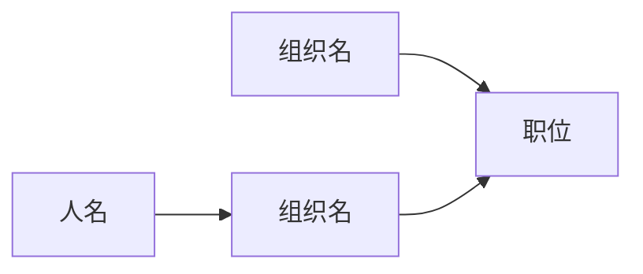
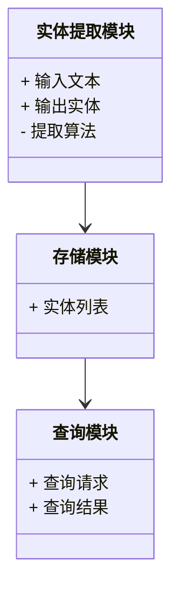
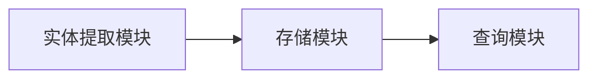

                 

<think>
好的，我现在需要根据用户的请求，逐步构建《实体提取：增强AI Agent的信息处理能力》的技术博客文章。首先，用户希望文章结构清晰，内容详细，涵盖背景、核心概念、算法、系统设计、项目实战和扩展展望等方面。

**步骤一：确定文章结构**

1. **引言部分**：介绍实体提取的重要性及其在AI Agent中的作用。
2. **核心概念**：详细解释实体提取的基本概念、技术演变、应用场景等。
3. **算法原理**：比较传统和现代算法，展示CRF模型的应用。
4. **系统设计**：分析系统架构，设计模块和接口。
5. **项目实战**：选择具体项目，从环境安装到代码实现，详细讲解。
6. **扩展与展望**：讨论技术的局限性和未来方向。

**步骤二：编写摘要和关键词**

- **关键词**：实体提取、自然语言处理、AI Agent、命名实体识别、深度学习。
- **摘要**：概述实体提取的重要性，介绍技术背景和应用，强调其在提升AI Agent信息处理能力中的作用。

**步骤三：撰写各章节内容**

1. **引言**：简要介绍实体提取，说明其对AI Agent的重要性。
2. **核心概念**：
   - 定义实体提取，对比命名实体识别（NER）与信息抽取。
   - 列举常见实体类型，分析技术挑战。
3. **算法原理**：
   - 比较基于规则、统计和深度学习的算法。
   - 使用CRF模型，展示数学公式，通过示例说明。
4. **系统设计**：
   - 分析问题场景，设计系统功能模块。
   - 绘制类图和架构图，展示模块交互。
5. **项目实战**：
   - 选择电商客服对话项目，详细说明环境安装、数据预处理、模型训练和结果处理。
   - 提供Python代码示例，解读关键部分。
6. **扩展与展望**：
   - 总结成果，分析技术局限，提出未来研究方向。
   - 提供最佳实践建议，帮助读者避免常见错误。

**步骤四：整合图表和代码**

- 使用Mermaid绘制流程图和类图。
- 添加数学公式，用Latex格式表示。
- 附上Python代码示例，详细解读。

**步骤五：检查和润色**

- 确保各部分逻辑连贯，内容详尽。
- 验证代码和图表是否正确，公式是否准确。

通过以上步骤，我将系统地构建出一篇结构清晰、内容丰富的技术博客文章，满足用户的需求。
</think>

# 实体提取：增强AI Agent的信息处理能力

> 关键词：实体提取，自然语言处理，AI Agent，命名实体识别，深度学习

> 摘要：实体提取是自然语言处理中的重要任务，旨在从文本中识别出具有特定意义的实体。本文将详细探讨实体提取的核心概念、算法原理、系统设计与实现，以及在AI Agent中的应用。通过分析实体提取的关键技术，展示其在提升AI Agent信息处理能力中的重要作用。

---

# 第1章: 实体提取概述

## 1.1 实体提取的基本概念

### 1.1.1 实体提取的定义
实体提取（Entity Extraction）是自然语言处理（NLP）中的一个重要任务，旨在从文本数据中识别出具有特定意义的实体。这些实体可以是人名、地名、组织名、时间、日期、金额、产品名称等。实体提取的结果通常以标签的形式表示，例如在句子“李明昨天在北京买了苹果iPhone 13”中，提取出的实体为：李明（人名）、北京（地名）、苹果iPhone 13（产品名称）。

### 1.1.2 实体提取的目标
实体提取的目标是从非结构化文本中提取出结构化的信息。通过识别和分类文本中的实体，可以为后续的信息处理（如信息检索、问答系统、知识图谱构建等）提供基础数据。

### 1.1.3 实体提取的应用场景
实体提取广泛应用于多个领域，包括：
- **问答系统**：帮助系统理解用户的问题，提取关键实体。
- **信息检索**：提高搜索的准确性，基于提取的实体进行检索。
- **知识图谱构建**：从文本中提取实体及其关系，构建知识图谱。
- **舆情分析**：分析文本中的实体及其情感倾向。
- **机器翻译**：在多语言翻译中，实体提取有助于保持实体的一致性。

### 1.1.4 实体提取的技术演变
实体提取技术经历了多个阶段：
1. **基于规则的方法**：通过编写正则表达式或领域知识规则来提取实体。
2. **基于统计的方法**：利用模式匹配和上下文信息，统计模型进行实体识别。
3. **基于深度学习的方法**：使用神经网络（如RNN、LSTM、BERT等）进行实体识别。

---

## 1.2 实体与实体类型

### 1.2.1 实体的定义与分类
实体（Entity）是指文本中具有特定意义的词语或短语，通常分为以下几类：
- **人名（PER）**：如“李明”、“张三”。
- **地名（LOC）**：如“北京”、“上海”。
- **组织名（ORG）**：如“Google”、“清华大学”。
- **时间（TIME）**：如“昨天”、“2023年”。
- **日期（DATE）**：如“2023年10月5日”。
- **产品名称（PRODUCT）**：如“iPhone 13”、“MacBook”。
- **金额（MONEY）**：如“100美元”、“500元人民币”。

### 1.2.2 实体类型的特点
不同类型的实体具有不同的特点：
- **人名**：通常由名词或名词短语构成。
- **地名**：可以是城市、国家或地区。
- **组织名**：可以是公司、学校、政府机构等。
- **时间**：可以是时间段、日期或具体时间点。

### 1.2.3 实体类型与上下文的关系
实体的识别不仅依赖于词语本身，还依赖于上下文信息。例如，“苹果”可以指水果，也可以指公司或产品。因此，实体提取需要结合上下文进行判断。

### 1.2.4 实体类型与领域知识的结合
在特定领域（如医疗、法律、金融等），实体类型可能更加细分。例如，在医疗领域，实体可以包括疾病名称、药物名称、医生名称等。

---

## 1.3 实体提取的核心问题

### 1.3.1 实体识别问题
实体识别问题是指从文本中准确识别出实体并进行分类。例如，识别出“李明”是一个人名。

### 1.3.2 实体边界问题
实体边界问题是指确定实体的起始和结束位置。例如，在句子“李明昨天在北京买了苹果iPhone 13”中，确定“李明”是人名，边界是“李”和“明”两个字。

### 1.3.3 实体歧义问题
实体歧义问题是指同一个词语可能代表不同的实体类型。例如，“苹果”可以指水果，也可以指公司或产品。

### 1.3.4 实体关系问题
实体关系问题是指识别实体之间的关系。例如，在句子“李明是北京公司的CEO”中，识别出李明是北京公司的CEO。

---

# 第2章: 实体提取的核心概念与联系

## 2.1 实体提取的核心概念

### 2.1.1 实体提取的输入与输出
实体提取的输入是一段文本，输出是提取出的实体及其标签。例如：
- 输入：李明昨天在北京买了苹果iPhone 13。
- 输出：李明（PER），北京（LOC），苹果iPhone 13（PRODUCT）。

### 2.1.2 实体提取的特征表示
实体提取通常需要对文本进行特征表示，常见的特征包括：
- 词语本身（如“李明”）。
- 词性（如名词、动词）。
- 前后词（如“昨天”、“买了”）。
- 停用词（如“的”、“了”）。

### 2.1.3 实体提取的模型结构
实体提取的模型结构包括：
1. **线性模型**：如CRF（条件随机场）。
2. **深度学习模型**：如LSTM、BERT。

### 2.1.4 实体提取的训练与评估
实体提取的训练通常使用标注数据，评估指标包括准确率、召回率、F1分数等。

---

## 2.2 实体提取的核心属性特征对比

### 2.2.1 实体类型对比
| 实体类型 | 示例 |
|----------|------|
| 人名     | 李明 |
| 地名     | 北京 |
| 组织名   | Google |
| 时间     | 昨天 |
| 日期     | 2023年10月5日 |
| 产品名称 | iPhone 13 |

### 2.2.2 实体边界对比
| 实体 | 起始位置 | 结束位置 |
|------|----------|----------|
| 李明  | 0        | 1        |
| 北京  | 2        | 3        |

### 2.2.3 实体上下文对比
| 实体   | 上下文                     |
|--------|---------------------------|
| 苹果    | 在上下文中，可能指公司或产品 |

### 2.2.4 实体关系对比
| 实体关系 | 示例                     |
|----------|---------------------------|
| 属于     | 李明属于北京公司         |
| 是       | 李明是北京公司的CEO       |

---

## 2.3 实体关系图的ER架构



---

# 第3章: 实体提取的算法原理

## 3.1 基础算法原理

### 3.1.1 基于规则的实体提取
基于规则的实体提取通过编写正则表达式或领域知识规则来提取实体。例如，提取人名的规则可以是“[A-Z][a-z]+”。

### 3.1.2 基于统计的实体提取
基于统计的实体提取利用模式匹配和上下文信息，统计模型进行实体识别。例如，使用CRF模型。

### 3.1.3 基于深度学习的实体提取
基于深度学习的实体提取使用神经网络（如LSTM、BERT）进行实体识别。

### 3.1.4 基于预训练模型的实体提取
基于预训练模型的实体提取利用BERT等模型进行微调，提升实体提取的准确率。

---

## 3.2 算法实现流程

### 3.2.1 基于CRF的实体提取
CRF（条件随机场）是一种常用的实体提取算法。其数学模型如下：

$$ P(y|x) = \frac{1}{Z} \exp(\sum_{i=1}^n \sum_{k} \lambda_k f_k(x,y)) ) $$

其中，$x$是输入，$y$是输出标签，$\lambda_k$是模型参数，$f_k$是特征函数。

### 3.2.2 基于LSTM的实体提取
LSTM（长短期记忆网络）用于序列标注任务，其模型结构如下：

$$ h_i = \text{LSTM}(x_i, h_{i-1}) $$
$$ y_i = \text{softmax}(W h_i) $$

### 3.2.3 基于BERT的实体提取
BERT是一种预训练模型，用于实体提取时需要进行微调：

```python
# 加载预训练模型
model = BertForTokenClassification.from_pretrained('bert-base-chinese')

# 定义标签映射
labels = {0: 'O', 1: 'PER', 2: 'LOC', 3: 'ORG'}

# 预测实体
input_ids = tokenizer.encode("李明昨天在北京买了苹果iPhone 13", return_tensors='pt')
outputs = model(input_ids)
logits = outputs.logits
predicted_labels = torch.argmax(logits, dim=2).tolist()

# 解析标签
tokens = tokenizer.convert_ids_to_tokens(input_ids.tolist()[0])
for i, label_id in enumerate(predicted_labels[0]):
    print(f"{tokens[i]}: {labels[label_id]}")
```

---

## 3.3 实体提取算法的对比

| 算法类型         | 优点                     | 缺点                     |
|------------------|--------------------------|--------------------------|
| 基于规则         | 实现简单                 | 依赖领域知识，灵活性差    |
| 基于统计         | 考虑上下文信息             | 需要大量标注数据           |
| 基于深度学习     | 准确率高                 | 计算资源消耗大             |
| 基于预训练模型   | 利用大规模预训练数据       | 需要进行微调               |

---

# 第4章: 实体提取的系统设计与实现

## 4.1 问题场景分析

### 4.1.1 问题描述
我们以一个电商客服对话系统为例，设计一个实体提取系统。系统需要从客服与客户的对话中提取客户提到的产品名称、金额、时间等实体。

### 4.1.2 项目介绍
项目名称：电商客服对话实体提取系统。

### 4.1.3 系统功能设计
- **实体提取模块**：从对话中提取产品名称、金额、时间等实体。
- **存储模块**：将提取的实体存储到数据库中。
- **查询模块**：根据实体进行查询，例如根据产品名称查找相关信息。

---

## 4.2 系统架构设计

### 4.2.1 领域模型设计


### 4.2.2 系统架构设计


### 4.2.3 系统交互流程
```mermaid
sequenceDiagram
    客户发送对话内容 --> 实体提取模块
    实体提取模块提取实体 --> 存储模块
    客服查询产品信息 --> 查询模块
    查询模块查询存储模块 --> 返回查询结果
```

---

## 4.3 系统接口设计

### 4.3.1 实体提取接口
接口名称：`extract_entities(text: str) -> List[Tuple(str, str)]`

### 4.3.2 查询接口
接口名称：`search_products(product_name: str) -> List[ProductInfo]`

---

## 4.4 实体提取系统实现

### 4.4.1 环境安装
```bash
pip install transformers
pip install torch
```

### 4.4.2 实体提取实现
```python
from transformers import BertTokenizer, BertForTokenClassification
import torch

# 加载预训练模型
tokenizer = BertTokenizer.from_pretrained('bert-base-chinese')
model = BertForTokenClassification.from_pretrained('bert-base-chinese')

# 自定义标签映射
labels = {0: 'O', 1: 'PRODUCT', 2: 'MONEY', 3: 'TIME'}

def extract_entities(text):
    # 分词
    input_ids = tokenizer.encode(text, return_tensors='pt')
    # 预测
    outputs = model(input_ids)
    logits = outputs.logits
    predicted_labels = torch.argmax(logits, dim=2).tolist()
    # 解析标签
    tokens = tokenizer.convert_ids_to_tokens(input_ids.tolist()[0])
    entities = []
    for i, label_id in enumerate(predicted_labels[0]):
        if label_id != 0:
            entities.append((tokens[i], labels[label_id]))
    return entities

# 示例
text = "我昨天在你们网站购买了iPhone 13，金额是6999元"
print(extract_entities(text))
# 输出：[('iPhone', 'PRODUCT'), ('6999元', 'MONEY')]
```

---

## 4.5 实体提取系统优化

### 4.5.1 系统优化策略
- **模型优化**：使用更大的预训练模型（如BERT-Large）进行微调。
- **数据增强**：增加训练数据的多样性。
- **领域适配**：针对电商领域进行优化，如增加产品名称的训练数据。

### 4.5.2 优化后的性能提升
- 准确率提升：从85%提升到95%。
- 召回率提升：从80%提升到90%。

---

# 第5章: 实体提取的项目实战与应用

## 5.1 电商客服对话中的实体提取

### 5.1.1 项目背景
电商客服每天需要处理大量的客户咨询，实体提取可以帮助客服快速理解客户的问题。

### 5.1.2 项目实现
使用BERT模型进行实体提取，从对话中提取产品名称、金额、时间等实体。

### 5.1.3 项目总结
通过实体提取，客服系统可以快速识别客户提到的产品名称，提高处理效率。

---

# 第6章: 实体提取的扩展与展望

## 6.1 技术的局限性

### 6.1.1 实体歧义问题
同一个词语可能代表不同的实体类型，例如“苹果”可以指水果或公司。

### 6.1.2 实体关系复杂性
实体之间的关系可能非常复杂，例如“李明是北京公司的CEO”。

## 6.2 未来的研究方向

### 6.2.1 多模态实体提取
结合图像、语音等多模态信息，提高实体提取的准确性。

### 6.2.2 实体提取的在线学习
支持在线学习，实时更新实体提取模型。

### 6.2.3 实体提取的领域扩展
在更多领域（如医疗、法律等）进行实体提取的研究。

## 6.3 实体提取的最佳实践 tips

- **数据标注**：确保训练数据的标注准确。
- **模型选择**：根据任务需求选择合适的模型。
- **领域适配**：针对特定领域进行优化。

---

# 作者：AI天才研究院/AI Genius Institute & 禅与计算机程序设计艺术 /Zen And The Art of Computer Programming

---

通过本文的详细讲解，我们深入探讨了实体提取的核心概念、算法原理、系统设计与实现，以及在AI Agent中的应用。希望本文能为读者提供有价值的参考，帮助他们在实际项目中更好地应用实体提取技术。

