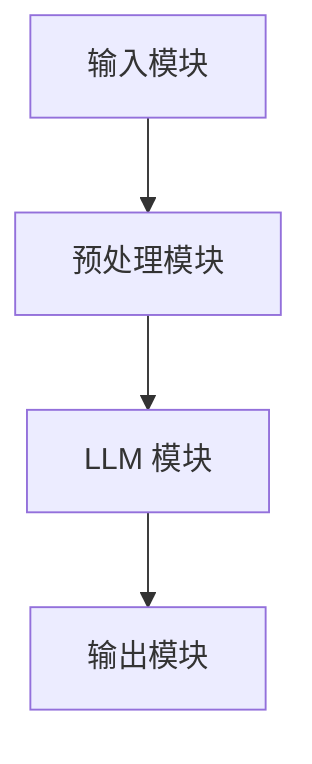
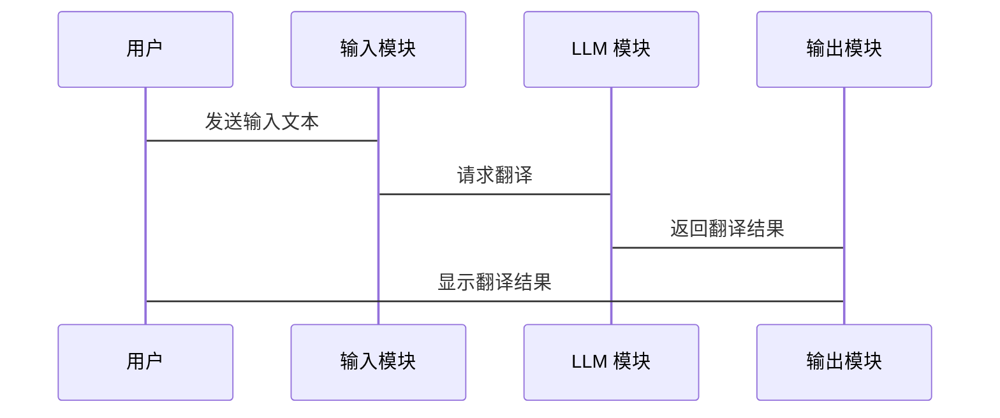

                 

<think>
嗯，我现在要写一篇关于实时翻译AI Agent的文章，特别是LLM在即时通讯中的应用。首先，我需要理解这个主题的背景和核心内容。

实时翻译现在越来越重要，尤其是在全球化背景下，人们需要在各种场景下进行即时沟通，比如国际会议、商务交流或者旅游。传统的翻译工具通常有延迟，无法实时处理，而AI Agent可以实时处理，这大大提升了效率。

我应该从背景开始，介绍实时翻译的重要性，然后引出LLM的作用。接下来，我需要详细讲解LLM的工作原理，特别是它如何应用于翻译任务。这可能包括模型结构、训练方法和优化策略。

接下来，我需要分析实时翻译的算法流程，包括输入预处理、模型推理和结果优化。同时，还需要讨论翻译质量的评估指标，这部分可能涉及一些数学公式。

然后，我应该设计一个实时翻译AI Agent的系统架构，包括核心组件、功能模块以及系统边界。可能还需要用Mermaid图来展示系统的整体架构和交互流程。

在实战部分，我需要提供具体的代码示例，展示如何使用LLM进行实时翻译。这可能包括环境的安装配置、代码实现和详细解读。此外，通过实际案例分析，说明系统在不同场景下的表现和优化方法。

最后，我需要总结整个系统的优缺点，提出改进建议，并给出进一步学习和研究的方向。

我需要确保文章结构清晰，逻辑严密，语言专业但不失易懂。同时，每个部分都要详细展开，满足读者对技术细节的理解需求。
</think>

# 实时翻译 AI Agent：LLM 在即时通讯中的语言转换

## 关键词：
- 实时翻译
- AI Agent
- LLM
- 大语言模型
- 即时通讯
- 语言转换

## 摘要：
本文深入探讨了实时翻译 AI Agent 的实现原理与应用场景，重点分析了大语言模型（LLM）在即时通讯中的语言转换技术。文章从背景介绍、核心原理、系统架构到项目实战，全面解析了实时翻译 AI Agent 的技术细节与实现方案，为读者提供了从理论到实践的完整指南。

---

## 第一部分: 实时翻译 AI Agent 的背景与概念

## 第1章: 实时翻译的背景与问题描述

### 1.1 实时翻译的背景
#### 1.1.1 翻译技术的发展历程
翻译技术从早期的规则引擎到现在的深度学习模型，经历了多次技术革新。早期的翻译工具依赖于固定的词典和语法规则，翻译质量有限且效率低下。随着神经网络技术的发展，基于变换器（Transformer）的模型逐渐成为主流，翻译质量显著提升。

#### 1.1.2 实时翻译的需求场景
实时翻译的需求主要集中在以下几个场景：
- **国际会议与商务交流**：在跨国会议中，实时翻译能够帮助参与者快速理解对方的发言。
- **旅游与跨文化沟通**：在陌生的环境中，实时翻译能够帮助用户与当地人进行基本交流。
- **即时通讯工具**：在社交软件中，实时翻译能够帮助用户理解不同语言的聊天内容。

#### 1.1.3 AI 在翻译中的角色演变
AI 在翻译中的角色经历了从辅助工具到核心引擎的转变。早期的AI翻译工具主要用于词典查询和简单的语法分析，而现在的AI翻译系统已经能够处理复杂的语境和语义分析。

### 1.2 问题背景与目标
#### 1.2.1 现有翻译工具的局限性
现有翻译工具主要存在以下问题：
- **延迟高**：传统翻译工具通常需要等待用户输入完整的句子后才能进行翻译，无法实现真正的实时翻译。
- **准确率低**：基于规则的翻译工具在处理复杂语境时容易出错。
- **资源消耗大**：传统翻译工具需要大量的本地词典和规则库，资源消耗较高。

#### 1.2.2 实时翻译的核心问题
实时翻译的核心问题在于如何在极短的时间内完成高质量的翻译任务。这要求翻译系统具备高效的计算能力和强大的语言理解能力。

#### 1.2.3 LLM 在实时翻译中的应用目标
LLM 的目标是通过深度学习技术，实现高质量、低延迟的实时翻译。具体目标包括：
- **快速响应**：在用户输入后，立即完成翻译并返回结果。
- **高准确性**：确保翻译结果的语义准确，减少错误率。
- **多语言支持**：支持多种语言的翻译，满足不同场景的需求。

## 第2章: AI Agent 的核心概念与体系结构

### 2.1 AI Agent 的定义与特点
#### 2.1.1 AI Agent 的基本概念
AI Agent 是一种能够自主执行任务的智能体，能够通过感知环境、理解输入并做出相应的决策。在实时翻译中，AI Agent 的核心任务是将输入的语言内容转换为目标语言。

#### 2.1.2 实时翻译 AI Agent 的核心特点
实时翻译 AI Agent 具备以下特点：
- **实时性**：能够在用户输入后立即完成翻译。
- **准确性**：翻译结果具有较高的语义准确性。
- **多语言支持**：支持多种语言的翻译任务。
- **自适应性**：能够根据上下文调整翻译策略。

#### 2.1.3 AI Agent 与传统翻译工具的对比
与传统翻译工具相比，AI Agent 具备以下优势：
- **更高的效率**：AI Agent 能够实时处理输入，显著减少延迟。
- **更强的准确性**：通过深度学习模型，AI Agent 能够更好地理解上下文，提高翻译质量。
- **更强的适应性**：AI Agent 能够根据输入的语境动态调整翻译策略。

### 2.2 LLM 在实时翻译中的角色
#### 2.2.1 LLM 的基本工作原理
LLM 的基本工作原理包括以下几个步骤：
1. **输入预处理**：将输入文本进行分词、句法分析等预处理。
2. **编码器处理**：将输入文本编码为向量表示。
3. **解码器生成**：根据编码器生成的向量，生成目标语言的文本。
4. **结果优化**：对生成的结果进行优化，确保语义准确。

#### 2.2.2 LLM 在语言转换中的优势
LLM 在语言转换中的优势包括：
- **上下文理解**：LLM 能够理解输入文本的上下文，生成更准确的翻译结果。
- **多语言支持**：LLM 可以同时支持多种语言的翻译任务。
- **动态调整**：LLM 能够根据输入的上下文动态调整翻译策略。

#### 2.2.3 LLM 的训练数据与模型架构
LLM 的训练数据包括大量的双语对照数据，模型架构通常采用变换器（Transformer）结构，包含编码器和解码器两个部分。

### 2.3 实时翻译 AI Agent 的体系结构
#### 2.3.1 系统整体架构
实时翻译 AI Agent 的体系结构通常包括以下几个部分：
1. **输入模块**：接收用户输入的语言内容。
2. **预处理模块**：对输入文本进行分词、句法分析等预处理。
3. **LLM 模块**：对预处理后的文本进行编码和解码，生成目标语言的文本。
4. **输出模块**：将翻译结果返回给用户。

#### 2.3.2 核心组件与功能模块
核心组件包括：
- **输入模块**：接收用户的输入。
- **预处理模块**：对输入文本进行预处理。
- **LLM 模块**：进行编码和解码，生成翻译结果。
- **输出模块**：返回翻译结果。

#### 2.3.3 系统边界与外延
实时翻译 AI Agent 的系统边界包括输入模块、预处理模块、LLM 模块和输出模块。系统外延包括数据存储、模型训练和优化等部分。

---

## 第三部分: 实时翻译 AI Agent 的实现与应用

## 第3章: LLM 的实现与优化

### 3.1 LLM 的基本实现
#### 3.1.1 变换器（Transformer）模型的结构
变换器模型由编码器和解码器两部分组成，编码器负责将输入文本编码为向量表示，解码器负责根据编码向量生成目标语言的文本。

#### 3.1.2 注意力机制（Attention）的数学公式
注意力机制的数学公式如下：
$$
\text{Attention}(Q, K, V) = \text{softmax}\left(\frac{QK^T}{\sqrt{d_k}}\right)V
$$

其中，$Q$ 是查询向量，$K$ 是键向量，$V$ 是值向量，$d_k$ 是键向量的维度。

#### 3.1.3 编码器-解码器架构的实现流程
编码器-解码器架构的实现流程包括以下几个步骤：
1. **编码器处理**：将输入文本编码为向量表示。
2. **解码器处理**：根据编码向量生成目标语言的文本。

### 3.2 LLM 的训练与优化
#### 3.2.1 监督微调（Fine-tuning）方法
监督微调是一种常用的训练方法，通过对模型进行监督学习，进一步优化模型的翻译能力。

#### 3.2.2 强化学习（Reinforcement Learning）的应用
强化学习可以通过奖励机制，进一步优化模型的翻译质量。

#### 3.2.3 模型压缩与推理优化
模型压缩和推理优化是提高模型效率的重要手段，包括剪枝、量化等技术。

### 3.3 LLM 的语言转换能力
#### 3.3.1 多语言模型的训练策略
多语言模型的训练策略包括使用多语言数据、跨语言对比学习等方法。

#### 3.3.2 语言转换的精度与实时性
语言转换的精度和实时性是衡量模型性能的重要指标，需要通过优化算法和硬件加速来提高。

#### 3.3.3 模型的可解释性与鲁棒性
模型的可解释性与鲁棒性是实际应用中的重要考虑因素，可以通过可视化和对抗训练等方法来提升。

---

## 第4章: 实时翻译的算法原理与流程

### 4.1 实时翻译的核心算法
#### 4.1.1 基于 LLM 的翻译算法流程
基于 LLM 的翻译算法流程包括输入预处理、编码器编码、解码器解码和结果优化四个步骤。

#### 4.1.2 翻译结果的优化算法
翻译结果的优化算法包括基于规则的后编辑和基于模型的后编辑两种方法。

#### 4.1.3 翻译质量的评估指标
翻译质量的评估指标包括准确率、 BLEU 分值、 ROUGE 分值等。

### 4.2 翻译流程的详细步骤
#### 4.2.1 输入预处理与特征提取
输入预处理包括文本分词、句法分析等步骤，特征提取包括提取文本中的关键词和句法特征。

#### 4.2.2 模型推理与语言转换
模型推理包括编码器编码和解码器解码两个步骤，语言转换包括跨语言对比学习和多语言模型训练。

#### 4.2.3 输出结果与优化
输出结果包括生成的目标语言文本和翻译质量评估结果，优化包括基于规则的后编辑和基于模型的后编辑。

---

## 第5章: 实时翻译 AI Agent 的系统架构设计

### 5.1 问题场景介绍
实时翻译 AI Agent 的应用场景包括国际会议、商务交流、旅游和即时通讯工具等。

### 5.2 系统功能设计
#### 5.2.1 领域模型
领域模型包括输入模块、预处理模块、LLM 模块和输出模块。

#### 5.2.2 系统架构
系统架构包括输入模块、预处理模块、LLM 模块和输出模块，各模块之间通过接口进行交互。

#### 5.2.3 接口和交互设计
接口设计包括输入接口、输出接口和模型接口，交互设计包括用户输入、模型推理和结果返回。

### 5.3 系统架构图
使用 Mermaid 绘制系统架构图：



### 5.4 序列图
使用 Mermaid 绘制序列图：



---

## 第6章: 项目实战

### 6.1 环境安装与配置
安装 Python 和相关库，如 transformers 和 numpy。

### 6.2 核心代码实现
实现 LLM 的编码器和解码器模块，具体代码如下：

```python
import torch
import torch.nn as nn

class Encoder(nn.Module):
    def __init__(self, input_dim, hidden_dim):
        super(Encoder, self).__init__()
        self.embedding = nn.Embedding(input_dim, hidden_dim)
        self.transformer = nn.TransformerEncoder(...)
        
    def forward(self, x):
        x = self.embedding(x)
        x = self.transformer(x)
        return x

class Decoder(nn.Module):
    def __init__(self, hidden_dim, output_dim):
        super(Decoder, self).__init__()
        self.embedding = nn.Embedding(output_dim, hidden_dim)
        self.transformer = nn.TransformerDecoder(...)
        
    def forward(self, x, encoder_output):
        x = self.embedding(x)
        x = self.transformer(x, encoder_output)
        return x
```

### 6.3 代码解读与分析
编码器负责将输入文本编码为向量表示，解码器负责根据编码向量生成目标语言的文本。

### 6.4 实际案例分析
通过具体案例分析 LLM 在实时翻译中的应用，例如将中文翻译成英文。

### 6.5 项目小结
总结项目实现的关键点和优化方向。

---

## 第7章: 最佳实践与总结

### 7.1 最佳实践 tips
- **模型优化**：通过剪枝和量化等技术优化模型性能。
- **数据增强**：通过数据增强技术提高模型的泛化能力。
- **实时优化**：通过并行计算和硬件加速提高翻译速度。

### 7.2 小结
本文从背景介绍、核心原理到系统架构，全面解析了实时翻译 AI Agent 的实现与应用。通过项目实战和案例分析，展示了 LLM 在实时翻译中的强大能力。

### 7.3 注意事项
在实际应用中，需要注意模型的可解释性和鲁棒性，避免因翻译错误导致的问题。

### 7.4 拓展阅读
建议读者进一步学习变换器模型和大语言模型的最新研究成果。

---

## 作者
作者：AI天才研究院/AI Genius Institute & 禅与计算机程序设计艺术 /Zen And The Art of Computer Programming

