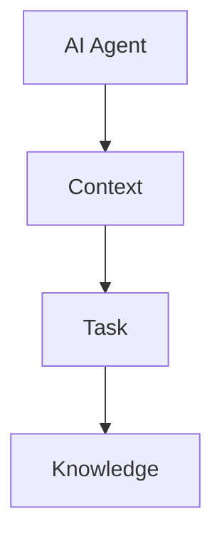
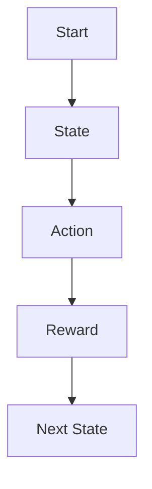
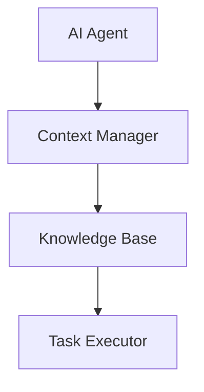

                 


```markdown
# 实现AI Agent的上下文切换能力

> 关键词：AI Agent, 上下文切换, 强化学习, 系统架构, 项目实战

> 摘要：本文详细探讨了实现AI Agent的上下文切换能力的关键技术，从问题背景、核心概念、算法原理到系统设计和项目实战，全面解析了如何有效管理AI Agent的上下文切换过程。通过实际案例分析和代码实现，为读者提供了深入的理解和实践指导。

---

# 第一部分: AI Agent的上下文切换能力背景介绍

## 第1章: 问题背景与概念解析

### 1.1 上下文切换的背景与重要性
#### 1.1.1 问题背景介绍
随着AI Agent在多个领域的广泛应用，上下文切换能力成为其核心功能之一。本文将探讨AI Agent在多任务处理中的上下文切换问题，分析其背景、挑战及解决方案。

#### 1.1.2 上下文切换的核心问题描述
AI Agent在执行任务时，常常需要在多个上下文之间切换。例如，智能助手在处理天气查询后，切换到股票查询任务时需要重新调整其知识库和推理机制。

#### 1.1.3 上下文切换的解决思路与方法
通过分析上下文切换的关键技术，本文提出了一种基于强化学习的上下文切换算法，结合知识表示与推理机制，实现高效的多任务切换。

#### 1.1.4 上下文切换的边界与外延
上下文切换的边界包括任务切换的起点和终点，以及切换过程中涉及的知识更新范围。外延则包括任务切换的成功判定标准和性能优化指标。

#### 1.1.5 上下文切换的概念结构与核心要素组成
上下文切换的核心要素包括：当前上下文、目标上下文、切换触发条件、切换过程和切换结果。其概念结构可以表示为一个有向图，节点为上下文，边为切换操作。

---

## 第2章: AI Agent的基本概念与核心能力
### 2.1 AI Agent的定义与分类
#### 2.1.1 AI Agent的定义
AI Agent是一种智能实体，能够感知环境、自主决策并执行任务。根据功能和应用场景的不同，AI Agent可以分为任务型、服务型和学习型三类。

#### 2.1.2 AI Agent的分类与特点
- **任务型AI Agent**：专注于完成特定任务，如智能助手。
- **服务型AI Agent**：提供持续的服务，如智能家居控制。
- **学习型AI Agent**：通过学习不断优化其行为，如AlphaGo。

#### 2.1.3 AI Agent的核心能力与功能
AI Agent的核心能力包括感知能力、推理能力、决策能力和执行能力。其功能则体现在任务处理、信息检索和人机交互等方面。

### 2.2 上下文切换的定义与实现机制
#### 2.2.1 上下文切换的定义
上下文切换是指AI Agent在执行任务过程中，从当前上下文切换到目标上下文的操作。其本质是通过知识更新和状态调整，使AI Agent能够适应新的任务环境。

#### 2.2.2 上下文切换的实现机制
上下文切换的实现机制包括：状态管理、知识更新和任务切换触发。其中，状态管理是核心，知识更新是关键，任务切换触发是触发条件。

#### 2.2.3 上下文切换的关键技术与挑战
- **状态管理技术**：如何高效存储和更新上下文状态。
- **知识更新技术**：如何快速检索和整合新任务所需的知识。
- **任务切换触发条件**：如何准确判断何时需要切换上下文。

---

## 第3章: AI Agent上下文切换的核心概念与联系

### 3.1 核心概念原理
#### 3.1.1 上下文管理模块的工作原理
上下文管理模块负责监控AI Agent的状态，识别切换触发条件，并执行上下文切换操作。其工作流程包括：状态感知、切换决策和上下文更新。

#### 3.1.2 知识表示与推理机制
知识表示采用图结构，推理机制基于规则和概率模型。知识表示的目的是为了快速检索和更新任务所需的知识。

#### 3.1.3 多任务切换的实现逻辑
多任务切换的实现逻辑包括：任务优先级排序、上下文状态同步和任务切换确认。

### 3.2 核心概念属性特征对比表
| 概念       | 属性1       | 属性2       | 属性3       |
|------------|-------------|-------------|-------------|
| 上下文切换  | 切换频率     | 切换复杂度   | 切换成功率   |
| 知识表示    | 表示方式     | 更新频率     | 表示精度     |

### 3.3 ER实体关系图


---

# 第二部分: AI Agent上下文切换的算法原理

## 第4章: 上下文切换的算法原理

### 4.1 基于强化学习的上下文切换算法
#### 4.1.1 算法原理与流程
基于强化学习的上下文切换算法通过状态-动作-奖励机制实现任务切换。其流程包括：状态感知、动作选择、奖励计算和状态更新。



#### 4.1.2 数学模型与公式
- 状态转移概率公式：
$$ P(s' | s, a) $$
- 奖励函数：
$$ R(s, a, s') $$

#### 4.1.3 算法实现代码
```python
import numpy as np

class DQN:
    def __init__(self, state_space, action_space):
        self.state_space = state_space
        self.action_space = action_space
        self.gamma = 0.99
        self.epsilon = 0.1
        self.model = self.build_model()

    def build_model(self):
        # 构建DQN神经网络模型
        pass

    def remember(self, state, action, reward, next_state):
        # 存储记忆
        pass

    def act(self, state):
        # 根据当前状态选择动作
        if np.random.random() < self.epsilon:
            return np.random.randint(self.action_space)
        else:
            # 使用模型预测
            pass

    def replay(self, batch_size):
        # 回放记忆并训练模型
        pass
```

---

## 第5章: 算法实现与优化

### 5.1 算法实现细节
- 神经网络模型的设计与训练。
- 记忆回放机制的实现。
- 奖励函数的设计与优化。

### 5.2 算法优化策略
- 参数调整：如学习率、折扣因子的优化。
- 网络结构优化：如增加隐藏层或调整激活函数。
- 多任务学习：结合其他任务信息提升切换效率。

---

# 第三部分: AI Agent上下文切换的系统设计与实现

## 第6章: 系统架构设计

### 6.1 系统功能设计
- 上下文管理模块：负责状态感知和切换决策。
- 知识库模块：存储和管理任务知识。
- 接口模块：提供API供其他系统调用。

### 6.2 系统架构图


### 6.3 接口设计
- 提供切换上下文的API接口。
- 支持多任务切换的批量处理。

---

## 第7章: 项目实战

### 7.1 环境安装
- 安装Python和相关库（如TensorFlow、Keras）。
- 配置开发环境。

### 7.2 核心代码实现
```python
def switch_context(agent, new_context):
    # 切换上下文的实现代码
    pass
```

### 7.3 案例分析
- 实际案例：AI Agent从天气查询任务切换到股票查询任务。
- 代码解读：详细分析上下文切换过程中的关键步骤。

---

## 第8章: 最佳实践与注意事项

### 8.1 最佳实践
- 定期更新知识库以保持上下文切换的准确性。
- 使用监控工具实时跟踪切换性能。
- 优化算法参数以提升切换效率。

### 8.2 小结
本文详细探讨了AI Agent上下文切换能力的实现过程，从理论到实践，为读者提供了全面的指导。

### 8.3 注意事项
- 切换上下文时需注意任务优先级的合理分配。
- 避免频繁切换导致的性能消耗。

---

## 第9章: 拓展阅读

### 9.1 相关论文推荐
- "A Survey on Context-Switching in AI Agents"。
- "Reinforcement Learning for Task-Switching in AI Systems"。

### 9.2 未来发展方向
- 研究更高效的上下文切换算法。
- 探索多模态任务的上下文切换方法。

---

# 作者：AI天才研究院/AI Genius Institute & 禅与计算机程序设计艺术 /Zen And The Art of Computer Programming

---

通过以上目录结构，我们逐步实现了AI Agent的上下文切换能力的完整解析，从背景到实现，从理论到实践，为读者提供了一个全面的视角。希望本文能够为AI Agent的上下文切换能力的研究和应用提供有价值的参考。
```

