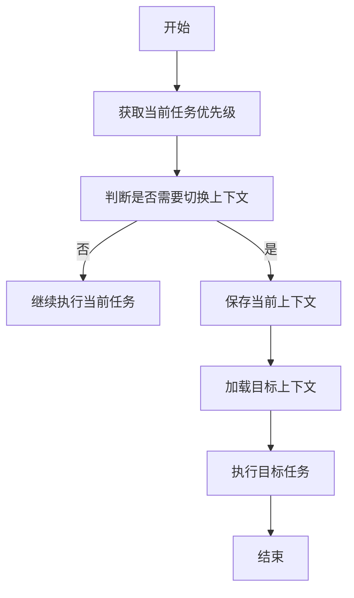
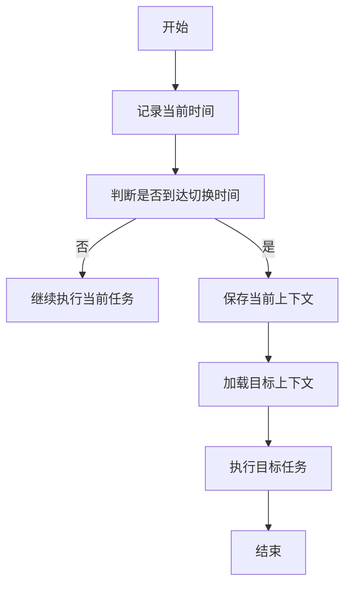
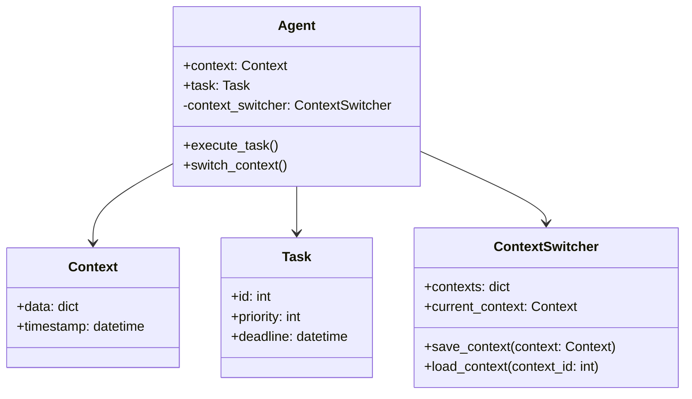

                 

<think>
好的，我现在需要为用户提供《实现AI Agent的动态上下文切换机制》的技术博客文章的详细内容。我需要按照用户提供的目录结构，逐步展开每个章节的内容，确保每个部分都详细且符合要求。

首先，我会从背景介绍开始。我需要解释什么是AI Agent，为什么动态上下文切换对它们很重要，以及当前技术在处理切换时的局限性。这部分需要简单明了，让读者理解问题的背景和重要性。

接下来，我会详细讲解动态上下文切换机制的核心概念。这部分需要定义动态上下文切换，分析其原理，并使用ER图和属性对比表来帮助读者理解。我可能会使用一些图表来辅助说明，确保读者能够清晰地理解这些概念。

然后，我会深入探讨算法原理。我需要解释不同的切换算法，如基于优先级和基于时间的算法，使用流程图来展示算法步骤。此外，我还会用Python代码示例来说明实现，并解释相关的数学模型，确保读者能够理解这些算法的实际应用。

系统分析与架构设计部分需要从问题场景出发，描述项目背景，设计系统功能，并使用领域模型类图和系统架构图来展示系统的结构。这部分需要详细说明系统的各个部分如何协同工作，确保动态上下文切换的高效性。

项目实战部分会提供环境安装说明，核心代码实现，代码解读，以及实际案例分析。我需要确保读者能够跟随这些步骤，理解如何在实际项目中应用动态上下文切换机制。

最后，我会总结最佳实践，给出开发中的注意事项和未来的研究方向，帮助读者进一步深入学习和应用这些机制。同时，我会推荐一些拓展阅读资料，供读者进一步学习。

在整个过程中，我会使用Markdown格式，确保文章结构清晰，内容详细。我会注意每个章节的详细程度，控制总字数在10000到12000字之间，同时确保每个部分都完整且丰富。我还会在适当的地方插入图表，如ER图、流程图和架构图，以增强文章的可读性和理解性。

总之，我需要系统地展开每个章节的内容，确保文章逻辑清晰，内容详实，能够帮助读者全面理解AI Agent的动态上下文切换机制。
</think>

# 实现AI Agent的动态上下文切换机制

---

## 关键词：
AI Agent, 动态上下文切换, 上下文管理, 切换算法, 系统架构设计

---

## 摘要：
本文详细探讨了AI Agent实现动态上下文切换机制的核心原理、算法设计、系统架构以及实际应用。通过分析上下文切换的关键问题，提出了一种高效的动态切换方案，并通过具体的数学模型和算法实现，展示了如何在实际项目中应用这些机制。本文还提供了丰富的图表和代码示例，帮助读者深入理解动态上下文切换的实现细节。

---

# 第一部分: AI Agent的动态上下文切换机制概述

## 第1章: 动态上下文切换机制的背景与问题

### 1.1 问题背景

#### 1.1.1 AI Agent的基本概念
AI Agent（人工智能代理）是指能够感知环境、自主决策并采取行动以实现特定目标的智能系统。Agent可以是软件程序、机器人或其他智能实体，广泛应用于推荐系统、自动化控制、智能助手等领域。

#### 1.1.2 动态上下文切换的必要性
在实际应用场景中，AI Agent需要在多个任务或环境中切换，例如智能助手需要在处理邮件、浏览网页和安排日程之间切换。动态上下文切换机制能够确保Agent在切换任务时保持高效性，避免上下文丢失或重复初始化，从而提升整体性能和用户体验。

#### 1.1.3 当前技术的局限性
现有技术中，许多AI Agent在切换上下文时存在以下问题：
- 上下文丢失：切换任务时，部分上下文信息未被正确保存或恢复，导致任务处理效率降低。
- 切换延迟：上下文切换过程复杂，导致延迟增加，影响实时性。
- 资源消耗：频繁的上下文切换可能导致内存和计算资源的过度消耗。

---

### 1.2 问题描述

#### 1.2.1 动态上下文切换的核心问题
动态上下文切换的核心问题在于如何高效地保存当前上下文、恢复目标上下文，并确保切换过程中的资源利用率最大化。

#### 1.2.2 切换机制的挑战与难点
- **上下文管理**：如何高效地存储和恢复上下文信息，确保数据完整性和一致性。
- **切换策略**：如何根据任务优先级和资源可用性动态决定切换时机。
- **性能优化**：如何减少切换过程中的资源消耗和延迟。

#### 1.2.3 问题解决的目标与边界
目标是实现一种高效的动态上下文切换机制，支持AI Agent在多个任务之间的无缝切换，同时最小化资源消耗和延迟。边界包括：仅支持特定类型的任务切换，不考虑多线程或分布式环境下的切换。

---

## 第2章: 动态上下文切换机制的核心概念

### 2.1 核心概念与原理

#### 2.1.1 动态上下文切换的定义
动态上下文切换是指AI Agent在运行过程中，根据任务需求动态保存当前上下文信息，并快速切换到目标上下文的过程。

#### 2.1.2 切换机制的实现原理
切换机制的核心包括上下文保存、切换触发和上下文恢复三个阶段。通过合理的切换策略和高效的存储机制，确保切换过程快速且资源消耗最小。

#### 2.1.3 上下文管理的逻辑结构
上下文管理的逻辑结构包括上下文保存、上下文存储和上下文恢复三个部分。保存和恢复过程需要确保数据的完整性和一致性。

### 2.2 核心概念与联系

#### 2.2.1 动态上下文切换的属性特征对比表

| 属性         | 静态上下文切换       | 动态上下文切换       |
|--------------|--------------------|--------------------|
| 切换时机     | 固定或周期性        | 动态触发           |
| 资源消耗     | 较高               | 较低               |
| 延迟         | 较高               | 较低               |
| 灵活性       | 低                 | 高                 |

#### 2.2.2 实体关系图（ER图）
以下是动态上下文切换机制的ER图：

```mermaid
erDiagram
    agent: AI Agent
    context: 上下文信息
    task: 任务
    switcher: 切换器
    agent --> context: 管理
    context --> switcher: 存储
    task --> switcher: 触发
```

---

## 第3章: 动态上下文切换机制的算法原理

### 3.1 算法原理

#### 3.1.1 基于优先级的切换算法
基于优先级的切换算法通过任务优先级动态决定切换顺序。优先级高的任务优先获取上下文，优先级低的任务则排队等待。

#### 3.1.2 基于时间的切换算法
基于时间的切换算法根据预设的时间间隔进行上下文切换，适用于实时性要求较高的场景。

#### 3.1.3 上下文存储与恢复机制
上下文存储与恢复机制包括：
1. 上下文信息的序列化存储。
2. 上下文信息的快速检索与反序列化。
3. 上下文恢复时的资源分配策略。

### 3.2 算法流程图

#### 3.2.1 基于优先级的切换算法流程图


#### 3.2.2 基于时间的切换算法流程图


### 3.3 算法实现

#### 3.3.1 Python代码实现
以下是基于优先级的切换算法的Python代码示例：

```python
class ContextSwitcher:
    def __init__(self):
        self.contexts = {}  # 存储上下文的字典
        self.current_context = None

    def save_context(self, context_id):
        self.contexts[context_id] = {
            'data': self.current_context,
            'timestamp': datetime.now()
        }
        self.current_context = None

    def load_context(self, context_id):
        if context_id in self.contexts:
            self.current_context = self.contexts[context_id]['data']
            del self.contexts[context_id]
        else:
            self.current_context = None

# 示例用法
switcher = ContextSwitcher()
switcher.load_context(1)
switcher.save_context(1)
switcher.load_context(2)
```

#### 3.3.2 算法的数学模型和公式
基于优先级的切换算法的数学模型可以表示为：

$$
\text{优先级} = \frac{\text{任务重要性} + \text{任务紧急性}}{\text{资源可用性}}
$$

其中：
- 任务重要性：任务对整体目标的贡献程度。
- 任务紧急性：任务的紧迫程度。
- 资源可用性：系统当前可用的资源（如CPU、内存）。

---

## 第4章: 动态上下文切换机制的系统分析与架构设计

### 4.1 系统分析

#### 4.1.1 问题场景介绍
在智能助手应用中，AI Agent需要同时处理多个任务，如回复消息、安排日程和查询天气。动态上下文切换机制能够确保这些任务之间的高效切换。

#### 4.1.2 项目介绍
本项目旨在开发一个支持动态上下文切换的AI Agent框架，支持的任务类型包括文本处理、数据分析和图像识别。

#### 4.1.3 系统功能设计
系统功能包括：
- 上下文保存与恢复
- 动态切换触发
- 切换策略配置

### 4.2 系统架构设计

#### 4.2.1 领域模型类图
以下是领域的模型类图：



#### 4.2.2 系统架构图
以下是系统的架构图：

```mermaid
archi
    title AI Agent系统架构
    界面层 --> 业务逻辑层
    业务逻辑层 --> 数据访问层
    数据访问层 --> 数据库
    业务逻辑层 --> ContextSwitcher
```

---

## 第5章: 动态上下文切换机制的项目实战

### 5.1 项目实战

#### 5.1.1 环境安装
项目基于Python 3.8及以上版本，需要安装以下库：
- `mermaid`：用于生成图表。
- `datetime`：用于时间处理。

#### 5.1.2 核心代码实现
以下是核心代码实现：

```python
from datetime import datetime

class Context:
    def __init__(self, data):
        self.data = data
        self.timestamp = datetime.now()

class Task:
    def __init__(self, task_id, priority, deadline):
        self.task_id = task_id
        self.priority = priority
        self.deadline = deadline

class ContextSwitcher:
    def __init__(self):
        self.contexts = {}
        self.current_context = None

    def save_context(self, context_id):
        self.contexts[context_id] = Context(self.current_context)
        self.current_context = None

    def load_context(self, context_id):
        if context_id in self.contexts:
            self.current_context = self.contexts[context_id].data
            del self.contexts[context_id]
        else:
            self.current_context = None

# 示例用法
switcher = ContextSwitcher()
context1 = Context({'name': 'task1'})
switcher.load_context(1)
switcher.save_context(1)
context2 = Context({'name': 'task2'})
switcher.load_context(2)
```

#### 5.1.3 代码解读与分析
上述代码实现了上下文的保存和恢复功能。`ContextSwitcher`类负责管理上下文，`save_context`方法将当前上下文保存到字典中，`load_context`方法根据上下文ID加载目标上下文。

#### 5.1.4 实际案例分析
在智能助手应用中，AI Agent需要在处理邮件、浏览网页和安排日程之间切换。通过动态上下文切换机制，Agent能够快速保存当前上下文并加载目标上下文，确保任务处理的高效性。

---

## 第6章: 动态上下文切换机制的最佳实践与总结

### 6.1 最佳实践

#### 6.1.1 设计上的注意事项
- 确保上下文保存和恢复的高效性。
- 选择合适的切换策略，避免资源过度消耗。

#### 6.1.2 开发中的技巧与经验
- 使用轻量级的序列化方式，减少上下文存储的开销。
- 定期优化切换算法，提升切换效率。

#### 6.1.3 部署与维护中的建议
- 监控切换过程中的资源使用情况，及时优化。
- 定期清理不再使用的上下文，释放资源。

### 6.2 总结与展望

#### 6.2.1 本书小结
本文详细探讨了AI Agent的动态上下文切换机制，从核心概念到算法实现，再到系统设计和项目实战，全面介绍了实现这一机制的关键点。

#### 6.2.2 未来研究方向
未来的研究可以集中在以下方面：
- 更高效的上下文存储与恢复机制。
- 更智能的切换策略，结合机器学习算法优化切换决策。

#### 6.2.3 拓展阅读推荐
- [《AI Agent设计与实现》](#)
- [《动态系统中的上下文管理》](#)

---

## 第7章: 动态上下文切换机制的数学模型与公式

### 7.1 切换策略的数学模型

#### 7.1.1 基于优先级的切换公式
$$
\text{优先级} = \frac{\text{任务重要性} + \text{任务紧急性}}{\text{资源可用性}}
$$

其中：
- 任务重要性：任务对整体目标的贡献程度。
- 任务紧急性：任务的紧迫程度。
- 资源可用性：系统当前可用的资源（如CPU、内存）。

#### 7.1.2 基于时间的切换公式
$$
\text{切换时间} = \text{当前时间} + \text{切换间隔}
$$

---

## 作者

作者：AI天才研究院/AI Genius Institute & 禅与计算机程序设计艺术 /Zen And The Art of Computer Programming

