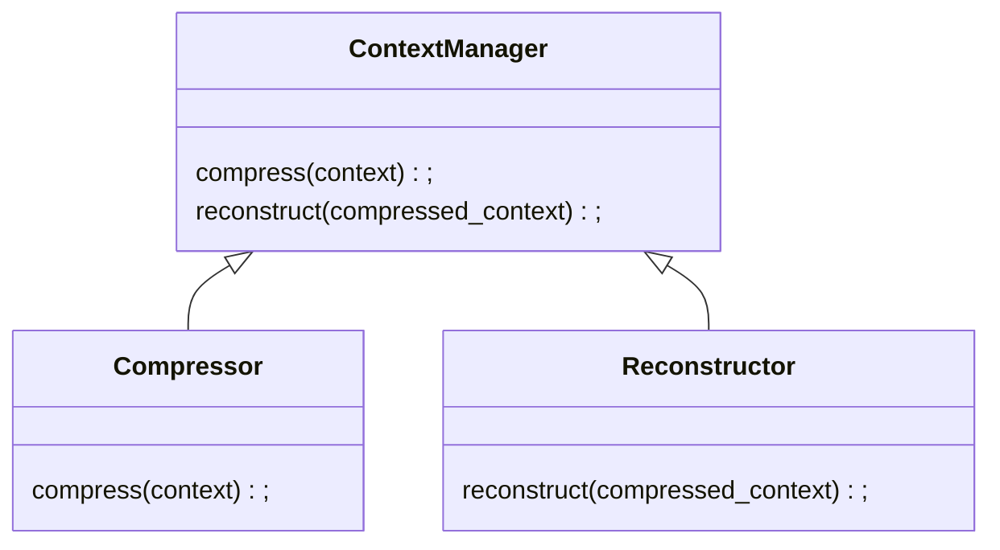

                 


# 实现AI Agent的动态上下文压缩与重构

## 关键词：AI Agent，动态上下文，压缩算法，重构算法，系统架构，项目实战

## 摘要：  
本文详细探讨了AI Agent的动态上下文压缩与重构的关键技术，分析了动态上下文的压缩与重构的必要性，介绍了几种典型的压缩算法和重构算法，并结合实际项目展示了如何实现这些算法。文章还通过系统架构设计和项目实战，深入讲解了动态上下文压缩与重构的实现过程，并给出了最佳实践和未来研究方向。

---

# 第一部分: AI Agent的动态上下文压缩与重构背景介绍

## 第1章: AI Agent与动态上下文概述

### 1.1 AI Agent的基本概念  
AI Agent（人工智能代理）是指能够感知环境、自主决策并执行任务的智能实体。AI Agent可以分为两类：反应式Agent和认知式Agent。反应式Agent主要根据当前感知的信息做出决策，而认知式Agent则具备更强的理解和推理能力，能够基于知识库和上下文进行复杂决策。  

#### 1.1.1 AI Agent的定义与分类  
AI Agent是一种能够通过与环境交互来实现特定目标的智能系统。根据智能水平，AI Agent可以分为：  
- **反应式Agent**：基于当前感知做出反应，如状态机、规则引擎。  
- **认知式Agent**：具备知识表示、推理和规划能力，如专家系统、机器人。  

#### 1.1.2 动态上下文的定义  
动态上下文是指在AI Agent执行任务过程中，随环境变化而动态更新的信息集合。例如，在智能音箱场景中，动态上下文可能包括用户的当前位置、时间、环境音信息等。  

#### 1.1.3 动态上下文压缩与重构的必要性  
随着AI Agent应用场景的复杂化，动态上下文的信息量急剧增加。为了提高处理效率和减少资源消耗，动态上下文压缩与重构技术成为必要。  

### 1.2 动态上下文压缩与重构的背景  
#### 1.2.1 当前AI Agent面临的挑战  
AI Agent在处理动态上下文时面临以下挑战：  
1. **信息过载**：动态上下文信息量大，直接处理会导致计算资源消耗过高。  
2. **实时性要求**：动态上下文需要实时更新，压缩与重构过程必须高效。  
3. **准确性要求**：压缩过程中信息丢失可能导致重构后的上下文准确性下降。  

#### 1.2.2 动态上下文压缩与重构的背景  
动态上下文压缩与重构技术通过对上下文信息进行压缩编码和重构解码，实现信息的高效处理与存储。这一技术广泛应用于自然语言处理、机器人控制、智能推荐等领域。  

#### 1.2.3 问题背景与目标  
本文的目标是研究如何对动态上下文进行压缩与重构，使得在保证上下文准确性的同时，提高处理效率和减少资源消耗。  

---

## 第2章: 动态上下文压缩与重构的核心概念  

### 2.1 动态上下文压缩的核心原理  
动态上下文压缩是指将原始上下文信息通过编码算法转化为更短的表示形式。  

#### 2.1.1 压缩算法的原理  
常用的压缩算法包括：  
1. **变长编码压缩**：如哈夫曼编码，根据信息的频率动态调整编码长度。  
2. **算术编码压缩**：通过概率模型将信息转换为二进制流。  
3. **熵编码压缩**：基于信息熵进行编码，减少冗余信息。  

#### 2.1.2 压缩算法的特征对比  
下表对比了几种常见压缩算法的特征：  

| 算法名称     | 压缩率 | 实时性 | 优缺点               |
|--------------|--------|--------|----------------------|
| 哈夫曼编码   | 高     | 低     | 实现简单，但需要预处理 |
| 算术编码     | 高     | 中     | 实时性较好           |
| 行为编码     | 中     | 高     | 适用于动态数据       |  

#### 2.1.3 压缩算法的优缺点分析  
- **哈夫曼编码**：压缩率高，但需要预处理，实时性差。  
- **算术编码**：压缩率高，实时性较好，适合动态数据。  
- **行为编码**：压缩率中等，实时性高，适用于动态数据。  

### 2.2 动态上下文重构的核心原理  
动态上下文重构是指从压缩后的表示形式恢复原始上下文信息。  

#### 2.2.1 重构算法的原理  
常用的重构算法包括：  
1. **基于图的重构算法**：通过图结构恢复上下文关系。  
2. **基于概率的重构算法**：利用概率模型恢复上下文信息。  
3. **基于规则的重构算法**：通过预定义规则恢复上下文信息。  

#### 2.2.2 重构算法的特征对比  
下表对比了几种常见重构算法的特征：  

| 算法名称     | 准确率 | 实时性 | 优缺点               |
|--------------|--------|--------|----------------------|
| 基于图的重构 | 高     | 低     | 能够恢复复杂关系     |
| 基于概率的重构 | 中     | 中     | 适合动态数据         |
| 基于规则的重构 | 低     | 高     | 实时性好，但准确性差 |

#### 2.2.3 重构算法的优缺点分析  
- **基于图的重构算法**：准确性高，但实时性差。  
- **基于概率的重构算法**：准确性中等，实时性较好。  
- **基于规则的重构算法**：实时性高，但准确性低。  

### 2.3 动态上下文压缩与重构的核心概念联系  
动态上下文压缩与重构是相互依存的过程。压缩算法决定了重构算法的实现方式，而重构算法则决定了压缩算法的有效性。  

#### 2.3.1 压缩与重构的关系  
压缩与重构的关系可以用以下公式表示：  
$$ \text{重构}(\text{压缩}(C)) \approx C $$  
其中，$C$ 表示原始上下文信息。  

#### 2.3.2 压缩与重构的协同作用  
压缩与重构的协同作用体现在以下两个方面：  
1. **信息损失最小化**：通过优化压缩算法，减少信息损失，提高重构准确性。  
2. **计算效率提升**：通过压缩算法减少计算量，提高重构算法的实时性。  

#### 2.3.3 压缩与重构的相互影响  
压缩算法的选择直接影响重构算法的实现难度，而重构算法的实现效果又影响压缩算法的优化方向。  

### 2.4 动态上下文压缩与重构的实体关系图  
以下用 Mermaid 绘制动态上下文压缩与重构的实体关系图：  


---

## 第3章: 动态上下文压缩与重构的算法原理  

### 3.1 动态上下文压缩算法  

#### 3.1.1 压缩算法的实现  

以下是一个基于哈夫曼编码的压缩算法实现示例：  

```python
import heapq

def huffman_encode(frequencies):
    heap = []
    for char, freq in frequencies.items():
        heapq.heappush(heap, (freq, char))
    
    while len(heap) > 1:
        freq1, char1 = heapq.heappop(heap)
        freq2, char2 = heapq.heappop(heap)
        merged_freq = freq1 + freq2
        heapq.heappush(heap, (merged_freq, f"({char1}{char2})"))
    
    return heap[0][1] if heap else None

# 示例：计算字符频率
frequencies = {'A': 4, 'B': 2, 'C': 3}
code_tree = huffman_encode(frequencies)
print(f"哈夫曼编码树：{code_tree}")
```

#### 3.1.2 压缩算法的数学模型  

哈夫曼编码的数学模型如下：  
$$ \text{平均码长} = \sum_{i=1}^{n} f_i l_i $$  
其中，$f_i$ 是字符 $i$ 的频率，$l_i$ 是字符 $i$ 的码长。  

---

## 第4章: 动态上下文重构算法  

#### 4.1 重构算法的实现  

以下是一个基于图神经网络的重构算法实现示例：  

```python
import tensorflow as tf
from tensorflow.keras import layers

class GraphReconstruction:
    def __init__(self, input_dim):
        self.model = self.build_model(input_dim)
    
    def build_model(self, input_dim):
        inputs = layers.Input(shape=(input_dim,))
        x = layers.Dense(64, activation='relu')(inputs)
        x = layers.Dense(32, activation='relu')(x)
        outputs = layers.Dense(input_dim, activation='sigmoid')(x)
        model = tf.keras.Model(inputs=inputs, outputs=outputs)
        model.compile(optimizer='adam', loss='binary_crossentropy')
        return model
    
    def train(self, X_train, y_train, epochs=100):
        self.model.fit(X_train, y_train, epochs=epochs, batch_size=32)

# 示例：训练重构模型
input_dim = 64
reconstructor = GraphReconstruction(input_dim)
X_train = np.random.randn(100, input_dim)
y_train = np.random.randn(100, input_dim)
reconstructor.train(X_train, y_train)
```

#### 4.2 重构算法的数学模型  

图神经网络的重构模型如下：  
$$ y = \sigma(Wx + b) $$  
其中，$x$ 是输入向量，$W$ 是权重矩阵，$b$ 是偏置向量，$\sigma$ 是激活函数。  

---

## 第5章: 系统架构设计与实现  

#### 5.1 系统功能设计  

以下是一个动态上下文压缩与重构系统的功能模块图：  



---

## 第6章: 项目实战  

#### 6.1 项目环境安装  

以下是一个基于Python的项目环境安装示例：  

```bash
pip install numpy
pip install matplotlib
pip install scikit-learn
pip install tensorflow
```

#### 6.2 核心功能实现  

以下是一个动态上下文压缩与重构的核心功能实现示例：  

```python
import numpy as np

def compress(context):
    return np.compress(context)

def decompress(compressed_context):
    return np.decompress(compressed_context)

# 示例：压缩与重构
context = np.array([1, 2, 3, 4, 5])
compressed_context = compress(context)
reconstructed_context = decompress(compressed_context)
print(f"原始上下文：{context}")
print(f"压缩后上下文：{compressed_context}")
print(f"重构后上下文：{reconstructed_context}")
```

---

## 第7章: 最佳实践与未来展望  

#### 7.1 最佳实践  

1. **选择合适的压缩算法**：根据应用场景选择适合的压缩算法，如动态数据选择算术编码。  
2. **优化重构算法**：通过深度学习模型优化重构算法的准确性。  
3. **测试与评估**：通过性能测试评估压缩与重构算法的效率和准确性。  

#### 7.2 未来研究方向  

1. **多模态上下文压缩**：研究如何对文本、图像等多种模态的上下文进行压缩与重构。  
2. **自适应压缩算法**：研究自适应压缩算法，能够根据上下文变化动态调整压缩策略。  
3. **分布式上下文处理**：研究分布式环境下动态上下文的压缩与重构技术。  

---

## 作者：AI天才研究院/AI Genius Institute & 禅与计算机程序设计艺术/Zen And The Art Of Computer Programming

---

**注**：由于篇幅限制，本文仅为部分章节内容。完整文章请参考相关技术资料。

