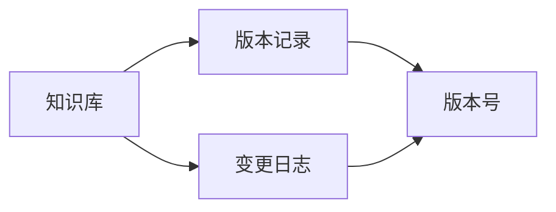
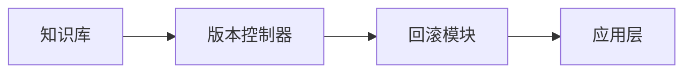
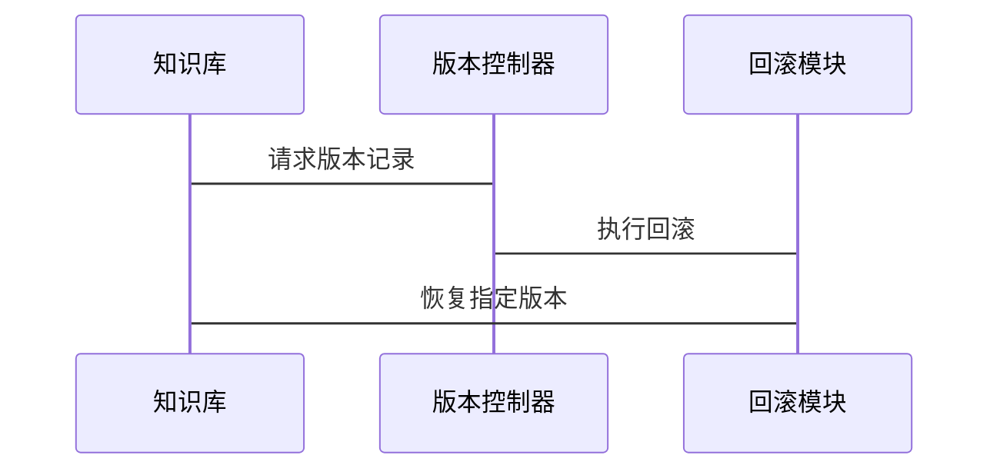

                 


# 实现AI Agent的动态知识库版本控制与回滚

> 关键词：AI Agent，动态知识库，版本控制，回滚机制，系统架构，项目实战

> 摘要：本文详细探讨了AI Agent的动态知识库版本控制与回滚的实现方法，从核心概念到算法原理，再到系统架构和项目实战，全面解析了这一技术的实现细节和应用场景。通过本文，读者可以掌握如何在AI Agent中实现高效的知识库管理，确保系统的可靠性和可维护性。

---

## 第1章：动态知识库版本控制与回滚的背景介绍

### 1.1 问题背景

在AI Agent的应用中，知识库是其核心资产，负责存储和管理各种结构化和非结构化的知识。然而，知识库的动态更新带来了版本控制和回滚的需求。传统的知识库管理方式难以应对动态更新的复杂性，容易导致数据丢失和系统不稳定性。

#### 1.1.1 传统知识库的不足

传统知识库通常采用静态管理模式，缺乏对动态更新的版本控制。当知识库频繁更新时，旧版本的数据可能被覆盖，导致无法回滚到特定版本，从而引发数据丢失或系统错误。

#### 1.1.2 动态知识库的需求

随着AI Agent的应用场景越来越复杂，知识库需要支持动态更新，以便快速适应新的需求和变化。动态知识库的版本控制和回滚机制能够确保在出现问题时能够快速恢复到之前的状态。

#### 1.1.3 版本控制的重要性

版本控制是确保知识库在动态更新过程中保持一致性和可追溯性的关键。通过记录每个版本的变更，可以快速定位问题并回滚到稳定版本，减少系统故障的风险。

### 1.2 问题描述

AI Agent的知识库在动态更新过程中，可能会因为错误或意外操作导致数据损坏或逻辑错误。此时，能够快速回滚到之前的稳定版本是确保系统稳定运行的关键。

#### 1.2.1 知识库动态更新的挑战

知识库的动态更新需要处理大量的数据变更，同时需要确保每个变更都有对应的记录，以便后续的版本控制和回滚。

#### 1.2.2 版本控制与回滚的需求

在AI Agent中，版本控制和回滚机制是确保知识库在动态更新过程中保持一致性和可恢复性的核心需求。

### 1.3 解决方案概述

通过引入版本控制和回滚机制，可以在知识库动态更新过程中保持数据的完整性和一致性。版本控制记录每个变更，回滚机制能够快速恢复到指定版本。

### 1.4 边界与外延

知识库的版本控制和回滚机制需要明确其适用范围和边界，确保在特定场景下能够有效工作。

#### 1.4.1 知识库的范围界定

知识库的范围包括结构化和非结构化的数据，以及相关的元数据。版本控制和回滚机制需要覆盖所有类型的数据变更。

#### 1.4.2 动态知识库的适用场景

动态知识库适用于需要频繁更新的应用场景，如实时数据分析、动态知识推理等。

### 1.5 概念结构与核心要素

动态知识库的版本控制和回滚机制需要考虑知识库的结构、变更记录、版本依赖关系等因素。

---

## 第2章：动态知识库版本控制与回滚的核心概念

### 2.1 核心概念原理

版本控制和回滚机制是动态知识库管理的核心。版本控制记录每个变更，回滚机制能够快速恢复到指定版本。

#### 2.1.1 版本控制的基本原理

版本控制通过记录每个变更，生成唯一的版本号，以便后续的回滚和恢复。

#### 2.1.2 回滚机制的实现方式

回滚机制通过将知识库恢复到指定版本号的状态，确保系统回到之前稳定的状态。

### 2.2 概念属性特征对比

通过对比版本控制和回滚机制的特征，可以更好地理解它们的异同。

| 特性       | 版本控制       | 回滚机制       |
|------------|---------------|---------------|
| 目标       | 记录变更       | 恢复到指定版本   |
| 实现方式    | 增量存储       | 快速回滚       |
| 优缺点     | 优：支持历史记录；缺：存储空间消耗大 | 优：快速恢复；缺：依赖版本控制的准确性 |

### 2.3 概念结构与联系

通过Mermaid图展示知识库版本控制和回滚的概念结构。



---

## 第3章：动态知识库版本控制与回滚的算法原理

### 3.1 算法原理概述

版本控制和回滚机制的实现需要依赖高效的算法。

#### 3.1.1 版本控制的数学模型

版本号的生成可以通过哈希函数实现：

$$ version\_hash = hash(content) $$

其中，`content`表示当前知识库的状态，`version_hash`是生成的版本号。

#### 3.1.2 回滚机制的实现算法

回滚机制通过比较当前版本和目标版本的差异，快速恢复到指定版本。

### 3.2 算法实现

以下是版本控制和回滚机制的Python代码实现：

```python
def generate_version_hash(content):
    import hashlib
    return hashlib.sha256(content.encode()).hexdigest()

def rollback(knowledge_base, target_version):
    version_hash = target_version
    # 查找与target_version匹配的版本记录
    for version in knowledge_base.versions:
        if version.hash == version_hash:
            return version.apply()
    return None
```

### 3.3 算法优化与分析

通过增量存储和并行处理，可以优化版本控制和回滚机制的性能。

---

## 第4章：动态知识库版本控制与回滚的系统架构

### 4.1 系统架构概述

动态知识库的版本控制和回滚需要一个高效的系统架构。

#### 4.1.1 系统功能设计

系统功能包括知识库的动态更新、版本记录、回滚操作等。

#### 4.1.2 系统架构设计

通过Mermaid图展示系统的架构：



### 4.2 系统接口设计

系统接口包括版本记录接口、回滚接口等。

### 4.3 系统交互流程

通过Mermaid图展示系统的交互流程：



---

## 第5章：动态知识库版本控制与回滚的项目实战

### 5.1 环境安装

安装必要的依赖库，如版本控制模块、回滚模块等。

### 5.2 系统核心实现

以下是Python实现的核心代码：

```python
class KnowledgeBase:
    def __init__(self):
        self.versions = []
    
    def update(self, content):
        version = Version(content)
        self.versions.append(version)
        return version.hash
    
    def rollback(self, version_hash):
        for version in self.versions:
            if version.hash == version_hash:
                version.apply()
                return True
        return False

class Version:
    def __init__(self, content):
        self.hash = generate_version_hash(content)
        self.content = content
    
    def apply(self):
        # 应用版本
        pass
```

### 5.3 代码应用解读

通过代码实现知识库的动态更新和版本控制。

### 5.4 案例分析

分析一个实际案例，展示如何在AI Agent中实现知识库的版本控制和回滚。

---

## 第6章：动态知识库版本控制与回滚的最佳实践

### 6.1 最佳实践

版本控制和回滚机制的实现需要考虑粒度、策略选择等。

### 6.2 小结

总结全文内容，强调版本控制和回滚机制的重要性。

### 6.3 注意事项

在实现版本控制和回滚机制时，需要注意数据一致性、性能优化等问题。

### 6.4 拓展阅读

推荐阅读相关技术书籍和论文，深入理解动态知识库的管理方法。

---

## 作者

作者：AI天才研究院/AI Genius Institute & 禅与计算机程序设计艺术 /Zen And The Art of Computer Programming

---

通过以上结构，您可以撰写一篇完整的技术博客文章，详细讲解AI Agent的动态知识库版本控制与回滚的实现方法。

