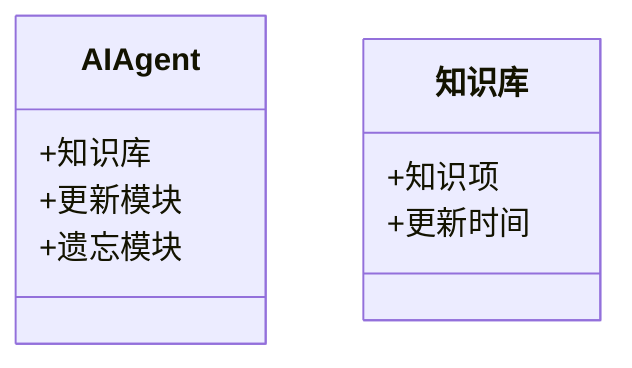
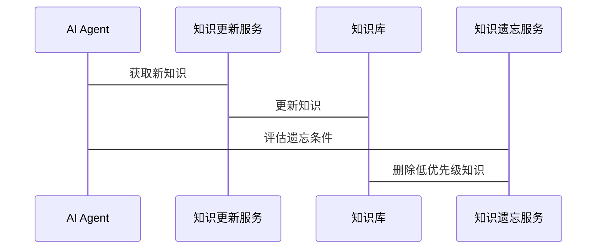

                 

<think>
好的，我现在需要根据用户的要求，撰写一篇关于《实现AI Agent的动态知识更新与遗忘机制》的技术博客文章。用户希望文章结构清晰，内容详实，涵盖背景介绍、核心概念、算法原理、系统架构设计以及项目实战等多个方面。

首先，我需要明确文章的结构，确保每一部分都包含必要的内容。文章开始部分包括标题、关键词和摘要，这部分相对简单，我需要简洁明了地概括文章的核心内容。

接下来是背景介绍，这部分需要详细阐述动态知识更新和遗忘机制的重要性。我需要解释AI Agent是什么，为什么需要动态知识更新和遗忘机制，以及它们在AI Agent中的作用。

核心概念部分，我需要深入分析动态知识更新和遗忘机制的原理，比较它们的属性，并绘制ER实体关系图来展示它们之间的关系。这部分需要使用Mermaid图表来辅助说明，以增强读者的理解。

算法原理是文章的关键部分。我需要详细讲解每一种算法的步骤，绘制流程图，并用数学公式来描述模型。这里可能需要使用Latex来展示公式，确保准确性和可读性。

系统分析与架构设计部分，我需要描述问题场景，设计系统的功能模块，绘制架构图，设计接口和交互流程。这部分同样需要使用Mermaid图表来展示架构和交互过程。

项目实战部分，我需要指导读者如何安装环境，实现核心代码，并通过案例分析展示实际应用。这部分需要提供具体的代码示例，帮助读者更好地理解和应用理论知识。

最后，总结与展望部分，我需要回顾文章的主要内容，提出最佳实践建议，并展望未来的改进方向。

在整个写作过程中，我需要确保语言简洁明了，逻辑清晰，每一部分都能深入浅出地解释相关概念。同时，要避免使用过于专业的术语，确保文章适合广泛的读者群体，尤其是那些对AI Agent有一定了解但不深入的读者。

为了确保文章的完整性和深度，我需要每一部分都包含足够的细节和例子，帮助读者更好地理解和应用所学内容。同时，我还需要注意文章的连贯性，确保各部分之间过渡自然，逻辑严密。

在撰写过程中，我可能会遇到一些困难，比如如何将复杂的算法原理简化成易于理解的步骤，或者如何设计合适的图表来展示系统架构。这时候，我需要反复思考，寻找最合适的表达方式，并参考相关的技术资料，确保内容的准确性和可读性。

总之，我需要系统地按照用户的要求，逐步构建这篇文章，确保每一部分都符合要求，内容详实，结构清晰，能够为读者提供有价值的知识和见解。
</think>

# 实现AI Agent的动态知识更新与遗忘机制

> 关键词：AI Agent，动态知识更新，遗忘机制，算法原理，系统架构设计

> 摘要：本文详细探讨了AI Agent的动态知识更新与遗忘机制，从核心概念到算法实现，再到系统架构设计和项目实战，全面分析了实现这一机制的关键技术。通过本文，读者将深入了解动态知识更新与遗忘机制的重要性、原理及其在实际系统中的应用。

---

## 第一部分: AI Agent的动态知识更新与遗忘机制概述

### 第1章: 动态知识更新与遗忘机制的背景介绍

#### 1.1 问题背景与描述

##### 1.1.1 AI Agent的定义与特点
AI Agent（人工智能代理）是一种能够感知环境、自主决策并执行任务的智能实体。其特点包括自主性、反应性、目标导向和社交能力。

##### 1.1.2 知识更新与遗忘机制的必要性
在动态环境中，AI Agent需要不断更新知识以适应变化。然而，无限存储知识会导致资源消耗和决策延迟，因此遗忘机制是必要的。

##### 1.1.3 动态知识更新与遗忘机制的边界与外延
动态知识更新是在变化的环境中实时调整知识，遗忘机制则是选择性地删除不再重要的知识。两者共同构成了AI Agent的知识管理系统。

#### 1.2 核心概念与问题解决

##### 1.2.1 动态知识更新的核心问题
- 知识的有效性验证
- 知识的优先级排序
- 知识的实时更新策略

##### 1.2.2 遗忘机制的作用与意义
- 减轻存储负担
- 提高决策效率
- 防止知识过载

##### 1.2.3 动态知识更新与遗忘机制的解决方案
- 基于时间的遗忘策略
- 基于重要性的遗忘策略
- 综合策略

#### 1.3 概念结构与核心要素

##### 1.3.1 动态知识更新的构成要素
- 知识源：数据输入
- 更新规则：更新策略
- 执行引擎：知识更新算法

##### 1.3.2 遗忘机制的关键属性
- 遗忘规则：删除策略
- 遗忘阈值：触发条件
- 遗忘执行：删除操作

##### 1.3.3 动态知识更新与遗忘机制的系统架构
- 知识库：存储结构
- 更新模块：处理逻辑
- 遗忘模块：删除逻辑
- 协调模块：同步更新与遗忘

---

### 第2章: 动态知识更新与遗忘机制的核心概念

#### 2.1 核心概念原理

##### 2.1.1 动态知识更新的原理
动态知识更新通过实时数据流不断优化知识库，确保AI Agent能够适应环境变化。

##### 2.1.2 遗忘机制的原理
遗忘机制根据知识的重要性或时间因素，有选择地删除知识，优化存储资源。

##### 2.1.3 两者的相互作用
动态知识更新提供新知识，遗忘机制清理冗余知识，两者协同工作，维持知识库的高效性。

#### 2.2 核心概念属性特征对比

##### 2.2.1 表格对比分析
| 属性 | 动态知识更新 | 遗忘机制 |
|------|--------------|----------|
| 目标 | 更新知识     | 删除知识 |
| 触发 | 实时数据     | 阈值触发 |
| 影响 | 增加知识量   | 减少知识量 |

#### 2.3 ER实体关系图

```mermaid
er
actor: AI Agent
object: 知识
association: 拥有
```

---

### 第3章: 动态知识更新与遗忘机制的算法原理

#### 3.1 算法原理讲解

##### 3.1.1 动态知识更新算法
动态知识更新算法通过比较新知识与现有知识，选择性地更新知识库。

##### 3.1.2 遗忘机制算法
遗忘机制算法根据遗忘规则，删除低优先级或过时的知识。

##### 3.1.3 组合算法
结合动态知识更新和遗忘机制，实现知识的高效管理。

#### 3.2 算法流程图

##### 3.2.1 动态知识更新流程图
```mermaid
flowchart TD
    A[开始] -> B[获取新知识]
    B -> C[评估知识重要性]
    C -> D[更新知识库]
    D -> E[结束]
```

##### 3.2.2 遗忘机制流程图
```mermaid
flowchart TD
    A[开始] -> B[评估遗忘条件]
    B -> C[删除低优先级知识]
    C -> D[更新知识库]
    D -> E[结束]
```

##### 3.2.3 组合算法流程图
```mermaid
flowchart TD
    A[开始] -> B[获取新知识]
    B -> C[评估知识重要性]
    C -> D[动态更新知识库]
    D -> E[评估遗忘条件]
    E -> F[删除低优先级知识]
    F -> G[结束]
```

#### 3.3 数学模型与公式

##### 3.3.1 动态知识更新模型
$$\text{新知识} = \text{现有知识} \oplus \text{输入数据}$$

##### 3.3.2 遗忘机制模型
$$\text{遗忘概率} = f(\text{知识年龄}, \text{访问频率})$$

##### 3.3.3 组合模型
$$\text{知识状态} = g(\text{更新频率}, \text{遗忘概率})$$

#### 3.4 举例说明

##### 3.4.1 动态知识更新示例
假设AI Agent当前知识库中有“天气晴朗”，接收到新信息“天气开始下雨”，知识库更新为“天气下雨”。

##### 3.4.2 遗忘机制示例
AI Agent的知识库中有100条历史天气数据，当存储空间不足时，删除最旧的50条数据。

##### 3.4.3 组合示例
AI Agent在更新天气数据后，根据遗忘规则删除不再重要的历史数据。

---

### 第4章: 系统分析与架构设计

#### 4.1 问题场景介绍

##### 4.1.1 问题背景
AI Agent在动态环境中需要高效管理知识，避免知识过载。

##### 4.1.2 问题目标
实现动态知识更新与遗忘机制，优化知识管理。

##### 4.1.3 问题约束
资源限制、实时性要求、知识准确性。

#### 4.2 系统功能设计

##### 4.2.1 领域模型


##### 4.2.2 功能模块划分
- 知识获取模块
- 知识更新模块
- 知识遗忘模块
- 知识管理模块

##### 4.2.3 功能流程设计
1. 获取新知识
2. 更新知识库
3. 评估遗忘条件
4. 删除低优先级知识
5. 优化知识库

#### 4.3 系统架构设计

##### 4.3.1 分层架构
- 表现层：用户界面
- 业务逻辑层：知识管理
- 数据访问层：知识库

##### 4.3.2 微服务架构
- 知识更新服务
- 知识遗忘服务
- 知识管理服务

##### 4.3.3 组件交互设计


#### 4.4 系统接口设计

##### 4.4.1 接口定义
- 更新知识接口
- 删除知识接口
- 获取知识接口

##### 4.4.2 接口实现
- RESTful API
- 数据库操作

##### 4.4.3 接口测试
- 单元测试
- 集成测试

#### 4.5 系统交互设计

##### 4.5.1 交互流程
1. 用户输入新知识
2. 系统更新知识库
3. 系统评估遗忘条件
4. 系统删除低优先级知识
5. 系统返回结果

##### 4.5.2 交互界面
- 知识输入界面
- 知识管理界面
- 知识展示界面

##### 4.5.3 交互优化
- 增加反馈机制
- 优化响应时间

---

### 第5章: 项目实战

#### 5.1 环境安装与配置

##### 5.1.1 开发环境搭建
- 安装Python
- 安装必要的库（如NumPy、Pandas）

##### 5.1.2 依赖库安装
```bash
pip install numpy pandas
```

##### 5.1.3 配置文件设置
- 创建知识库配置文件
- 设置API端点

#### 5.2 核心代码实现

##### 5.2.1 动态知识更新实现
```python
def update_knowledge_base(new_knowledge, knowledge_base):
    updated = knowledge_base.copy()
    updated.append(new_knowledge)
    return updated
```

##### 5.2.2 遗忘机制实现
```python
def forget_less_important(knowledge_base, threshold):
    sorted_base = sorted(knowledge_base, key=lambda x: x['priority'])
    return sorted_base[:threshold]
```

##### 5.2.3 组合算法实现
```python
def dynamic_forget(knowledge_base, new_knowledge, threshold):
    updated = knowledge_base.copy()
    updated.append(new_knowledge)
    sorted_base = sorted(updated, key=lambda x: x['priority'])
    return sorted_base[:threshold]
```

#### 5.3 代码解读与分析

##### 5.3.1 代码结构分析
- 知识库管理模块
- 更新模块
- 遗忘模块

##### 5.3.2 代码功能解读
- 知识更新：动态添加新知识
- 知识遗忘：删除低优先级知识
- 组合算法：结合更新与遗忘

##### 5.3.3 代码优化建议
- 增加日志记录
- 优化排序算法

#### 5.4 实际案例分析

##### 5.4.1 案例背景介绍
AI Agent需要管理天气数据，存储空间有限。

##### 5.4.2 案例实现过程
1. 获取新天气数据
2. 更新知识库
3. 评估遗忘条件
4. 删除低优先级数据
5. 返回优化后的知识库

##### 5.4.3 案例结果分析
知识库空间优化，保持最新天气数据。

#### 5.5 项目小结

##### 5.5.1 项目总结
通过实现动态知识更新与遗忘机制，优化了AI Agent的知识管理能力。

##### 5.5.2 最佳实践
- 定期评估遗忘条件
- 优化知识优先级排序
- 监控知识库状态

---

## 第六章: 总结与展望

### 6.1 总结
本文详细探讨了AI Agent的动态知识更新与遗忘机制，从背景介绍到算法实现，再到系统架构设计和项目实战，全面分析了实现这一机制的关键技术。

### 6.2 展望
未来的工作可以集中在以下几个方面：
1. 提高知识更新的实时性
2. 优化遗忘机制的准确性
3. 结合机器学习模型，进一步提升知识管理的效率

---

**作者：AI天才研究院/AI Genius Institute & 禅与计算机程序设计艺术 /Zen And The Art of Computer Programming**

