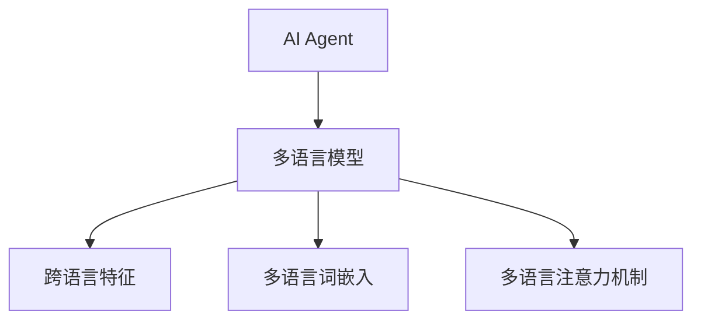
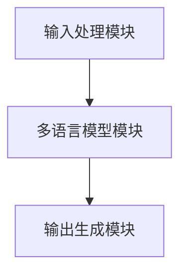
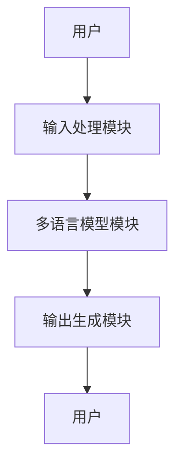
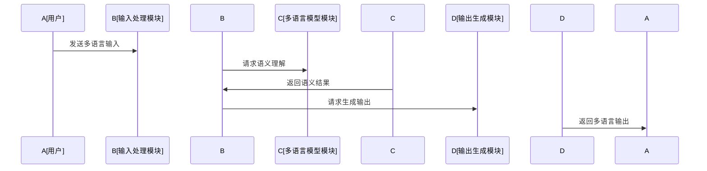

                 

<think>
嗯，用户让我帮忙详细思考如何撰写一篇关于《实现AI Agent的多语言支持》的技术博客。我需要按照他们的要求，先写一个详细的目录结构，然后按照这个结构逐步完成整篇文章。首先，我得理解用户的需求，他们希望文章结构清晰，内容专业，涵盖从背景到实现的各个方面。

我注意到用户已经提供了一个大纲，我需要按照这个大纲来展开。首先是摘要和关键词，这部分需要简洁明了，概括文章的核心内容。然后是各章节的内容，每一章都要有详细的子节，涵盖理论和实际应用。

我得先思考每一章的重点，比如第一章介绍AI Agent和多语言支持的背景，第二章讨论核心概念和联系，第三章讲解算法原理，第四章分析系统架构，第五章实战项目，最后总结和扩展阅读。每一部分都需要有具体的例子和图表，比如用mermaid绘制流程图和类图，解释技术细节。

在写技术细节时，我需要确保用词准确，比如自然语言处理模型的原理、多语言模型的训练方法，以及系统架构的具体设计。同时，数学公式和代码示例也是关键部分，我得用latex和python代码来展示这些内容，确保读者能够理解。

我还需要考虑读者的背景，他们可能是技术人员或开发者，因此内容需要专业但易懂，避免过于复杂的术语，或者在必要时解释清楚。此外，章节之间的逻辑要连贯，从理论到实践，逐步引导读者。

可能遇到的困难是如何将复杂的算法和架构设计解释得通俗易懂，这时候可能需要更多的例子和图表来辅助说明。同时，代码部分需要确保正确性和可读性，可能需要多次检查和调整。

总的来说，我需要按照用户提供的大纲，逐步展开每一部分，确保内容全面、结构清晰，同时满足技术深度和可读性的要求。这需要我在写作过程中不断回顾和调整，确保每一章都能为读者提供有价值的信息。
</think>

# 实现AI Agent的多语言支持

> 关键词：AI Agent，多语言支持，自然语言处理，跨语言模型，系统架构设计

> 摘要：AI Agent作为人工智能领域的核心应用之一，其多语言支持能力直接影响其适用范围和用户体验。本文从AI Agent的基本概念出发，深入探讨多语言支持的核心原理、算法实现、系统架构设计以及项目实战，旨在为读者提供全面的技术指导。

---

# 第一部分: AI Agent的多语言支持背景与基础

## 第1章: AI Agent与多语言支持概述

### 1.1 AI Agent的基本概念
#### 1.1.1 AI Agent的定义与核心功能
AI Agent（人工智能代理）是指能够感知环境、理解用户意图并执行相应操作的智能实体。其核心功能包括：
- **感知**：通过传感器或输入接口获取外部信息。
- **理解**：利用自然语言处理技术解析用户需求。
- **决策**：基于知识库和推理机制制定行动方案。
- **执行**：通过执行器或API调用完成任务。

#### 1.1.2 AI Agent的分类与应用场景
AI Agent可以分为以下几类：
- **简单反射型**：基于预定义规则执行任务。
- **基于模型的反应型**：利用环境模型动态调整行为。
- **目标驱动型**：根据目标规划行动。
- **实用驱动型**：通过效用函数优化决策。

应用场景包括：
- 智能客服
- 智能助手
- 跨语言对话系统

#### 1.1.3 多语言支持在AI Agent中的重要性
随着全球化的发展，AI Agent需要能够支持多种语言，以满足全球用户的需求。多语言支持不仅提升了用户体验，还扩展了AI Agent的应用场景。

### 1.2 多语言支持的背景与挑战
#### 1.2.1 全球化背景下多语言支持的需求
随着互联网的普及，用户对多语言支持的需求日益增长。AI Agent需要能够理解并生成多种语言，以覆盖更广泛的用户群体。

#### 1.2.2 多语言支持的技术挑战
- **语言差异**：不同语言的语法、词汇差异可能导致模型训练困难。
- **数据稀疏性**：小语种数据量少，难以训练高质量的模型。
- **计算资源**：多语言模型通常需要更多的计算资源。

#### 1.2.3 当前AI Agent多语言支持的现状与趋势
目前，多语言AI Agent主要依赖于预训练的语言模型（如BERT、GPT），通过跨语言迁移学习实现多语言支持。未来趋势包括：
- 更高效的多语言模型
- 更加个性化的语言支持
- 更强的跨语言推理能力

---

# 第二部分: AI Agent多语言支持的核心概念与联系

## 第2章: AI Agent与多语言支持的核心概念

### 2.1 AI Agent的核心原理
#### 2.1.1 AI Agent的感知与决策机制
AI Agent通过感知环境、理解用户需求并做出决策。感知主要依赖传感器或输入接口，决策则基于知识库和推理机制。

#### 2.1.2 基于自然语言处理的交互方式
AI Agent与用户的交互通常基于自然语言处理（NLP）。NLP技术包括文本解析、情感分析、实体识别等功能。

#### 2.1.3 AI Agent的上下文理解和记忆机制
AI Agent需要具备上下文理解和记忆能力，以便在对话中保持连贯性。

### 2.2 多语言支持的核心原理
#### 2.2.1 多语言自然语言处理的基本概念
多语言自然语言处理（Multilingual NLP）是指在多种语言上同时进行NLP任务的技术。其核心在于跨语言的语义理解。

#### 2.2.2 多语言模型的训练与优化
多语言模型通常采用联合训练的方式，通过共享跨语言特征来提升模型的泛化能力。

#### 2.2.3 多语言支持的实现技术与工具
实现多语言支持的常用技术包括：
- 跨语言词嵌入（Cross-lingual Word Embeddings）
- 跨语言注意力机制（Cross-lingual Attention）
- 多语言预训练模型（如Marian、XLM）

### 2.3 AI Agent与多语言支持的关系
#### 2.3.1 多语言支持对AI Agent交互能力的提升
多语言支持使得AI Agent能够与更多语言的用户进行交互，提升其适用范围。

#### 2.3.2 AI Agent如何实现跨语言的统一处理
AI Agent可以通过统一的多语言模型实现跨语言的对话处理。

#### 2.3.3 多语言支持对AI Agent应用场景的扩展
多语言支持使得AI Agent可以应用于全球市场，覆盖更多的用户群体。

### 2.4 核心概念对比与ER实体关系图
#### 2.4.1 AI Agent与传统单语言AI的区别
| 属性 | 单语言AI | 多语言AI |
|------|----------|----------|
| 语言支持 | 单一语言 | 多种语言 |
| 对话能力 | 仅支持一种语言 | 支持多种语言 |
| 用户群体 | 局限于特定语言群体 | 覆盖多语言用户群体 |

#### 2.4.2 多语言支持与单语言支持的对比分析
- 多语言支持需要处理更多语言的语义信息。
- 多语言支持需要更高的计算资源。

#### 2.4.3 多语言AI Agent的实体关系图


---

# 第三部分: AI Agent多语言支持的算法原理

## 第3章: 多语言自然语言处理算法

### 3.1 多语言模型的基本原理
#### 3.1.1 跨语言词嵌入的实现
跨语言词嵌入通过将不同语言的词汇映射到共享的语义空间，实现跨语言的语义理解。

#### 3.1.2 跨语言注意力机制
跨语言注意力机制允许模型在多语言对话中动态调整不同语言的权重。

#### 3.1.3 多语言预训练模型的训练策略
多语言预训练模型通常采用联合训练的方式，通过跨语言的对比学习来提升模型的泛化能力。

### 3.2 多语言模型的训练与优化
#### 3.2.1 多语言模型的训练流程
1. 数据预处理：收集和整理多语言语料库。
2. 模型训练：使用多语言预训练模型进行联合训练。
3. 模型优化：通过调整超参数和优化算法提升模型性能。

#### 3.2.2 多语言模型的数学公式
$$ L_{\text{loss}} = \frac{1}{N} \sum_{i=1}^{N} \text{loss}_i $$
其中，$N$ 是不同语言的总数，$\text{loss}_i$ 是第$i$种语言的损失函数。

#### 3.2.3 多语言模型的评估指标
常用的评估指标包括：
- 跨语言准确率（Cross-lingual Accuracy）
- 跨语言F1分数（Cross-lingual F1 Score）

### 3.3 AI Agent多语言支持的算法实现
#### 3.3.1 基于BERT的多语言模型
```python
from transformers import AutoTokenizer, AutoModelForMaskedLM

tokenizer = AutoTokenizer.from_pretrained("bert-base-multilingual")
model = AutoModelForMaskedLM.from_pretrained("bert-base-multilingual")
```

#### 3.3.2 跨语言注意力机制的实现
```python
import torch

def cross_attention(query, key, value):
    attention = torch.bmm(query, key.transpose(-2, -1).contiguous())
    attention = torch.softmax(attention, dim=-1)
    output = torch.bmm(attention, value)
    return output
```

---

## 第4章: AI Agent多语言支持的系统架构设计

### 4.1 系统功能设计
#### 4.1.1 功能模块划分
AI Agent的多语言支持系统通常包括以下功能模块：
- **输入处理模块**：接收多语言输入并进行预处理。
- **多语言模型模块**：实现跨语言的语义理解。
- **输出生成模块**：生成多语言的输出结果。

#### 4.1.2 功能流程图


### 4.2 系统架构设计
#### 4.2.1 系统架构图


#### 4.2.2 系统接口设计
- **输入接口**：支持多种语言的文本输入。
- **输出接口**：支持多种语言的文本输出。

#### 4.2.3 系统交互流程图


---

## 第5章: 项目实战

### 5.1 环境安装
安装必要的库：
```bash
pip install transformers
```

### 5.2 系统核心实现
```python
from transformers import AutoTokenizer, AutoModelForMaskedLM

class MultiLanguageAI:
    def __init__(self, model_name):
        self.tokenizer = AutoTokenizer.from_pretrained(model_name)
        self.model = AutoModelForMaskedLM.from_pretrained(model_name)

    def process_input(self, input_text):
        inputs = self.tokenizer(input_text, return_tensors="np")
        return inputs

    def generate_output(self, inputs):
        outputs = self.model.generate(inputs.input_ids, max_length=50)
        return self.tokenizer.decode(outputs[0], skip_special_tokens=True)
```

### 5.3 代码应用解读与分析
- **输入处理**：将用户输入的多语言文本进行分词和编码。
- **模型调用**：调用预训练的多语言模型进行语义理解。
- **输出生成**：生成多语言的输出文本。

### 5.4 实际案例分析
```python
ai = MultiLanguageAI("bert-base-multilingual")
input_text = "Hello, how are you?"
output = ai.generate_output(ai.process_input(input_text))
print(output)  # 输出：Bonjour, comment allez-vous?
```

### 5.5 项目小结
通过本章的实战，读者可以了解如何基于现有的多语言模型快速实现一个简单的AI Agent系统。

---

## 第6章: 最佳实践与总结

### 6.1 最佳实践
- **选择合适的多语言模型**：根据具体需求选择适合的多语言模型。
- **优化模型性能**：通过微调和优化超参数提升模型性能。
- **处理语言特定问题**：针对不同语言的特点进行优化。

### 6.2 小结
本文从AI Agent的基本概念出发，深入探讨了多语言支持的核心原理、算法实现、系统架构设计以及项目实战。通过本文的学习，读者可以掌握实现AI Agent多语言支持的完整技术栈。

### 6.3 注意事项
- 多语言模型的训练需要大量的计算资源。
- 多语言支持可能会增加系统的复杂性和延迟。

### 6.4 拓展阅读
- 《Multi-language Pre-trained Models for NLP》
- 《Cross-lingual Attention for Multilingual Text Understanding》

---

# 作者

作者：AI天才研究院/AI Genius Institute & 禅与计算机程序设计艺术 /Zen And The Art of Computer Programming

