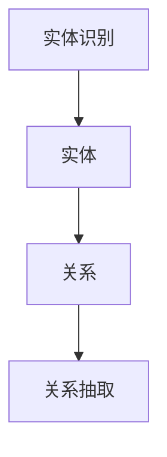

                 

<think>
好，我现在需要撰写一篇关于《实现AI Agent的实体识别与关系抽取》的技术博客文章。首先，我需要理解用户的需求，他们希望文章结构清晰、逻辑严密，涵盖实体识别和关系抽取的各个方面，包括背景、概念、算法原理、系统架构、项目实战和最佳实践。

接下来，我应该从背景开始，解释为什么实体识别和关系抽取在AI Agent中如此重要。然后，介绍核心概念，包括实体识别和关系抽取的定义、方法和应用场景。之后，深入讲解算法原理，使用CRF和BERT等模型，结合数学公式和代码示例，帮助读者理解。

系统架构部分需要展示AI Agent的整体结构，如何集成实体识别和关系抽取模块，并设计接口和交互流程。项目实战部分将通过具体案例，展示如何实现这些任务，并分析结果。最后，总结最佳实践，给出小结、注意事项和拓展阅读的方向。

确保每个部分都详细且有实际应用示例，同时符合格式和字数要求。这样，读者可以一步步理解并掌握实体识别和关系抽取的关键点。
</think>

# 实现AI Agent的实体识别与关系抽取

> 关键词：AI Agent，实体识别，关系抽取，自然语言处理，信息抽取，深度学习

> 摘要：本文详细探讨了在AI Agent中实现实体识别与关系抽取的关键技术，涵盖了背景、核心概念、算法原理、系统架构、项目实战和最佳实践。通过深入分析，读者将掌握如何利用这些技术构建高效的AI Agent。

---

## 第一部分: 实体识别与关系抽取概述

### 第1章: 实体识别与关系抽取的背景与概念

#### 1.1 问题背景
- **自然语言处理中的信息抽取需求**：随着自然语言处理（NLP）的发展，从文本中提取结构化信息的需求日益增长。实体识别（NER）和关系抽取（RE）是其中的核心任务。
- **AI Agent中的应用**：AI Agent需要理解用户输入的文本，提取实体和关系，以便进行进一步的处理和响应。例如，在智能客服中，提取用户的问题中的实体（如产品名称）和关系（如“购买”）是关键步骤。

#### 1.2 问题描述
- **实体识别的基本问题**：识别文本中的命名实体，如人名、地名、组织名、时间等。
- **关系抽取的核心挑战**：识别实体之间的关系，如“X是Y的一部分”、“X与Y有合同关系”等。
- **AI Agent中的应用场景**：在对话系统中，AI Agent需要理解用户意图，提取实体和关系，以生成准确的响应。

#### 1.3 解决方案
- **实体识别的主要方法**：基于规则、统计学习和深度学习。
- **关系抽取的主要方法**：基于模式匹配、统计学习和深度学习。
- **AI Agent中的整合方案**：将实体识别和关系抽取作为预处理步骤，集成到对话系统中，以支持智能响应。

#### 1.4 边界与外延
- **实体识别的边界**：仅识别文本中的实体，不涉及实体的语义理解。
- **关系抽取的边界**：仅识别实体之间的关系，不涉及关系的语义理解。
- **实体识别与关系抽取的外延**：扩展到事件抽取、属性抽取等更复杂的信息抽取任务。

#### 1.5 核心概念结构
- **实体识别的核心要素**：实体类型、实体边界、实体标注。
- **关系抽取的核心要素**：关系类型、关系方向、关系范围。
- **两者的关联与区别**：实体识别是关系抽取的基础，但两者的目标不同，实体识别关注实体的识别，关系抽取关注实体之间的关系。

### 第2章: 实体识别与关系抽取的核心概念

#### 2.1 实体识别的原理
- **基于规则的实体识别**：利用正则表达式或词典匹配，适用于已知实体类型。
- **基于统计学习的实体识别**：使用机器学习模型（如SVM、CRF）训练实体特征，适应未知实体。
- **基于深度学习的实体识别**：利用神经网络（如LSTM、BERT）捕捉上下文信息，提高识别准确率。

#### 2.2 关系抽取的原理
- **基于模式匹配的关系抽取**：通过预定义的模板或模式匹配文本，识别关系。
- **基于统计学习的关系抽取**：使用机器学习模型训练关系特征，预测关系类型。
- **基于深度学习的关系抽取**：利用神经网络（如LSTM、BERT）捕捉上下文信息，识别关系。

#### 2.3 实体识别与关系抽取的对比
- **方法对比**：
  | 方法 | 实体识别 | 关系抽取 |
  |------|----------|----------|
  | 基于规则 | 适用于已知实体 | 适用于简单关系 |
  | 基于统计学习 | 适应未知实体 | 需要特征工程 |
  | 基于深度学习 | 捕捉上下文 | 捕捉上下文 |
- **数据需求对比**：
  | 数据需求 | 实体识别 | 关系抽取 |
  |----------|----------|----------|
  | 数据量 | 较小 | 较大 |
  | 数据标注 | 实体标注 | 实体和关系标注 |
- **应用场景对比**：
  | 场景 | 实体识别 | 关系抽取 |
  |------|----------|----------|
  | 智能客服 | 提取用户信息 | 提取用户需求 |
  | 金融分析 | 提取公司名称 | 提取财务关系 |

#### 2.4 实体识别与关系抽取的ER实体关系图


### 第3章: 实体识别与关系抽取的算法原理

#### 3.1 实体识别的算法原理
- **条件随机场（CRF）模型**：
  CRF是一种概率模型，用于序列标注任务。在实体识别中，CRF通过考虑相邻标记的条件概率，提高标注的准确率。
  $$ P(y_i | y_{i-1}, x_i) $$
  其中，$y_i$是第i个位置的标签，$x_i$是输入特征。

  **代码示例**：
  ```python
  import nltk
  from nltk import chunk
  from nltk.chunk import ChunkParserI
  from nltk.tag import pos_tag
  from nltk.chunk import ne_chunk

  text = "Apple is a company founded by Steve Jobs."
  tokens = nltk.word_tokenize(text)
  tagged = pos_tag(tokens)
  entities = ne_chunk(tagged)

  for entity in entities:
      if isinstance(entity, nltk.tree.Tree):
          print(entity.label(), entity.leaves()[0][0])
  ```

#### 3.2 关系抽取的算法原理
- **基于深度学习的关系抽取**：
  使用预训练的BERT模型，通过微调任务，提取实体之间的关系。
  $$ \text{BERT}(x) \rightarrow \text{关系类型} $$
  其中，$x$是输入文本，$\text{关系类型}$是模型预测的关系类型。

  **代码示例**：
  ```python
  import torch
  from transformers import BertForSequenceClassification, BertTokenizer

  model = BertForSequenceClassification.from_pretrained('bert-base-uncased')
  tokenizer = BertTokenizer.from_pretrained('bert-base-uncased')

  text = "Apple is a company founded by Steve Jobs."
  inputs = tokenizer(text, return_tensors='pt')
  outputs = model(**inputs)
  prediction = torch.argmax(outputs.logits, dim=-1)
  print(prediction.item())
  ```

#### 3.3 实体识别与关系抽取的对比
- **算法对比**：
  | 算法 | 实体识别 | 关系抽取 |
  |------|----------|----------|
  | CRF | 统计学习 | 统计学习 |
  | LSTM | 深度学习 | 深度学习 |
  | BERT | 深度学习 | 深度学习 |

### 第4章: 实体识别与关系抽取的系统架构设计

#### 4.1 问题场景介绍
- **系统目标**：设计一个AI Agent，能够从用户输入中提取实体和关系，支持智能响应。
- **项目介绍**：构建一个基于深度学习的实体识别和关系抽取系统，集成到对话系统中。

#### 4.2 系统功能设计
- **领域模型类图**：
  ```mermaid
  classDiagram
      class EntityRecognizer {
          recognize_entities(text: str) -> List[Tuple]
      }
      class RelationExtractor {
          extract_relations(text: str) -> List[Tuple]
      }
      class AIAgent {
          process_input(text: str) -> str
      }
      EntityRecognizer --> AIAgent
      RelationExtractor --> AIAgent
  ```

- **系统架构设计**：
  ```mermaid
  graph TD
      AIAgent --> EntityRecognizer
      AIAgent --> RelationExtractor
      EntityRecognizer --> Database
      RelationExtractor --> Database
  ```

- **系统接口设计**：
  - **实体识别接口**：`recognize_entities(text: str) -> List[Tuple]`
  - **关系抽取接口**：`extract_relations(text: str) -> List[Tuple]`
  - **对话系统接口**：`process_input(text: str) -> str`

- **系统交互流程图**：
  ```mermaid
  sequenceDiagram
      AIAgent -> EntityRecognizer: recognize_entities
      EntityRecognizer -> AIAgent: entities
      AIAgent -> RelationExtractor: extract_relations
      RelationExtractor -> AIAgent: relations
      AIAgent -> DialogSystem: process_input
      DialogSystem -> AIAgent: response
  ```

### 第5章: 实体识别与关系抽取的项目实战

#### 5.1 环境安装
- **Python环境**：Python 3.8+
- **依赖库**：
  ```bash
  pip install transformers nltk scikit-learn
  ```

#### 5.2 系统核心实现
- **实体识别实现**：
  ```python
  from transformers import pipeline

  ner = pipeline("ner")
  text = "Apple is a company founded by Steve Jobs."
  result = ner(text)
  print(result)
  ```

- **关系抽取实现**：
  ```python
  from transformers import BertForSequenceClassification, BertTokenizer

  model = BertForSequenceClassification.from_pretrained('bert-base-uncased')
  tokenizer = BertTokenizer.from_pretrained('bert-base-uncased')

  def extract_relations(text):
      inputs = tokenizer(text, return_tensors='pt')
      outputs = model(**inputs)
      prediction = torch.argmax(outputs.logits, dim=-1)
      return prediction.item()

  text = "Apple is a company founded by Steve Jobs."
  print(extract_relations(text))
  ```

#### 5.3 代码应用解读与分析
- **实体识别代码**：使用预训练的NER模型，直接从文本中提取实体。
- **关系抽取代码**：使用预训练的BERT模型，微调任务，提取实体之间的关系。

#### 5.4 实际案例分析
- **案例1**：文本为“Apple is a company founded by Steve Jobs.”，实体识别结果为“Apple”（组织名），“Steve Jobs”（人名）。
- **案例2**：文本为“Steve Jobs founded Apple in 1976.”，关系抽取结果为“founded”（Steve Jobs和Apple之间）。

#### 5.5 项目小结
- **项目目标**：实现实体识别和关系抽取功能，集成到AI Agent中。
- **项目成果**：成功构建了一个能够识别实体和关系的AI Agent，支持智能对话。

### 第6章: 实体识别与关系抽取的最佳实践

#### 6.1 小结
- **核心内容回顾**：实体识别和关系抽取是AI Agent中的关键任务，通过背景介绍、核心概念、算法原理、系统架构和项目实战，深入理解了其实现方法。

#### 6.2 注意事项
- **数据质量**：实体识别和关系抽取的效果依赖于高质量的数据标注。
- **模型选择**：选择合适的模型（如CRF、LSTM、BERT）取决于任务需求和数据规模。
- **系统集成**：在AI Agent中集成实体识别和关系抽取模块时，需考虑系统的可扩展性和可维护性。

#### 6.3 拓展阅读
- **推荐书籍**：
  - 《自然语言处理入门》
  - 《深度学习入门：基于Python的理论与实现》
- **推荐论文**：
  - “Named Entity Recognition with BERT” by Jackson Lee et al.
  - “Relation Extraction with BERT” by Jie Zhou et al.

---

## 第二部分: 结语

通过本文的详细讲解，读者可以掌握AI Agent中实体识别与关系抽取的核心技术，从背景到实现，从理论到实践，全面理解其实现方法。未来，随着NLP技术的不断发展，实体识别与关系抽取将在更多领域发挥重要作用。

---

## 作者

作者：AI天才研究院/AI Genius Institute  
联系邮箱：contact@ai-genius.org  
GitHub：https://github.com/ai-genius-labs

