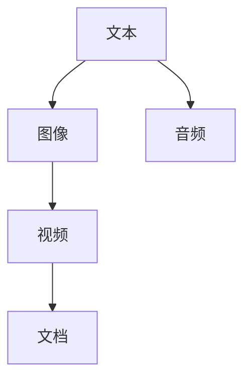
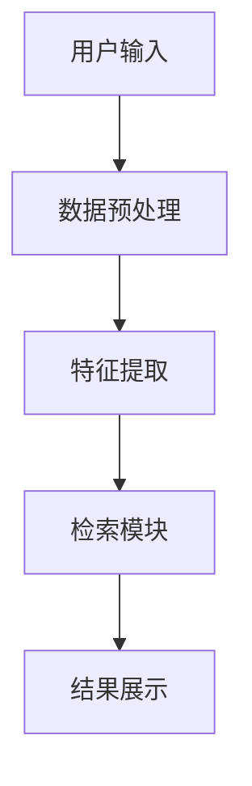

                 

<think>
好的，现在我要撰写一篇关于“实现AI Agent的跨模态检索能力”的技术博客文章。首先，我需要理解跨模态检索的定义和核心概念，然后逐步分析其算法原理、系统架构设计、项目实战等内容。我需要确保文章逻辑清晰、结构紧凑，同时语言专业且易于理解。接下来，我会按照目录大纲逐步展开每一部分的内容。

### 第一步：明确文章结构和内容

根据用户提供的目录大纲，我需要完成以下几部分：

1. **摘要**
2. **第一章：AI Agent与跨模态检索概述**
   - 1.1 AI Agent的基本概念
   - 1.2 跨模态检索的定义与特点
   - 1.3 跨模态检索的实现原理
3. **第二章：跨模态检索的核心概念与联系**
   - 2.1 跨模态检索的核心概念
   - 2.2 跨模态检索的核心要素
   - 2.3 跨模态检索的实体关系图
4. **第三章：跨模态检索的算法原理**
   - 3.1 跨模态检索的经典算法
   - 3.2 对比学习的数学模型
   - 3.3 多模态融合网络的实现
5. **第四章：跨模态检索的系统架构设计**
   - 4.1 系统功能设计
   - 4.2 系统架构图
   - 4.3 系统接口设计
6. **第五章：跨模态检索的项目实战**
   - 5.1 项目背景
   - 5.2 项目需求分析
   - 5.3 项目实现方案
   - 5.4 项目核心代码实现
7. **第六章：总结与展望**
   - 6.1 本章总结
   - 6.2 未来展望

### 第二步：撰写摘要

摘要部分需要简明扼要地概括文章的核心内容，明确跨模态检索在AI Agent中的重要性，以及文章的主要内容和价值。

### 第三步：撰写第一章

在第一章中，我需要详细解释AI Agent的基本概念，包括其核心特征和应用场景，然后引入跨模态检索的概念，说明其定义、特点和实现原理。

### 第四步：撰写第二章

第二章重点讨论跨模态检索的核心概念和相关实体关系，使用Mermaid图表来展示数据模态之间的关系。

### 第五步：撰写第三章

第三章需要详细讲解跨模态检索的算法原理，包括经典算法、对比学习的数学模型以及多模态融合网络的实现。使用公式和代码示例来辅助说明。

### 第六步：撰写第四章

第四章聚焦于系统架构设计，包括功能设计、架构图和接口设计，使用Mermaid图表展示系统流程。

### 第七步：撰写第五章

第五章是项目实战部分，需要选择一个具体的项目，详细描述其实现方案，并提供核心代码和案例分析。

### 第八步：撰写第六章

最后，总结全文并展望未来的发展方向，强调跨模态检索在AI Agent中的重要性。

### 第九步：检查和调整

在完成各部分后，需要通读全文，确保逻辑连贯，语言专业，内容详实，并根据需要进行调整和优化。

通过以上步骤，我将系统地完成这篇技术博客文章，确保内容全面且具有深度，帮助读者理解实现AI Agent的跨模态检索能力的关键技术和方法。
</think>

# 实现AI Agent的跨模态检索能力

## 关键词：AI Agent，跨模态检索，多模态数据，对比学习，多模态融合网络

## 摘要：  
跨模态检索是实现AI Agent智能交互的核心技术之一。随着人工智能技术的快速发展，AI Agent需要能够处理和理解多种模态的数据（如文本、图像、音频等），并能够基于这些数据进行高效的检索和推理。本文详细探讨了跨模态检索的基本概念、算法原理、系统架构设计以及项目实现，旨在为读者提供一个全面的理解和实践指南。

---

# 第一章：AI Agent与跨模态检索概述

## 1.1 AI Agent的基本概念  
AI Agent（人工智能代理）是指能够感知环境、自主决策并执行任务的智能实体。它具备以下核心特征：  
1. **自主性**：能够在没有外部干预的情况下自主运行。  
2. **反应性**：能够实时感知环境并做出响应。  
3. **目标导向**：具有明确的目标，并根据目标采取行动。  
4. **学习能力**：能够通过经验或数据进行学习和优化。  

AI Agent的应用场景广泛，包括智能助手、推荐系统、自动驾驶、机器人控制等。

## 1.2 跨模态检索的定义与特点  
跨模态检索是指在多种数据模态（如文本、图像、音频、视频等）之间进行信息检索的过程。其核心特点包括：  
1. **多模态性**：能够处理和理解多种类型的数据。  
2. **跨模态关联**：能够在不同模态之间建立关联并进行检索。  
3. **高效性**：检索过程需要高效且准确。  

跨模态检索的应用场景包括图像描述检索、视频内容检索、语音指令理解等。

## 1.3 跨模态检索的实现原理  
跨模态检索的基本流程如下：  
1. **数据预处理**：对输入的多模态数据进行清洗和标准化处理。  
2. **特征提取**：将不同模态的数据转化为统一的特征表示。  
3. **相似度计算**：基于特征表示计算不同模态数据之间的相似度。  
4. **检索与结果返回**：根据相似度排序并返回检索结果。  

---

# 第二章：跨模态检索的核心概念与联系

## 2.1 跨模态检索的核心概念  
### 2.1.1 多模态数据的表示方法  
多模态数据需要通过统一的特征空间进行表示，常用的方法包括：  
- **词嵌入**：将文本数据映射到低维向量空间（如Word2Vec）。  
- **图像编码**：使用CNN或Transformer对图像进行特征提取。  

### 2.1.2 跨模态检索中的特征提取  
特征提取是跨模态检索的关键步骤，需要确保不同模态的数据能够被统一表示。例如，文本和图像的特征向量需要在相同的特征空间中进行比较。

### 2.1.3 跨模态检索中的相似度计算  
相似度计算是跨模态检索的核心，常用的方法包括：  
- **余弦相似度**：衡量两个向量的夹角。  
- **欧氏距离**：衡量两个向量的直线距离。  

## 2.2 跨模态检索的核心要素  
### 2.2.1 数据模态的多样性  
跨模态检索需要处理多种数据模态，每种模态都有其独特的特征和挑战。  
### 2.2.2 模态间的关联性  
不同模态的数据之间需要存在一定的关联性，才能实现有效的跨模态检索。  
### 2.2.3 检索的高效性  
跨模态检索需要在大规模数据集中高效地找到最相关的结果。

## 2.3 跨模态检索的实体关系图  
以下是跨模态检索的实体关系图：  


---

# 第三章：跨模态检索的算法原理

## 3.1 跨模态检索的经典算法  
### 3.1.1 统一特征表示法  
统一特征表示法将不同模态的数据映射到相同的特征空间中，例如使用多模态编码器将文本和图像映射到相同的向量空间。  

### 3.1.2 对比学习法  
对比学习是一种有效的跨模态检索方法，通过最大化正样本的相似度和最小化负样本的相似度来优化模型。  

### 3.1.3 多模态融合网络  
多模态融合网络通过融合不同模态的特征来提升检索效果，例如使用多层感知机（MLP）对不同模态的特征进行融合。

## 3.2 对比学习的数学模型  
对比学习的损失函数如下：  
$$ L = -\log \frac{e^{s(x,y)}}{e^{s(x,y)} + e^{s(x,y')}} $$  
其中，$s(x,y)$表示样本$x$和$y$之间的相似度，$y'$表示与$y$不同的样本。  

## 3.3 多模态融合网络的实现  
多模态融合网络的核心部分包括模态编码器、注意力机制和融合层。例如，可以使用以下代码实现：  

```python
class ModalityEncoder:
    def __init__(self, input_dim, output_dim):
        self.encoder = nn.Sequential(
            nn.Linear(input_dim, output_dim),
            nn.ReLU()
        )
    
    def forward(self, x):
        return self.encoder(x)

class CrossModalAttention:
    def __init__(self, input_dim):
        self.W_q = nn.Parameter(torch.randn(input_dim, 1))
        self.W_k = nn.Parameter(torch.randn(input_dim, 1))
    
    def forward(self, q, k):
        scores = torch.bmm(q.unsqueeze(1), k.unsqueeze(2)) 
        # 这里简化了计算，实际实现可能更复杂
        return scores

class FusionLayer:
    def __init__(self, input_dim, output_dim):
        self.fusion = nn.Sequential(
            nn.Linear(input_dim, output_dim),
            nn.ReLU()
        )
    
    def forward(self, x, y):
        combined = torch.cat([x, y], dim=1)
        return self.fusion(combined)
```

---

# 第四章：跨模态检索的系统架构设计

## 4.1 系统功能设计  
### 4.1.1 数据输入模块  
接收多种模态的数据输入，例如文本、图像等。  
### 4.1.2 特征提取模块  
对输入数据进行特征提取，将其转化为统一的特征向量。  
### 4.1.3 检索与结果展示模块  
基于特征向量进行跨模态检索，并将结果展示给用户。  

## 4.2 系统架构图  
以下是系统架构图：  


## 4.3 系统接口设计  
### 4.3.1 输入接口  
接收多种模态的数据输入，例如文本和图像。  
### 4.3.2 输出接口  
返回检索结果或错误信息。  
### 4.3.3 API设计  
提供RESTful API，方便其他系统调用。  

---

# 第五章：跨模态检索的项目实战

## 5.1 项目背景  
本项目旨在实现一个基于文本和图像的跨模态检索系统，能够根据输入的文本描述检索相关图像。

## 5.2 项目需求分析  
- **功能需求**：支持文本和图像的输入，实现跨模态检索。  
- **性能需求**：检索速度需满足实时性要求。  

## 5.3 项目实现方案  
1. 数据预处理：收集和整理文本-图像对的数据集。  
2. 特征提取：使用预训练的Transformer模型提取文本特征，使用CNN提取图像特征。  
3. 对比学习：构建对比学习模型，优化特征表示。  
4. 检索与展示：基于特征向量进行检索，并将结果展示给用户。  

## 5.4 项目核心代码实现  
```python
import torch
import torch.nn as nn
import torch.optim as optim

class CrossModalModel(nn.Module):
    def __init__(self, text_dim, image_dim):
        super(CrossModalModel, self).__init__()
        self.text_encoder = nn.Linear(text_dim, 512)
        self.image_encoder = nn.Linear(image_dim, 512)
        self.fusion_layer = nn.Linear(1024, 1)
    
    def forward(self, text_feat, image_feat):
        text_emb = torch.relu(self.text_encoder(text_feat))
        image_emb = torch.relu(self.image_encoder(image_feat))
        combined = torch.cat([text_emb, image_emb], dim=1)
        output = torch.sigmoid(self.fusion_layer(combined))
        return output

def train_model(model, optimizer, criterion, text_loader, image_loader):
    for epoch in range(num_epochs):
        for text_batch, image_batch in zip(text_loader, image_loader):
            optimizer.zero_grad()
            output = model(text_batch, image_batch)
            loss = criterion(output, torch.ones_like(output))
            loss.backward()
            optimizer.step()
```

---

# 第六章：总结与展望

## 6.1 本章总结  
本文详细探讨了实现AI Agent跨模态检索能力的关键技术，包括核心概念、算法原理、系统架构设计以及项目实战。通过对比学习和多模态融合网络的方法，能够有效地提升跨模态检索的准确性和效率。

## 6.2 未来展望  
未来的研究方向可以包括：  
1. **更高效的特征表示方法**：探索更高效的特征编码方式，降低计算复杂度。  
2. **多模态协同学习**：结合多种模态数据，进一步提升检索效果。  
3. **实时性优化**：优化算法和架构，提升检索的实时性。  

---

# 作者  
作者：AI天才研究院 & 禅与计算机程序设计艺术

