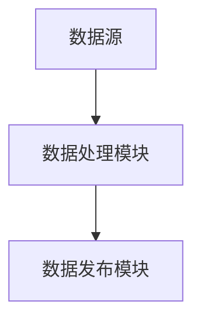
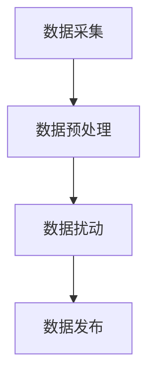

                 


# 差分隐私在AI Agent数据保护中的应用

## 关键词：差分隐私，AI Agent，数据保护，隐私技术，人工智能

## 摘要：  
随着人工智能技术的快速发展，AI Agent（智能体）在各个领域的应用越来越广泛。然而，AI Agent在处理数据时，也面临着数据隐私泄露的风险。为了保护用户隐私，差分隐私作为一种新兴的数据隐私保护技术，为AI Agent的数据安全提供了新的解决方案。本文将深入探讨差分隐私的核心原理、AI Agent的数据处理机制，以及如何将差分隐私技术应用于AI Agent的数据保护中。通过实际案例分析和系统架构设计，本文旨在为AI Agent的数据隐私保护提供一种可行且高效的解决方案。

---

# 第1章 差分隐私的基本概念

## 1.1 差分隐私的定义与核心思想

### 1.1.1 差分隐私的定义  
差分隐私是一种数据隐私保护技术，通过在数据中添加随机噪声，使得在查询数据时无法推断出单个数据点的原始信息。其核心思想是确保任何个体的数据对查询结果的影响可以忽略不计。

### 1.1.2 差分隐私的核心思想  
差分隐私的核心思想是通过概率机制来保护数据的隐私性。它允许在数据发布时添加随机噪声，使得攻击者无法通过多次查询来推断出单个数据点的原始值。

### 1.1.3 差分隐私与传统隐私保护的区别  
与传统的隐私保护技术相比，差分隐私的独特之处在于它允许在数据发布时添加随机噪声，从而在保护隐私的同时，仍然能够支持数据分析和机器学习任务。

---

## 1.2 AI Agent的基本概念

### 1.2.1 AI Agent的定义  
AI Agent是一种具有自主决策能力的智能体，能够在复杂的环境中感知、推理和行动，以完成特定的任务。

### 1.2.2 AI Agent的核心功能  
AI Agent的核心功能包括数据感知、决策推理、行动执行和自适应学习。这些功能使其能够独立完成任务，并与环境和其他系统进行交互。

### 1.2.3 AI Agent与传统软件的区别  
AI Agent与传统软件的区别在于其自主性和智能性。AI Agent能够根据环境信息动态调整行为，而传统软件则需要明确的程序指令。

---

# 第2章 差分隐私在数据保护中的应用背景

## 2.1 数据隐私保护的重要性

### 2.1.1 数据泄露的现状与挑战  
随着数据的广泛应用，数据泄露事件频发，给个人和企业带来了巨大的损失。数据隐私保护已成为一个迫切需要解决的问题。

### 2.1.2 数据隐私保护的法律与伦理要求  
数据隐私保护不仅是技术问题，还涉及法律和伦理层面。各国纷纷出台数据保护法规，要求企业和组织在处理数据时必须遵守严格的隐私保护标准。

### 2.1.3 数据隐私保护的技术挑战  
数据隐私保护的技术挑战包括如何在保护隐私的同时支持数据分析和机器学习任务，以及如何设计高效的隐私保护机制。

---

## 2.2 AI Agent数据处理的特点

### 2.2.1 AI Agent的数据收集与处理机制  
AI Agent通常需要从多种数据源收集数据，并对这些数据进行处理和分析，以支持其决策和行动。

### 2.2.2 AI Agent数据处理的隐私风险  
AI Agent在数据处理过程中，可能会面临数据泄露的风险，尤其是在处理敏感数据时。

### 2.2.3 AI Agent与数据隐私保护的结合  
为了保护AI Agent的数据隐私，需要在数据收集、处理和发布等环节中嵌入隐私保护技术，如差分隐私。

---

## 2.3 差分隐私在AI Agent数据保护中的必要性

### 2.3.1 差分隐私如何解决AI Agent的隐私问题  
差分隐私通过在数据中添加随机噪声，使得攻击者无法通过查询结果推断出单个数据点的原始信息，从而保护了数据隐私。

### 2.3.2 差分隐私在AI Agent数据保护中的优势  
差分隐私的优势在于其灵活性和可扩展性。它可以在不影响数据分析结果的情况下，保护数据隐私。

---

# 第3章 差分隐私的数学模型与算法原理

## 3.1 差分隐私的数学模型

### 3.1.1 差分隐私的定义式  
差分隐私的定义式为：对于任何两个相邻的数据集D和D'，以及任何可能的查询结果S，差分隐私要求P(S | D) / P(S | D') ≤ e^ε，其中ε是隐私预算参数。

### 3.1.2 差分隐私的参数设置  
差分隐私的参数设置包括隐私预算ε、噪声添加机制的选择等。通常，ε越小，隐私保护越强，但数据分析的准确性可能降低。

### 3.1.3 差分隐私的实现方法  
差分隐私的实现方法包括Laplace机制、Gaussian机制和Randomized Response机制等。

---

## 3.2 差分隐私的核心算法

### 3.2.1 Laplace机制  
Laplace机制是一种基于拉普拉斯分布的差分隐私算法。它通过在数据中添加拉普拉斯分布的噪声，使得查询结果的敏感数据被模糊化。

### 3.2.2 Gaussian机制  
Gaussian机制是一种基于高斯分布的差分隐私算法。它与Laplace机制类似，但噪声的分布是高斯分布。

### 3.2.3 Randomized Response机制  
Randomized Response机制是一种基于概率的差分隐私算法，适用于二值响应场景。它通过引入概率噪声，使得查询结果无法推断出单个数据点的原始值。

---

# 第4章 差分隐私的系统架构与实现

## 4.1 差分隐私系统的组成

### 4.1.1 数据源模块  
数据源模块负责收集原始数据，并将其传递给数据处理模块。

### 4.1.2 数据处理模块  
数据处理模块负责对数据进行清洗、转换和增强，以便后续的差分隐私处理。

### 4.1.3 数据发布模块  
数据发布模块负责将处理后的数据发布给外部系统或用户。

---

## 4.2 差分隐私系统的实现流程

### 4.2.1 数据采集  
数据采集是差分隐私系统的第一步，需要从各种数据源收集数据。

### 4.2.2 数据预处理  
数据预处理包括数据清洗、转换和增强，以确保数据的完整性和一致性。

### 4.2.3 数据扰动  
数据扰动是差分隐私的核心步骤，通过在数据中添加随机噪声，保护数据隐私。

### 4.2.4 数据发布  
数据发布模块将处理后的数据发布给外部系统或用户，确保数据隐私的同时支持数据分析。

---

## 4.3 差分隐私系统的系统架构

### 4.3.1 系统架构图  


### 4.3.2 数据处理流程图  


---

# 第5章 差分隐私在AI Agent中的应用

## 5.1 AI Agent的数据处理机制

### 5.1.1 AI Agent的数据收集  
AI Agent需要从多种数据源收集数据，包括传感器数据、用户输入数据等。

### 5.1.2 AI Agent的数据处理  
AI Agent需要对收集的数据进行处理，包括数据清洗、转换和增强，以便后续的分析和决策。

### 5.1.3 AI Agent的数据发布  
AI Agent需要将处理后的数据发布给外部系统或用户，支持数据分析和决策。

---

## 5.2 差分隐私在AI Agent数据保护中的应用

### 5.2.1 数据隐私保护需求  
AI Agent在数据处理过程中，需要保护敏感数据的隐私，防止数据泄露。

### 5.2.2 差分隐私的应用场景  
差分隐私可以应用于AI Agent的数据收集、处理和发布等环节，保护数据隐私。

### 5.2.3 差分隐私的实现步骤  
在AI Agent中实现差分隐私，需要在数据处理模块中嵌入差分隐私算法，对敏感数据进行扰动处理。

---

# 第6章 项目实战：基于差分隐私的AI Agent数据保护系统

## 6.1 项目背景与目标

### 6.1.1 项目背景  
本项目旨在设计并实现一个基于差分隐私的AI Agent数据保护系统，保护AI Agent在数据处理过程中的隐私安全。

### 6.1.2 项目目标  
通过本项目，验证差分隐私技术在AI Agent数据保护中的可行性和有效性。

---

## 6.2 项目实现

### 6.2.1 环境安装  
项目需要安装Python、numpy和mermaid等工具。

### 6.2.2 核心代码实现  
以下是差分隐私实现的核心代码：
```python
import numpy as np

def laplace_mechanism(data, sensitivity, epsilon):
    noise = np.random.laplace(0, sensitivity / epsilon)
    return data + noise
```

### 6.2.3 代码解读  
上述代码实现了Laplace机制，通过对数据添加拉普拉斯分布的噪声，保护数据隐私。

---

## 6.3 实际案例分析

### 6.3.1 案例背景  
假设我们有一个AI Agent用于医疗数据分析，需要保护患者的隐私数据。

### 6.3.2 数据处理流程  
数据从患者记录中收集，经过预处理后，使用Laplace机制对敏感数据进行扰动处理，最后将处理后的数据发布给分析系统。

---

## 6.4 项目小结

### 6.4.1 项目成果  
通过本项目，我们成功实现了基于差分隐私的AI Agent数据保护系统，验证了差分隐私技术的有效性。

### 6.4.2 项目总结  
本项目展示了差分隐私在AI Agent数据保护中的应用潜力，为未来的隐私保护技术研究提供了参考。

---

# 第7章 总结与展望

## 7.1 总结  
本文深入探讨了差分隐私在AI Agent数据保护中的应用，详细讲解了差分隐私的核心原理和实现方法，并通过实际案例展示了其应用潜力。

## 7.2 未来展望  
未来的研究可以进一步优化差分隐私算法，提高其在AI Agent数据保护中的效率和准确性。此外，还可以探索差分隐私与其他隐私保护技术的结合，以提供更全面的隐私保护方案。

---

# 作者：AI天才研究院/AI Genius Institute & 禅与计算机程序设计艺术 /Zen And The Art of Computer Programming

