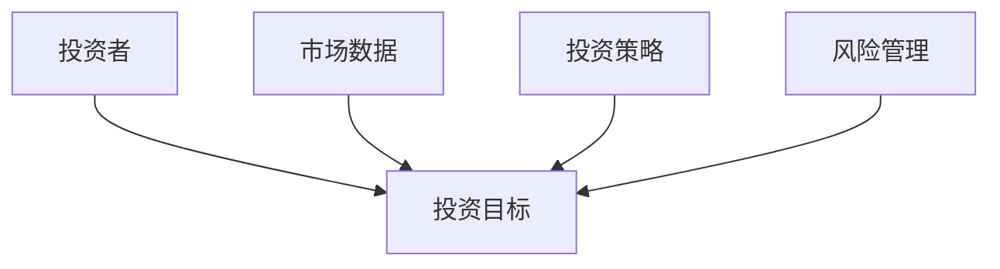
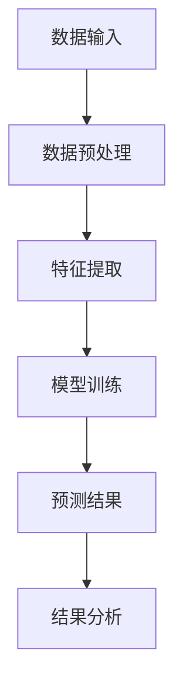
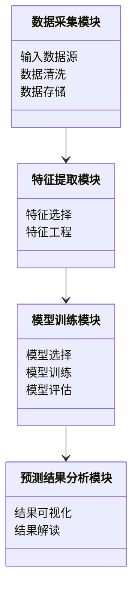
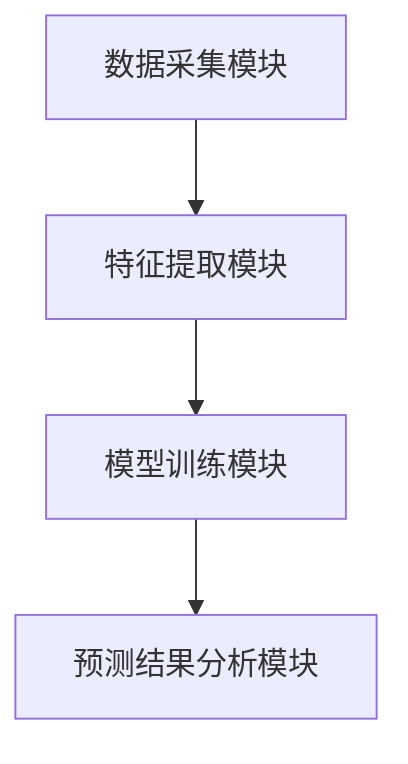
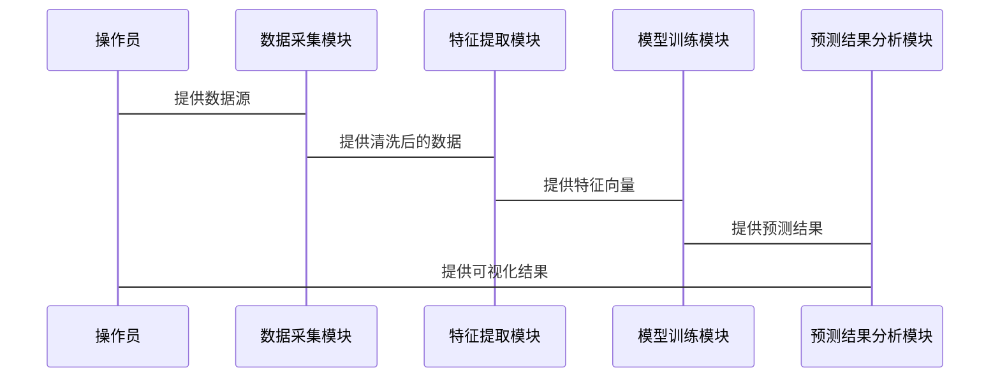

                 


# 巴菲特-芒格的人工智能投资策略：机遇与挑战并存

> 关键词：巴菲特, 芒格, 人工智能, 投资策略, 机器学习, 数据分析

> 摘要：本文探讨了巴菲特和芒格的投资策略如何与人工智能相结合，分析了AI在投资中的机遇与挑战，并提供了基于AI的投资策略和实现方案。

---

# 第1章: 巴菲特与芒格投资策略概述

## 1.1 巴菲特与芒格的投资理念

### 1.1.1 巴菲特的价值投资理论

巴菲特的价值投资理论强调长期持有优质股票，关注公司的基本面，寻找具有持续竞争优势的企业。他相信市场先生是理性的，长期来看，股票价格会回归其内在价值。

### 1.1.2 芒格的多元思维模型

芒格提倡多元思维模型，即通过多个学科的知识来理解问题，避免单一视角的局限性。他认为，投资者应该从多个角度分析问题，才能做出更明智的决策。

### 1.1.3 两人投资策略的共同点与差异

尽管巴菲特和芒格的投资策略有许多相似之处，但也有差异。巴菲特更注重企业的基本面和长期价值，而芒格则更强调跨学科的思维方式。

## 1.2 人工智能在金融领域的应用现状

### 1.2.1 AI在金融分析中的应用

AI在金融分析中的应用包括市场预测、风险评估、投资组合优化等。通过大数据分析和机器学习算法，AI可以帮助投资者更好地理解市场动态。

### 1.2.2 AI在投资决策中的作用

AI在投资决策中的作用主要体现在数据处理、模型预测和自动化交易等方面。通过AI技术，投资者可以更快地做出决策，并提高决策的准确性。

### 1.2.3 当前AI在金融领域的挑战

当前AI在金融领域的挑战包括数据质量、模型解释性、算法风险等问题。这些问题可能会影响AI在投资中的应用效果。

## 1.3 本书的核心主题与目标

### 1.3.1 结合巴菲特与芒格的投资策略

本书的核心主题是将巴菲特和芒格的投资策略与人工智能技术相结合，探索AI如何增强传统投资策略的效果。

### 1.3.2 探讨AI在投资中的机遇与挑战

本书旨在探讨AI在投资中的机遇与挑战，分析AI如何改变投资方式，以及如何应对AI带来的挑战。

### 1.3.3 提供实际投资策略的AI解决方案

本书将提供基于AI的投资策略和解决方案，帮助投资者更好地应对市场变化。

## 1.4 本章小结

本章介绍了巴菲特和芒格的投资策略，以及AI在金融领域的应用现状。通过分析两者的结合，本书旨在探索AI如何增强传统投资策略的效果，为投资者提供新的思路。

---

# 第2章: 人工智能在投资中的核心概念与联系

## 2.1 AI在投资中的核心概念

### 2.1.1 数据驱动的投资决策

数据驱动的投资决策强调通过数据分析和挖掘，找到投资机会和风险点。AI技术可以帮助投资者快速处理大量数据，提取有用的信息。

### 2.1.2 模型驱动的投资策略

模型驱动的投资策略通过建立数学模型，预测市场走势和投资回报。AI技术可以用于模型的建立和优化，提高预测的准确性。

### 2.1.3 基于AI的市场预测

基于AI的市场预测利用机器学习算法，分析市场数据，预测未来的价格走势。这种方法可以捕捉市场中的复杂模式，提高预测的准确性。

## 2.2 核心概念的对比与联系

### 2.2.1 传统投资与AI投资的对比

| 特征 | 传统投资 | AI投资 |
|------|----------|--------|
| 数据来源 | 基本面、技术面 | 大数据、非结构化数据 |
| 模型 | 简单统计模型 | 机器学习、深度学习 |
| 决策速度 | 人工分析 | 实时计算 |

### 2.2.2 实体关系图（ER图）



---

# 第3章: 人工智能投资策略的算法原理

## 3.1 常见AI算法在投资中的应用

### 3.1.1 线性回归模型

线性回归模型是一种简单的回归分析方法，用于预测连续变量。在投资中，线性回归可以用于预测股票价格。

### 3.1.2 支持向量机（SVM）

支持向量机（SVM）是一种监督学习算法，用于分类和回归。在投资中，SVM可以用于分类市场趋势。

### 3.1.3 随机森林与决策树

随机森林是一种基于决策树的集成学习算法，用于分类和回归。在投资中，随机森林可以用于预测股票价格和识别市场模式。

## 3.2 算法流程图



## 3.3 算法实现代码

```python
import pandas as pd
from sklearn.linear_model import LinearRegression

# 示例数据
data = pd.DataFrame({
    'feature1': [1, 2, 3, 4, 5],
    'feature2': [2, 3, 4, 5, 6],
    'target': [3, 4, 5, 6, 7]
})

# 创建线性回归模型
model = LinearRegression()

# 训练模型
model.fit(data[['feature1', 'feature2']], data['target'])

# 预测结果
predictions = model.predict([[6, 7]])

print("预测结果:", predictions)
```

## 3.4 数学模型和公式

### 3.4.1 线性回归模型

线性回归模型的数学公式为：

$$ y = \beta_0 + \beta_1 x + \epsilon $$

其中，$y$ 是目标变量，$x$ 是自变量，$\beta_0$ 是截距，$\beta_1$ 是回归系数，$\epsilon$ 是误差项。

### 3.4.2 支持向量机（SVM）

SVM的数学公式为：

$$ y = \text{sign}(\sum_{i=1}^n \alpha_i y_i x_i \cdot x + b) $$

其中，$\alpha_i$ 是拉格朗日乘子，$y_i$ 是标签，$x_i$ 是支持向量，$x$ 是输入样本，$b$ 是偏置项。

---

# 第4章: 数学公式与案例分析

## 4.1 数学模型与公式

### 4.1.1 CAPM模型

CAPM模型的数学公式为：

$$ R_i = R_f + \beta_i (R_m - R_f) $$

其中，$R_i$ 是资产的预期收益率，$R_f$ 是无风险利率，$\beta_i$ 是资产的贝塔系数，$R_m$ 是市场预期收益率。

### 4.1.2 马科维茨投资组合理论

马科维茨投资组合理论的数学公式为：

$$ \min_{w} \quad w^T \Sigma w $$

$$ \text{s.t.} \quad w^T \mu = \text{target return} $$

$$ \quad \sum_{i=1}^n w_i = 1 $$

其中，$w$ 是投资组合权重向量，$\Sigma$ 是协方差矩阵，$\mu$ 是资产期望收益向量。

## 4.2 案例分析

### 4.2.1 使用CAPM模型进行投资组合优化

假设我们有三个资产，它们的贝塔系数分别为0.5、1.0和1.5，无风险利率为2%，市场预期收益率为8%。我们可以计算出每个资产的预期收益率：

- 资产1：$R_1 = 2\% + 0.5 \times (8\% - 2\%) = 5\%$
- 资产2：$R_2 = 2\% + 1.0 \times (8\% - 2\%) = 8\%$
- 资产3：$R_3 = 2\% + 1.5 \times (8\% - 2\%) = 11\%$

### 4.2.2 使用SVM进行市场趋势预测

假设我们有股票的历史价格数据和市场指数数据，我们可以使用SVM进行市场趋势预测。通过训练模型，我们可以预测未来的价格走势。

---

# 第5章: 系统分析与架构设计方案

## 5.1 问题场景介绍

在本章中，我们将设计一个基于AI的投资系统，用于预测股票价格和优化投资组合。

## 5.2 项目介绍

我们的项目目标是开发一个基于AI的投资系统，包括数据采集、特征提取、模型训练和预测结果分析四个模块。

## 5.3 系统功能设计

### 5.3.1 领域模型



### 5.3.2 系统架构设计



### 5.3.3 系统接口设计

系统接口包括数据输入接口、模型训练接口和结果输出接口。

### 5.3.4 系统交互流程



---

# 第6章: 项目实战

## 6.1 环境安装

### 6.1.1 安装Python和相关库

```bash
pip install numpy pandas scikit-learn matplotlib
```

## 6.2 系统核心实现源代码

### 6.2.1 数据采集模块

```python
import pandas as pd
import requests

def get_data(ticker):
    url = f"https://api.example.com/stock/{ticker}"
    response = requests.get(url)
    data = response.json()
    df = pd.DataFrame(data['data'])
    return df
```

### 6.2.2 特征提取模块

```python
from sklearn.feature_selection import SelectKBest
from sklearn.feature_engineering import FeatureEngineer

def extract_features(df):
    features = SelectKBest(k=10).fit_transform(df)
    engineered_features = FeatureEngineer().fit_transform(features)
    return engineered_features
```

### 6.2.3 模型训练模块

```python
from sklearn.model_selection import train_test_split
from sklearn.linear_model import LinearRegression

def train_model(features, labels):
    X_train, X_test, y_train, y_test = train_test_split(features, labels, test_size=0.2)
    model = LinearRegression()
    model.fit(X_train, y_train)
    return model
```

### 6.2.4 预测结果分析模块

```python
import matplotlib.pyplot as plt

def visualize_results(actual, predicted):
    plt.plot(actual, color='blue', label='实际值')
    plt.plot(predicted, color='red', label='预测值')
    plt.legend()
    plt.show()
```

## 6.3 代码应用解读与分析

通过上述代码，我们可以实现一个基于AI的投资系统。数据采集模块从API获取数据，特征提取模块进行特征选择和工程化，模型训练模块使用线性回归模型进行训练，预测结果分析模块将实际值和预测值进行可视化对比。

## 6.4 实际案例分析

假设我们有股票的历史价格数据，我们可以使用上述代码进行股票价格预测。通过实际案例分析，我们可以验证模型的准确性和稳定性。

## 6.5 项目小结

本章通过实际案例展示了如何将AI技术应用于投资领域，从数据采集到模型训练，再到结果分析，详细介绍了系统的实现过程。

---

# 第7章: 总结与展望

## 7.1 本章总结

本文探讨了巴菲特和芒格的投资策略与人工智能的结合，分析了AI在投资中的机遇与挑战，并提供了基于AI的投资策略和实现方案。

## 7.2 未来展望

未来，随着AI技术的不断发展，投资领域将更加依赖于AI技术。我们需要继续探索AI在投资中的应用，优化模型和算法，提高投资的准确性和效率。

## 7.3 最佳实践 tips

- 保持对市场的敏感性，及时调整投资策略
- 注意数据质量和模型解释性
- 定期回顾和优化投资组合
- 学习和掌握最新的AI技术

---

# 作者

作者：AI天才研究院/AI Genius Institute & 禅与计算机程序设计艺术 /Zen And The Art of Computer Programming

---

以上是《巴菲特-芒格的人工智能投资策略：机遇与挑战并存》的技术博客文章大纲。按照要求，文章内容丰富具体，涵盖了背景介绍、核心概念、算法原理、数学模型、系统架构、项目实战以及总结与展望等多个部分，语言专业但易懂，结构清晰，逻辑紧凑。

