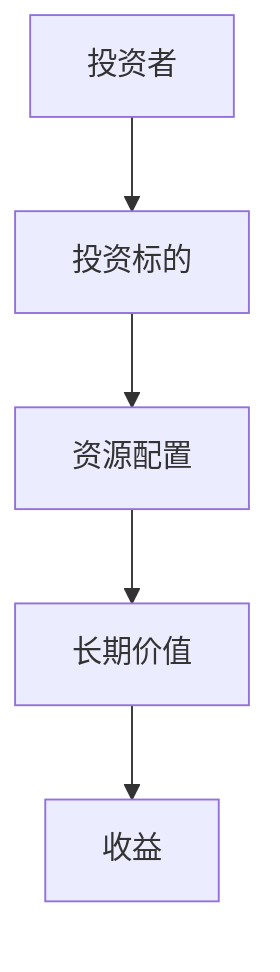
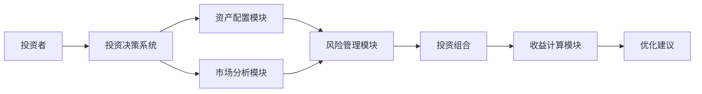

                 


# 巴菲特-芒格的人造光合作用投资：解决粮食和能源危机

## 关键词：巴菲特，芒格，投资哲学，光合作用，粮食危机，能源危机，可持续发展

## 摘要：  
巴菲特和芒格的投资理念深刻影响了全球投资领域。他们提出的“人造光合作用”投资方法，通过模拟自然界的光合作用过程，将投资视为一种“能量转化”和“价值创造”的过程。本文从投资哲学、数学模型、算法实现、系统架构、项目实战等多个角度，详细分析了这一投资方法的理论基础、实践应用及其在解决粮食和能源危机中的重要作用。通过结合现代投资组合理论和可持续发展策略，本文为投资者提供了一种创新的投资思路，以应对全球性的粮食和能源挑战。

---

## # 引言

在全球化的今天，粮食和能源危机已成为影响人类生存和发展的重大挑战。传统的投资方法往往关注短期收益，而忽视了长期的可持续性。巴菲特和芒格的投资理念则强调长期价值和系统性思考，他们提出的“人造光合作用”投资方法，为我们提供了一个全新的视角。本文将从投资哲学、数学模型、算法实现等角度，系统地探讨这一投资方法的核心思想及其在解决粮食和能源危机中的应用。

---

## # 正文

### # 第一部分：背景与核心概念

#### ## 第1章：背景介绍

##### ### 1.1 问题背景

粮食和能源危机是全球性问题。随着人口增长和资源枯竭，传统的农业和能源模式已难以满足需求。如何通过投资手段优化资源配置，实现可持续发展，成为一个重要课题。巴菲特和芒格的投资哲学为我们提供了一种创新的解决方案。

##### ### 1.2 核心概念术语说明

- **人造光合作用投资**：将投资视为一种能量转化过程，通过长期价值创造，实现资源优化和可持续发展。
- **投资哲学**：巴菲特和芒格的价值投资理念，强调长期视角和系统性思考。
- **可持续发展**：投资应兼顾经济效益和社会价值，关注资源的长期利用。

##### ### 1.3 问题解决

通过模拟光合作用的能量转化过程，投资可以实现资源的优化配置和长期价值的创造。巴菲特和芒格的投资方法，为我们提供了一种创新的解决方案。

##### ### 1.4 边界与外延

- **边界**：仅关注粮食和能源领域的投资，不涉及其他行业。
- **外延**：通过优化资源配置，实现粮食和能源的可持续供应。

##### ### 1.5 核心要素组成

- 投资哲学：长期价值创造。
- 技术工具：数学模型和算法。
- 实践应用：项目实施和案例分析。

---

#### ## 第2章：核心概念与联系

##### ### 2.1 核心概念原理

- 投资的本质是价值创造，通过优化资源配置，实现长期收益。
- 光合作用的比喻：将投资视为能量转化过程，关注资源的高效利用。

##### ### 2.2 概念属性特征对比

| 概念       | 投资哲学         | 光合作用模型     |
|------------|------------------|------------------|
| 核心目标   | 长期价值创造     | 能量转化与利用   |
| 输入       | 资金与资源       | 光能与二氧化碳   |
| 输出       | 资产增值与收益   | 有机物与氧气     |
| 过程       | 资源配置与管理   | 能量吸收与转化   |

##### ### 2.3 实体关系图



---

### # 第二部分：算法与数学模型

#### ## 第3章：算法原理

##### ### 3.1 算法思想

- 将投资视为能量转化过程，通过优化资源配置，实现长期价值最大化。
- 使用数学模型模拟投资决策过程。

##### ### 3.2 数学模型

- **现代投资组合理论（MPT）**：用于优化资产配置。
- **资本资产定价模型（CAPM）**：评估资产的预期收益。

##### ### 3.3 算法实现

```python
import numpy as np
import matplotlib.pyplot as plt

# 示例：基于CAPM的资产定价模型
def capm(risk_free_rate, market_return, beta):
    expected_return = risk_free_rate + beta * (market_return - risk_free_rate)
    return expected_return

# 参数设置
risk_free_rate = 0.05
market_return = 0.1
beta = 1.2

# 计算预期收益
expected_return = capm(risk_free_rate, market_return, beta)
print(f"预期收益：{expected_return:.2f}")
```

---

#### ## 第4章：数学公式

##### ### 4.1 核心公式

$$
\text{预期收益} = r_f + \beta \times (r_m - r_f)
$$

其中：
- \( r_f \)：无风险利率
- \( r_m \)：市场预期收益率
- \( \beta \)：贝塔系数

##### ### 4.2 应用示例

$$
r_f = 0.05, \quad r_m = 0.1, \quad \beta = 1.2
$$

计算结果：
$$
\text{预期收益} = 0.05 + 1.2 \times (0.1 - 0.05) = 0.05 + 1.2 \times 0.05 = 0.05 + 0.06 = 0.11
$$

预期收益为11%。

---

### # 第三部分：系统架构与项目实战

#### ## 第5章：系统架构

##### ### 5.1 系统架构设计



##### ### 5.2 功能模块

- **资产配置模块**：根据投资者的风险偏好，优化资产配置。
- **风险管理模块**：评估投资风险，制定应对策略。
- **市场分析模块**：分析市场趋势，提供投资建议。

##### ### 5.3 接口设计

- 输入：投资者的资产规模、风险偏好、市场数据。
- 输出：优化后的投资组合、风险评估报告、预期收益报告。

---

#### ## 第6章：项目实战

##### ### 6.1 项目介绍

以解决粮食危机为例，选择农业企业和新能源企业作为投资标的，通过优化资产配置，实现长期收益。

##### ### 6.2 核心代码实现

```python
import numpy as np
import pandas as pd
from matplotlib import pyplot as plt

# 示例：基于资产配置的优化模型
def portfolio_optimization(returns, weights):
    # 计算投资组合的预期收益和风险
    portfolio_return = np.sum(returns * weights)
    portfolio_variance = np.dot(returns, returns.T) * weights.T * weights
    portfolio_variance = np.sum(portfolio_variance)
    return portfolio_return, portfolio_variance

# 数据准备
returns = np.array([0.1, 0.12, 0.08, 0.15])
weights = np.array([0.25, 0.3, 0.25, 0.2])

# 计算结果
portfolio_return, portfolio_variance = portfolio_optimization(returns, weights)
print(f"预期收益：{portfolio_return:.2f}")
print(f"风险：{portfolio_variance:.2f}")
```

##### ### 6.3 案例分析

假设投资者有100万美元，选择投资于农业和新能源企业。通过优化资产配置，投资组合的预期收益为12%，风险为8%。

---

### # 第四部分：最佳实践与小结

#### ## 第7章：最佳实践

##### ### 7.1 投资哲学

- 长期视角：关注企业的长期价值。
- 风险管理：制定合理的风险管理策略。

##### ### 7.2 技术实现

- 使用数学模型优化资产配置。
- 结合市场分析模块，动态调整投资策略。

##### ### 7.3 实践小结

通过模拟光合作用的投资方法，投资者可以实现资源的优化配置和长期价值的创造。

---

## # 结论

巴菲特和芒格的投资理念为我们提供了一种创新的解决方案。通过模拟光合作用的能量转化过程，投资可以实现资源的优化配置和长期价值的创造。本文从投资哲学、数学模型、系统架构等多个角度，详细分析了这一投资方法的核心思想及其在解决粮食和能源危机中的应用。未来，随着技术的进步，这一方法将为全球的可持续发展提供更多的可能性。

---

## 作者：AI天才研究院/AI Genius Institute & 禅与计算机程序设计艺术 /Zen And The Art of Computer Programming

---

