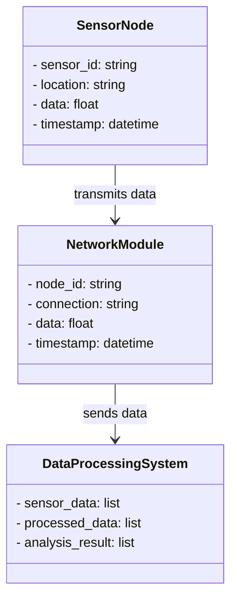
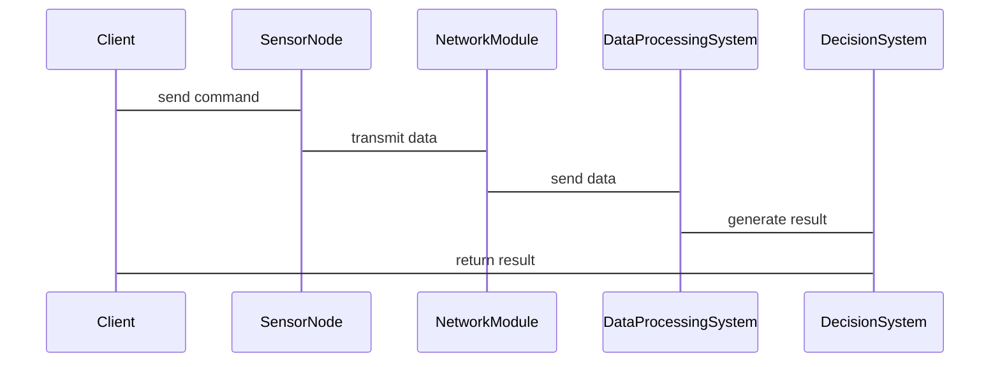

                 


# 巴菲特-芒格的仿生量子传感器投资：下一代物联网的核心

---

## 关键词：
巴菲特、芒格、仿生量子传感器、物联网、投资策略、数据分析、量子技术

---

## 摘要：
本文探讨了巴菲特和芒格的投资理念与仿生量子传感器技术的结合，分析了如何通过量子传感器的数据驱动投资决策，优化物联网系统。文章从价值投资的核心思想出发，结合量子传感器的原理和物联网的体系结构，详细阐述了仿生量子传感器在投资中的应用、数据分析模型以及系统架构设计。通过实际案例分析，展示了量子传感器如何成为下一代物联网的核心技术，并为投资者提供了新的视角和策略。

---

## 第一部分: 巴菲特-芒格投资理念与仿生量子传感器的结合

### 第1章: 巴菲特-芒格投资理念概述

#### 1.1 巴菲特-芒格投资理念的核心思想
##### 1.1.1 巴菲特的价值投资理论
- **核心思想**：巴菲特的价值投资理论强调以低于内在价值的价格买入优质资产，注重企业的基本面分析，寻找具有持续竞争优势的企业。
- **长期主义**：巴菲特的投资策略注重长期价值，而非短期市场波动。
- **安全边际**：通过买入价格低于内在价值的资产，确保投资的安全性。

##### 1.1.2 芒格的多元思维模型
- **多元思维模型**：芒格提倡将各个学科的基本原理融会贯通，形成一个多元化的知识框架，以帮助投资者做出更明智的决策。
- **逆向思维**：芒格强调从反方向思考问题，寻找市场的非共识性机会。

##### 1.1.3 价值投资与长期主义的结合
- **价值投资的核心**：寻找具有长期竞争优势的企业，关注企业的内在价值而非市场短期波动。
- **长期主义的重要性**：通过长期持有优质资产，实现财富的稳步增长。

#### 1.2 价值投资的核心要素
##### 1.2.1 企业基本面分析
- **财务指标分析**：包括盈利能力、资产负债表、现金流等关键财务指标。
- **行业地位分析**：关注企业在行业中的竞争优势和市场占有率。

##### 1.2.2 安全边际的概念
- **安全边际的定义**：买入价格低于企业内在价值的部分，确保投资的安全性。
- **安全边际的计算**：通过对企业未来现金流的贴现，估算其内在价值。

##### 1.2.3 投资组合的构建与优化
- **资产配置**：根据市场环境和投资目标，合理配置不同资产类别。
- **分散投资**：通过分散投资降低风险，避免过度集中于单一资产或行业。

#### 1.3 巴菲特-芒格投资理念的现代应用
##### 1.3.1 数字化时代的投资机会
- **科技行业的投资机会**：关注人工智能、大数据、物联网等新兴技术领域的投资机会。
- **数字化转型的影响**：企业通过数字化转型提升竞争力，为投资者提供了新的投资方向。

##### 1.3.2 新兴技术对投资决策的影响
- **数据驱动的投资决策**：利用大数据和人工智能技术，提高投资决策的准确性和效率。
- **技术对企业价值的影响**：新兴技术对企业未来盈利能力和内在价值的影响。

##### 1.3.3 价值投资与科技创新的结合
- **科技创新的价值评估**：如何将科技创新纳入价值投资的框架，评估其对企业内在价值的影响。
- **长期投资与科技创新的结合**：通过长期持有具有创新能力和竞争优势的企业，实现财富增长。

#### 1.4 本章小结
- 本章介绍了巴菲特和芒格的投资理念，特别是价值投资和长期主义的核心思想，分析了这些理念在现代投资中的应用，特别是数字化时代和技术驱动的背景下，如何将价值投资与科技创新结合起来。

---

### 第2章: 仿生量子传感器的基本原理

#### 2.1 量子传感器的定义与特点
##### 2.1.1 量子传感器的基本概念
- **量子传感器**：利用量子效应进行感知和测量的装置，具有极高的灵敏度和精度。
- **量子效应**：包括量子叠加、量子纠缠等现象，为传感器提供了更高的性能。

##### 2.1.2 量子传感器的核心技术
- **量子干涉技术**：通过量子干涉效应实现高精度的测量。
- **量子纠缠技术**：利用量子纠缠现象进行信息传输和处理。

##### 2.1.3 量子传感器的性能优势
- **高灵敏度**：量子传感器能够检测到极微弱的信号，适用于高精度测量。
- **高稳定性**：量子传感器在复杂环境下的稳定性优于传统传感器。

#### 2.2 仿生传感器的设计理念
##### 2.2.1 仿生传感器的定义
- **仿生传感器**：模仿生物感官系统设计的传感器，具有高度的感知能力和智能性。
- **生物感官系统**：如视觉、听觉、触觉等，为传感器的设计提供了灵感。

##### 2.2.2 仿生传感器的工作原理
- **生物模拟技术**：通过模拟生物感官系统的工作原理，设计仿生传感器。
- **智能感知算法**：利用人工智能算法，实现仿生传感器的智能感知和数据处理。

##### 2.2.3 仿生传感器的优势与挑战
- **优势**：高灵敏度、高智能性、适应性强。
- **挑战**：技术复杂性高、成本高、稳定性需要进一步提升。

#### 2.3 量子传感器在物联网中的应用
##### 2.3.1 量子传感器在物联网中的作用
- **数据采集**：量子传感器可以实时采集高精度的数据，为物联网系统提供高质量的信息。
- **智能决策**：通过量子传感器的数据，物联网系统可以做出更精准的决策。

##### 2.3.2 量子传感器在智能设备中的应用
- **智能硬件**：量子传感器可以应用于智能手机、智能家居等智能设备中，提升设备的感知能力。
- **智能汽车**：量子传感器可以用于自动驾驶汽车的环境感知和安全监测。

##### 2.3.3 量子传感器对数据采集的影响
- **数据质量的提升**：量子传感器提供的高精度数据，可以显著提高物联网系统的决策能力。
- **数据量的增加**：量子传感器的高灵敏度和高稳定性，可以实现更频繁的数据采集。

#### 2.4 本章小结
- 本章介绍了量子传感器的基本原理和仿生传感器的设计理念，分析了量子传感器在物联网中的应用，特别是其在数据采集和智能决策中的重要作用。

---

### 第3章: 物联网的体系结构与核心组件

#### 3.1 物联网的基本概念
##### 3.1.1 物联网的定义
- **物联网**：通过各种信息传感设备，按照约定的协议，把任何物品与互联网连接起来，进行信息交换和通信，以实现智能化识别、定位、跟踪、监控和管理。

##### 3.1.2 物联网的组成要素
- **感知层**：包括传感器、射频识别（RFID）、全球定位系统（GPS）、摄像头等设备，用于采集数据。
- **网络层**：包括各种网络通信技术，如无线传感器网络、移动通信网络、互联网等，用于数据传输。
- **应用层**：包括各种应用系统，如智能交通、智能家居、医疗健康等，用于数据处理和应用。

##### 3.1.3 物联网的演进历程
- **第一代物联网**：基于传感器和简单的数据传输技术，主要用于简单的监控和数据采集。
- **第二代物联网**：引入了云计算和大数据技术，实现了数据的集中处理和分析。
- **第三代物联网**：基于人工智能和量子计算技术，实现了智能化的决策和自主学习。

#### 3.2 物联网的体系结构
##### 3.2.1 物理层
- **物理层**：包括传感器和执行器等设备，用于与物理世界的交互。
- **数据采集**：通过传感器采集环境数据，如温度、湿度、压力等。

##### 3.2.2 数据传输层
- **网络通信**：包括无线通信技术（如Wi-Fi、蓝牙、ZigBee等）和移动通信技术（如5G），用于数据的传输。
- **数据传输协议**：如HTTP、MQTT等，用于数据的高效传输。

##### 3.2.3 应用层
- **数据处理**：包括数据的存储、分析和挖掘，用于生成有用的信息和知识。
- **应用服务**：基于数据处理结果，提供各种应用服务，如智能监控、智能决策等。

#### 3.3 物联网的核心组件
##### 3.3.1 传感器节点
- **传感器节点**：包括传感器和数据处理单元，用于采集和处理数据。
- **传感器网络**：由多个传感器节点组成的网络，用于覆盖更大的区域和实现更复杂的数据采集。

##### 3.3.2 网络通信模块
- **通信技术**：包括无线通信技术和移动通信技术，用于数据的传输。
- **通信协议**：如MQTT、CoAP等，用于实现设备之间的通信和数据交换。

##### 3.3.3 数据处理与存储系统
- **数据存储**：包括数据库和分布式存储系统，用于存储大量的物联网数据。
- **数据处理**：包括数据清洗、数据转换和数据分析，用于生成有用的信息和知识。

#### 3.4 本章小结
- 本章介绍了物联网的基本概念、体系结构和核心组件，分析了物联网系统的组成和各部分的功能，为后续章节的应用分析奠定了基础。

---

### 第4章: 仿生量子传感器在投资中的应用

#### 4.1 仿生量子传感器的投资价值
##### 4.1.1 传感器数据的金融价值
- **数据的准确性**：量子传感器提供的高精度数据，可以显著提高投资决策的准确性。
- **数据的实时性**：量子传感器可以实时采集数据，为投资者提供及时的信息。

##### 4.1.2 数据的实时性与准确性
- **实时性**：量子传感器可以实时采集数据，确保投资者能够及时获取最新的信息。
- **准确性**：量子传感器的高灵敏度和高稳定性，保证了数据的准确性。

##### 4.1.3 数据的可扩展性与稳定性
- **可扩展性**：量子传感器可以大规模部署，适用于各种规模的物联网系统。
- **稳定性**：量子传感器在复杂环境下的稳定性，保证了数据的持续性和可靠性。

#### 4.2 量子传感器在风险控制中的作用
##### 4.2.1 风险识别与评估
- **风险识别**：通过量子传感器的数据，投资者可以更准确地识别潜在风险。
- **风险评估**：利用量子传感器的数据，进行风险的量化评估，为投资决策提供支持。

##### 4.2.2 数据的驱动决策支持
- **数据驱动的决策**：通过量子传感器的数据，投资者可以做出更科学的投资决策。
- **风险预警机制**：通过量子传感器的数据，建立风险预警机制，提前采取应对措施。

##### 4.2.3 风险控制的具体应用
- **市场风险控制**：通过量子传感器的数据，实时监控市场波动，进行风险控制。
- **信用风险控制**：通过量子传感器的数据，评估企业的信用风险，进行风险控制。

#### 4.3 量子传感器在投资组合优化中的应用
##### 4.3.1 数据驱动的投资策略
- **数据驱动的策略**：通过量子传感器的数据，制定科学的投资策略。
- **投资组合优化**：利用量子传感器的数据，优化投资组合，提高投资回报率。

##### 4.3.2 投资组合的动态调整
- **动态调整**：根据量子传感器的数据，实时调整投资组合，适应市场变化。
- **风险与收益的平衡**：通过量子传感器的数据，实现风险与收益的平衡，优化投资组合。

##### 4.3.3 数据的长期积累与分析
- **长期数据积累**：通过量子传感器的长期数据积累，进行深入的分析和研究。
- **数据挖掘与分析**：利用量子传感器的数据，进行深度的数据挖掘和分析，发现投资机会。

#### 4.4 本章小结
- 本章分析了仿生量子传感器在投资中的应用，特别是其在风险控制和投资组合优化中的重要作用，展示了量子传感器如何为投资者提供新的视角和策略。

---

### 第5章: 量子传感器的数据分析与投资模型

#### 5.1 数据分析的基本方法
##### 5.1.1 数据清洗与预处理
- **数据清洗**：去除噪声数据和异常值，确保数据的准确性和一致性。
- **数据预处理**：对数据进行标准化、归一化等处理，为后续分析做好准备。

##### 5.1.2 数据分析方法
- **统计分析**：包括均值、方差、相关性分析等，用于数据的基本统计特征分析。
- **机器学习**：包括回归分析、分类分析、聚类分析等，用于数据的深度挖掘和分析。

##### 5.1.3 数据可视化
- **数据可视化工具**：如Matplotlib、Seaborn等，用于数据的可视化展示。
- **可视化分析**：通过图表、图形等方式，直观展示数据的特征和趋势。

#### 5.2 数据分析的高级方法
##### 5.2.1 时间序列分析
- **时间序列分析**：用于分析数据随时间的变化趋势，发现周期性、趋势性等特征。
- **ARIMA模型**：用于预测未来的时间序列数据。

##### 5.2.2 主成分分析（PCA）
- **主成分分析**：用于降维，提取数据的主要特征，减少数据的复杂性。

##### 5.2.3 聚类分析
- **聚类分析**：用于将数据分成不同的类别，发现数据的内在结构。

#### 5.3 投资模型的构建
##### 5.3.1 投资模型的框架
- **模型框架**：包括数据输入、特征提取、模型训练、结果输出等部分。
- **模型选择**：根据数据特征和投资目标，选择合适的模型。

##### 5.3.2 量子传感器数据的特征提取
- **特征提取**：从量子传感器数据中提取有用的特征，用于投资模型的训练。
- **特征选择**：选择最具代表性的特征，提高模型的性能。

##### 5.3.3 模型训练与优化
- **模型训练**：利用量子传感器数据，训练投资模型，使其能够准确预测投资结果。
- **模型优化**：通过调整模型参数和优化算法，提高模型的准确性和效率。

#### 5.4 投资模型的实现
##### 5.4.1 Python代码实现
- **代码实现**：使用Python语言，结合机器学习库（如Scikit-learn、XGBoost等），实现投资模型的训练和预测。
- **代码解读**：详细解读代码的每一部分，说明其功能和作用。

##### 5.4.2 模型的验证与评估
- **模型验证**：通过交叉验证等方法，验证模型的准确性和稳定性。
- **模型评估**：通过指标（如准确率、召回率、F1分数等），评估模型的性能。

#### 5.5 本章小结
- 本章详细介绍了量子传感器数据分析的基本方法和高级方法，构建了投资模型的框架，并通过Python代码实现了模型的训练和预测，展示了量子传感器如何为投资决策提供支持。

---

## 第六章: 系统分析与架构设计方案

### 6.1 问题场景介绍
- **问题场景**：在物联网系统中，如何利用仿生量子传感器实现高精度的数据采集和智能决策。
- **目标**：设计一个基于仿生量子传感器的物联网系统，实现数据的实时采集、传输、处理和应用。

### 6.2 项目介绍
- **项目目标**：通过仿生量子传感器，实现物联网系统的高精度数据采集和智能决策。
- **项目范围**：包括传感器节点、网络通信、数据处理与存储等部分。

### 6.3 系统功能设计
##### 6.3.1 领域模型


##### 6.3.2 系统架构设计


##### 6.3.3 系统接口设计
- **传感器节点接口**：定义传感器节点的数据采集和传输接口。
- **网络通信接口**：定义网络模块的数据传输接口。
- **数据处理接口**：定义数据处理系统的数据接口。

##### 6.3.4 系统交互设计


### 6.4 本章小结
- 本章通过系统分析与架构设计，展示了如何利用仿生量子传感器构建一个高效的物联网系统，实现数据的实时采集、传输、处理和应用。

---

## 第七章: 项目实战与案例分析

### 7.1 环境安装
- **环境要求**：安装Python、NumPy、Pandas、Scikit-learn、Mermaid等工具。
- **安装步骤**：使用pip安装所需的Python库。

### 7.2 系统核心实现源代码
##### 7.2.1 传感器数据采集代码
```python
import numpy as np
import pandas as pd
import time

def collect_data(sensor_id):
    # 模拟量子传感器数据采集
    data = np.random.normal(0, 1, 100)
    timestamp = pd.Timestamp(time.time())
    return {
        'sensor_id': sensor_id,
        'data': data.tolist(),
        'timestamp': timestamp
    }
```

##### 7.2.2 数据处理与分析代码
```python
from sklearn import preprocessing
from sklearn.ensemble import RandomForestRegressor

def preprocess_data(data):
    # 数据预处理
    X = data.drop('target', axis=1)
    y = data['target']
    # 特征标准化
    scaler = preprocessing.StandardScaler().fit(X)
    X_scaled = scaler.transform(X)
    return X_scaled, y

def train_model(X_scaled, y):
    # 训练随机森林回归模型
    model = RandomForestRegressor(n_estimators=100, random

