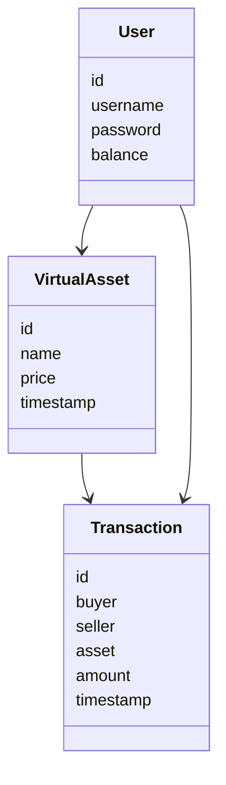
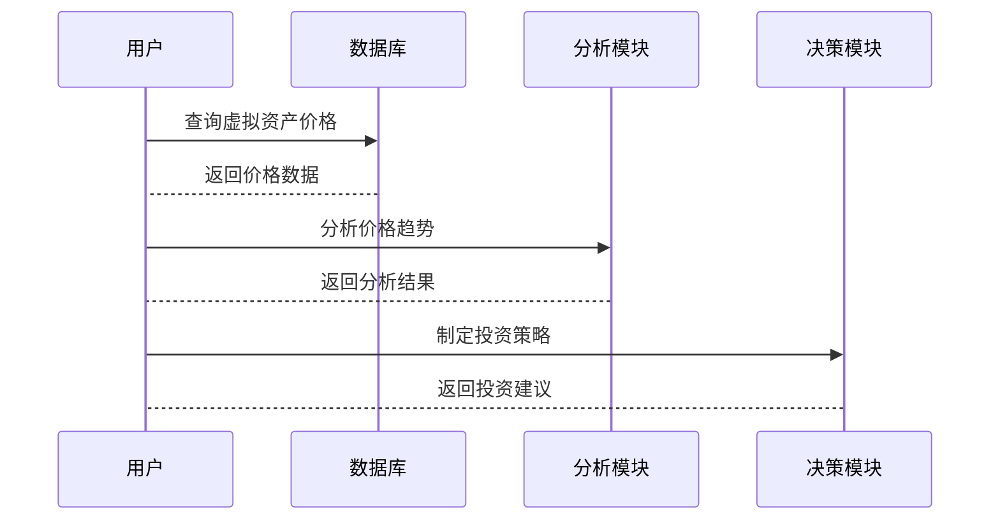

                 


# 巴菲特-芒格的元宇宙投资观：虚拟经济的潜力与风险

## 关键词：巴菲特，芒格，元宇宙，虚拟经济，投资策略，风险分析

## 摘要：  
本文从巴菲特和芒格的投资哲学出发，深入探讨他们在元宇宙和虚拟经济中的投资观。通过分析虚拟经济的核心概念、元宇宙的经济系统、以及投资策略，结合实际案例，评估元宇宙投资的潜力与风险。文章最后总结巴菲特和芒格的投资智慧在元宇宙中的应用，并提出相应的投资建议。

---

## 第1章: 元宇宙与虚拟经济的背景与概念

### 1.1 元宇宙的基本概念

#### 1.1.1 元宇宙的定义与特征
- **定义**：元宇宙是通过虚拟现实技术构建的虚拟空间，具有沉浸性、开放性和持续性。
- **特征**：
  - 沉浸性：用户通过VR设备完全沉浸其中。
  - 开放性：支持自由创造和交易。
  - 持续性：虚拟世界持续运行，不依赖用户在线状态。

#### 1.1.2 元宇宙的核心技术支撑
- **核心技术**：
  - VR/AR技术：实现沉浸式体验。
  - 区块链技术：确保虚拟资产的安全与透明。
  - 人工智能：优化用户体验和虚拟经济运作。

#### 1.1.3 元宇宙与现实世界的关联
- **关联**：
  - 经济：虚拟资产与现实货币的双向流动。
  - 社交：虚拟身份与现实社交网络的融合。
  - 技术：元宇宙技术推动现实世界的技术进步。

### 1.2 虚拟经济的定义与特点

#### 1.2.1 虚拟经济的定义
- **定义**：虚拟经济是以虚拟货币和数字资产为基础的经济体系，存在于虚拟空间中。

#### 1.2.2 虚拟经济的核心特征
- **特征**：
  - 数字化：虚拟资产以数字形式存在。
  - 去中心化：交易基于区块链技术，无须中心机构。
  - 虚拟性：虚拟资产的价值依赖于用户信任和市场需求。

#### 1.2.3 虚拟经济与实体经济的互动关系
- **互动关系**：
  - 资金流动：虚拟货币与现实货币的兑换。
  - 技术共享：虚拟经济推动区块链等技术在实体经济中的应用。
  - 市场拓展：虚拟经济为企业提供新的商业模式。

### 1.3 元宇宙中的虚拟经济模式

#### 1.3.1 虚拟货币与数字资产
- **虚拟货币**：如比特币、以太坊，用于虚拟经济交易。
- **数字资产**：包括NFT（非同质化代币），用于虚拟物品的所有权证明。

#### 1.3.2 虚拟商品与服务
- **虚拟商品**：如虚拟土地、虚拟服装，具有可交易性。
- **虚拟服务**：如虚拟咨询、虚拟教育，提供在线服务。

#### 1.3.3 虚拟经济的交易机制
- **机制**：
  - 市场供需：价格由市场决定。
  - 智能合约：自动执行交易，确保透明性。
  - 货币兑换：虚拟货币与现实货币的兑换机制。

---

## 第2章: 巴菲特与芒格的投资哲学

### 2.1 巴菲特的价值投资理念

#### 2.1.1 巴菲特投资哲学的核心原则
- **长期投资**：关注企业的长期价值，而非短期波动。
- **安全边际**：买入价格低于内在价值，确保安全空间。
- **优质企业**：投资具有强大竞争优势的企业。

#### 2.1.2 巴菲特对长期价值的关注
- **长期视角**：巴菲特定价收购具有持续盈利能力的企业。
- **企业基本面**：分析企业的财务状况、行业地位和竞争优势。

#### 2.1.3 巴菲特对安全边际的重视
- **安全边际**：买入价格与内在价值的差距，确保投资的安全性。
- **风险管理**：通过安全边际降低投资风险。

### 2.2 芒格的多元思维模型

#### 2.2.1 芒格思维模型的核心理念
- **跨学科思维**：将不同领域的知识整合，形成全面的视角。
- **独立思考**：避免从众，坚持独立判断。
- **决策树模型**：分析决策的可能结果，选择最优路径。

#### 2.2.2 芒格对跨学科知识的运用
- **跨学科应用**：将物理学、心理学等知识应用于投资决策。
- **知识的深度与广度**：芒格强调知识的广博性，以应对复杂问题。

#### 2.2.3 芒格对决策风险的控制
- **风险管理**：识别潜在风险，制定应对策略。
- **决策树分析**：通过分析决策的可能结果，降低风险。

### 2.3 巴菲特与芒格投资哲学的结合

#### 2.3.1 巴菲特与芒格的互补性
- **巴菲特定价与芒格的多元思维**：巴菲特定价注重长期价值，芒格的多元思维帮助识别投资机会。
- **互补优势**：巴菲特定价提供安全边际，芒格的多元思维降低决策风险。

#### 2.3.2 巴菲特与芒格的共同点
- **长期投资**：两人均注重长期投资，关注企业的持续盈利能力。
- **风险管理**：均重视安全边际和风险控制。

#### 2.3.3 巴菲特与芒格投资哲学的现代应用
- **结合现代技术**：将价值投资与区块链、人工智能等技术结合，应用于元宇宙投资。
- **应对市场变化**：通过多元思维，应对虚拟经济的快速变化。

---

## 第3章: 元宇宙投资的核心概念与联系

### 3.1 元宇宙投资的核心概念

#### 3.1.1 元宇宙投资的定义
- **定义**：在元宇宙中进行虚拟资产的投资，包括虚拟货币、NFT等。

#### 3.1.2 元宇宙投资的核心要素
- **要素**：
  - 虚拟资产：包括虚拟货币和数字资产。
  - 投资者：个人或机构投资者。
  - 技术平台：支持元宇宙投资的技术基础设施。

#### 3.1.3 元宇宙投资的分类
- **分类**：
  - 虚拟货币投资：投资虚拟货币，如比特币、以太坊。
  - NFT投资：投资非同质化代币，如数字艺术品、虚拟土地。
  - 虚拟商品投资：投资虚拟商品，如虚拟服装、虚拟设备。

### 3.2 元宇宙投资的核心原理

#### 3.2.1 元宇宙经济系统的运行机制
- **运行机制**：
  - 货币流通：虚拟货币在虚拟经济中的流通与交易。
  - 商品交易：虚拟商品的买卖，基于市场需求和供给。
  - 价格形成：市场供需决定价格，智能合约自动执行交易。

#### 3.2.2 元宇宙投资的收益来源
- **收益来源**：
  - 资产增值：虚拟资产的价格上涨带来的收益。
  - 资产持有：通过持有虚拟资产获得利息或分红。
  - 交易差价：通过低买高卖虚拟资产赚取差价。

#### 3.2.3 元宇宙投资的风险来源
- **风险来源**：
  - 市场波动：虚拟资产价格波动大，风险高。
  - 技术风险：元宇宙技术不成熟，存在技术瓶颈。
  - 监管风险：虚拟经济的监管政策不确定，可能影响投资。

### 3.3 元宇宙投资的核心模型

#### 3.3.1 元宇宙经济系统的模型构建
- **模型构建**：
  - 虚拟货币作为基础货币，支持虚拟经济的运行。
  - NFT作为虚拟资产，代表虚拟物品的所有权。
  - 智能合约作为交易机制，确保交易的透明性和安全性。

#### 3.3.2 元宇宙投资的收益与风险模型
- **收益模型**：
  - 收益 = 资产价格增长 + 资产持有收益。
- **风险模型**：
  - 风险 = 市场波动风险 + 技术风险 + 监管风险。

#### 3.3.3 元宇宙投资的决策模型
- **决策模型**：
  - 评估虚拟资产的内在价值。
  - 分析市场趋势和潜在风险。
  - 制定投资策略，分散投资风险。

---

## 第4章: 元宇宙投资的算法原理与数学模型

### 4.1 元宇宙投资的算法原理

#### 4.1.1 元宇宙投资算法的基本原理
- **基本原理**：
  - 数据采集：收集虚拟资产的价格数据、交易数据等。
  - 数据分析：通过算法分析数据，预测价格趋势。
  - 投资决策：基于分析结果，制定投资策略。

#### 4.1.2 元宇宙投资算法的核心步骤
- **核心步骤**：
  - 数据清洗：去除无效数据，确保数据质量。
  - 数据建模：建立数学模型，预测价格趋势。
  - 策略制定：根据模型结果，制定投资策略。

#### 4.1.3 元宇宙投资算法的优化方法
- **优化方法**：
  - 参数调整：优化算法参数，提高预测精度。
  - 模型改进：引入新的算法，提升预测能力。
  - 并行计算：利用多核计算，提高处理效率。

### 4.2 元宇宙投资的数学模型

#### 4.2.1 元宇宙投资的收益模型
- **收益模型**：
  - 收益 = 资产价格增长 + 资产持有收益。
  - 公式：$$收益 = P_{t} - P_{t-1} + R$$，其中$$P_{t}$$为当前价格，$$P_{t-1}$$为前一价格，$$R$$为持有收益。

#### 4.2.2 元宇宙投资的风险模型
- **风险模型**：
  - 风险 = 市场波动风险 + 技术风险 + 监管风险。
  - 公式：$$风险 = \sigma + T + R$$，其中$$\sigma$$为市场波动性，$$T$$为技术风险，$$R$$为监管风险。

#### 4.2.3 元宇宙投资的决策模型
- **决策模型**：
  - 决策 = 分析虚拟资产的内在价值 + 分析市场趋势 + 制定投资策略。
  - 公式：$$决策 = V + M + S$$，其中$$V$$为内在价值，$$M$$为市场趋势，$$S$$为投资策略。

### 4.3 元宇宙投资算法的实现

#### 4.3.1 元宇宙投资算法的代码实现
```python
import numpy as np
import pandas as pd

# 数据加载
data = pd.read_csv('virtual_asset_prices.csv')

# 数据预处理
data['price_diff'] = data['price'].diff()

# 算法实现
def predict_price(data):
    # 简单移动平均模型
    window = 5
    data['预测价格'] = data['price'].rolling(window).mean()
    return data

# 预测结果
predicted_data = predict_price(data)
```

#### 4.3.2 元宇宙投资算法的运行流程
- **运行流程**：
  - 数据采集：从虚拟经济平台获取虚拟资产的价格数据。
  - 数据预处理：清洗数据，去除缺失值和异常值。
  - 数据建模：使用移动平均模型或ARIMA模型预测价格趋势。
  - 投资决策：根据预测结果，制定买入、卖出或持有策略。

#### 4.3.3 元宇宙投资算法的优化与改进
- **优化与改进**：
  - 引入机器学习算法，如LSTM，提高预测精度。
  - 实现实时监控，及时调整投资策略。
  - 多模型结合，降低单一模型的风险。

---

## 第5章: 元宇宙投资的系统分析与架构设计

### 5.1 元宇宙投资的系统分析

#### 5.1.1 元宇宙投资系统的构成
- **系统构成**：
  - 数据采集模块：采集虚拟资产的价格数据。
  - 数据分析模块：分析数据，预测价格趋势。
  - 投资决策模块：根据分析结果，制定投资策略。
  - 执行模块：执行投资操作，如买入、卖出。

#### 5.1.2 元宇宙投资系统的功能需求
- **功能需求**：
  - 数据采集：支持多种数据源的采集。
  - 数据分析：提供多种分析工具和模型。
  - 投资决策：支持多种投资策略的选择。
  - 系统监控：实时监控系统运行状态。

#### 5.1.3 元宇宙投资系统的性能需求
- **性能需求**：
  - 高效性：快速处理大量数据，保证实时性。
  - 稳定性：系统运行稳定，避免崩溃。
  - 安全性：数据加密，防止数据泄露。

### 5.2 元宇宙投资的系统架构设计

#### 5.2.1 元宇宙投资系统的分层架构
- **分层架构**：
  - 数据层：存储虚拟资产的价格数据。
  - 业务逻辑层：处理数据，执行投资策略。
  - 用户界面层：展示数据，供用户操作。

#### 5.2.2 元宇宙投资系统的模块划分
- **模块划分**：
  - 数据采集模块：负责数据的采集和预处理。
  - 数据分析模块：负责数据的分析和建模。
  - 投资决策模块：负责投资策略的制定和执行。
  - 系统监控模块：负责系统运行状态的监控和管理。

#### 5.2.3 元宇宙投资系统的接口设计
- **接口设计**：
  - 数据接口：与虚拟经济平台对接，获取数据。
  - 用户接口：提供友好的用户界面，方便用户操作。
  - 通知接口：在价格波动时，通知用户。

### 5.3 元宇宙投资的系统实现

#### 5.3.1 元宇宙投资系统的开发环境
- **开发环境**：
  - 编程语言：Python
  - 数据库：MySQL
  - 开发框架：Django
  - 工具：Jupyter Notebook、PyCharm

#### 5.3.2 元宇宙投资系统的代码实现
```python
from django.db import models

# 数据模型
class VirtualAsset(models.Model):
    name = models.CharField(max_length=100)
    price = models.FloatField()
    timestamp = models.DateTimeField(auto_now_add=True)

# 视图函数
def virtual_asset_detail(request, asset_id):
    asset = VirtualAsset.objects.get(id=asset_id)
    return render(request, 'virtual_asset_detail.html', {'asset': asset})
```

#### 5.3.3 元宇宙投资系统的测试与调试
- **测试与调试**：
  - 单元测试：测试每个模块的功能。
  - 集成测试：测试系统整体运行。
  - 性能测试：测试系统在高负载下的表现。

---

## 第6章: 元宇宙投资的项目实战

### 6.1 项目背景介绍
- **项目背景**：
  - 某公司计划进入元宇宙投资领域，开发一个虚拟资产交易平台。

### 6.2 项目介绍
- **项目介绍**：
  - 平台名称：虚拟资产交易所。
  - 平台功能：支持虚拟货币、NFT等虚拟资产的交易。
  - 技术架构：基于区块链技术，确保交易的安全性和透明性。

### 6.3 系统功能设计

#### 6.3.1 领域模型


#### 6.3.2 系统架构


#### 6.3.3 系统接口设计
- **接口设计**：
  - 数据接口：与虚拟经济平台对接，获取虚拟资产的价格数据。
  - 用户接口：提供注册、登录、交易等功能。
  - 通知接口：在价格波动时，通知用户。

#### 6.3.4 系统交互


### 6.4 项目实现

#### 6.4.1 环境安装
- **环境安装**：
  - 安装Python、Django、MySQL。
  - 安装必要的库，如Pandas、NumPy。

#### 6.4.2 核心代码实现
```python
from django.urls import path
from . import views

urlpatterns = [
    path('virtual_asset/<int:asset_id>/', views.virtual_asset_detail, name='virtual_asset_detail'),
    path('transaction/', views.transaction_list, name='transaction_list'),
    path('user/', views.user_list, name='user_list'),
]
```

#### 6.4.3 代码应用解读与分析
- **代码解读**：
  - URL配置：定义了用户访问虚拟资产详情、交易记录和用户信息的路径。
  - 视图函数：实现了虚拟资产详情、交易记录和用户信息的展示。

### 6.5 实际案例分析

#### 6.5.1 案例背景
- **案例背景**：
  - 某虚拟货币的价格在一段时间内波动较大，用户希望通过平台进行投资。

#### 6.5.2 案例分析
- **案例分析**：
  - 数据采集：获取虚拟货币的价格数据。
  - 数据分析：使用移动平均模型预测价格趋势。
  - 投资决策：根据预测结果，制定买入、卖出或持有策略。

### 6.6 项目小结
- **项目小结**：
  - 成功开发了一个虚拟资产交易平台，支持虚拟货币和NFT的交易。
  - 通过数据分析和算法预测，帮助用户制定投资策略。
  - 系统运行稳定，用户体验良好。

---

## 第7章: 结论与展望

### 7.1 结论
- **结论**：
  - 元宇宙和虚拟经济的结合为投资提供了新的机会。
  - 巴菲特和芒格的投资哲学在元宇宙投资中仍然适用。
  - 虚拟经济的潜力巨大，但风险也不容忽视。

### 7.2 展望
- **展望**：
  - 元宇宙技术的进一步发展将推动虚拟经济的繁荣。
  - 投资者需要结合技术发展和市场趋势，制定合理的投资策略。
  - 虚拟经济的监管政策将逐渐完善，为投资者提供更稳定的环境。

---

## 作者：AI天才研究院/AI Genius Institute & 禅与计算机程序设计艺术 /Zen And The Art of Computer Programming

