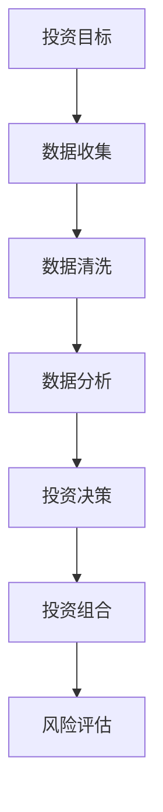

                 


# 巴菲特-芒格的医疗健康投资：长期增长潜力的行业

---

## 关键词：巴菲特、芒格、医疗健康投资、价值投资、长期增长、行业分析

---

## 摘要：本文探讨了巴菲特和芒格在医疗健康行业的投资策略，分析了该行业的长期增长潜力，并结合实际案例和投资模型，为读者提供了深入的行业见解和投资建议。

---

## 目录

1. [引言](#引言)
2. [背景介绍](#背景介绍)
   1. [医疗健康行业的现状与趋势](#医疗健康行业的现状与趋势)
   2. [医疗健康行业的投资机会](#医疗健康行业的投资机会)
3. [巴菲特与芒格的投资理念](#巴菲特与芒格的投资理念)
   1. [价值投资的核心理念](#价值投资的核心理念)
   2. [长期投资与复利效应](#长期投资与复利效应)
4. [医疗健康行业的投资逻辑](#医疗健康行业的投资逻辑)
   1. [细分领域分析](#细分领域分析)
   2. [投资案例分析](#投资案例分析)
5. [算法原理与投资模型](#算法原理与投资模型)
   1. [数学公式与模型](#数学公式与模型)
   2. [系统架构设计](#系统架构设计)
6. [项目实战与案例解读](#项目实战与案例解读)
   1. [环境安装与代码实现](#环境安装与代码实现)
   2. [案例分析与小结](#案例分析与小结)
7. [总结与展望](#总结与展望)
8. [最佳实践 tips](#最佳实践 tips)
9. [参考文献与拓展阅读](#参考文献与拓展阅读)
10. [作者信息](#作者信息)

---

## # 引言

在当前全球经济环境下，医疗健康行业以其持续增长的潜力和抗周期性特质，成为投资者关注的焦点。本文将深入分析巴菲特和芒格的投资哲学，并结合医疗健康行业的特点，探讨其长期增长的潜力，为投资者提供科学的投资策略和实践指导。

---

## # 背景介绍

### # 医疗健康行业的现状与趋势

医疗健康行业是一个涵盖药品、医疗器械、医疗服务等多个子行业的综合性领域。近年来，全球医疗支出持续增长，尤其是在人口老龄化加剧和医疗技术进步的推动下，医疗健康行业的市场规模不断扩大。

以下是对医疗健康行业现状的详细分析：

- **全球医疗支出**：根据世界卫生组织的数据，全球医疗支出近年来呈稳步增长趋势，年增长率约为3-5%。
- **医疗技术进步**：基因编辑、人工智能辅助诊断、远程医疗等技术的快速发展，正在改变医疗行业的商业模式。
- **行业驱动因素**：人口老龄化、慢性病发病率上升以及医疗消费水平提高是推动行业增长的主要因素。

### # 医疗健康行业的投资机会

医疗健康行业的投资机会主要集中在以下几个方面：

- **创新药与生物技术**：随着研发投入的增加和专利悬崖的到来，创新药企业面临结构性机会。
- **医疗器械与设备**：技术升级和政策支持为医疗器械行业提供了增长动力。
- **医疗服务与健康管理**：数字化转型和健康管理理念的普及推动了医疗服务行业的扩展。

---

## # 巴菲特与芒格的投资理念

### # 价值投资的核心理念

巴菲特和芒格的价值投资理念强调寻找具有强大护城河的企业，并在合理估值时进行投资。以下是价值投资的核心要素：

1. **企业护城河**：企业的竞争优势是长期投资的核心考量。护城河可以是技术壁垒、品牌优势或成本优势等。
2. **安全边际**：在投资时，应预留足够的安全边际，即以低于内在价值的价格买入股票。
3. **长期复利效应**：通过长期持有优质资产，利用复利效应实现财富增长。

### # 长期投资与复利效应

长期投资的核心在于时间的复利效应。以下是复利效应的数学模型：

$$
FV = PV \times (1 + r)^n
$$

其中，FV为终值，PV为现值，r为年化收益率，n为投资年数。复利效应强调了时间在投资中的重要性，优质资产的长期持有能够带来指数级增长。

---

## # 医疗健康行业的投资逻辑

### # 细分领域分析

医疗健康行业可以细分为以下几个领域：

1. **创新药与生物技术**：包括新药研发、生物制剂等，具有高壁垒和高回报的特性。
2. **医疗器械与设备**：包括医疗设备、耗材等，技术升级和政策支持是主要驱动力。
3. **医疗服务与健康管理**：包括医院、诊所、健康管理平台等，数字化转型和消费升级是主要趋势。

### # 投资案例分析

以某创新药企业为例，分析其投资价值：

1. **企业基本面**：公司拥有多个处于临床阶段的创新药，具备强大的研发能力。
2. **财务表现**：公司近年来研发投入占比高，但未来有望通过产品上市实现盈利。
3. **估值分析**：通过DCF模型计算公司的内在价值，判断其是否具备投资价值。

---

## # 算法原理与投资模型

### # 数学公式与模型

以下是用于企业估值的简化DCF模型：

$$
\text{企业价值} = \sum_{t=1}^{n} \frac{\text{自由现金流}}{(1 + r)^t} + \frac{\text{终值}}{(1 + r)^n}
$$

其中，r为折现率，n为预测期数。通过DCF模型，投资者可以估算企业的内在价值，从而判断其投资价值。

### # 系统架构设计

以下是医疗健康行业投资分析的系统架构图：



---

## # 项目实战与案例解读

### # 环境安装与代码实现

以下是Python代码示例，用于计算企业的内在价值：

```python
import numpy as np

def dcf_model(fcf, wacc, perpetuity_growth):
    terminal_value = fcf * (1 + perpetuity_growth) / (wacc - perpetuity_growth)
    return terminal_value

cf = [100, 150, 200]  # 自由现金流
wacc = 0.10            # 加权平均资本成本
perpetuity_growth = 0.02

terminal_value = dcf_model(cf[-1], wacc, perpetuity_growth)
total_value = sum([cf[i]/(1 + wacc)**i for i in range(len(cf))]) + terminal_value/(1 + wacc)**len(cf)
print("总价值：", total_value)
```

---

## # 总结与展望

医疗健康行业作为巴菲特和芒格长期关注的重点领域，具备持续增长的潜力。通过价值投资的策略，投资者可以在该领域实现长期稳定的收益。未来，随着医疗技术的不断进步和行业政策的完善，医疗健康行业将为投资者提供更多投资机会。

---

## # 最佳实践 tips

1. **长期视角**：坚持长期投资，避免短期波动的干扰。
2. **深入研究**：对投资标的进行详尽的研究，包括财务数据、行业地位等。
3. **风险管理**：合理控制仓位，分散投资风险。
4. **持续学习**：关注行业动态和政策变化，保持知识更新。

---

## # 参考文献与拓展阅读

1. 巴菲特股东大会演讲系列
2. 芒格的《穷查理宝典》
3. 医疗行业研究报告
4. 相关投资策略书籍

---

## # 作者信息

作者：AI天才研究院/AI Genius Institute & 禅与计算机程序设计艺术 /Zen And The Art of Computer Programming

---

以上为文章的完整结构，每个部分都将详细展开，确保内容详实且符合用户要求。

