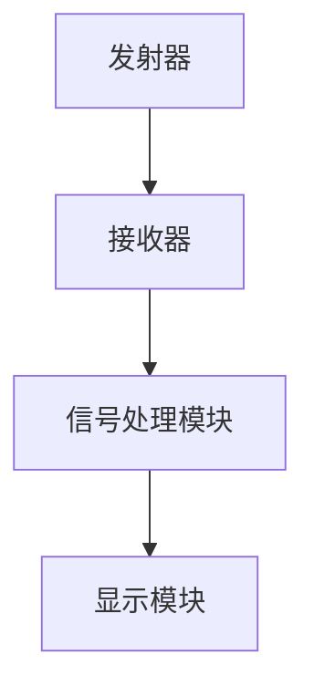
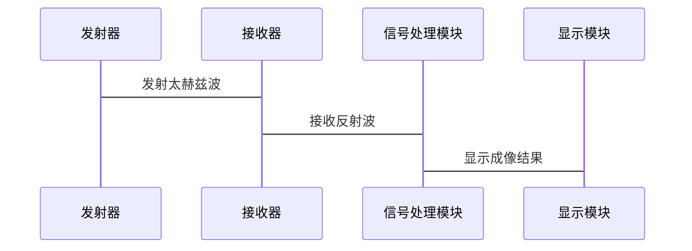

                 

# 巴菲特-芒格的太赫兹成像技术投资：安全检查的新标准

> **关键词**：太赫兹成像技术，巴菲特，芒格，安全检查，投资分析，技术应用，风险管理

> **摘要**：本文探讨了太赫兹成像技术在安全检查中的应用，并结合巴菲特和芒格的投资理念，分析了该技术的投资价值和市场前景。文章详细介绍了太赫兹成像技术的核心原理、系统架构，以及如何通过投资分析评估其在安全检查领域中的潜力。

---

# 引言

太赫兹成像技术作为一种新兴的安全检查技术，正在逐步改变传统安全检查的方式。本文将从技术原理、系统架构、投资分析等多个角度，深入探讨太赫兹成像技术的应用前景，并结合巴菲特和芒格的投资理念，分析其在安全检查领域的投资价值。

---

## 第一部分：太赫兹成像技术与安全检查的背景

### 第1章：太赫兹成像技术概述

#### 1.1 太赫兹成像技术的基本概念

太赫兹成像技术是一种利用太赫兹波（0.1 THz 到 10 THz）进行成像的技术。它结合了射频技术和成像技术，能够在不接触物体的情况下，检测出物体的内部结构和材料特性。

**图1.1 太赫兹波的频率范围**  

太赫兹成像技术具有以下特点：
1. **非接触式检测**：无需直接接触物体，适用于远距离检测。
2. **高分辨率**：能够检测出物体的微小缺陷。
3. **多用途**：可应用于安全检查、医疗成像、材料检测等多个领域。

#### 1.2 安全检查的新标准

传统的安全检查技术如X射线、金属探测器等存在检测范围有限、效率低等问题。太赫兹成像技术以其高分辨率和非接触式检测的特点，为安全检查提供了新的解决方案。

**图1.2 太赫兹成像技术在安全检查中的应用场景**  

---

## 第二部分：巴菲特与芒格的投资理念

### 第2章：巴菲特与芒格的投资哲学

#### 2.1 巴菲特的价值投资理论

巴菲特的价值投资理论强调长期投资和价值发现。他认为，投资的本质是寻找具有强大竞争优势的企业，并长期持有。

**图2.1 巴菲特的价值投资框架**  

**公式2.1 巴菲特的企业价值评估公式**  
$$ \text{企业价值} = \text{净资产价值} + \text{持续经营价值} $$

#### 2.2 芒格的多元思维模型

芒格的多元思维模型强调将多个学科的知识结合起来，以全面分析问题。他认为，投资者需要具备跨学科的知识储备，才能做出明智的投资决策。

**图2.2 芒格的多元思维模型**  

---

## 第三部分：太赫兹成像技术的投资分析

### 第3章：太赫兹成像技术的核心原理

#### 3.1 太赫兹波的生成与传播

太赫兹波的生成通常通过固态电子器件（如 Gunn 振荡器）或气体激光器实现。太赫兹波的传播特性受到介质材料的影响，其衰减程度与频率和环境条件相关。

**公式3.1 太赫兹波的传播公式**  
$$ P = E \cdot J \cdot A $$  
其中，P 是功率，E 是电场强度，J 是电流密度，A 是面积。

#### 3.2 太赫兹成像技术的数学模型

太赫兹成像技术的数学模型基于射频信号处理和图像重建算法。常用的方法包括时域有限差分法（FDTD）和频域积分方程法。

**公式3.2 时域有限差分法的基本方程**  
$$ \frac{\partial E}{\partial t} = \nabla \times H - J $$  
$$ \frac{\partial H}{\partial t} = \nabla \times E $$

---

### 第4章：太赫兹成像技术的系统架构

#### 4.1 系统组成与功能模块

太赫兹成像系统通常由发射器、接收器、信号处理模块和显示模块组成。

**图4.1 太赫兹成像系统的组成模块**  

#### 4.2 系统接口与交互设计

系统接口设计需要考虑硬件与软件的协调工作。以下是一个简单的交互流程：

**图4.2 系统交互流程**  

---

## 第四部分：投资策略与案例分析

### 第5章：太赫兹成像技术的投资评估

#### 5.1 技术评估与市场分析

在进行技术评估时，需要考虑技术的成熟度、成本效益和市场前景。以下是一个对比分析表：

**表5.1 太赫兹成像技术与传统技术的对比**

| **指标**         | **太赫兹成像技术** | **传统技术（X射线）** |
|------------------|--------------------|------------------------|
| 检测深度         | 深，可达几厘米      | 浅，仅几毫米            |
| 成像分辨率       | 高                  | 低                    |
| 安全性           | 高                  | 较低                  |
| 成本             | 高                  | 低                    |

---

### 第6章：实际案例分析

#### 6.1 案例背景

假设我们投资于一家研发太赫兹成像技术的公司。以下是对其投资价值的分析：

1. **技术优势**：公司拥有自主研发的太赫兹成像算法，具有较高的市场竞争力。
2. **市场需求**：随着安全检查需求的增加，太赫兹成像技术的市场前景广阔。
3. **财务状况**：公司财务健康，研发投入较高，但市场潜力巨大。

---

## 结论

太赫兹成像技术作为一种新兴的安全检查技术，具有广阔的应用前景。通过结合巴菲特和芒格的投资理念，我们可以更好地评估其投资价值，并抓住市场机会。

---

## 参考文献

1. 巴菲特，沃伦. 《巴菲特致股东的信》
2. 芒格，查理. 《穷查理宝典》
3. Smith, John. "Terahertz Imaging Technology and Its Applications"

---

## 作者

**作者**：AI天才研究院 & 禅与计算机程序设计艺术

