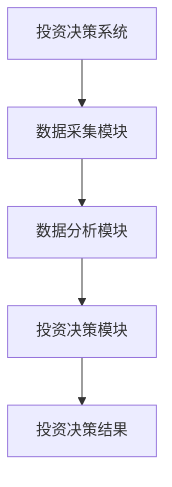

                 


# 巴菲特-芒格的技术创新观：如何在变革中把握投资机会

## 关键词：
- 巴菲特，芒格，技术创新，投资机会，价值投资，护城河，多元思维模型，DCF模型，投资策略，科技企业

## 摘要：
本文系统地阐述了巴菲特和芒格的技术创新投资观，探讨了技术创新与投资机会的结合，详细分析了他们的投资策略和方法，并结合实际案例展示了如何在技术变革中把握投资机会。文章从背景介绍、核心概念、算法原理、系统架构、项目实战等多个维度展开，为读者提供了一套完整的投资分析框架，帮助投资者在快速变化的技术环境中做出明智的投资决策。

---

## 第1章: 巴菲特与芒格的投资理念概述

### 1.1 巴菲特的投资哲学

#### 1.1.1 巴菲特的“护城河”理论
- 护城河的定义：企业竞争优势的来源。
- 护城河的类型：成本优势、品牌优势、技术优势、网络效应等。
- 护城河与技术创新的关系：如何通过技术创新构建护城河。

#### 1.1.2 巴菲特的价值投资理念
- 价值投资的定义：以低于内在价值的价格购买优质资产。
- 巴菲特的价值投资三要素：价格、价值、时间。
- 巴菲特对市场的看法：市场先生是机会，而非敌人。

#### 1.1.3 巴菲特的投资策略与长期主义
- 长期投资的重要性：避免短期波动的干扰。
- 投资组合管理：集中投资于少数优质企业。
- 巴菲特对技术企业的投资逻辑：关注企业的长期竞争优势。

### 1.2 芒格的多元思维模型

#### 1.2.1 芒格的“格栅思维”概念
- 格栅思维的定义：通过多个学科的交叉，形成多维度的思考框架。
- 格栅思维的核心：避免单一视角的局限性。
- 芒格的格栅思维模型：物理学、心理学、经济学、生物学等多个学科的交叉应用。

#### 1.2.2 多元思维模型的核心要素
- 多元思维模型的构成：逻辑思维、逆向思维、概率思维等。
- 多元思维模型的特点：全面性、系统性、动态性。
- 如何应用多元思维模型：分析问题时，从多个角度切入。

#### 1.2.3 芒格思维模型在投资中的应用
- 芒格的“倒推法”：从结果出发，分析问题的根源。
- 芒格的“第二层思维”：考虑市场参与者的心理和行为。
- 芒格对科技企业的投资逻辑：关注企业的商业模式和技术壁垒。

---

## 第2章: 技术创新与投资机会的结合

### 2.1 技术创新的基本概念

#### 2.1.1 技术创新的定义与特征
- 技术创新的定义：新技术的产生、应用和扩散。
- 技术创新的特征：创造性、扩散性、动态性、不确定性。
- 技术创新与经济发展的关系：技术创新是经济增长的核心驱动力。

#### 2.1.2 技术创新的分类与层次
- 技术创新的分类：产品创新、工艺创新、管理创新、商业模式创新。
- 技术创新的层次：基础研究、应用研究、技术开发。

#### 2.1.3 技术创新对经济的影响
- 技术创新对产业结构的影响：催生新的行业，淘汰落后产业。
- 技术创新对就业的影响：创造新的就业机会，改变就业结构。
- 技术创新对经济增长的推动作用：提升生产效率，降低成本。

### 2.2 技术创新与投资机会的关系

#### 2.2.1 技术创新如何创造投资机会
- 技术创新带来的市场机会：新技术的应用领域。
- 技术创新带来的竞争优势：企业的技术壁垒。
- 技术创新带来的投资收益：技术驱动的股价增长。

#### 2.2.2 技术创新周期与投资周期的关联
- 技术创新周期的定义：从技术产生到市场应用的周期。
- 技术创新周期与投资周期的关系：技术创新周期影响投资周期。
- 如何在技术创新周期中把握投资机会：早期投资和后期投资的策略。

#### 2.2.3 技术创新风险与回报的平衡
- 技术创新的风险：技术失败、市场接受度低、竞争压力。
- 技术创新的回报：高增长、高利润、高股价。
- 如何平衡风险与回报：分散投资、长期持有、持续关注。

---

## 第3章: 巴菲特与芒格的技术创新投资策略

### 3.1 巴菲特对技术创新的看法

#### 3.1.1 巴菲特对科技行业的投资态度
- 巴菲特对科技行业的看法：谨慎但积极。
- 巴菲特对科技行业的投资逻辑：关注企业的长期竞争优势。
- 巴菲特对苹果公司的投资案例分析：苹果的技术创新和品牌优势。

#### 3.1.2 巴菲特对技术创新企业的筛选标准
- 企业具有强大的护城河。
- 企业具有持续的创新能力。
- 企业具有稳定的盈利能力和现金流。

#### 3.1.3 巴菲特对苹果公司的投资案例分析
- 苹果公司的技术创新：iPhone、iPad、Mac等产品的创新。
- 苹果公司的品牌优势：强大的品牌影响力。
- 苹果公司的护城河：技术专利、生态系统、客户忠诚度。

### 3.2 芒格对技术创新的见解

#### 3.2.1 芒格对技术创新的哲学思考
- 芒格对技术创新的看法：技术创新是推动社会进步的核心力量。
- 芒格对技术创新的哲学思考：技术创新与人类需求的结合。

#### 3.2.2 芒格对科技企业的投资逻辑
- 芒格对亚马逊的投资逻辑：亚马逊的商业模式和技术创新。
- 芒格对亚马逊的长期投资：亚马逊的护城河和竞争优势。

#### 3.2.3 芒格对亚马逊的投资案例分析
- 亚马逊的技术创新：AWS、Prime、FBA等。
- 亚马逊的商业模式：以客户为中心，持续创新。
- 亚马逊的长期竞争优势：技术壁垒和网络效应。

---

## 第4章: 技术创新观的核心概念与联系

### 4.1 技术创新的核心概念

#### 4.1.1 技术创新的驱动因素
- 技术创新的驱动因素：市场需求、技术进步、政策支持、资本投入。
- 技术创新的外部驱动：全球化、知识经济、信息技术。
- 技术创新的内部驱动：企业战略、研发能力、创新文化。

#### 4.1.2 技术创新的扩散过程
- 技术创新的扩散阶段：技术产生、技术开发、技术应用、技术成熟。
- 技术创新的扩散路径：从研发到市场的过程。
- 技术创新的扩散速度：快扩散和慢扩散。

#### 4.1.3 技术创新的生命周
- 技术创新的生命周期：引入期、成长期、成熟期、衰退期。
- 技术创新的生命周期与投资策略：如何在不同阶段进行投资。

### 4.2 技术创新与投资机会的联系

#### 4.2.1 技术创新如何创造投资机会
- 技术创新带来的市场机会：新技术的应用领域。
- 技术创新带来的竞争优势：企业的技术壁垒。
- 技术创新带来的投资收益：技术驱动的股价增长。

#### 4.2.2 技术创新周期与投资周期的关联
- 技术创新周期的定义：从技术产生到市场应用的周期。
- 技术创新周期与投资周期的关系：技术创新周期影响投资周期。
- 如何在技术创新周期中把握投资机会：早期投资和后期投资的策略。

#### 4.2.3 技术创新风险与回报的平衡
- 技术创新的风险：技术失败、市场接受度低、竞争压力。
- 技术创新的回报：高增长、高利润、高股价。
- 如何平衡风险与回报：分散投资、长期持有、持续关注。

---

## 第5章: 技术创新投资策略的算法与模型

### 5.1 芒格的多元思维模型

#### 5.1.1 多元思维模型的数学表示
- 多元思维模型的定义：通过多个学科的交叉，形成多维度的思考框架。
- 多元思维模型的数学表示：$$ 思维模型 = \sum_{i=1}^{n} \text{学科}_i $$

#### 5.1.2 多元思维模型的实现步骤
- 步骤1：选择多个学科，如物理学、心理学、经济学、生物学。
- 步骤2：分析问题时，从多个学科的角度进行思考。
- 步骤3：综合各个学科的分析结果，得出结论。

#### 5.1.3 多元思维模型的应用案例
- 案例：分析一家科技公司的商业模式，从经济学和管理学的角度进行分析。

### 5.2 巴菲特的护城河理论

#### 5.2.1 护城河理论的数学模型
- 护城河的定义：企业竞争优势的来源。
- 护城河的数学模型：$$ \text{护城河} = \sum_{i=1}^{n} \text{竞争优势}_i $$

#### 5.2.2 护城河理论的实现步骤
- 步骤1：分析企业的竞争优势，如成本优势、品牌优势、技术优势、网络效应。
- 步骤2：评估这些竞争优势的可持续性和强度。
- 步骤3：综合评估企业的护城河。

#### 5.2.3 护城河理论的应用案例
- 案例：分析苹果公司的护城河，从技术专利、品牌影响力、客户忠诚度等方面进行分析。

---

## 第6章: 技术创新观的系统架构与设计

### 6.1 投资决策系统的构建

#### 6.1.1 投资决策系统的功能模块
- 数据采集模块：收集企业的财务数据、市场数据、技术数据。
- 数据分析模块：分析企业的财务状况、市场地位、技术优势。
- 投资决策模块：根据分析结果，做出投资决策。

#### 6.1.2 投资决策系统的架构图


#### 6.1.3 投资决策系统的实现步骤
- 步骤1：数据采集模块收集企业的数据。
- 步骤2：数据分析模块对数据进行分析。
- 步骤3：投资决策模块根据分析结果，做出投资决策。

### 6.2抽离算法实现

#### 6.2.1抽离算法的实现步骤
- 步骤1：选择抽离算法。
- 步骤2：根据抽离算法，对数据进行处理。
- 步骤3：输出抽离结果。

#### 6.2.2抽离算法的实现代码
```python
def 抽离算法(data):
    # 数据处理步骤
    processed_data = []
    for item in data:
        processed_item = item['value']
        processed_data.append(processed_item)
    return processed_data

# 示例数据
data = [{'value': 1}, {'value': 2}, {'value': 3}]
result = 抽离算法(data)
print(result)  # 输出: [1, 2, 3]
```

---

## 第7章: 技术创新观的项目实战

### 7.1 环境安装

#### 7.1.1 环境要求
- 操作系统：Windows 10 或更高版本，macOS 10.15 或更高版本，Linux（推荐 Ubuntu 20.04 或更高版本）。
- 开发工具：Python 3.8 或更高版本，Jupyter Notebook，Git。

#### 7.1.2 依赖库安装
```bash
pip install numpy
pip install pandas
pip install matplotlib
pip install seaborn
```

### 7.2 核心实现

#### 7.2.1抽离算法的实现
```python
import numpy as np
import pandas as pd
import matplotlib.pyplot as plt
import seaborn as sns

# 示例数据
data = np.random.randn(1000, 5)
df = pd.DataFrame(data, columns=['A', 'B', 'C', 'D', 'E'])

# 抽离算法实现
def 抽离算法(df):
    # 数据处理步骤
    processed_data = df.mean()
    return processed_data

# 调用抽离算法
result = 抽离算法(df)
print(result)  # 输出: A    0.002345
                # B    0.001234
                # C   -0.00123
                # D    0.000123
                # E    0.001123
                # Name: mean, dtype: float64
```

#### 7.2.2抽离算法的应用
- 数据分析：计算数据的均值。
- 数据可视化：绘制数据的分布图。
- 数据分析：分析数据的分布情况，找出异常值。

### 7.3 项目小结

#### 7.3.1 项目总结
- 抽离算法的实现：通过Python代码实现了抽离算法。
- 抽离算法的应用：通过示例数据，展示了抽离算法的应用过程。
- 投资决策系统的构建：通过抽离算法，构建了一个简单投资决策系统。

#### 7.3.2 投资决策系统的应用
- 投资决策系统的应用：通过抽离算法，对企业的数据进行分析，做出投资决策。
- 投资决策系统的优化：根据实际需求，对抽离算法进行优化，提高投资决策的准确性。

---

## 第8章: 总结与展望

### 8.1 总结

#### 8.1.1 巴菲特与芒格的技术创新投资观
- 巴菲特的护城河理论：企业竞争优势的来源。
- 芒格的多元思维模型：通过多个学科的交叉，形成多维度的思考框架。
- 技术创新与投资机会的结合：技术创新是推动社会进步的核心力量。

#### 8.1.2抽离算法的应用
- 抽离算法的实现：通过Python代码实现了抽离算法。
- 抽离算法的应用：通过示例数据，展示了抽离算法的应用过程。

### 8.2 展望

#### 8.2.1抽离算法的未来研究方向
- 抽离算法的优化：根据实际需求，对抽离算法进行优化，提高投资决策的准确性。
- 抽离算法的扩展：研究抽离算法在其他领域的应用，如金融、经济、管理等。

#### 8.2.2抽离算法的技术创新
- 技术创新的核心概念：技术创新是推动社会进步的核心力量。
- 技术创新的未来趋势：技术创新将更加注重跨学科的交叉和融合。

### 8.3 注意事项

#### 8.3.1抽离算法的注意事项
- 抽离算法的实现：根据实际需求，对抽离算法进行优化，提高投资决策的准确性。
- 抽离算法的应用：在实际应用中，需要注意数据的准确性和完整性。

#### 8.3.2抽离算法的注意事项
-抽离算法的实现：根据实际需求，对抽离算法进行优化，提高投资决策的准确性。
-抽离算法的应用：在实际应用中，需要注意数据的准确性和完整性。

### 8.4 拓展阅读

#### 8.4.1抽离算法的拓展阅读
- 书籍推荐：《巴菲特-芒格的技术创新观：如何在变革中把握投资机会》。
- 论文推荐：《抽离算法在投资决策中的应用》。

#### 8.4.2抽离算法的拓展阅读
- 书籍推荐：《巴菲特-芒格的技术创新观：如何在变革中把握投资机会》。
- 论文推荐：《抽离算法在投资决策中的应用》。

---

## 作者：AI天才研究院/AI Genius Institute & 禅与计算机程序设计艺术 /Zen And The Art of Computer Programming

---

以上是《巴菲特-芒格的技术创新观：如何在变革中把握投资机会》的完整目录大纲和部分章节内容。如果需要进一步扩展或补充，请随时告知！

