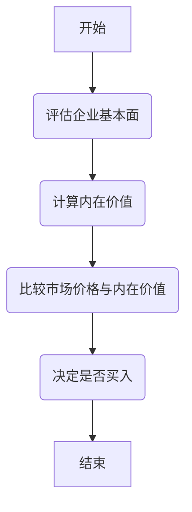
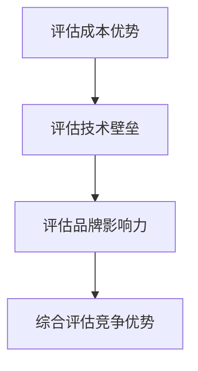
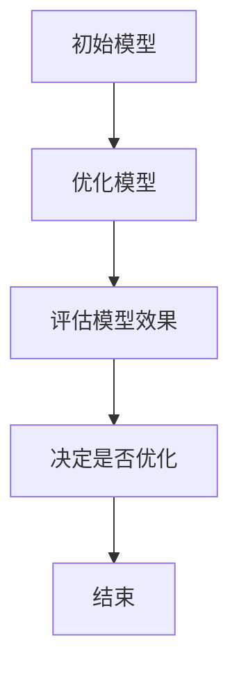
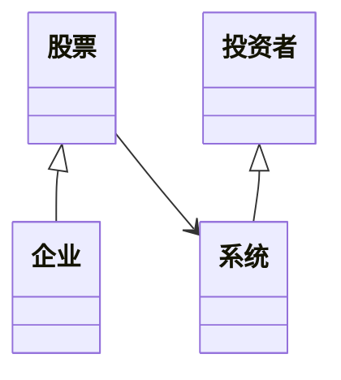
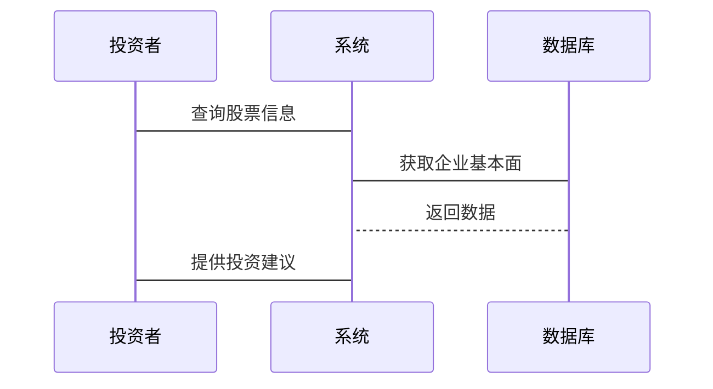

                 


# 巴菲特-芒格的数字经济投资策略：传统智慧在新经济中的应用

> 关键词：巴菲特、芒格、数字经济、投资策略、价值投资、多元思维模型

> 摘要：本文探讨了巴菲特和芒格的传统投资策略在数字经济中的应用，通过分析数字经济的特点、价值投资的核心要素、多元思维模型的构建，以及投资策略的算法实现，结合实际案例和系统架构设计，为投资者提供了在数字经济环境下如何应用传统投资策略的深度分析和实践指导。

---

# 第1章: 巴菲特-芒格投资策略的背景与基础

## 1.1 数字经济的定义与特点

### 1.1.1 数字经济的核心概念
数字经济是以数据为关键生产要素，以数字技术为核心驱动力的新型经济形态。其主要特征包括数据化、网络化和智能化。

### 1.1.2 数字经济与传统经济的对比
| 对比维度 | 传统经济 | 数字经济 |
|----------|----------|----------|
| 生产要素 | 土地、劳动力、资本 | 数据、技术、知识 |
| 生产方式 | 线下交易为主 | 线上与线下深度融合 |
| 价值创造 | 物质产品为主 | 数字服务与创新为主 |

### 1.1.3 数字经济对企业价值的影响
数字经济使得企业的价值不仅取决于其物理资产，更取决于其数据资产、技术创新能力和网络效应。

## 1.2 巴菲特与芒格的传统投资策略

### 1.2.1 巴菲特的价值投资理念
巴菲特的价值投资理念强调以低于内在价值的价格买入优质资产。其核心在于对企业基本面的深入分析。

### 1.2.2 芒格的多元思维模型
芒格的多元思维模型强调通过多学科的知识体系来理解复杂问题，避免单一视角的局限性。

### 1.2.3 传统投资策略在数字经济中的适用性
尽管数字经济环境复杂多变，但巴菲特和芒格的核心理念——基本面分析和长期价值投资——仍然适用。

## 1.3 数字经济中的投资新挑战

### 1.3.1 数字经济中的不确定性
技术快速迭代、市场波动加剧等因素增加了投资的难度。

### 1.3.2 新兴技术对企业价值的影响
人工智能、区块链等技术对企业价值的影响需要重新评估。

### 1.3.3 投资者如何应对变化
投资者需要不断学习新技术，更新知识体系，以适应数字经济的变化。

---

# 第2章: 巴菲特-芒格策略在数字经济中的核心概念

## 2.1 价值投资的核心要素

### 2.1.1 企业基本面分析
基本面分析包括对企业财务状况、市场地位、盈利能力等方面的研究。

### 2.1.2 安全边际的计算
安全边际是投资价格与内在价值之间的差距，用于降低投资风险。

### 2.1.3 竞争优势的评估
竞争优势包括成本优势、技术壁垒、品牌影响力等。

## 2.2 多元思维模型的构建

### 2.2.1 多元思维模型的定义
多元思维模型是指通过多学科的视角来分析问题，避免单一思维的局限性。

### 2.2.2 多元思维模型的组成部分
- 经济学：理解市场运行规律。
- 心理学：分析投资者行为。
- 技术学：评估技术创新对企业的影响。

### 2.2.3 多元思维模型在投资中的应用
通过多元思维模型，投资者可以更全面地评估企业的潜在风险和机会。

## 2.3 数字经济中的核心概念对比

### 2.3.1 传统经济与数字经济的核心要素对比
| 对比维度 | 传统经济 | 数字经济 |
|----------|----------|----------|
| 核心资产 | 物质资产 | 数据资产 |
| 技术驱动 | 机械化 | 数字化、智能化 |
| 增长模式 | 线性增长 | 领先者优势 |

### 2.3.2 数字经济中的新概念与新模型
- 数据资产：数据成为核心资源。
- 网络效应：用户数量增加带来的边际成本递减。

### 2.3.3 核心概念的ER实体关系图

```mermaid
erd
  股票 --|{拥有|> 股东
  股东 --|{交易|> 交易所
  交易所 --|{监管|> 监管机构
  股票 --|{反映|> 企业基本面
```

---

# 第3章: 巴菲特-芒格策略的算法原理

## 3.1 价值投资的算法模型

### 3.1.1 价值投资的决策树


### 3.1.2 安全边际的计算公式
$$ \text{安全边际} = \text{内在价值} - \text{市场价格} $$

### 3.1.3 竞争优势的评估算法


## 3.2 多元思维模型的实现

### 3.2.1 多元思维模型的构建流程
1. 收集多学科知识。
2. 分析问题的多维度影响。
3. 综合评估得出结论。

### 3.2.2 多元思维模型的优化算法


### 3.2.3 多元思维模型的案例分析
案例：分析一家科技公司的投资价值时，结合经济学、心理学和技术学的视角进行综合评估。

---

## 3.3 数学模型与公式

### 3.3.1 价值投资的核心公式
$$ \text{内在价值} = \sum_{t=1}^{\infty} \frac{\text{现金流}}{(1 + r)^t} $$

其中，$r$ 是折现率，$\text{现金流}$ 是企业的未来现金流。

### 3.3.2 安全边际的计算
$$ \text{安全边际} = \text{内在价值} \times (1 - \frac{\text{市场价格}}{\text{内在价值}}) $$

---

# 第4章: 系统分析与架构设计方案

## 4.1 问题场景介绍
在数字经济环境下，投资者需要一个综合的决策支持系统来辅助投资决策。

## 4.2 项目介绍
构建一个基于巴菲特-芒格策略的数字经济投资决策支持系统。

## 4.3 系统功能设计

### 4.3.1 领域模型


### 4.3.2 系统架构设计


### 4.3.3 系统接口设计
- 输入接口：股票数据、市场信息。
- 输出接口：投资建议、风险评估。

### 4.3.4 系统交互


---

# 第5章: 项目实战

## 5.1 环境安装
安装Python和必要的库（如pandas、numpy）。

## 5.2 系统核心实现源代码
```python
def calculate_intrinsic_value(cash_flow, discount_rate):
    return sum(cash_flow / (1 + discount_rate)**t for t in range(len(cash_flow)))

def calculate_margin_of_safety(intrinsic_value, market_price):
    return intrinsic_value - market_price

# 示例
cash_flow = [100, 200, 300]
discount_rate = 0.1
iv = calculate_intrinsic_value(cash_flow, discount_rate)
market_price = 250
mos = calculate_margin_of_safety(iv, market_price)
print(f"内在价值: {iv}\n安全边际: {mos}")
```

## 5.3 代码应用解读与分析
上述代码计算了股票的内在价值和安全边际，帮助投资者评估投资价值。

## 5.4 案例分析
以某科技公司为例，分析其内在价值和安全边际，提供投资建议。

---

# 第6章: 总结与展望

## 6.1 总结
本文详细探讨了巴菲特和芒格的投资策略在数字经济中的应用，结合算法、系统架构和实际案例，为投资者提供了理论和实践指导。

## 6.2 展望
未来，随着技术的不断进步，数字经济的投资策略将更加复杂，投资者需要不断更新知识体系，以应对新的挑战。

---

作者：AI天才研究院/AI Genius Institute & 禅与计算机程序设计艺术/Zen And The Art of Computer Programming

