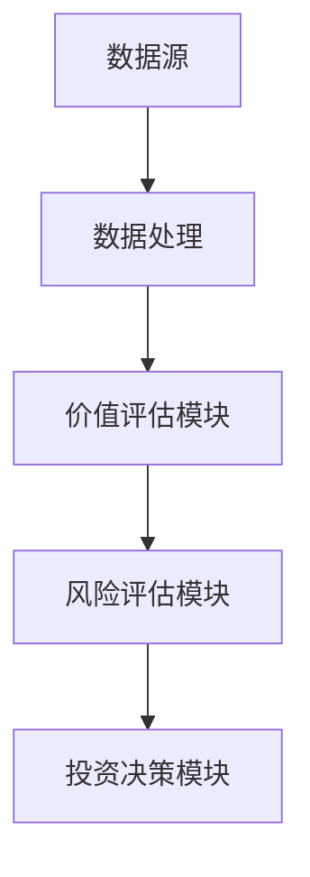
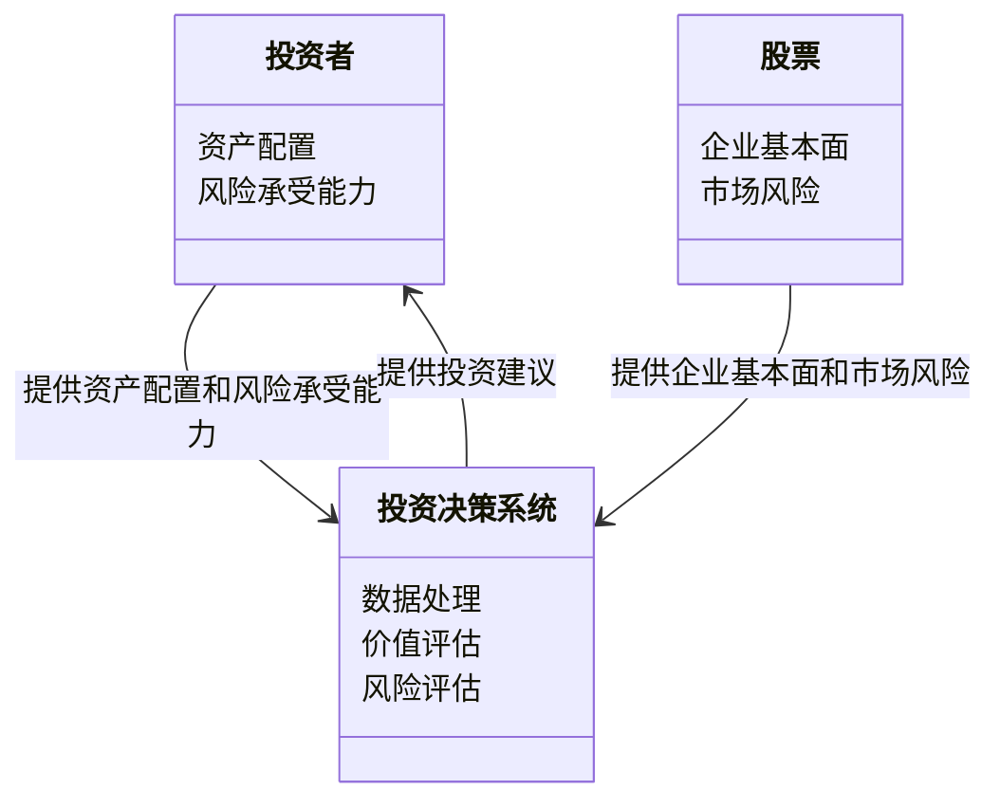
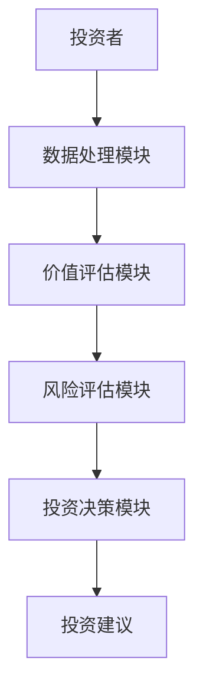
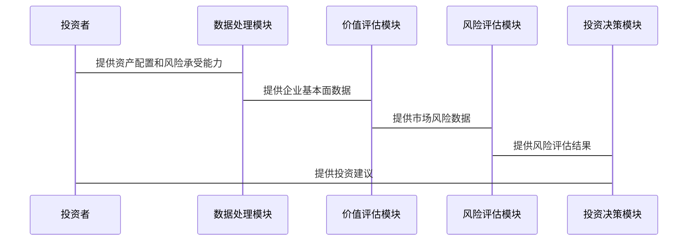

                 


# 巴菲特-芒格的新兴市场投资策略：机遇与风险的平衡

## 关键词：
巴菲特, 芒格, 新兴市场, 投资策略, 风险管理, 价值投资, 安全边际

## 摘要：
本文系统地探讨了巴菲特和芒格在新兴市场中的投资策略，分析了新兴市场的机遇与风险，并结合数学模型和实际案例，详细阐述了他们的投资哲学和方法。文章通过理论与实践相结合的方式，为投资者提供了在新兴市场中平衡风险与收益的深度见解。

---

# 第一部分: 巴菲特与芒格的投资理念概述

## 第1章: 巴菲特与芒格的投资哲学

### 1.1 巴菲特与芒格的投资理念

#### 1.1.1 巴菲特的价值投资理论
巴菲特的价值投资理论强调以低于内在价值的价格购买优质资产。他的核心观点是：
- **长期投资**：投资不是短期交易，而是寻找能够持续创造价值的企业。
- **安全边际**：买入价格低于内在价值，以降低风险并确保收益。
- **企业基本面分析**：关注企业的财务状况、盈利能力、竞争优势和管理团队。

#### 1.1.2 芒格的多元思维模型
芒格提倡通过多学科的思维模型来分析问题，强调：
- **跨学科思考**：将物理学、心理学、经济学等学科的原则结合起来，形成全面的决策框架。
- **避免情绪化决策**：通过理性分析来规避情绪化投资的错误。
- **逆向思维**：从反方向思考问题，寻找市场的非共识性机会。

#### 1.1.3 巴菲特与芒格策略在新兴市场的应用
在新兴市场中，巴菲特和芒格的投资策略需要适应市场特点：
- **寻找具有持续竞争优势的企业**：重点关注那些能够在新兴市场中持续增长的公司。
- **估值与风险平衡**：在新兴市场的高增长与高风险之间找到平衡点。

### 1.2 新兴市场的定义与分类

#### 1.2.1 新兴市场的定义
新兴市场是指那些经济增长迅速、市场机制逐步完善但尚未完全成熟的国家和地区。典型的新兴市场包括中国、印度、巴西等。

#### 1.2.2 新兴市场的分类
根据经济规模、增长潜力和市场成熟度，新兴市场可以分为：
- **高增长市场**：如印度、越南，经济增长速度快，潜力大。
- **成熟型市场**：如韩国、台湾地区，市场较为成熟，但仍有增长空间。
- **转型市场**：如俄罗斯、波兰，处于经济转型期，风险与机遇并存。

#### 1.2.3 新兴市场的投资机会
新兴市场的投资机会主要体现在：
- **高增长潜力**：新兴市场的企业通常具有较高的增长潜力。
- **低估的资产**：由于市场不完善，一些优质资产可能被低估。
- **多样化投资机会**：新兴市场覆盖多个行业，提供了多样化的投资选择。

### 1.3 新兴市场的风险与挑战

#### 1.3.1 政治风险
新兴市场通常政治环境不稳定，政策变化频繁，可能对企业运营产生重大影响。

#### 1.3.2 经济波动风险
新兴市场经济增长波动较大，容易受到全球经济周期的影响，导致资产价格波动。

#### 1.3.3 市场流动性风险
新兴市场的市场规模和流动性有限，可能导致买卖价差大，交易成本高。

### 1.4 巴菲特与芒格新兴市场投资策略的核心要素

#### 1.4.1 核心概念与联系
巴菲特和芒格的投资策略在新兴市场中强调：
- **内在价值评估**：通过DCF模型等方法评估企业的内在价值。
- **竞争优势分析**：寻找具有持续竞争优势的企业。
- **安全边际**：买入价格低于内在价值，确保收益并降低风险。

#### 1.4.2 投资策略的数学模型
##### 1.4.2.1 价值评估公式
$$ V = \frac{CF}{r - g} $$
其中，\( V \) 表示内在价值，\( CF \) 表示现金流，\( r \) 表示折现率，\( g \) 表示增长率。

##### 1.4.2.2 安全边际计算
$$ \text{安全边际} = \text{内在价值} \times (1 - \text{安全边际率}) $$

#### 1.4.3 投资策略的系统架构
##### 1.4.3.1 系统功能模块
- **数据收集与处理**：收集企业的财务数据和市场信息。
- **价值评估**：使用DCF模型等方法评估企业价值。
- **风险评估**：分析市场的政治、经济和流动性风险。
- **投资决策**：根据评估结果制定投资策略。

##### 1.4.3.2 系统架构设计
使用mermaid图展示系统架构：


---

# 第二部分: 新兴市场的特点与挑战

## 第2章: 新兴市场的特点与挑战

### 2.1 新兴市场的定义与分类

#### 2.1.1 新兴市场的定义
新兴市场是指那些经济增长迅速、市场机制逐步完善但尚未完全成熟的国家和地区。典型的新兴市场包括中国、印度、巴西等。

#### 2.1.2 新兴市场的分类
根据经济规模、增长潜力和市场成熟度，新兴市场可以分为：
- **高增长市场**：如印度、越南，经济增长速度快，潜力大。
- **成熟型市场**：如韩国、台湾地区，市场较为成熟，但仍有增长空间。
- **转型市场**：如俄罗斯、波兰，处于经济转型期，风险与机遇并存。

#### 2.1.3 新兴市场的投资机会
新兴市场的投资机会主要体现在：
- **高增长潜力**：新兴市场的企业通常具有较高的增长潜力。
- **低估的资产**：由于市场不完善，一些优质资产可能被低估。
- **多样化投资机会**：新兴市场覆盖多个行业，提供了多样化的投资选择。

### 2.2 新兴市场的风险与挑战

#### 2.2.1 政治风险
新兴市场通常政治环境不稳定，政策变化频繁，可能对企业运营产生重大影响。

#### 2.2.2 经济波动风险
新兴市场经济增长波动较大，容易受到全球经济周期的影响，导致资产价格波动。

#### 2.2.3 市场流动性风险
新兴市场的市场规模和流动性有限，可能导致买卖价差大，交易成本高。

### 2.3 巴菲特与芒格策略在新兴市场的应用

#### 2.3.1 投资理念的适应性
巴菲特和芒格的投资策略在新兴市场中需要适应市场特点：
- **寻找具有持续竞争优势的企业**：重点关注那些能够在新兴市场中持续增长的公司。
- **估值与风险平衡**：在新兴市场的高增长与高风险之间找到平衡点。

#### 2.3.2 投资策略的具体实施
##### 2.3.2.1 价值评估模型的应用
使用DCF模型评估新兴市场的企业的内在价值，考虑其未来现金流和贴现率。

##### 2.3.2.2 安全边际的计算
确保买入价格低于内在价值，以降低投资风险并确保收益。

##### 2.3.2.3 投资组合的构建
通过分散投资和动态调整投资组合来平衡风险和收益。

### 2.4 新兴市场的风险管理

#### 2.4.1 风险识别与评估
- **政治风险**：关注政策变化和政治稳定性。
- **经济波动风险**：监控宏观经济指标和行业趋势。
- **市场流动性风险**：评估市场的交易深度和流动性。

#### 2.4.2 风险管理策略
- **分散投资**：将资金分配到不同行业和地区的资产，降低集中风险。
- **动态调整**：根据市场变化及时调整投资策略。
- **风险对冲**：使用金融衍生工具对冲部分风险。

---

# 第三部分: 巴菲特与芒格新兴市场投资策略的核心要素

## 第3章: 核心概念与联系

### 3.1 核心概念与联系

#### 3.1.1 巴菲特的价值投资理论
巴菲特的价值投资理论强调以低于内在价值的价格购买优质资产。他的核心观点是：
- **长期投资**：投资不是短期交易，而是寻找能够持续创造价值的企业。
- **安全边际**：买入价格低于内在价值，以降低风险并确保收益。
- **企业基本面分析**：关注企业的财务状况、盈利能力、竞争优势和管理团队。

#### 3.1.2 芒格的多元思维模型
芒格提倡通过多学科的思维模型来分析问题，强调：
- **跨学科思考**：将物理学、心理学、经济学等学科的原则结合起来，形成全面的决策框架。
- **避免情绪化决策**：通过理性分析来规避情绪化投资的错误。
- **逆向思维**：从反方向思考问题，寻找市场的非共识性机会。

#### 3.1.3 巴菲特与芒格策略在新兴市场的应用
在新兴市场中，巴菲特和芒格的投资策略需要适应市场特点：
- **寻找具有持续竞争优势的企业**：重点关注那些能够在新兴市场中持续增长的公司。
- **估值与风险平衡**：在新兴市场的高增长与高风险之间找到平衡点。

### 3.2 投资策略的数学模型

#### 3.2.1 价值评估公式
$$ V = \frac{CF}{r - g} $$
其中，\( V \) 表示内在价值，\( CF \) 表示现金流，\( r \) 表示折现率，\( g \) 表示增长率。

#### 3.2.2 安全边际计算
$$ \text{安全边际} = \text{内在价值} \times (1 - \text{安全边际率}) $$

### 3.3 系统分析与架构设计

#### 3.3.1 系统功能模块
- **数据收集与处理**：收集企业的财务数据和市场信息。
- **价值评估**：使用DCF模型等方法评估企业价值。
- **风险评估**：分析市场的政治、经济和流动性风险。
- **投资决策**：根据评估结果制定投资策略。

#### 3.3.2 系统架构设计
使用mermaid图展示系统架构：


---

# 第四部分: 巴菲特与芒格新兴市场投资策略的系统分析

## 第4章: 系统分析与架构设计方案

### 4.1 问题场景介绍
在新兴市场中，投资者需要面对复杂多变的市场环境，包括高增长潜力和高风险并存的特点。因此，设计一个有效的投资决策系统至关重要。

### 4.2 项目介绍
本项目旨在构建一个基于巴菲特和芒格投资策略的新兴市场投资决策系统，帮助投资者在新兴市场中实现风险与收益的平衡。

### 4.3 系统功能设计

#### 4.3.1 领域模型
使用mermaid类图展示领域模型：


### 4.4 系统架构设计

#### 4.4.1 系统架构
使用mermaid图展示系统架构：


#### 4.4.2 系统接口设计
- **输入接口**：接收投资者的资产配置和风险承受能力。
- **输出接口**：提供投资建议和风险评估结果。

### 4.5 系统交互设计

#### 4.5.1 交互流程
使用mermaid序列图展示交互流程：


---

# 第五部分: 巴菲特与芒格新兴市场投资策略的项目实战

## 第5章: 项目实战

### 5.1 环境安装

#### 5.1.1 安装Python环境
使用Anaconda安装Python和必要的库：
```bash
conda create -n investment_strategy python=3.8
conda activate investment_strategy
pip install pandas numpy matplotlib
```

### 5.2 核心代码实现

#### 5.2.1 数据处理模块
```python
import pandas as pd
import numpy as np

def calculate_intrinsic_value(cash_flows, discount_rate, growth_rate):
    return cash_flows / (discount_rate - growth_rate)

def main():
    cash_flows = [100, 120, 140, 160]
    discount_rate = 0.1
    growth_rate = 0.05
    intrinsic_value = calculate_intrinsic_value(cash_flows, discount_rate, growth_rate)
    print(f"内在价值: {intrinsic_value}")
    
if __name__ == "__main__":
    main()
```

#### 5.2.2 价值评估模块
```python
import pandas as pd
import numpy as np

def calculate_intrinsic_value(cash_flows, discount_rate, growth_rate):
    return cash_flows / (discount_rate - growth_rate)

def calculate_margin_of_safety(intrinsic_value, price):
    return (intrinsic_value - price) / intrinsic_value * 100

def main():
    cash_flows = [100, 120, 140, 160]
    discount_rate = 0.1
    growth_rate = 0.05
    price = 80
    intrinsic_value = calculate_intrinsic_value(cash_flows, discount_rate, growth_rate)
    margin_of_safety = calculate_margin_of_safety(intrinsic_value, price)
    print(f"内在价值: {intrinsic_value}")
    print(f"安全边际: {margin_of_safety}%")

if __name__ == "__main__":
    main()
```

### 5.3 实际案例分析

#### 5.3.1 案例背景
假设我们投资于一家新兴市场的公司，其未来现金流预测为100, 120, 140, 160，贴现率为10%，增长率为5%，当前股价为80。

#### 5.3.2 价值评估
根据上述代码，计算得出：
- 内在价值 = 100/(0.1-0.05) = 2000
- 安全边际 = (2000-80)/2000 * 100 = 96%

#### 5.3.3 投资决策
基于以上计算，买入价格低于内在价值，安全边际为96%，表明投资具有较高的安全性和潜在收益。

### 5.4 项目小结
通过本项目，我们成功地将巴菲特和芒格的投资策略应用于新兴市场，验证了价值评估模型的有效性和安全性。

---

# 第六部分: 总结与展望

## 第6章: 总结与展望

### 6.1 总结
本文系统地探讨了巴菲特和芒格在新兴市场中的投资策略，分析了新兴市场的机遇与风险，并结合数学模型和实际案例，详细阐述了他们的投资哲学和方法。文章通过理论与实践相结合的方式，为投资者提供了在新兴市场中平衡风险与收益的深度见解。

### 6.2 未来展望
未来的研究可以进一步探讨以下方向：
- **新兴市场的风险管理**：开发更先进的风险评估模型。
- **技术驱动的投资策略**：利用大数据和人工智能技术优化投资决策。
- **全球化视角下的投资策略**：研究全球化背景下的投资机会与挑战。

### 6.3 最佳实践 Tips
- **持续学习**：关注市场动态和企业基本面。
- **分散投资**：降低集中风险。
- **长期持有**：避免短期波动的影响。

---

# 作者信息

作者：AI天才研究院/AI Genius Institute & 禅与计算机程序设计艺术/Zen And The Art of Computer Programming

---

通过以上结构，文章系统地阐述了巴菲特和芒格在新兴市场中的投资策略，从理论到实践，从分析到案例，为投资者提供了全面的指导。

