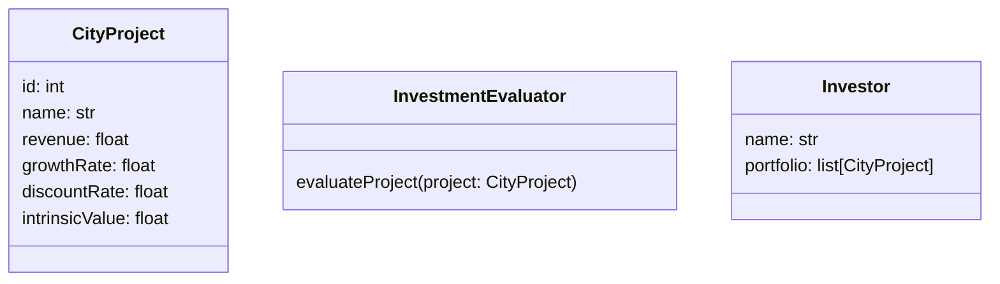
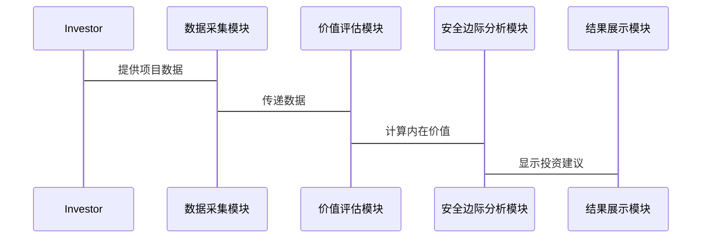

                 


# 巴菲特-芒格的智慧城市投资：城市化进程中的机遇

## 关键词：
- 巴菲特, 芒格, 智慧城市, 城市化, 投资策略, 价值投资

## 摘要：
本文深入探讨了巴菲特和芒格的投资理念在智慧城市投资中的应用，分析了城市化进程中的投资机遇，并结合算法原理和系统设计，提供了具体的实战案例和最佳实践。

---

# 第一部分: 背景介绍

## 第1章: 巴菲特与芒格的投资哲学

### 1.1 巴菲特的价值投资理论
- 价值投资的核心理念：寻找具有持续竞争优势的企业，关注长期价值。
- 安全边际的概念：在价格低于内在价值时买入，确保投资的安全性。

### 1.2 芒格的多元思维模型
- 多元思维模型：通过多个学科的交叉应用，形成全面的思考框架。
- 投资中的应用：帮助投资者识别潜在风险，优化投资组合。

## 第2章: 智慧城市与城市化

### 2.1 城市化的基本概念与发展趋势
- 城市化的定义：人口向城市集中，城市面积扩大。
- 全球城市化进程：发展中国家城市化速度加快，发达国家趋于稳定。
- 中国城市化的特点：速度快，规模大，区域差异明显。

### 2.2 智慧城市的概念与发展
- 智慧城市的定义：利用信息技术优化城市资源配置，提升居民生活质量。
- 智慧城市建设的技术支撑：物联网、大数据、人工智能等。
- 智慧城市与城市化的关系：智慧城市是城市化高级阶段，推动城市化进程。

---

# 第二部分: 巴菲特与芒格投资理念在智慧城市中的应用

## 第3章: 投资理念与智慧城市分析

### 3.1 巴菲特价值投资理念的应用
- 寻找具有持续竞争优势的智慧城市项目：关注技术领先、市场占有率高的企业。
- 评估长期价值：考虑智慧城市项目的可持续性和盈利能力。

### 3.2 芒格多元思维模型的应用
- 多元思维模型在风险评估中的应用：通过多角度分析识别潜在风险。
- 投资组合优化：结合多元思维模型，构建多元化投资组合，分散风险。

---

# 第三部分: 算法原理

## 第4章: 基于巴菲特模型的智慧城市投资评估算法

### 4.1 算法原理
- 算法目标：评估智慧城市项目的内在价值，确定投资安全性。
- 算法步骤：
  1. 数据采集：收集项目财务数据、市场信息等。
  2. 价值评估：使用现金流折现法计算内在价值。
  3. 安全边际分析：比较市场价格与内在价值，确定投资机会。

### 4.2 算法实现

#### Python代码示例：

```python
def calculate_intrinsic_value(revenue, growth_rate, discount_rate):
    # 假设现金流为未来5年自由现金流
    cash_flows = [revenue * (1 + growth_rate) for _ in range(5)]
    # 计算现值
    present_value = sum(cash_flow / (1 + discount_rate)**i for i, cash_flow in enumerate(cash_flows))
    return present_value

# 示例数据
revenue = 1000000  # 年收入
growth_rate = 0.1   # 年增长率
discount_rate = 0.08  # 折现率

intrinsic_value = calculate_intrinsic_value(revenue, growth_rate, discount_rate)
print(f"内在价值：${intrinsic_value:.2f}")
```

### 4.3 数学公式
- 现金流折现公式：
$$
PV = \sum_{i=0}^{n} \frac{CF_i}{(1 + r)^i}
$$
其中，\( CF_i \) 是第i年的现金流，\( r \) 是折现率。

---

# 第四部分: 系统分析与架构设计

## 第5章: 系统分析

### 5.1 问题场景介绍
- 项目目标：构建智慧城市投资评估系统，帮助投资者进行科学决策。
- 项目背景：城市化进程中，智慧城市建设需求旺盛，投资机会丰富。

### 5.2 系统功能设计（领域模型）

#### Mermaid类图：


### 5.3 系统架构设计

#### Mermaid架构图：
```mermaid
container 智慧城市投资评估系统 {
    数据采集模块
    价值评估模块
    安全边际分析模块
    结果展示模块
}
```

### 5.4 系统接口设计

#### Mermaid序列图：


---

# 第五部分: 项目实战

## 第6章: 项目实战

### 6.1 环境安装
- 安装Python和必要的库：pandas, numpy, matplotlib。

### 6.2 核心代码实现

#### Python代码示例：

```python
import pandas as pd

def calculate_intrinsic_value(revenue, growth_rate, discount_rate, years=5):
    cash_flows = [revenue * (1 + growth_rate) ** i for i in range(years)]
    present_value = sum(cf / (1 + discount_rate) ** i for i, cf in enumerate(cash_flows))
    return present_value

# 示例数据
revenue = 1000000
growth_rate = 0.1
discount_rate = 0.08
years = 5

iv = calculate_intrinsic_value(revenue, growth_rate, discount_rate, years)
print(f"内在价值：${iv:.2f}")
```

### 6.3 代码解读
- 函数 `calculate_intrinsic_value`：计算项目的内在价值。
- 示例数据：年收入100万美元，年增长率10%，折现率8%，计算5年内的内在价值。

### 6.4 实际案例分析
- 选择一个智慧城市项目，收集相关数据，运行代码，分析结果。

### 6.5 项目小结
- 通过代码实现，验证了巴菲特模型在智慧城市投资中的应用。

---

# 第六部分: 最佳实践

## 第7章: 最佳实践

### 7.1 投资策略 tips
- 关注具有持续竞争优势的智慧城市项目。
- 结合多元思维模型，优化投资组合。

### 7.2 小结
- 巴菲特和芒格的投资理念为智慧城市投资提供了 valuable insights。
- 通过系统设计和算法实现，投资者可以做出更科学的投资决策。

### 7.3 注意事项
- 投资需谨慎，市场风险需充分考虑。
- 确保数据的准确性和完整性，避免错误评估。

### 7.4 拓展阅读
- 《巴菲特传》：了解巴菲特的投资哲学。
- 《芒格的智慧》：学习芒格的多元思维模型。

---

# 作者：AI天才研究院 & 禅与计算机程序设计艺术

---

这篇文章通过详细分析巴菲特和芒格的投资理念，结合智慧城市的投资分析和系统设计，为投资者提供了科学的投资决策方法。

