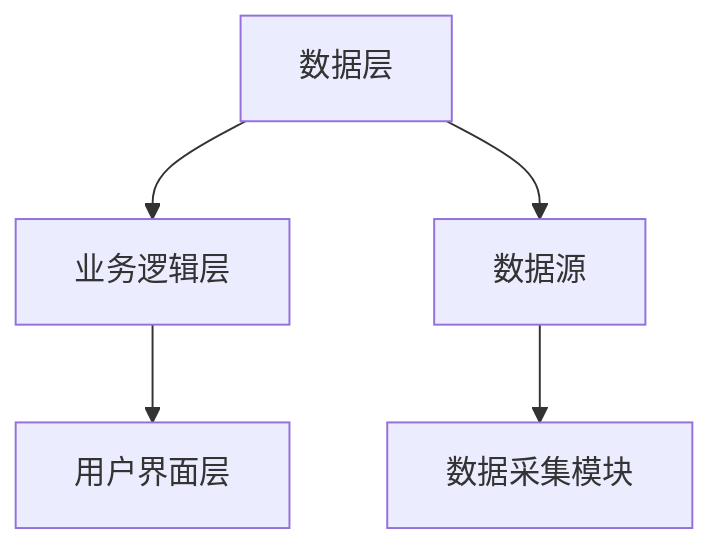
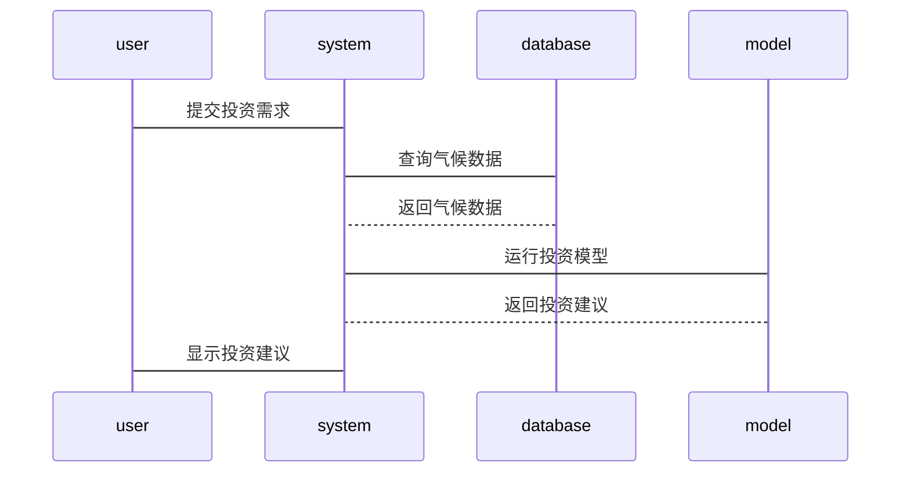

                 


# 巴菲特-芒格的气候适应性投资：应对全球变暖的策略

## 关键词：
巴菲特, 芒格, 气候投资, 气候变化, 投资策略, 风险管理, 可持续发展

## 摘要：
本文深入探讨了巴菲特和芒格的气候适应性投资策略，分析了气候变化对全球经济和投资的影响，提出了将长期价值投资与气候风险管理相结合的方法。文章结合实际案例，详细讲解了气候风险的量化评估模型、投资组合的优化算法，并通过系统架构设计和项目实战，展示了如何在投资决策中融入气候适应性原则。最后，文章总结了气候适应性投资的关键要素和未来发展方向。

---

## 第一部分: 巴菲特-芒格的气候适应性投资概述

## # 第1章: 全球气候变化与投资的背景

### 1.1 全球气候变化的现状与挑战

#### 1.1.1 气候变化的科学背景
气候变化是指全球气候系统长期的变化，主要由温室气体排放引起。根据联合国政府间气候变化专门委员会（IPCC）的报告，全球气温上升可能导致极端天气事件增加、海平面上升和生态系统破坏。这些变化对全球经济活动、企业运营和投资决策产生深远影响。

#### 1.1.2 气候变化对全球经济的影响
气候变化对全球经济的影响是多方面的。例如，极端天气可能导致财产损失、企业停工和供应链中断。此外，气候变化还可能引发政策变化，如碳排放税的实施，从而影响企业的盈利能力和估值。

#### 1.1.3 投资领域面临的气候风险
投资者需要关注与气候变化相关的物理风险（如洪水、干旱）和转型风险（如政策变化和行业结构调整）。这些风险可能影响企业的财务表现和投资组合的回报。

### 1.2 巴菲特与芒格的投资理念

#### 1.2.1 巴菲特的价值投资原则
巴菲特的价值投资理念强调长期持有优质资产，关注企业的内在价值而非短期市场波动。他认为，优秀的企业具备强大的竞争优势和持续的盈利能力。

#### 1.2.2 芒格的多元思维模型
芒格提倡多元思维模型，强调从多个学科的角度分析问题，避免认知偏差。他认为，投资者应该具备跨领域的知识，以便更好地识别投资机会和风险。

#### 1.2.3 两人投资理念的结合
巴菲特和芒格的投资理念结合了长期价值投资和多元思维模型，注重对企业基本面的分析和对宏观经济趋势的把握。这种结合使得他们的投资策略更具灵活性和适应性。

### 1.3 气候适应性投资的定义与意义

#### 1.3.1 气候适应性投资的定义
气候适应性投资是指在投资决策中考虑气候变化的影响，通过优化投资组合以应对气候变化带来的风险和机会。这种投资策略旨在在保护环境的同时实现财务回报。

#### 1.3.2 气候适应性投资的核心要素
气候适应性投资的核心要素包括：识别气候相关风险、评估企业的气候适应能力、优化投资组合以平衡风险和收益。

#### 1.3.3 气候适应性投资的全球实践
全球范围内，越来越多的投资者开始关注气候适应性投资。例如，许多机构投资者将碳排放指标纳入投资决策，以降低转型风险。

---

## # 第2章: 气候风险与投资决策

### 2.1 气候风险的分类与评估

#### 2.1.1 物理风险
物理风险是指气候变化直接对企业或资产造成的影响，如极端天气事件导致的财产损失。这种风险通常难以预测，但可以通过情景分析进行评估。

#### 2.1.2 转型风险
转型风险是指为应对气候变化而进行政策调整或行业转型带来的风险，例如碳排放税的实施可能增加企业的成本。投资者需要评估政策变化对企业的影响。

#### 2.1.3 监管风险
监管风险是指政府可能出台更严格的环保政策，导致企业面临更高的合规成本。投资者需要关注相关政策变化，以避免投资损失。

### 2.2 气候风险对投资组合的影响

#### 2.2.1 行业风险分析
不同行业对气候变化的敏感度不同。例如，高碳排放行业（如化石能源）可能面临更大的转型风险，而绿色能源行业则可能受益于政策支持。

#### 2.2.2 地区风险分析
气候变化的影响在不同地区差异显著。例如，沿海地区可能面临更高的洪水风险，而内陆地区可能面临干旱风险。投资者需要根据地区的气候风险评估投资目标。

#### 2.2.3 企业层面的气候风险
企业的气候风险包括生产过程中的碳排放、供应链中断和品牌声誉风险。投资者需要评估企业在应对气候变化方面的准备情况。

### 2.3 投资组合的气候适应性优化

#### 2.3.1 投资组合的多样化策略
通过多样化投资，投资者可以分散气候风险。例如，投资于绿色能源和传统能源企业的组合可以在转型期降低风险。

#### 2.3.2 气候相关投资的权重分配
投资者可以根据气候风险评估结果，调整投资组合中不同资产的权重。例如，增加对绿色能源企业的投资比例，减少对高碳排放企业的投资。

#### 2.3.3 风险调整后的收益模型
投资者可以通过调整收益模型，将气候风险纳入投资决策。例如，使用情景分析法评估不同气候变化情景下的投资回报。

---

## # 第3章: 巴菲特与芒格的气候投资策略

### 3.1 巴菲特的长期投资视角

#### 3.1.1 长期价值投资的核心要素
巴菲特的长期价值投资强调企业内在价值、管理层素质和行业地位。他认为，优秀的企业具备持续的盈利能力和发展潜力。

#### 3.1.2 气候变化对长期投资的影响
气候变化可能改变企业的长期盈利能力。例如，绿色能源企业可能在未来获得更大的市场份额，而高碳排放企业可能面临转型压力。

#### 3.1.3 巴菲特对绿色能源的投资实践
巴菲特通过旗下公司投资于绿色能源项目，如太阳能和风能。这些投资不仅符合长期价值投资理念，还能够应对气候变化带来的转型风险。

### 3.2 芒格的多元思维与气候投资

#### 3.2.1 多元思维模型在气候投资中的应用
芒格的多元思维模型强调跨学科分析。例如，结合经济学、环境科学和政策分析，评估气候变化对企业的影响。

#### 3.2.2 芒格对气候风险的系统性分析
芒格认为，投资者需要从多个角度分析气候风险，包括物理风险、转型风险和监管风险。这种系统性分析有助于制定更有效的投资策略。

#### 3.2.3 芒格的气候投资案例研究
芒格通过其投资公司分析企业的气候适应能力。例如，他关注企业在应对气候变化方面的技术创新能力和成本控制能力。

### 3.3 巴菲特与芒格的气候投资共识

#### 3.3.1 长期投资与气候适应性的结合
巴菲特和芒格都认为，长期投资与气候适应性投资可以结合。通过长期持有优质资产，投资者可以更好地应对气候变化带来的风险和机会。

#### 3.3.2 投资决策中的气候风险考量
两人强调，在投资决策中必须考虑气候风险。例如，评估企业的碳排放指标、政策适应能力和行业转型风险。

#### 3.3.3 气候适应性投资的未来趋势
随着气候变化的影响加剧，气候适应性投资将成为主流。巴菲特和芒格的投资理念为投资者提供了重要的参考。

---

## # 第4章: 气候适应性投资的量化评估

### 4.1 气候风险的量化模型

#### 4.1.1 气候风险的量化指标
气候风险的量化指标包括碳排放强度、气候变化情景下的收益波动等。这些指标可以帮助投资者评估不同资产的气候风险。

#### 4.1.2 气候风险与投资组合的关系
通过量化模型，投资者可以评估不同资产在不同气候变化情景下的表现。例如，使用蒙特卡洛模拟评估投资组合的波动性。

#### 4.1.3 气候风险的评估工具
投资者可以使用气候风险评估工具，如碳足迹分析和情景分析，评估企业的气候适应能力。

### 4.2 气候适应性投资的量化策略

#### 4.2.1 投资组合的风险调整
通过量化模型，投资者可以调整投资组合的权重，以降低气候风险。例如，增加对绿色能源企业的投资比例。

#### 4.2.2 碳排放因子的引入
投资者可以引入碳排放因子，评估企业在减少碳排放方面的表现。例如，使用碳排放强度作为投资决策的指标。

#### 4.2.3 气候情景分析
通过气候情景分析，投资者可以评估不同气候变化情景下的投资回报。例如，使用 IPCC 的情景分析模型，评估极端天气事件对投资组合的影响。

### 4.3 气候适应性投资的算法实现

#### 4.3.1 气候风险评估算法
气候风险评估算法包括数据收集、模型选择和结果分析。例如，使用回归分析评估气候变化对企业收益的影响。

#### 4.3.2 投资组合优化算法
投资组合优化算法可以使用动态规划模型，考虑气候风险和收益的权衡。例如，使用均值-方差优化模型，调整投资组合的权重。

#### 4.3.3 算法实现的代码示例
以下是使用 Python 实现气候风险评估的代码示例：

```python
import pandas as pd
import numpy as np

# 数据收集
data = pd.read_csv('climate_risk.csv')

# 气候风险评估模型
def climate_risk_assessment(data):
    # 计算碳排放强度
    carbon_intensity = data['emissions'] / data['revenue']
    # 计算气候变化情景下的收益波动
    revenue_fluctuation = data['revenue'].std() * np.random.normal(size=len(data))
    return carbon_intensity, revenue_fluctuation

# 算法实现
carbon_intensity, revenue_fluctuation = climate_risk_assessment(data)

# 结果分析
print("碳排放强度:", carbon_intensity.mean())
print("收益波动:", revenue_fluctuation.std())
```

---

## # 第5章: 系统分析与架构设计

### 5.1 气候适应性投资系统的功能设计

#### 5.1.1 系统功能需求
气候适应性投资系统需要具备数据采集、风险评估、投资优化和监控反馈功能。

#### 5.1.2 系统功能设计
系统功能设计包括数据采集模块、风险评估模块、优化建议模块和监控反馈模块。

### 5.2 气候适应性投资系统的架构设计

#### 5.2.1 系统架构设计
系统架构设计采用模块化架构，包括数据层、业务逻辑层和用户界面层。

#### 5.2.2 系统架构图
以下是系统的架构图：



### 5.3 系统接口设计

#### 5.3.1 系统接口定义
系统接口包括数据接口、用户接口和监控接口。

#### 5.3.2 系统接口设计
数据接口用于采集气候数据，用户接口用于显示投资建议，监控接口用于实时跟踪投资组合的表现。

### 5.4 系统交互设计

#### 5.4.1 系统交互流程
用户输入投资需求，系统根据气候数据和投资模型生成投资建议。

#### 5.4.2 系统交互图
以下是系统的交互图：



---

## # 第6章: 项目实战与案例分析

### 6.1 项目环境的安装与配置

#### 6.1.1 环境需求
需要安装 Python、Pandas 和 NumPy 等工具。

#### 6.1.2 环境配置
安装必要的 Python 包，例如：

```bash
pip install pandas numpy
```

### 6.2 系统核心实现

#### 6.2.1 数据预处理
对气候数据进行清洗和转换，确保数据的可用性。

#### 6.2.2 模型训练
使用回归分析或其他算法训练气候风险评估模型。

#### 6.2.3 结果可视化
通过图表展示气候风险评估结果和投资建议。

### 6.3 项目实战代码

#### 6.3.1 数据预处理代码
以下是数据预处理的代码示例：

```python
import pandas as pd

# 数据加载
data = pd.read_csv('climate_data.csv')

# 数据清洗
data.dropna(inplace=True)

# 数据转换
data['date'] = pd.to_datetime(data['date'])
```

#### 6.3.2 模型训练代码
以下是模型训练的代码示例：

```python
import numpy as np

# 数据准备
X = data[['temperature', 'rainfall']]
y = data['revenue']

# 模型训练
from sklearn.linear_model import LinearRegression
model = LinearRegression()
model.fit(X, y)

# 模型预测
predictions = model.predict(X)
```

#### 6.3.3 结果分析
通过分析模型预测结果，评估投资组合的气候适应能力。

### 6.4 案例分析

#### 6.4.1 案例背景
以某能源企业为例，分析其气候适应能力。

#### 6.4.2 数据分析
分析企业的碳排放强度、收益波动和政策适应能力。

#### 6.4.3 投资建议
根据分析结果，提出优化投资组合的具体建议。

---

## # 第7章: 气候适应性投资的未来展望

### 7.1 气候适应性投资的未来趋势

#### 7.1.1 气候适应性投资的全球发展趋势
随着气候变化的影响加剧，气候适应性投资将成为全球投资的主要趋势。

#### 7.1.2 巴菲特与芒格投资理念的延续
巴菲特和芒格的投资理念将继续指导气候适应性投资的发展。

#### 7.1.3 数字技术在气候投资中的应用
人工智能和大数据技术将推动气候适应性投资的进一步发展。

### 7.2 气候适应性投资的关键成功要素

#### 7.2.1 长期投资视角的重要性
长期投资视角是应对气候变化的关键。

#### 7.2.2 多元思维模型的应用
多元思维模型是评估气候风险的重要工具。

#### 7.2.3 技术创新的推动作用
技术创新是提升气候适应性投资效率的重要手段。

### 7.3 气候适应性投资的风险与挑战

#### 7.3.1 数据质量与完整性
数据质量和完整性是气候适应性投资的关键。

#### 7.3.2 模型的局限性
气候适应性投资模型可能存在局限性，需要不断优化。

#### 7.3.3 政策与市场的不确定性
政策变化和市场不确定性是气候适应性投资的主要挑战。

---

## 作者：AI天才研究院/AI Genius Institute & 禅与计算机程序设计艺术 /Zen And The Art of Computer Programming

---

### 小结
本文通过分析巴菲特和芒格的投资理念，探讨了气候适应性投资的策略与实践。通过量化模型和系统设计，提出了应对气候变化的解决方案。未来，气候适应性投资将成为全球投资的重要方向，投资者需要结合长期价值投资和多元思维模型，应对气候变化带来的挑战。

---

### Tips：
- 气候适应性投资需要关注企业的长期价值和气候适应能力。
- 在投资决策中，应综合考虑物理风险、转型风险和监管风险。
- 通过技术创新和数据驱动的方法，优化投资组合的气候适应能力。

---

### 注意事项：
- 数据质量是气候适应性投资的关键，需确保数据的准确性和完整性。
- 模型的优化需要不断迭代，根据实际情况调整参数。
- 投资者应关注政策变化，避免因政策调整导致的投资损失。

---

### 拓展阅读：
- 巴菲特和芒格的其他投资理念。
- 气候变化对不同行业的影响。
- 气候适应性投资的国际实践案例。

