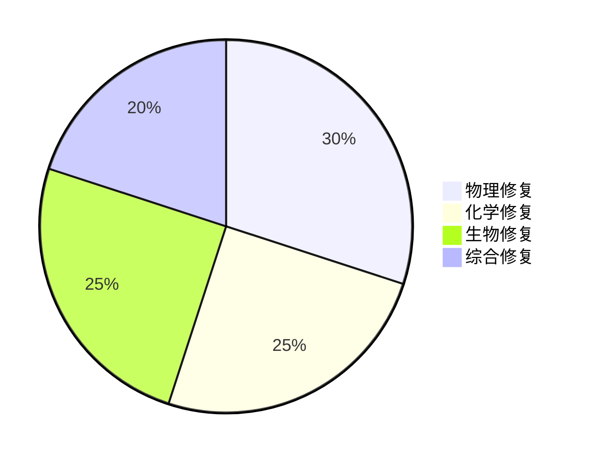
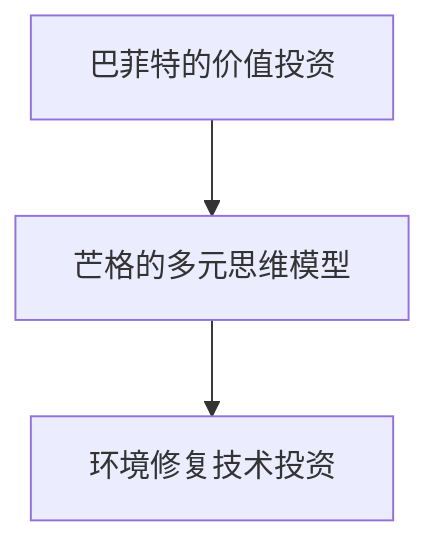
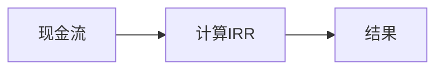
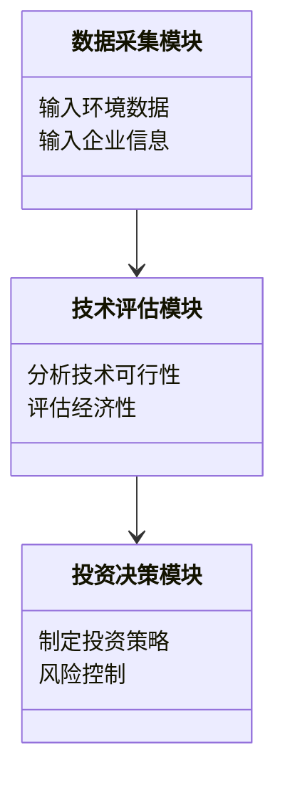

                 


# 巴菲特-芒格的环境修复技术投资：应对气候危机

> **关键词**：巴菲特、芒格、环境修复技术、气候危机、投资策略、可持续发展

> **摘要**：  
> 本文深入探讨了巴菲特和芒格的投资理念在环境修复技术领域的应用，分析了环境修复技术的核心原理及其在应对气候危机中的重要性。通过结合价值投资与多元思维模型，本文提出了环境修复技术投资的策略框架，并通过实际案例展示了如何将这些理念应用于具体的环境修复项目中。文章内容涵盖环境修复技术的分类、投资评估模型、系统架构设计以及项目实战，为读者提供了全面而深入的指导。

---

## 第一部分: 环境修复技术投资的背景与重要性

### 第1章: 环境修复技术的定义与分类

#### 1.1 环境修复技术的定义与分类

环境修复技术是指通过技术手段修复受污染的环境介质（如土壤、水体、空气等），使其恢复到可接受的环境质量标准的过程。环境修复技术可以分为以下几类：

- **物理修复技术**：通过物理手段（如挖掘、过滤等）去除污染物。
- **化学修复技术**：通过化学反应将污染物转化为无害物质。
- **生物修复技术**：利用微生物或植物等生物体降解污染物。
- **综合修复技术**：结合多种技术手段进行修复。

下图展示了环境修复技术的主要分类及其特点：



#### 1.2 巴菲特与芒格的投资理念

巴菲特和芒格的投资理念为价值投资和多元思维模型的结合。巴菲特注重企业的基本面分析和长期价值，而芒格则强调多学科知识的整合和边际成本收益分析。两人理念的结合为环境修复技术投资提供了独特的视角。

下图展示了巴菲特和芒格投资理念的结合：



#### 1.3 环境修复技术投资的必要性

环境修复技术投资在应对气候危机中具有重要意义。通过修复受污染的环境，可以减少对生态系统和人类健康的危害，同时推动可持续发展。环境修复技术的投资不仅具有经济价值，还能满足政策和市场的双重需求。

---

### 第2章: 巴菲特与芒格投资理念的环境修复技术应用

#### 2.1 巴菲特的价值投资策略

巴菲特的价值投资策略注重以下几个方面：

- **企业基本面分析**：包括收入、利润、资产负债表等。
- **财务状况评估**：关注ROE（股东权益回报率）、ROA（资产回报率）等指标。
- **管理层质量评估**：管理层的诚信和能力是投资的关键因素。

#### 2.2 芒格的多元思维模型

芒格的多元思维模型强调跨学科知识的整合，包括心理学、经济学、工程学等。在环境修复技术投资中，芒格的模型可以帮助投资者全面评估技术的可行性和风险。

#### 2.3 巴菲特与芒格策略的结合

结合巴菲特和芒格的策略，环境修复技术投资需要：

- 从基本面分析技术的经济可行性。
- 通过多元思维模型评估技术的风险和潜力。
- 综合考虑政策、市场和技术的多重因素。

---

### 第3章: 环境修复技术投资的数学模型与算法

#### 3.1 投资回报率（ROI）的计算

投资回报率（ROI）是衡量投资效益的重要指标。计算公式如下：

$$ ROI = \frac{\text{净利润}}{\text{初始投资}} \times 100\% $$

例如，假设某环境修复项目初始投资为1000万元，净利润为200万元，则ROI为20%。

#### 3.2 净现值（NPV）的计算

净现值（NPV）是将未来现金流按折现率折算到现值，再减去初始投资。计算公式如下：

$$ NPV = \sum_{t=1}^{n} \frac{CF_t}{(1+r)^t} - I_0 $$

其中，$CF_t$为第$t$年的现金流，$r$为折现率，$I_0$为初始投资。

#### 3.3 内部收益率（IRR）的计算

内部收益率（IRR）是使净现值为零的折现率。计算公式如下：

$$ NPV = \sum_{t=1}^{n} \frac{CF_t}{(1+IRR)^t} - I_0 = 0 $$

下图展示了IRR的计算流程：



---

### 第4章: 环境修复技术投资的系统架构设计

#### 4.1 系统功能设计

环境修复技术投资的系统功能设计包括以下几个模块：

- **数据采集模块**：收集环境数据和企业信息。
- **技术评估模块**：评估环境修复技术的可行性和经济性。
- **投资决策模块**：基于评估结果制定投资策略。

下图展示了系统的功能模块设计：



#### 4.2 系统架构设计

系统的架构设计采用分层架构，包括数据层、业务逻辑层和用户界面层。

下图展示了系统的架构设计：

```mermaid
rectangle 数据层 {
    数据库
    环境数据
    企业信息
}
rectangle 业务逻辑层 {
    数据采集模块
    技术评估模块
    投资决策模块
}
rectangle 用户界面层 {
    用户界面
}
数据层 --> 业务逻辑层
业务逻辑层 --> 用户界面层
```

---

### 第5章: 项目实战

#### 5.1 项目背景

假设我们面临一个受污染的水体修复项目，需要选择合适的修复技术。

#### 5.2 项目实施步骤

1. **数据采集**：收集水体污染数据和相关企业信息。
2. **技术评估**：评估物理、化学和生物修复技术的可行性。
3. **投资决策**：基于评估结果选择最优技术并制定投资计划。

#### 5.3 代码实现

以下是一个简单的投资回报率计算的Python代码示例：

```python
def calculate_roi(net_profit, initial_investment):
    return (net_profit / initial_investment) * 100

# 示例数据
net_profit = 2000000
initial_investment = 10000000

roi = calculate_roi(net_profit, initial_investment)
print(f"ROI: {roi}%")
```

---

### 第6章: 最佳实践与小结

#### 6.1 最佳实践

- **长期视角**：关注环境修复技术的长期效益。
- **风险管理**：建立完善的风险评估机制。
- **持续学习**：保持对新技术和市场的敏感性。

#### 6.2 小结

通过结合巴菲特和芒格的投资理念，我们可以更好地进行环境修复技术投资，应对气候危机。

---

**作者：AI天才研究院/AI Genius Institute & 禅与计算机程序设计艺术 /Zen And The Art of Computer Programming**

