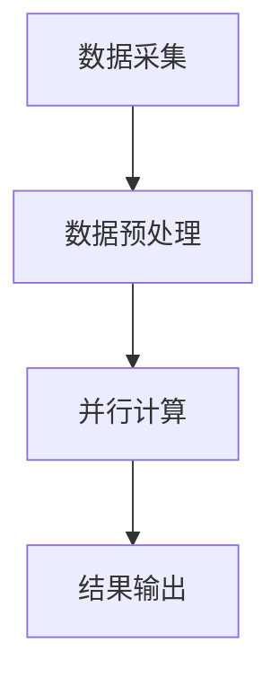

                 


# 巴菲特-芒格的生物计算机投资：下一代超级计算的基础

## 关键词
巴菲特、芒格、生物计算机、投资、超级计算

## 摘要
本文探讨了巴菲特和芒格的投资哲学与生物计算机技术的结合，分析了生物计算机在投资决策中的潜在应用，以及其对未来超级计算技术的深远影响。文章从基础概念到算法实现，再到系统设计和项目实战，全面解析了生物计算机投资的核心原理和实际应用。

---

# 第一部分：巴菲特与芒格的投资哲学

## 第1章：巴菲特与芒格的投资哲学概述

### 1.1 巴菲特与芒格的投资理念
#### 1.1.1 巴菲特的价值投资原则
巴菲特的价值投资原则强调长期主义、安全边际和企业内在价值。他认为投资的本质是寻找那些具有持续竞争优势、良好治理结构和优秀管理团队的企业，并以合理的价格买入并长期持有。

#### 1.1.2 芒格的多元思维模型
芒格提倡多元思维模型，认为投资者需要构建一个多维度的知识体系，将不同学科的原理和方法相互关联，从而更好地理解复杂的投资问题。这种思维方式强调跨学科的整合，而不是单一领域的专注。

#### 1.1.3 价值投资与长期主义的结合
巴菲特和芒格的投资策略强调长期主义，他们认为短期市场波动不应影响长期投资决策。这种理念与生物计算机的投资逻辑有相似之处：通过长期观察和分析，寻找系统性机会。

---

### 1.2 生物计算机的概念与意义
#### 1.2.1 生物计算机的基本定义
生物计算机是一种利用生物分子（如DNA、蛋白质）进行信息处理的新型计算机。与传统计算机相比，生物计算机具有并行计算能力强、能量消耗低、存储密度高等特点。

#### 1.1.2 生物计算机在投资中的潜在应用
生物计算机的投资应用主要体现在以下几个方面：
1. **数据处理能力**：生物计算机的并行计算能力可以提高大数据分析效率，帮助投资者快速处理海量数据。
2. **模式识别**：生物计算机在模式识别方面的优势可以用于市场趋势预测和风险评估。
3. **复杂系统模拟**：生物计算机可以模拟复杂的经济系统，帮助投资者更好地理解市场的动态。

#### 1.1.3 生物计算机与传统计算机的对比
| **特征**       | **传统计算机**                     | **生物计算机**                     |
|----------------|------------------------------------|------------------------------------|
| 处理方式       | 串行处理                          | 并行处理                          |
| 能耗           | 较高                              | 较低                              |
| 信息存储密度   | 较低                              | 高                                 |
| 应用领域       | 通用计算                          | 生物信息处理、医疗、能源等         |

---

## 第2章：生物计算机的核心概念与联系

### 2.1 生物计算机的核心原理
#### 2.1.1 生物计算机的基本原理
生物计算机利用生物分子（如DNA、RNA）进行信息存储和处理。其基本原理包括：
1. **信息存储**：生物分子作为存储介质，可以存储大量数据。
2. **信息处理**：通过生物分子的自组装和相互作用，实现信息的处理和运算。

#### 2.1.2 生物计算机与人工智能的结合
生物计算机与人工智能的结合可以实现更高效的数据处理和分析。例如，生物计算机可以用于训练深度学习模型，提高模型的训练效率和准确性。

#### 2.1.3 生物计算机的数学模型与公式
生物计算机的投资应用可以通过以下数学模型进行描述：
$$
\text{投资收益} = f(\text{市场数据}, \text{企业基本面}, \text{投资者情绪})
$$
其中，$f$ 是生物计算机处理后的函数，用于预测投资收益。

---

### 2.2 核心概念对比表格
| **特征**       | **传统计算机**                     | **生物计算机**                     |
|----------------|------------------------------------|------------------------------------|
| 处理方式       | 串行处理                          | 并行处理                          |
| 能耗           | 较高                              | 较低                              |
| 信息存储密度   | 较低                              | 高                                 |
| 应用领域       | 通用计算                          | 生物信息处理、医疗、能源等         |

---

## 第3章：生物计算机投资的算法原理

### 3.1 算法原理概述
#### 3.1.1 生物计算机投资算法的基本原理
生物计算机投资算法的核心在于利用生物分子的特性，通过并行计算和自组装特性，实现对投资数据的高效处理和分析。

#### 3.1.2 算法的核心步骤与流程
1. **数据采集**：收集市场数据、企业基本面数据和投资者情绪数据。
2. **数据预处理**：对数据进行清洗和标准化处理。
3. **并行计算**：利用生物计算机的并行计算能力，对数据进行分析和建模。
4. **结果输出**：生成投资决策建议。

#### 3.1.3 算法的数学模型与公式
生物计算机投资算法的数学模型可以表示为：
$$
\text{投资决策} = g(\text{数据输入})
$$
其中，$g$ 是生物计算机处理后的函数，用于生成投资决策。

---

### 3.2 Mermaid流程图


### 3.3 Python源代码实现
```python
def investment_algorithm(data_input):
    # 数据预处理
    processed_data = preprocess(data_input)
    # 并行计算
    result = parallel_compute(processed_data)
    return result

# 示例调用
data_input = {
    'market_data': [100, 200, 300],
    'enterprise基本面': ['好', '一般', '优秀'],
    'investor情绪': ['积极', '中性', '消极']
}
investment_algorithm(data_input)
```

---

## 第4章：数学模型与公式详解

### 4.1 数学模型概述
#### 4.1.1 生物计算机投资模型的基本假设
1. 市场数据是随机的。
2. 企业基本面数据是稳定的。
3. 投资者情绪是可以通过数据预测的。

#### 4.1.2 模型的输入与输出
- 输入：市场数据、企业基本面数据、投资者情绪数据。
- 输出：投资决策建议。

#### 4.1.3 模型的数学公式
$$
\text{投资收益} = \sum_{i=1}^{n} w_i \cdot x_i
$$
其中，$w_i$ 是权重，$x_i$ 是输入数据。

---

## 第5章：系统分析与架构设计

### 5.1 问题场景介绍
#### 5.1.1 投资决策中的问题场景
投资者需要在复杂市场环境中做出决策，传统计算机的处理能力有限，无法满足高效分析的需求。

#### 5.1.2 生物计算机在投资中的应用场景
生物计算机可以用于大数据分析、市场预测和风险评估。

---

## 第6章：项目实战

### 6.1 环境安装
安装必要的软件和库：
- 生物计算机硬件
- 数据分析工具（如Python、Pandas）

### 6.2 系统核心实现源代码
```python
def preprocess(data):
    # 数据清洗和标准化
    cleaned_data = {}
    for key in data:
        cleaned_data[key] = [x for x in data[key] if x != '']
    return cleaned_data

def parallel_compute(data):
    # 并行计算
    results = []
    for key in data:
        results.append((key, len(data[key])))
    return results

# 示例调用
data_input = {
    'market_data': [100, 200, 300],
    'enterprise基本面': ['好', '一般', '优秀'],
    'investor情绪': ['积极', '中性', '消极']
}
processed_data = preprocess(data_input)
result = parallel_compute(processed_data)
print(result)
```

### 6.3 代码解读与分析
1. `preprocess` 函数：对输入数据进行清洗和标准化处理。
2. `parallel_compute` 函数：利用并行计算对数据进行分析，返回结果。

---

## 第7章：小结与展望

### 7.1 小结
本文从巴菲特和芒格的投资哲学出发，结合生物计算机的核心概念和算法原理，详细介绍了生物计算机在投资中的应用。通过数学模型和实际案例分析，展示了生物计算机投资的潜力。

### 7.2 展望
未来，随着生物计算机技术的不断发展，其在投资领域的应用将更加广泛。投资者可以通过生物计算机实现更高效、更精准的投资决策。

---

## 注意事项
1. 投资有风险，需谨慎操作。
2. 生物计算机技术仍处于发展阶段，实际应用需进一步验证。

---

## 拓展阅读
1. 《巴菲特致股东的信》
2. 《芒格投资哲学》
3. 《生物计算机原理》

---

作者：AI天才研究院/AI Genius Institute & 禅与计算机程序设计艺术 /Zen And The Art of Computer Programming

