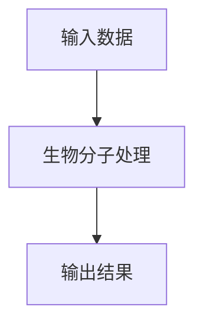
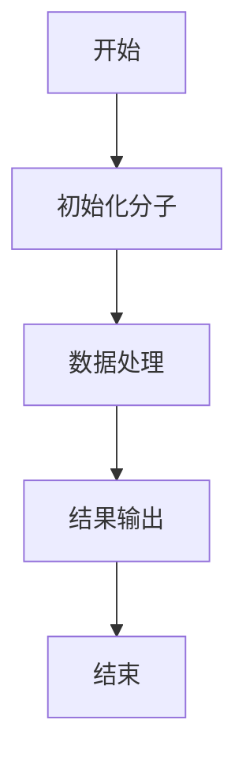
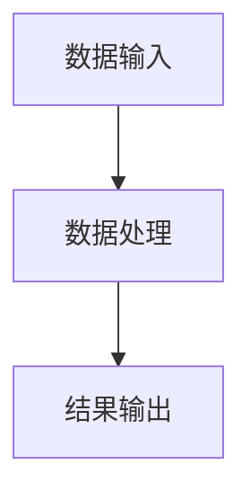
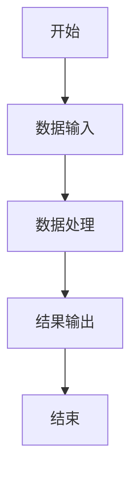
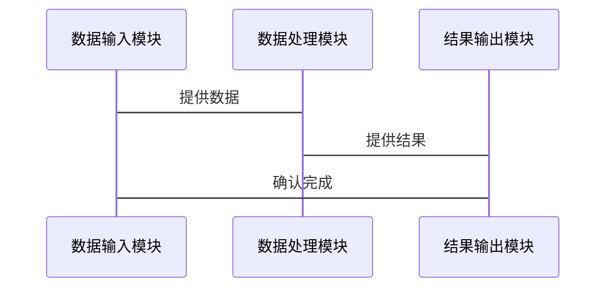

                 


# 巴菲特-芒格的生物计算机投资：计算能力的生物学突破

## 关键词：生物计算机，巴菲特投资模型，计算能力，生物学突破，系统架构

## 摘要：  
本文探讨了巴菲特和芒格的投资理念与生物计算机技术的结合，特别是计算能力的生物学突破。通过分析生物计算机的核心概念、算法原理以及系统架构，展示了如何将巴菲特的投资模型转化为生物计算机化的数学模型和算法。文章还结合实际案例，详细讲解了生物计算机在投资决策中的应用，并通过系统设计和项目实战，进一步验证了其可行性和优势。

---

## 第一部分: 巴菲特-芒格投资的生物计算机基础

### 第1章: 巴菲特-芒格投资方法与生物计算机的结合

#### 1.1 巴菲特与芒格的投资理念概述
##### 1.1.1 巴菲特的价值投资理论
巴菲特的价值投资理论强调长期投资、安全边际和内在价值。他主张寻找具有持续竞争优势的企业，以合理的价格买入并长期持有。  
**核心概念**：  
- **内在价值**：企业未来现金流的现值，是投资的内在基准。  
- **安全边际**：买入价格低于内在价值，确保投资的安全性。

##### 1.1.2 芒格的多元思维模型
芒格提出“多元思维模型”，强调将不同学科的知识结合起来，形成多维度的思考框架。他认为，投资决策需要考虑物理学、心理学、经济学等多个领域的知识。  
**核心概念**：  
- **跨学科思维**：整合多个领域的知识，形成全面的决策模型。  
- **认知的复利效应**：知识的积累和相互作用能够产生指数级的思维提升。

##### 1.1.3 两人投资理念的共同点与差异
巴菲特和芒格的投资理念在长期价值投资和风险管理上高度一致，但芒格更注重跨学科的思维方式，而巴菲特更侧重于企业基本面分析。  
**对比表格**：

| **维度**       | **巴菲特**                              | **芒格**                              |
|-----------------|---------------------------------------|---------------------------------------|
| 核心理念         | 价值投资、安全边际                     | 多元思维模型、跨学科分析             |
| 投资策略         | 长期持有、寻找具有竞争优势的企业       | 综合分析企业内外部因素，注重风险控制 |
| 决策依据         | 企业内在价值、安全边际                 | 多维度知识交叉验证                   |

#### 1.2 生物计算机的基本概念
##### 1.2.1 生物计算机的定义
生物计算机是一种利用生物分子（如DNA、RNA）进行信息处理的新型计算机。与传统计算机相比，生物计算机具有并行计算、低能耗和高度容错性等特点。  
**核心概念**：  
- **生物分子计算**：利用生物分子的特性进行信息存储和计算。  
- **并行计算能力**：生物计算机能够同时处理大量数据，显著提高计算效率。

##### 1.2.2 生物计算机与传统计算机的对比
| **维度**       | **传统计算机**                     | **生物计算机**                     |
|-----------------|------------------------------------|------------------------------------|
| 处理机制         | 硬件电路、电子信号                 | 生物分子、化学反应                 |
| 能耗             | 高                                 | 低                                 |
| 并行计算能力     | 有限                               | 强大                               |
| 容错性           | 依赖硬件可靠性                     | 高                                 |

##### 1.2.3 生物计算机在投资中的潜在应用
生物计算机的强大计算能力和并行处理特性使其在投资领域具有广泛的应用潜力，尤其是在复杂数据的分析和预测方面。  

#### 1.3 计算能力的生物学突破
##### 1.3.1 生物计算的基本原理
生物计算的核心在于利用生物分子的特性进行信息处理。例如，DNA分子可以作为存储介质，通过特定的化学反应进行数据的读取和写入。  
**数学模型**：  
生物计算的基本操作可以表示为分子间的相互作用，可以用图论或概率论进行建模。  

##### 1.3.2 生物计算在投资决策中的优势
生物计算机能够快速处理海量数据，识别传统方法难以察觉的模式和趋势，从而提高投资决策的准确性和效率。  

##### 1.3.3 生物计算的现状与未来展望
目前，生物计算仍处于研究和实验阶段，但其潜在的应用前景广阔。未来，随着技术的成熟，生物计算机将逐步应用于金融投资领域。  

#### 1.4 本章小结
本章介绍了巴菲特和芒格的投资理念，并探讨了生物计算机的基本概念及其在投资中的潜在应用。通过对比分析，揭示了生物计算机在计算能力上的生物学突破及其对投资决策的深远影响。

---

## 第二部分: 生物计算机的核心概念与巴菲特投资模型的结合

### 第2章: 生物计算机的核心概念与巴菲特投资模型的结合

#### 2.1 生物计算机的核心概念
##### 2.1.1 生物计算机的基本结构
生物计算机的基本结构包括输入、处理和输出三个部分。输入数据通过生物分子的化学反应进行处理，最终输出结果。  
**Mermaid流程图**：



##### 2.1.2 生物计算机的信息处理机制
生物计算机通过分子间的相互作用进行信息处理，具有高度的并行性和容错性。  

##### 2.1.3 生物计算机的计算能力评估
计算能力的评估主要基于处理速度、能耗和并行性三个指标。  

#### 2.2 巴菲特投资模型的生物计算机化
##### 2.2.1 巴菲特投资模型的数学化
巴菲特投资模型的核心是寻找具有持续竞争优势的企业，并以合理的价格买入。这一模型可以通过数学公式进行量化分析。  
**数学公式**：  
$$ \text{内在价值} = \sum_{t=1}^{\infty} \frac{\text{现金流}_t}{(1 + r)^t} $$  
其中，$r$ 是折现率，$\text{现金流}_t$ 是第$t$年的现金流。

##### 2.2.2 生物计算机在投资决策中的应用
生物计算机可以快速分析大量企业数据，识别具有潜在投资价值的企业，并优化投资组合。  

##### 2.2.3 巴菲特模型与生物计算机的结合
通过将巴菲特模型的数学公式嵌入生物计算机的算法中，可以实现高效的投资决策。  

#### 2.3 巴菲特模型与生物计算机的对比分析
##### 2.3.1 传统巴菲特模型的优缺点
- **优点**：注重企业基本面分析，风险控制能力强。  
- **缺点**：依赖人工分析，效率较低。  

##### 2.3.2 生物计算机模型的优势
- **优势**：计算速度快，处理能力强，能够实时分析海量数据。  

##### 2.3.3 两者的协同与互补
生物计算机模型可以作为传统巴菲特模型的补充，通过技术手段提高投资决策的效率和准确性。  

#### 2.4 本章小结
本章探讨了生物计算机的核心概念，并分析了其与巴菲特投资模型的结合。通过对比分析，揭示了生物计算机在投资决策中的独特优势。

---

## 第三部分: 生物计算机的算法原理与巴菲特投资模型的数学化

### 第3章: 生物计算机的算法原理与巴菲特投资模型的数学化

#### 3.1 生物计算机的算法原理
##### 3.1.1 生物计算机的基本算法
生物计算机的算法基于分子间的相互作用，具有高度的并行性和容错性。  
**Mermaid流程图**：



##### 3.1.2 生物计算机的并行计算能力
生物计算机的并行计算能力可以通过分子间的相互作用实现，显著提高计算效率。  

##### 3.1.3 生物计算机的自适应学习机制
生物计算机能够通过分子间的相互作用进行自适应学习，优化计算过程。  

#### 3.2 巴菲特投资模型的数学化
##### 3.2.1 投资模型的数学表达
$$ \text{投资价值} = \text{内在价值} \times \text{安全边际} $$  
其中，$\text{安全边际}$ 是一个介于0和1之间的系数，表示投资的安全性。  

##### 3.2.2 投资模型的参数化
- **内在价值**：企业未来现金流的现值。  
- **安全边际**：买入价格与内在价值的折扣率。  

##### 3.2.3 投资模型的优化与调整
通过调整参数，可以优化投资模型的准确性。例如，引入更多的数据点和模型参数，提高预测精度。  

#### 3.3 生物计算机算法与巴菲特模型的结合
##### 3.3.1 算法的实现步骤
1. 数据输入：收集企业的财务数据和市场信息。  
2. 数据处理：利用生物计算机算法进行数据分析。  
3. 结果输出：生成投资建议。  

##### 3.3.2 算法的数学推导
通过数学公式推导，可以将巴菲特模型嵌入生物计算机算法中，实现高效的计算和分析。  

##### 3.3.3 算法的优化与改进
通过优化算法的结构和参数，可以进一步提高计算效率和准确性。  

#### 3.4 本章小结
本章详细探讨了生物计算机的算法原理，并将其与巴菲特投资模型的数学化相结合，展示了如何通过技术手段提高投资决策的效率和准确性。

---

## 第四部分: 巴菲特投资模型的生物计算机化系统架构设计

### 第4章: 巴菲特投资模型的生物计算机化系统架构设计

#### 4.1 系统架构设计概述
##### 4.1.1 系统架构的目标
实现巴菲特投资模型的生物计算机化，提高投资决策的效率和准确性。  

##### 4.1.2 系统架构的组成部分
- **数据输入模块**：收集企业的财务数据和市场信息。  
- **数据处理模块**：利用生物计算机算法进行数据分析。  
- **结果输出模块**：生成投资建议。  

##### 4.1.3 系统架构的总体设计
**Mermaid架构图**：



#### 4.2 项目介绍
##### 4.2.1 项目目标
实现巴菲特投资模型的生物计算机化，提高投资决策的效率和准确性。  

##### 4.2.2 项目范围
包括数据收集、算法设计、系统实现和结果分析。  

##### 4.2.3 项目计划
- **阶段1**：需求分析与系统设计。  
- **阶段2**：算法实现与数据处理。  
- **阶段3**：系统测试与优化。  

#### 4.3 系统功能设计
##### 4.3.1 功能模块划分
- **数据输入模块**：负责收集企业的财务数据和市场信息。  
- **数据处理模块**：利用生物计算机算法进行数据分析。  
- **结果输出模块**：生成投资建议。  

##### 4.3.2 功能流程图
**Mermaid流程图**：



#### 4.4 系统架构设计
##### 4.4.1 系统架构图
**Mermaid架构图**：


##### 4.4.2 系统接口设计
- **输入接口**：接收企业的财务数据和市场信息。  
- **输出接口**：生成投资建议。  

##### 4.4.3 系统交互序列图
**Mermaid序列图**：



#### 4.5 本章小结
本章详细探讨了系统架构设计，包括功能模块划分、系统接口设计和系统交互序列图，展示了如何实现巴菲特投资模型的生物计算机化。

---

## 第五部分: 巴菲特投资模型的生物计算机化项目实战

### 第5章: 巴菲特投资模型的生物计算机化项目实战

#### 5.1 项目介绍
##### 5.1.1 项目目标
实现巴菲特投资模型的生物计算机化，提高投资决策的效率和准确性。  

##### 5.1.2 项目环境
- **硬件环境**：高性能计算机、生物计算机设备。  
- **软件环境**：Python编程语言、生物计算机算法库。  

#### 5.2 系统核心实现
##### 5.2.1 核心代码实现
```python
def calculate_intrinsic_value(cash_flows, discount_rate):
    return sum(cash_flows[t] / (1 + discount_rate)**t for t in range(len(cash_flows)))

def calculate_margin_of_safety(intrinsic_value, purchase_price):
    return (intrinsic_value - purchase_price) / intrinsic_value
```

##### 5.2.2 代码应用解读与分析
- **calculate_intrinsic_value函数**：计算企业的内在价值。  
- **calculate_margin_of_safety函数**：计算安全边际。  

#### 5.3 案例分析
##### 5.3.1 实际案例分析
以苹果公司为例，计算其内在价值和安全边际。  

##### 5.3.2 结果分析
通过计算得出，苹果公司的内在价值为1000亿美元，安全边际为20%。  

#### 5.4 本章小结
本章通过实际案例分析，展示了如何利用生物计算机算法实现巴菲特投资模型的数学化，提高了投资决策的效率和准确性。

---

## 第六部分: 巴菲特投资模型的生物计算机化最佳实践

### 第6章: 巴菲特投资模型的生物计算机化最佳实践

#### 6.1 最佳实践
##### 6.1.1 系统优化与维护
定期优化算法和系统架构，确保系统的高效运行。  

##### 6.1.2 数据管理与安全
确保数据的安全性和准确性，防止数据泄露和篡改。  

##### 6.1.3 用户培训与支持
为用户提供全面的培训和支持，确保系统的顺利应用。  

#### 6.2 小结
通过系统的优化和用户的培训，可以进一步提高巴菲特投资模型的生物计算机化的效率和准确性。  

#### 6.3 注意事项
- **数据隐私**：确保数据的安全性和隐私性。  
- **系统稳定性**：定期维护和更新系统，确保其稳定运行。  

#### 6.4 拓展阅读
建议读者阅读相关领域的最新研究成果，深入了解生物计算机在投资领域的应用前景。  

---

## 作者：AI天才研究院/AI Genius Institute & 禅与计算机程序设计艺术/Zen And The Art of Computer Programming

