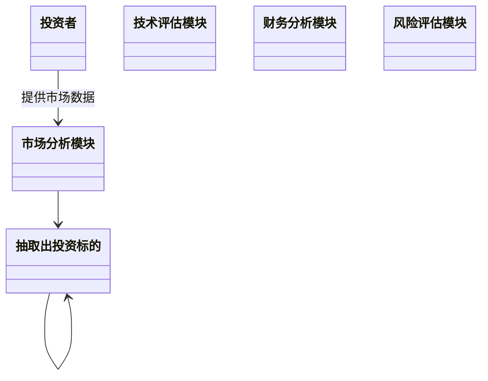
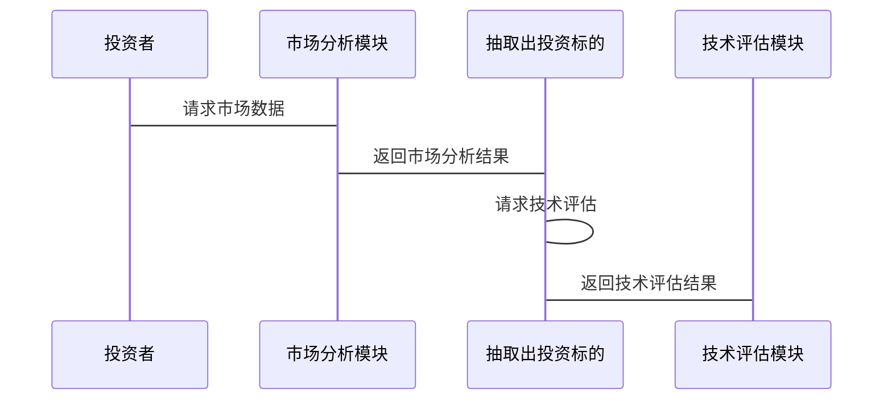

                 


# 巴菲特-芒格的生物降解智能材料投资：可持续科技的新方向

> 关键词：巴菲特, 芒格, 生物降解材料, 智能材料, 可持续科技, 投资策略

> 摘要：本文探讨了巴菲特和芒格在生物降解智能材料领域的投资策略，分析了其在可持续科技中的重要性，结合投资评估模型和系统设计，提供了实际案例和最佳实践。

---

## 第一部分: 巴菲特-芒格的生物降解智能材料投资概述

### 第1章: 生物降解智能材料的定义与背景

#### 1.1 生物降解材料的基本概念

生物降解材料是指在自然环境中，通过微生物的作用分解为二氧化碳、水和其他简单化合物的材料。其核心属性包括可降解性、环境友好性和资源节约性。

- **可降解性**：材料在特定条件下分解，减少对环境的影响。
- **环境友好性**：降低对自然资源的依赖，减少污染。
- **资源节约性**：通过可再生资源生产，减少能源消耗。

#### 1.2 智能材料的核心属性

智能材料具有响应外界刺激（如温度、压力、光线）的能力，并能通过内部机制调整性能。其关键特性包括响应性、自适应性和记忆性。

- **响应性**：材料对外界变化做出反应，调整其物理或化学性质。
- **自适应性**：材料能够自动调整以适应环境变化。
- **记忆性**：材料能够“记住”过去的状态，并在特定条件下恢复。

#### 1.3 巴菲特与芒格的投资理念

- **巴菲特的价值投资理论**：注重企业基本面，寻找具有持续竞争优势和良好管理团队的公司。
- **芒格的多元思维模型**：通过跨学科视角分析问题，寻找投资机会。
- **投资与可持续发展的结合**：关注具有长期增长潜力和环境效益的领域。

---

### 第2章: 生物降解智能材料的市场分析

#### 2.1 全球生物降解材料市场现状

- **市场规模与增长趋势**：全球生物降解材料市场正快速增长，预计未来几年将以年均15%的速度增长。
- **主要应用领域分析**：包装、农业、纺织、电子等领域对生物降解材料的需求增加。
- **区域市场分布**：欧洲和亚洲是主要市场，推动全球市场发展。

#### 2.2 可持续科技的发展方向

- **生物降解材料的技术进步**：研发新型材料，提高降解效率和性能。
- **智能材料的创新应用**：将智能特性应用于更多领域，提升材料的功能性和可持续性。
- **可持续科技的未来趋势**：向绿色技术、循环经济和可持续发展转型。

---

### 第3章: 巴菲特-芒格投资策略的分析

#### 3.1 巴菲特的长期价值投资

- **价值投资的核心原则**：寻找被市场低估的企业，长期持有，获得复利收益。
- **企业基本面分析**：评估财务状况、盈利能力、管理团队等因素。
- **长期持有与复利效应**：通过长期投资，实现财富的稳定增长。

#### 3.2 芒格的多元思维模型

- **多元思维的定义**：通过多个学科的视角分析问题，寻找投资机会。
- **多元思维在投资中的应用**：结合材料科学、环境科学、经济学等知识，评估投资标的的价值。
- **跨学科视角的分析优势**：发现传统方法难以察觉的机会和风险。

---

### 第4章: 生物降解智能材料的投资价值评估

#### 4.1 投资价值的评估指标

- **市场需求分析**：评估目标市场的容量和增长潜力。
- **技术可行性评估**：分析技术的成熟度和商业化潜力。
- **企业财务状况**：考察企业的盈利能力、资产负债情况和现金流。

#### 4.2 投资回报分析

- **现金流分析**：通过净现值（NPV）和内部收益率（IRR）评估项目的盈利能力。
- **风险评估模型**：使用情景分析和蒙特卡洛模拟评估投资风险。

---

## 第二部分: 生物降解智能材料的投资策略与系统设计

### 第5章: 投资策略的系统分析

#### 5.1 系统功能设计

- **领域模型（mermaid类图）**：展示系统各模块之间的关系和交互。



#### 5.2 系统架构设计

- **系统架构图（mermaid架构图）**：展示系统的整体架构和模块之间的交互。

```mermaid
client
    server
        资源管理模块
        分析模块
        报告生成模块
```

#### 5.3 系统接口设计

- **接口设计**：定义系统各模块之间的接口，确保数据流和功能交互的正确性。

#### 5.4 系统交互流程（mermaid序列图）



---

### 第6章: 项目实战

#### 6.1 环境影响评估

- **环境影响分析**：评估生物降解材料在整个生命周期中的环境影响，包括生产、使用和废弃阶段。

#### 6.2 投资回报分析

- **案例分析**：假设某生物降解材料公司，分析其投资回报率和市场前景。

---

## 第三部分: 结论与展望

### 第7章: 结论与展望

#### 7.1 结论

- 巴菲特和芒格的投资理念与生物降解智能材料的结合，为可持续科技的发展提供了新的方向。
- 生物降解智能材料的投资具有广阔前景，但需要综合考虑技术、市场和财务因素。

#### 7.2 未来展望

- 随着技术进步和政策支持，生物降解智能材料将在更多领域得到应用。
- 可持续科技将继续推动投资策略的创新和优化。

---

## 作者

作者：AI天才研究院 & 禅与计算机程序设计艺术

---

本文结合了巴菲特和芒格的投资理念，详细分析了生物降解智能材料的投资价值和策略，为投资者提供了系统的分析框架和实际案例。

