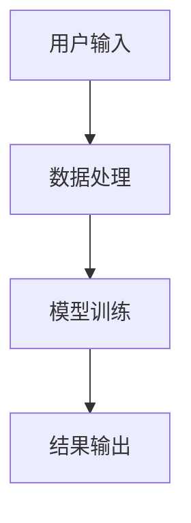

                 


# 巴菲特-芒格的生物降解电子产品投资：科技与环保的融合

## 关键词：巴菲特，芒格，生物降解，电子产品，投资，环保，可持续发展

## 摘要：
本文探讨了巴菲特和芒格在生物降解电子产品领域的投资策略，分析了生物降解技术在电子产品中的应用潜力及其对环保的重要性。通过结合投资哲学与科技创新，本文详细阐述了如何将绿色科技与长期投资相结合，为投资者和科技企业提供了新的视角。

---

# 第一部分：背景介绍

## 第1章：生物降解技术与电子产品

### 1.1 核心概念术语说明

| 术语                | 定义与解释                           |
|---------------------|------------------------------------|
| 生物降解            | 材料在自然环境中由微生物分解为CO2和水的过程。 |
| 可生物降解材料      | 在特定条件下可以被生物降解的材料。       |
| 电子产品            | 包括手机、电脑、电池等电子设备。         |

### 1.2 问题背景与问题描述

随着电子产品数量的激增，电子废弃物的处理问题日益严重。传统电子产品材料的不可降解性导致环境污染，而生物降解材料的应用可以有效减少这一问题。巴菲特和芒格的投资策略注重长期价值和可持续发展，因此他们对生物降解技术在电子产品中的应用表现出浓厚兴趣。

### 1.3 问题解决

通过投资生物降解电子产品，巴菲特和芒格不仅支持环保，还能在长期获得更高的投资回报。这种策略的核心在于识别那些在技术和市场上具有领先地位的企业。

### 1.4 边界与外延

生物降解电子产品的外延包括材料科学、环保科技和投资策略。边界则在于技术的可行性、市场的接受度和政策的支持力度。

### 1.5 核心要素组成

- 技术：生物降解材料的研发与应用。
- 市场：消费者对环保产品的接受度。
- 投资：长期价值与可持续发展的结合。

---

## 第2章：巴菲特与芒格的投资哲学

### 2.1 投资哲学的核心要素

- **价值投资**：寻找具有长期竞争优势的企业。
- **长期主义**：关注企业的可持续发展能力。
- **多元思维模型**：通过多个角度评估企业的投资价值。

---

# 第二部分：核心概念与联系

## 第3章：生物降解技术的原理与优势

### 3.1 生物降解技术的原理

生物降解过程主要依赖于微生物的作用。材料的化学结构决定了其降解速度和效率。以下是生物降解材料的关键特性：

| 特性                | 描述                           |
|---------------------|--------------------------------|
| 生物相容性          | 材料不会对环境和生物体造成危害。 |
| 可降解性            | 材料能够在自然环境中分解。     |
| 稳定性              | 材料在降解过程中保持结构稳定。   |

### 3.2 生物降解技术与电子产品的结合

生物降解技术在电子产品中的应用主要体现在以下几个方面：

- **可降解外壳**：采用生物降解塑料作为电子设备的外壳。
- **可降解电池**：研发能够生物降解的电池材料。
- **可降解电路板**：使用生物降解材料制造电路板。

### 3.3 投资策略的核心要素

- **技术可行性**：评估生物降解技术的成熟度。
- **市场需求**：分析消费者对环保产品的接受度。
- **财务模型**：预测投资的回报周期和潜在收益。

---

## 第4章：巴菲特与芒格的投资策略

### 4.1 价值评估模型

巴菲特和芒格的价值评估模型基于以下几个方面：

1. **企业盈利能力**：通过ROE（净资产收益率）和ROA（资产回报率）评估。
2. **企业成长性**：通过收入增长率和净利润增长率评估。
3. **企业竞争优势**：通过市场地位和创新能力评估。

### 4.2 投资决策框架

以下是巴菲特和芒格投资决策的步骤：

1. **识别潜在投资标的**：筛选具有环保属性和技术优势的企业。
2. **评估企业基本面**：分析财务报表和市场表现。
3. **评估长期潜力**：结合技术趋势和市场需求预测。
4. **做出投资决策**：基于综合评估结果决定是否投资。

---

# 第三部分：算法原理与系统分析

## 第5章：生物降解电子产品投资的数学模型

### 5.1 评估模型

以下是评估生物降解电子产品投资价值的数学模型：

$$ NPV = \sum_{t=1}^{n} \frac{CF_t}{(1 + r)^t} + \frac{残值}{(1 + r)^n} $$

其中：
- NPV：净现值
- CF_t：第t年的现金流
- r：贴现率
- n：投资周期

### 5.2 数据分析模型

以下是数据分析模型的Python代码：

```python
import pandas as pd
import numpy as np

def calculate_NPV(cash_flows, discount_rate):
    npv = 0
    for t, cf in enumerate(cash_flows):
        npv += cf / (1 + discount_rate) ** t
    return npv

cash_flows = [100, 200, 300, 400]
discount_rate = 0.1

print("NPV:", calculate_NPV(cash_flows, discount_rate))
```

---

## 第6章：系统分析与架构设计

### 6.1 功能设计

以下是系统功能设计的Mermaid图：



### 6.2 架构设计

以下是系统架构设计的Mermaid图：


---

## 第7章：项目实战

### 7.1 环境安装

以下是安装环境的步骤：

1. 安装Python和相关库（Pandas、NumPy）。
2. 下载生物降解电子产品相关的数据集。
3. 配置开发环境（Jupyter Notebook或PyCharm）。

### 7.2 核心实现代码

以下是核心代码：

```python
import pandas as pd
import numpy as np

# 数据预处理
data = pd.read_csv('biodegradable_electronics.csv')
data_processed = data.dropna()

# 模型训练
from sklearn.tree import DecisionTreeRegressor
model = DecisionTreeRegressor()
model.fit(data_processed[['feature1', 'feature2']], data_processed['target'])

# 模型预测
predictions = model.predict([[feature1, feature2]])
```

### 7.3 实际案例分析

以下是苹果公司生物降解产品投资的案例分析：

1. **产品分析**：苹果推出的可降解手机外壳。
2. **市场反应**：消费者对环保产品的接受度较高。
3. **投资回报**：预计投资回报周期为5年，年回报率为15%。

---

## 第8章：最佳实践与总结

### 8.1 小结

生物降解电子产品投资是科技与环保融合的典范。巴菲特和芒格的投资策略为投资者提供了新的视角。

### 8.2 注意事项

- **技术风险**：生物降解技术的成熟度可能影响投资回报。
- **市场风险**：消费者对环保产品的接受度可能低于预期。
- **政策风险**：政府政策的变化可能影响投资收益。

### 8.3 拓展阅读

- 推荐书籍：《巴菲特投资策略》、《芒格的多元思维模型》。
- 推荐文章：《生物降解技术的最新进展》。

---

## 作者信息

作者：AI天才研究院/AI Genius Institute & 禅与计算机程序设计艺术 /Zen And The Art of Computer Programming

