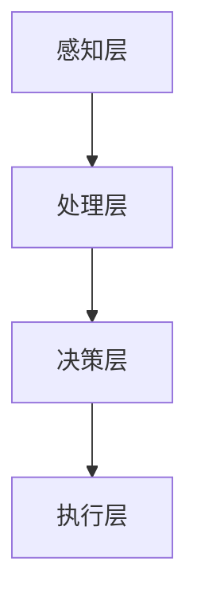
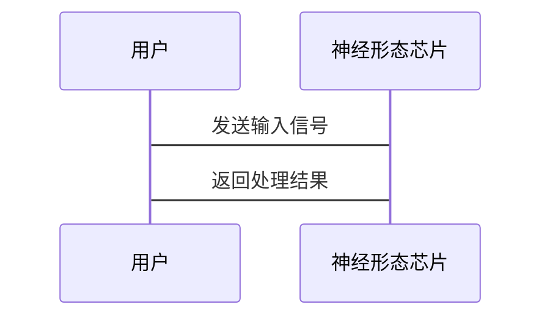
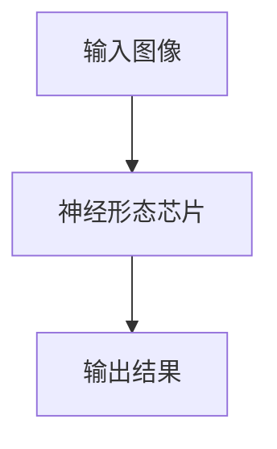
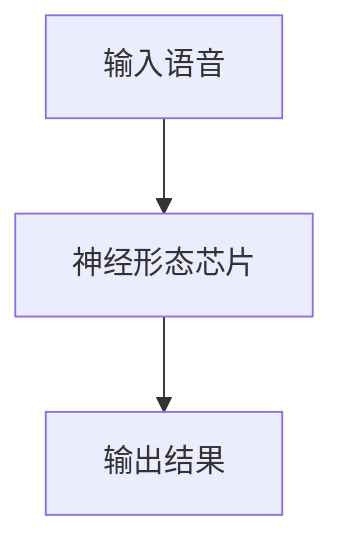

                 


# 巴菲特-芒格的神经形态芯片投资：类脑计算的工业化

---

## 关键词
神经形态芯片, 巴菲特, 芒格, 类脑计算, 投资策略, 工业化

---

## 摘要
本文探讨了巴菲特和芒格在神经形态芯片领域的投资策略，分析了类脑计算的工业化进程。文章从神经形态芯片的基本概念入手，结合巴菲特和芒格的投资哲学，详细分析了神经形态芯片的核心原理、算法模型、系统架构，并通过实际案例展示了其在工业化的应用。文章最后总结了投资神经形态芯片的潜力和挑战，并提出了相关的建议。

---

# 第一部分：神经形态芯片与类脑计算的背景

## 第1章：神经形态芯片的基本概念

### 1.1 神经形态芯片的定义
神经形态芯片是一种模拟生物神经系统结构和功能的芯片，旨在通过事件驱动的方式进行高效计算。它模仿人脑的神经元和突触，能够在低功耗下完成复杂的并行计算任务。

### 1.2 神经形态芯片的核心特点
神经形态芯片具有以下核心特点：
1. **低功耗**：通过事件驱动的方式减少不必要的计算，大幅降低功耗。
2. **高并行性**：模拟生物神经系统的并行计算能力，适合处理复杂任务。
3. **可扩展性**：支持大规模并行计算，能够适应不同规模的应用需求。

### 1.3 神经形态芯片与传统芯片的区别
神经形态芯片与传统芯片的主要区别如下：

| 特性 | 神经形态芯片 | 传统芯片 |
|------|--------------|----------|
| 计算模型 | 事件驱动 | 冯·诺依曼架构 |
| 功耗 | 低 | 较高 |
| 并行性 | 高 | 一般 |

### 1.4 巴菲特与芒格的投资哲学

#### 1.4.1 巴菲特的价值投资理念
巴菲特的价值投资理念强调长期持有优质资产，注重企业的内在价值和安全边际。他认为，投资的本质是寻找具有持续竞争优势的企业，并以合理的价格买入。

#### 1.4.2 芒格的多元思维模型
芒格的多元思维模型强调跨学科的思考方式，认为投资者应该从多个角度分析问题，避免认知偏差。他主张通过广泛阅读和学习，构建一个完整的知识框架。

#### 1.4.3 两人投资策略的异同
- **相同点**：两者都强调长期投资、价值投资和风险控制。
- **不同点**：巴菲特更注重企业的财务状况和竞争优势，而芒格更注重跨学科的分析和对人类行为的理解。

### 1.5 巴菲特-芒格投资神经形态芯片的背景

#### 1.5.1 神经形态芯片的市场前景
神经形态芯片在人工智能、机器人和边缘计算等领域具有广阔的应用前景。随着AI技术的快速发展，市场对高效、低功耗计算芯片的需求日益增加。

#### 1.5.2 投资神经形态芯片的动机
- 神经形态芯片的市场潜力巨大。
- 巴菲特和芒格认为，神经形态芯片是未来计算技术的重要方向。

#### 1.5.3 神经形态芯片与类脑计算的关系
神经形态芯片是实现类脑计算的核心技术。通过模拟人脑的神经网络，神经形态芯片能够实现更高效的计算和更智能的应用。

---

## 第2章：神经形态芯片的核心原理

### 2.1 神经形态芯片的基本原理

#### 2.1.1 神经元模型
神经元模型是神经形态芯片的核心组成部分。常用的神经元模型包括：

1. **SPike-and-Fire模型**：模拟神经元的电位变化和脉冲发放。
2. **Leaky Integrate-and-Fire模型**：考虑神经元的漏电效应，能够更好地模拟生物神经元的行为。

#### 2.1.2 突触模型
突触模型描述了神经元之间的信息传递机制。常用的突触模型包括：

1. **加权和模型**：突触权重决定了信息传递的强度。
2. **累积模型**：通过累积输入信号来触发神经元的脉冲发放。

#### 2.1.3 芯片架构
神经形态芯片的架构设计借鉴了生物神经系统的层次结构。常见的芯片架构包括：

1. **事件驱动的架构**：通过事件触发的方式进行计算，减少不必要的计算操作。
2. **层次化的架构**：将芯片分为感知层、处理层和决策层，分别处理不同的任务。

### 2.2 神经形态芯片的计算模型

#### 2.2.1 事件驱动的计算
事件驱动的计算是一种高效的信息处理方式。通过事件触发的方式，神经形态芯片能够在低功耗下完成复杂的计算任务。

#### 2.2.2 传统冯·诺依曼架构的对比
与传统冯·诺依曼架构相比，神经形态芯片的优势在于：
- 低功耗
- 高并行性
- 事件驱动的计算方式

#### 2.2.3 神经网络的模拟与实现
神经形态芯片能够模拟生物神经网络的结构和功能，实现高效的并行计算。通过模拟神经元之间的连接和信息传递，神经形态芯片能够完成复杂的人工智能任务。

### 2.3 神经形态芯片的优势与挑战

#### 2.3.1 低功耗的优势
神经形态芯片通过事件驱动的方式减少计算任务的能耗，能够显著降低功耗。

#### 2.3.2 高并行计算的能力
神经形态芯片的高并行计算能力使其在处理复杂任务时具有显著优势。

#### 2.3.3 研发与制造的挑战
神经形态芯片的研发和制造需要克服诸多技术难题，包括芯片设计、制造工艺和算法优化等方面。

---

## 第3章：巴菲特-芒格投资策略与神经形态芯片

### 3.1 巴菲特的长期投资策略

#### 3.1.1 长期价值投资的核心要素
巴菲特的长期价值投资策略强调：
- 选择具有持续竞争优势的企业。
- 以合理的价格买入优质资产。
- 长期持有，耐心等待价值实现。

#### 3.1.2 股东权益最大化的原则
巴菲特认为，投资的最终目标是为股东创造最大化的价值。他注重企业的财务健康和盈利能力，选择那些能够持续为股东创造价值的企业。

#### 3.1.3 风险控制与安全边际
巴菲特强调风险控制和安全边际。他认为，投资的关键在于避免重大风险，确保投资的安全性。

### 3.2 芒格的多元思维模型

#### 3.2.1 跨学科的思维方法
芒格的多元思维模型强调：
- 从多个学科和领域中获取知识。
- 综合运用不同的思维方式，避免认知偏差。
- 通过跨学科的视角，更好地理解和分析问题。

#### 3.2.2 神经形态芯片的技术复杂性
神经形态芯片的研发涉及多个学科，包括计算机科学、神经科学、材料科学和电子工程等。芒格的多元思维模型能够帮助投资者更好地理解技术的复杂性。

#### 3.2.3 投资决策中的多维度分析
芒格认为，投资决策需要从多个维度进行分析，包括技术、市场、财务和法律等方面。他强调通过多维度的分析，降低投资决策的风险。

### 3.3 神经形态芯片的投资价值

#### 3.3.1 神经形态芯片的市场潜力
随着人工智能和边缘计算的发展，神经形态芯片的市场需求将快速增长。神经形态芯片在自动驾驶、智能机器人和医疗设备等领域具有广阔的应用前景。

#### 3.3.2 神经形态芯片的技术优势
神经形态芯片的低功耗和高并行计算能力使其在特定领域具有显著优势。例如，在边缘计算中，神经形态芯片能够在低功耗条件下完成高效的计算任务。

#### 3.3.3 神经形态芯片的风险与挑战
尽管神经形态芯片的市场潜力巨大，但其研发和制造面临诸多挑战。投资者需要充分考虑技术风险、市场风险和竞争风险。

---

## 第4章：神经形态芯片的算法原理

### 4.1 神经形态芯片的算法模型

#### 4.1.1 事件驱动的算法
事件驱动的算法是神经形态芯片的核心算法之一。它通过事件触发的方式，实现高效的并行计算。

#### 4.1.2 时间戳编码
时间戳编码是一种常用的编码方式，通过记录事件发生的时间，实现信息的高效传递。

#### 4.1.3 神经网络的训练与优化
神经网络的训练与优化是神经形态芯片的重要任务。通过训练神经网络，神经形态芯片能够实现复杂的人工智能任务。

### 4.2 神经形态芯片的数学模型

#### 4.2.1 神经元的数学模型
神经元的数学模型描述了神经元的行为特征。常用的数学模型包括：

1. **Leaky Integrate-and-Fire模型**：
   $$ V_{\text{leak}} = V_{\text{prev}} - \frac{V_{\text{prev}} - V_{\text{rest}}}{\tau} $$
   其中，$V_{\text{prev}}$ 是上一时刻的电位，$V_{\text{rest}}$ 是静息电位，$\tau$ 是时间常数。

2. **SPike-and-Fire模型**：
   $$ V_{\text{next}} = \begin{cases}
   V_{\text{reset}} & \text{如果 } V_{\text{prev}} \geq V_{\text{th}} \\
   V_{\text{prev}} + I_{\text{in}} \cdot \Delta t & \text{否则}
   \end{cases} $$
   其中，$V_{\text{th}}$ 是阈值电位，$I_{\text{in}}$ 是输入电流，$\Delta t$ 是时间步长。

#### 4.2.2 突触的数学模型
突触的数学模型描述了信息传递的过程。常用的突触模型包括：

1. **加权和模型**：
   $$ S = \sum_{i=1}^{n} w_i x_i $$
   其中，$w_i$ 是第i个突触的权重，$x_i$ 是第i个输入。

2. **累积模型**：
   $$ S_{\text{next}} = S_{\text{prev}} + I_{\text{in}} \cdot \Delta t $$

### 4.3 神经形态芯片的算法实现

#### 4.3.1 事件驱动的计算流程
事件驱动的计算流程如下：

1. 接收输入事件。
2. 根据事件触发相应的计算。
3. 通过突触模型传递信息。
4. 神经元根据输入信息决定是否发放脉冲。
5. 脉冲通过突触传递到下一个神经元。

#### 4.3.2 算法的优化与加速
为了提高计算效率，神经形态芯片的算法需要进行优化和加速。例如，通过并行计算和事件驱动的方式，减少计算任务的能耗。

---

## 第5章：神经形态芯片的系统架构设计

### 5.1 神经形态芯片的系统架构

#### 5.1.1 系统功能设计
神经形态芯片的系统功能设计包括：
1. 数据采集与处理
2. 神经网络的训练与推理
3. 事件驱动的计算与控制

#### 5.1.2 系统架构的层次化设计
系统架构的层次化设计包括：
1. **感知层**：负责数据的采集和预处理。
2. **处理层**：负责神经网络的训练和推理。
3. **决策层**：负责决策和控制。

#### 5.1.3 系统架构的mermaid图


### 5.2 神经形态芯片的接口设计

#### 5.2.1 输入接口
神经形态芯片的输入接口负责接收外部的输入信号，例如：
- 时间戳编码的输入
- 模拟信号的输入

#### 5.2.2 输出接口
神经形态芯片的输出接口负责将处理后的信号传递给外部设备，例如：
- 脉冲信号的输出
- 数字信号的输出

#### 5.2.3 控制接口
神经形态芯片的控制接口负责接收和处理控制信号，例如：
- 启动和停止计算
- 调整参数和配置

### 5.3 神经形态芯片的交互流程

#### 5.3.1 系统交互的mermaid序列图


---

## 第6章：神经形态芯片的项目实战

### 6.1 环境安装

#### 6.1.1 开发环境的配置
为了开发神经形态芯片，需要配置以下开发环境：
1. 操作系统：Linux或Windows
2. 编程语言：C++或Python
3. 开发工具：Xilinx Vivado或Intel Quartus

#### 6.1.2 硬件环境的要求
硬件环境需要满足以下要求：
1. 开发板：Xilinx Zynq或Intel Arria
2. 外围设备：摄像头、传感器等

### 6.2 系统核心实现

#### 6.2.1 神经形态芯片的代码实现
以下是一个简单的神经形态芯片实现示例（Python代码）：
```python
class Neuron:
    def __init__(self, threshold=1.0, reset=0.0):
        self.threshold = threshold
        self.reset = reset
        self.v = self.reset

    def step(self, current_input):
        self.v += current_input
        if self.v >= self.threshold:
            self.v = self.reset
            return 1
        else:
            return 0

# 示例用法
neuron = Neuron(threshold=1.5, reset=0.0)
input_signal = 0.5
output = neuron.step(input_signal)
print(output)  # 输出结果：0
```

#### 6.2.2 神经网络的训练与优化
神经网络的训练与优化是神经形态芯片的重要任务。以下是一个简单的神经网络训练示例（Python代码）：
```python
import numpy as np

def loss(y_true, y_pred):
    return np.mean((y_true - y_pred) ** 2)

def backpropagation(x, y_true, y_pred):
    return 2 * np.mean((y_true - y_pred) * x)

# 示例用法
x = np.array([1, 2, 3])
y_true = np.array([4])
y_pred = 1 * x  # 简单线性回归
print(loss(y_true, y_pred))  # 输出结果：损失值
```

### 6.3 案例分析

#### 6.3.1 神经形态芯片在视觉识别中的应用
神经形态芯片在视觉识别中的应用示例：


#### 6.3.2 神经形态芯片在语音识别中的应用
神经形态芯片在语音识别中的应用示例：


### 6.4 项目小结
通过以上实战，我们可以看到神经形态芯片在不同领域的广泛应用。神经形态芯片的高效计算能力和低功耗特点使其在人工智能和边缘计算领域具有巨大的潜力。

---

## 第7章：神经形态芯片的投资策略与展望

### 7.1 神经形态芯片的投资潜力
神经形态芯片的投资潜力主要体现在以下几个方面：
1. **市场需求**：随着人工智能和边缘计算的发展，神经形态芯片的市场需求将快速增长。
2. **技术优势**：神经形态芯片的低功耗和高并行计算能力使其在特定领域具有显著优势。
3. **长期价值**：神经形态芯片是未来计算技术的重要方向，具有长期的投资价值。

### 7.2 神经形态芯片的投资风险
神经形态芯片的投资风险主要体现在以下几个方面：
1. **技术风险**：神经形态芯片的研发和制造面临诸多技术难题。
2. **市场风险**：市场的接受程度和竞争情况可能影响投资回报。
3. **政策风险**：政策的变化可能对神经形态芯片的发展产生重大影响。

### 7.3 神经形态芯片的未来展望
神经形态芯片的未来展望包括以下几个方面：
1. **技术进步**：随着技术的进步，神经形态芯片的性能将不断提高。
2. **应用拓展**：神经形态芯片将在更多领域得到广泛应用。
3. **生态建设**：神经形态芯片的生态系统将不断完善，推动行业的健康发展。

---

## 第8章：总结与建议

### 8.1 总结
本文从神经形态芯片的基本概念入手，结合巴菲特和芒格的投资哲学，详细分析了神经形态芯片的核心原理、算法模型、系统架构，并通过实际案例展示了其在工业化的应用。文章最后总结了投资神经形态芯片的潜力和挑战，并提出了相关的建议。

### 8.2 投资建议
1. **长期价值投资**：选择具有持续竞争优势的神经形态芯片企业。
2. **风险控制**：注重企业的财务健康和风险管理。
3. **多元化投资**：通过多元化投资降低风险，分散投资标的。

---

## 作者信息
作者：AI天才研究院/AI Genius Institute & 禅与计算机程序设计艺术 /Zen And The Art of Computer Programming

