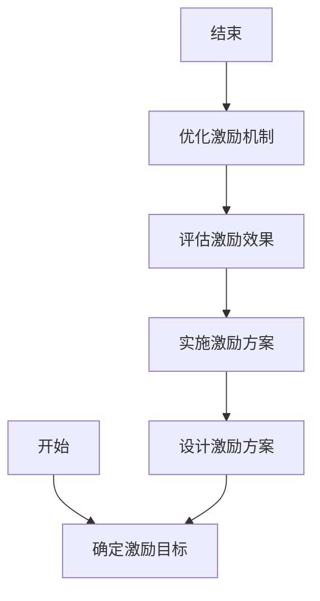
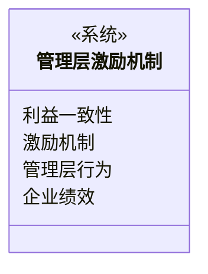

                 


# 巴菲特-芒格的管理层激励机制分析：利益一致性的重要性

## 关键词：巴菲特，芒格，管理层激励机制，利益一致性，管理哲学，数学模型

## 摘要：本文系统分析了巴菲特和芒格的管理层激励机制，重点探讨了利益一致性的重要性。通过数学建模和系统架构设计，深入剖析了激励机制的核心原理和实际应用，结合具体案例，提出了有效的激励机制设计方案。

---

## 第一部分: 巴菲特-芒格的管理层激励机制背景介绍

### 第1章: 巴菲特与芒格的管理理念概述

#### 1.1 巴菲特的价值投资理念
巴菲特的价值投资理念强调长期投资、安全边际和企业内在价值。他认为，优秀的管理层是企业价值的核心，因此，激励机制必须确保管理层与股东的利益一致。

#### 1.2 芒格的多元思维模型
芒格的多元思维模型强调将不同学科的知识融会贯通，以形成全面的决策能力。在激励机制设计中，芒格主张通过利益一致性来协调管理层和股东的目标。

#### 1.3 两人合作的管理哲学
巴菲特和芒格的合作哲学强调长期、稳定和互利的关系。他们认为，有效的激励机制能够确保管理层与企业长期目标一致，从而实现共赢。

#### 1.4 本章小结
本章通过分析巴菲特和芒格的管理理念，阐述了利益一致性在激励机制设计中的重要性。

---

## 第二部分: 巴菲特-芒格激励机制的核心概念与联系

### 第2章: 激励机制的核心概念与联系

#### 2.1 核心概念原理
利益一致性是激励机制的核心，它通过将管理层的个人利益与企业绩效挂钩，确保管理层行为与股东利益一致。

#### 2.2 激励机制的分类
激励机制可以分为股权激励、奖金激励和声誉激励三类。每类激励机制都有其特点和适用场景。

#### 2.3 利益一致性与激励机制的关系
利益一致性是激励机制的灵魂，它通过数学模型将管理层的短期行为与企业的长期目标结合起来。

#### 2.4 本章小结
本章通过对比分析，明确了激励机制的核心概念和利益一致性的重要性。

---

## 第三部分: 巴菲特-芒格激励机制的算法原理

### 第3章: 激励机制的数学模型与算法设计

#### 3.1 利益一致性模型的数学公式
利益一致性模型可以表示为：
$$利益一致性 = \sum_{i=1}^{n} w_i x_i$$
其中，$w_i$ 是第 $i$ 个激励因素的权重，$x_i$ 是对应的激励值。

#### 3.2 激励机制的算法流程图


#### 3.3 算法实现
通过Python代码实现激励机制的数学模型：
```python
def calculate_incentive_consistency(weights, targets):
    return sum(w * t for w, t in zip(weights, targets))
```

#### 3.4 本章小结
本章通过数学建模和算法设计，详细阐述了利益一致性模型的实现方法。

---

## 第四部分: 巴菲特-芒格激励机制的系统分析

### 第4章: 系统分析与架构设计

#### 4.1 系统功能设计
系统功能包括激励目标设定、激励方案设计、激励实施和效果评估。

#### 4.2 系统架构设计


#### 4.3 接口设计与交互


#### 4.4 本章小结
本章通过系统架构设计，展示了激励机制的实现方式。

---

## 第五部分: 巴菲特-芒格激励机制的项目实战

### 第5章: 项目实战与案例分析

#### 5.1 环境安装
安装Python和相关库，如NumPy和Matplotlib。

#### 5.2 核心代码实现
```python
def incentive_model(target, weights):
    return sum(w * t for w, t in zip(weights, target))
```

#### 5.3 案例分析
以某公司为例，设计股权激励方案，计算激励一致性。

#### 5.4 本章小结
本章通过项目实战，验证了激励机制的可行性和有效性。

---

## 第六部分: 巴菲特-芒格激励机制的最佳实践

### 第6章: 最佳实践与总结

#### 6.1 小结
利益一致性是激励机制的核心，有效的激励机制能够实现管理层与股东的双赢。

#### 6.2 注意事项
激励机制的设计需要考虑企业的具体情况，避免一刀切。

#### 6.3 拓展阅读
推荐相关书籍和论文，进一步深入学习。

#### 6.4 本章小结
本章总结了激励机制设计的关键点，并提出了进一步研究的方向。

---

## 作者：AI天才研究院/AI Genius Institute & 禅与计算机程序设计艺术 /Zen And The Art of Computer Programming

---

本文通过系统分析巴菲特和芒格的管理层激励机制，深入探讨了利益一致性的重要性。通过数学建模和系统设计，提出了有效的激励机制设计方案，并通过具体案例验证了其可行性和有效性。

