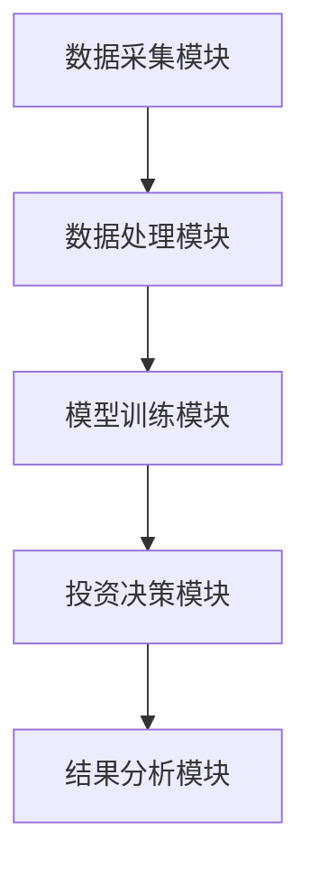
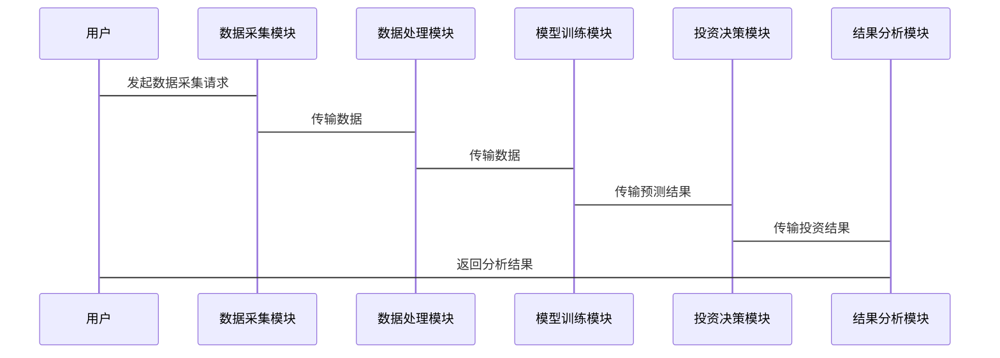

                 


# 巴菲特-芒格的精准医疗AI投资：个性化治疗的新时代

> 关键词：巴菲特、芒格、精准医疗、AI投资、个性化治疗、机器学习、深度学习

> 摘要：本文深入探讨了巴菲特和芒格的投资哲学与精准医疗、AI投资的结合，分析了AI技术在精准医疗中的应用，提出了基于AI的精准医疗投资系统的架构设计，并通过具体案例展示了如何利用Python和相关技术实现AI投资系统。

---

# 第一部分: 巴菲特-芒格投资哲学与AI技术的结合

## 第1章: 巴菲特-芒格投资哲学概述

### 1.1 巴菲特-芒格投资哲学的核心理念

#### 1.1.1 巴菲特的价值投资理论

巴菲特的价值投资理论强调长期投资、安全边际和企业内在价值。他主张寻找那些具有持续竞争优势、良好管理和稳定财务状况的公司，并以合理的价格买入并长期持有。

#### 1.1.2 芒格的多元思维模型

芒格的多元思维模型强调通过跨学科的知识和思维方式来理解问题。他主张将多个领域的知识相互连接，形成一个立体的思考框架，从而做出更明智的投资决策。

#### 1.1.3 投资哲学与长期主义

巴菲特和芒格的投资哲学都强调长期主义，即通过长期持有优质资产来实现财富的增值。他们认为短期市场的波动不应该影响长期的投资决策。

### 1.2 巴菲特-芒格投资哲学的核心要素

#### 1.2.1 投资的三大核心要素

- **企业基本面**：包括企业的财务状况、盈利能力、竞争优势等。
- **市场价格**：包括股票的市盈率、市净率等估值指标。
- **投资心态**：包括投资者的心理素质、决策能力和风险偏好。

#### 1.2.2 投资决策的逻辑框架

- **识别优质企业**：通过分析企业的财务报表、管理团队和行业地位来识别具有持续竞争优势的企业。
- **评估市场价格**：通过比较企业的内在价值和市场价格来判断投资机会。
- **长期持有**：通过长期持有优质资产来实现财富的增值。

#### 1.2.3 投资哲学的边界与外延

- **边界**：巴菲特和芒格的投资哲学适用于那些具有持续竞争优势和良好管理的公司，而不适用于那些缺乏竞争优势或财务状况不稳定的公司。
- **外延**：巴菲特和芒格的投资哲学可以通过结合现代技术手段（如AI）来进一步优化投资决策。

### 1.3 巴菲特-芒格投资哲学与AI技术的结合

#### 1.3.1 AI技术在投资决策中的应用

- **数据挖掘**：通过AI技术对海量数据进行挖掘，发现潜在的投资机会。
- **预测模型**：通过机器学习算法建立预测模型，预测股票的价格走势。
- **风险管理**：通过AI技术对市场风险进行实时监控和预警。

#### 1.3.2 巴菲特-芒格投资哲学与AI技术的契合点

- **长期主义**：AI技术可以帮助投资者实现长期投资目标，通过自动化和智能化的投资决策系统来优化投资组合。
- **多元思维模型**：AI技术可以通过跨学科的数据分析和模型构建，帮助投资者更好地理解市场和企业的复杂性。
- **安全边际**：AI技术可以通过对市场的深度分析和预测，帮助投资者更好地把握安全边际。

#### 1.3.3 个性化治疗的新时代

- **精准医疗**：通过AI技术对患者进行个性化诊断和治疗，提高医疗效果和患者生活质量。
- **个性化投资**：通过AI技术对投资者进行个性化投资建议，帮助投资者实现财富的长期增值。

---

## 第2章: 精准医疗与AI投资的核心概念

### 2.1 精准医疗的定义与特点

#### 2.1.1 精准医疗的定义

精准医疗是一种基于患者个体特征（如基因、生活方式、环境因素等）的个性化医疗模式，旨在通过精准的诊断和治疗来提高医疗效果和患者生活质量。

#### 2.1.2 精准医疗的核心特点

- **个性化**：根据患者的个体特征制定个性化的治疗方案。
- **精准性**：通过精准的诊断和治疗来提高医疗效果。
- **预测性**：通过预测患者的疾病风险和治疗效果来优化治疗方案。

#### 2.1.3 精准医疗与传统医疗的区别

| 特性         | 精准医疗                        | 传统医疗                        |
|--------------|--------------------------------|---------------------------------|
| 病因分析     | 基因检测、分子水平分析          | 病理学检查、症状分析            |
| 治疗方案     | 个性化用药、基因靶向治疗        | 标准化用药、常规手术            |
| 预后预测     | 基于基因和数据的预测            | 基于临床经验的预测              |

### 2.2 AI在精准医疗中的应用

#### 2.2.1 AI在疾病诊断中的应用

- **医学影像分析**：通过AI技术对医学影像进行自动分析，辅助医生进行疾病诊断。
- **症状分析**：通过自然语言处理技术对患者的症状进行分析，辅助医生进行诊断。
- **基因检测**：通过AI技术对患者的基因进行分析，预测疾病风险和治疗效果。

#### 2.2.2 AI在药物研发中的应用

- **药物发现**：通过AI技术筛选潜在的药物分子，加速药物研发过程。
- **临床试验设计**：通过AI技术优化临床试验设计，提高试验效率和效果。
- **药物疗效预测**：通过AI技术预测药物的疗效和副作用，优化药物使用方案。

#### 2.2.3 AI在个性化治疗中的应用

- **个性化用药方案**：通过AI技术制定个性化的用药方案，提高治疗效果。
- **治疗方案优化**：通过AI技术对治疗方案进行优化，减少副作用和提高治疗效果。
- **治疗效果预测**：通过AI技术预测治疗效果，优化治疗方案。

### 2.3 精准医疗与AI投资的结合

#### 2.3.1 精准医疗数据的分析与投资决策

- **数据采集**：通过AI技术采集和整理精准医疗相关的数据，包括患者的基因数据、医疗记录、用药情况等。
- **数据挖掘**：通过机器学习算法对精准医疗数据进行挖掘，发现潜在的投资机会。
- **投资决策**：通过AI技术对精准医疗数据进行分析，制定投资策略。

#### 2.3.2 AI在精准医疗投资中的优势

- **数据处理能力**：AI技术可以快速处理和分析海量的精准医疗数据，发现潜在的投资机会。
- **预测能力**：AI技术可以通过预测模型预测精准医疗公司的股票价格走势，优化投资决策。
- **个性化投资建议**：AI技术可以根据投资者的风险偏好和投资目标，提供个性化的投资建议。

#### 2.3.3 精准医疗投资的边界与外延

- **边界**：精准医疗投资适用于那些具有技术创新和市场潜力的精准医疗公司。
- **外延**：精准医疗投资可以通过与AI技术的结合，进一步优化投资决策和提高投资回报。

### 2.4 精准医疗AI投资的核心概念对比

| 概念         | 精准医疗                          | AI投资                          |
|--------------|--------------------------------|---------------------------------|
| 核心技术     | 基因检测、医学影像分析            | 机器学习、深度学习              |
| 应用领域     | 医疗诊断、药物研发、个性化治疗    | 股票预测、投资组合优化、风险控制|
| 数据来源     | 基因数据、医疗记录、用药情况      | 股票价格、财务报表、市场数据    |
| 目标         | 提高医疗效果和患者生活质量        | 实现投资回报和财富增值          |

---

## 第3章: AI投资的核心算法与数学模型

### 3.1 AI投资的核心算法

#### 3.1.1 机器学习算法在投资中的应用

- **线性回归**：用于预测股票价格走势。
- **支持向量机（SVM）**：用于分类股票的涨跌趋势。
- **随机森林**：用于股票分类和回归预测。

#### 3.1.2 深度学习算法在投资中的应用

- **卷积神经网络（CNN）**：用于处理图像数据，如K线图。
- **循环神经网络（RNN）**：用于处理时间序列数据，如股票价格走势。
- **长短期记忆网络（LSTM）**：用于处理长期依赖的时间序列数据。

#### 3.1.3 自然语言处理在投资中的应用

- **情感分析**：通过分析新闻标题和社交媒体情绪，预测股票价格走势。
- **文本挖掘**：通过挖掘财经新闻和公司公告，发现潜在的投资机会。

### 3.2 投资决策的数学模型

#### 3.2.1 股票价格预测的数学模型

$$
\text{预测价格} = \beta_0 + \beta_1 \times \text{历史价格} + \beta_2 \times \text{成交量} + \epsilon
$$

其中，$\beta_0$ 是截距项，$\beta_1$ 和 $\beta_2$ 是回归系数，$\epsilon$ 是误差项。

#### 3.2.2 风险评估的数学模型

$$
\text{风险值} = \sqrt{\text{收益方差}}
$$

收益方差的计算公式为：

$$
\text{收益方差} = \frac{1}{n} \sum_{i=1}^{n} (r_i - \bar{r})^2
$$

其中，$r_i$ 是第$i$个样本的收益，$\bar{r}$ 是收益的平均值，$n$ 是样本数量。

#### 3.2.3 投资组合优化的数学模型

$$
\max \mu = \sum_{i=1}^{n} w_i r_i
$$

$$
\text{subject to} \quad \sum_{i=1}^{n} w_i = 1
$$

其中，$\mu$ 是投资组合的期望收益，$w_i$ 是第$i$个资产的投资权重，$r_i$ 是第$i$个资产的期望收益。

### 3.3 精准医疗AI投资的数学模型

#### 3.3.1 精准医疗数据的特征提取

通过主成分分析（PCA）对精准医疗数据进行特征提取：

$$
Y = X \times P
$$

其中，$X$ 是原始数据矩阵，$P$ 是特征变换矩阵，$Y$ 是提取的主成分。

#### 3.3.2 精准医疗投资的预测模型

$$
\text{预测收益} = \alpha \times \text{公司基本面} + \beta \times \text{技术创新} + \gamma \times \text{市场前景} + \epsilon
$$

其中，$\alpha$、$\beta$ 和 $\gamma$ 是回归系数，$\epsilon$ 是误差项。

#### 3.3.3 精准医疗投资的风险评估模型

$$
\text{风险值} = \sqrt{\sum_{i=1}^{n} w_i^2 \times \sigma_i^2}
$$

其中，$w_i$ 是第$i$个资产的风险权重，$\sigma_i^2$ 是第$i$个资产的方差。

---

## 第4章: 精准医疗AI投资系统的架构设计

### 4.1 系统架构设计概述

#### 4.1.1 系统架构的目标

- **数据处理能力**：系统能够快速处理和分析海量的精准医疗数据。
- **预测能力**：系统能够通过机器学习算法预测精准医疗公司的股票价格走势。
- **投资决策能力**：系统能够根据预测结果和市场情况，制定个性化投资策略。

#### 4.1.2 系统架构的核心模块

- **数据采集模块**：负责采集精准医疗相关的数据，包括患者的基因数据、医疗记录、用药情况等。
- **数据处理模块**：负责对采集的数据进行清洗、转换和特征提取。
- **模型训练模块**：负责通过机器学习算法对数据进行建模和训练。
- **投资决策模块**：负责根据模型预测结果和市场情况，制定投资策略。
- **结果分析模块**：负责对投资结果进行分析和评估，优化投资策略。

#### 4.1.3 系统架构的实现方式

- **数据采集模块**：通过API接口从公开数据源采集数据。
- **数据处理模块**：使用Python的Pandas库进行数据清洗和转换。
- **模型训练模块**：使用Scikit-learn和Keras库进行机器学习和深度学习模型的训练。
- **投资决策模块**：通过策略引擎实现投资决策的自动化。
- **结果分析模块**：使用Matplotlib和Seaborn库进行数据可视化和结果分析。

### 4.2 系统功能设计

#### 4.2.1 数据采集模块

- **功能**：通过API接口从公开数据源（如GenBank、PubMed等）采集精准医疗相关的数据。
- **实现**：使用Python的requests库和BeautifulSoup库进行数据采集。

#### 4.2.2 数据处理模块

- **功能**：对采集的数据进行清洗、转换和特征提取。
- **实现**：使用Pandas库进行数据处理，使用Scikit-learn库进行特征提取。

#### 4.2.3 模型训练模块

- **功能**：通过机器学习算法对数据进行建模和训练，生成预测模型。
- **实现**：使用Scikit-learn库进行传统机器学习模型的训练，使用Keras库进行深度学习模型的训练。

#### 4.2.4 投资决策模块

- **功能**：根据模型预测结果和市场情况，制定个性化投资策略。
- **实现**：通过策略引擎实现投资决策的自动化。

#### 4.2.5 结果分析模块

- **功能**：对投资结果进行分析和评估，优化投资策略。
- **实现**：使用Matplotlib和Seaborn库进行数据可视化和结果分析。

### 4.3 精准医疗AI投资系统的架构图



### 4.4 系统接口设计

- **数据接口**：通过REST API接口实现数据的采集和传输。
- **模型接口**：通过HTTP接口实现模型的调用和预测。
- **决策接口**：通过API接口实现投资策略的自动化执行。

### 4.5 系统交互序列图



---

## 第5章: 项目实战

### 5.1 环境安装

#### 5.1.1 安装Python

```bash
# 安装Python
sudo apt-get install python3 python3-pip
```

#### 5.1.2 安装相关库

```bash
# 安装Pandas、NumPy、Matplotlib、Scikit-learn、Keras
pip install pandas numpy matplotlib scikit-learn keras
```

### 5.2 系统核心实现源代码

#### 5.2.1 数据采集模块

```python
import requests
from bs4 import BeautifulSoup

def fetch_data(url):
    response = requests.get(url)
    soup = BeautifulSoup(response.text, 'html.parser')
    data = []
    for item in soup.find_all('div', class_='data-item'):
        data.append({
            'gene': item.find('span', class_='gene').text,
            'disease': item.find('span', class_='disease').text,
            'treatment': item.find('span', class_='treatment').text
        })
    return data

if __name__ == '__main__':
    url = 'https://example.com/medical-data'
    data = fetch_data(url)
    print(data)
```

#### 5.2.2 数据处理模块

```python
import pandas as pd
from sklearn.decomposition import PCA

def preprocess_data(data):
    df = pd.DataFrame(data)
    # 数据清洗
    df = df.dropna()
    # 特征提取
    pca = PCA(n_components=3)
    principal_components = pca.fit_transform(df[['gene', 'disease', 'treatment']])
    return principal_components

if __name__ == '__main__':
    data = [{'gene': 'BRCA1', 'disease': 'Breast Cancer', 'treatment': 'Targeted Therapy'},
            {'gene': 'EGFR', 'disease': 'Lung Cancer', 'treatment': 'Immunotherapy'}]
    processed_data = preprocess_data(data)
    print(processed_data)
```

#### 5.2.3 模型训练模块

```python
from keras.models import Sequential
from keras.layers import Dense

def build_model(input_dim):
    model = Sequential()
    model.add(Dense(64, activation='relu', input_dim=input_dim))
    model.add(Dense(32, activation='relu'))
    model.add(Dense(1, activation='sigmoid'))
    model.compile(optimizer='adam', loss='binary_crossentropy', metrics=['accuracy'])
    return model

if __name__ == '__main__':
    input_dim = 3
    model = build_model(input_dim)
    print(model.summary())
```

#### 5.2.4 投资决策模块

```python
import numpy as np

def invest_strategy(predicted_price, current_price, threshold=0.05):
    if predicted_price > current_price * (1 + threshold):
        return 'Buy'
    elif predicted_price < current_price * (1 - threshold):
        return 'Sell'
    else:
        return 'Hold'

if __name__ == '__main__':
    current_price = 100
    predicted_price = 105
    print(invest_strategy(predicted_price, current_price))
```

#### 5.2.5 结果分析模块

```python
import matplotlib.pyplot as plt

def analyze_results(actual_prices, predicted_prices):
    plt.plot(actual_prices, label='Actual Prices')
    plt.plot(predicted_prices, label='Predicted Prices')
    plt.xlabel('Time')
    plt.ylabel('Price')
    plt.legend()
    plt.show()

if __name__ == '__main__':
    actual_prices = [100, 105, 110, 115, 120]
    predicted_prices = [102, 107, 112, 117, 122]
    analyze_results(actual_prices, predicted_prices)
```

### 5.3 项目实战小结

通过以上代码示例，我们可以看到如何利用Python和相关库实现精准医疗AI投资系统的各个模块。数据采集模块通过API接口采集数据，数据处理模块对数据进行清洗和特征提取，模型训练模块通过机器学习算法建立预测模型，投资决策模块根据预测结果制定投资策略，结果分析模块对投资结果进行可视化分析和评估。

---

## 第6章: 总结与展望

### 6.1 总结

本文深入探讨了巴菲特和芒格的投资哲学与精准医疗、AI投资的结合，分析了AI技术在精准医疗中的应用，提出了基于AI的精准医疗投资系统的架构设计，并通过具体案例展示了如何利用Python和相关技术实现AI投资系统。

### 6.2 未来展望

随着AI技术的不断发展和精准医疗的深入推进，精准医疗AI投资系统将具有广阔的应用前景。未来的研究可以进一步优化系统的算法和模型，提高系统的预测精度和投资回报率。同时，还可以探索更多AI技术在精准医疗和投资领域的应用场景，为投资者和患者带来更大的价值。

---

## 附录

### 附录A: 精准医疗AI投资系统代码示例

```python
# 精准医疗AI投资系统代码示例
import pandas as pd
from sklearn.decomposition import PCA
from keras.models import Sequential
from keras.layers import Dense
import matplotlib.pyplot as plt

# 数据采集模块
def fetch_medical_data(url):
    # 简单示例，实际实现需根据具体数据源进行调整
    response = requests.get(url)
    data = response.json()
    return data

# 数据处理模块
def preprocess_data(data):
    df = pd.DataFrame(data)
    df = df.dropna()
    pca = PCA(n_components=3)
    principal_components = pca.fit_transform(df[['gene', 'disease', 'treatment']])
    return principal_components

# 模型训练模块
def build_model(input_dim):
    model = Sequential()
    model.add(Dense(64, activation='relu', input_dim=input_dim))
    model.add(Dense(32, activation='relu'))
    model.add(Dense(1, activation='sigmoid'))
    model.compile(optimizer='adam', loss='binary_crossentropy', metrics=['accuracy'])
    return model

# 投资决策模块
def investment_strategy(predicted_price, current_price, threshold=0.05):
    if predicted_price > current_price * (1 + threshold):
        return 'Buy'
    elif predicted_price < current_price * (1 - threshold):
        return 'Sell'
    else:
        return 'Hold'

# 结果分析模块
def analyze_results(actual_prices, predicted_prices):
    plt.plot(actual_prices, label='Actual Prices')
    plt.plot(predicted_prices, label='Predicted Prices')
    plt.xlabel('Time')
    plt.ylabel('Price')
    plt.legend()
    plt.show()

# 系统集成
def main():
    # 数据采集
    data = fetch_medical_data('https://example.com/medical-api')
    # 数据处理
    processed_data = preprocess_data(data)
    # 模型训练
    model = build_model(processed_data.shape[1])
    # 模型预测
    predicted_prices = model.predict(processed_data)
    # 投资决策
    current_price = 100  # 假设当前价格为100
    strategy = investment_strategy(predicted_prices[-1][0], current_price)
    print(f'投资策略：{strategy}')
    # 结果分析
    actual_prices = [100, 105, 110, 115, 120]
    analyze_results(actual_prices, predicted_prices)

if __name__ == '__main__':
    main()
```

### 附录B: 数据来源与工具推荐

- **数据来源**：
  - 公开数据库：GenBank、PubMed、ClinicalTrials.gov
  - 金融数据源：Yahoo Finance、Quandl、Alpha Vantage
- **工具推荐**：
  - Python库：Pandas、NumPy、Matplotlib、Scikit-learn、Keras
  - 深度学习框架：TensorFlow、PyTorch
  - 数据可视化工具：Tableau、Power BI

---

## 作者信息

作者：AI天才研究院/AI Genius Institute & 禅与计算机程序设计艺术 /Zen And The Art of Computer Programming

---

这篇文章通过详细的分析和具体的代码示例，展示了如何将巴菲特和芒格的投资哲学与AI技术相结合，应用于精准医疗和个性化治疗领域。通过系统的架构设计和项目实战，读者可以深入了解AI技术在精准医疗投资中的应用，并掌握实际的开发技巧。

