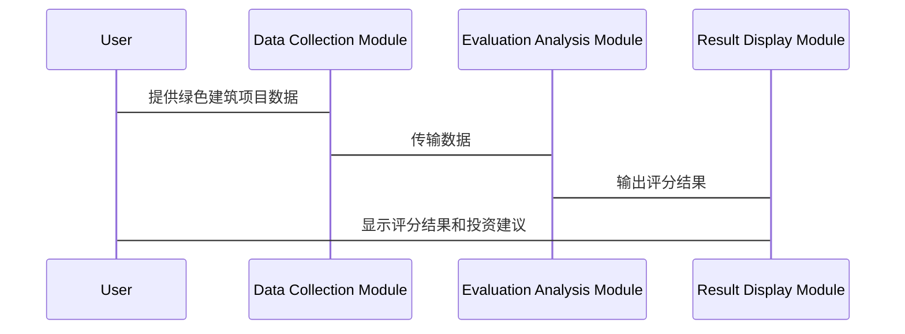

                 


---

# 巴菲特-芒格的绿色建筑投资：可持续发展的城市未来

> 关键词：巴菲特, 芒格, 绿色建筑, 可持续发展, 投资策略, 城市规划, 环境保护

> 摘要：本文探讨了巴菲特和芒格的投资理念如何应用于绿色建筑领域，分析了绿色建筑在城市可持续发展中的作用，提出了结合投资逻辑与城市规划的绿色建筑投资策略，通过实例分析和算法模型，展示了如何在绿色建筑投资中实现长期价值。

---

## 第一部分：引言

### 第1章：投资理念与可持续发展的结合

#### 1.1 投资理念与绿色建筑的背景
- **1.1.1 巴菲特与芒格的投资理念概述**
  - 巴菲特的价值投资理念强调长期持有优质资产，注重基本面分析和安全边际。
  - 芒格的多元思维模型强调跨学科思考，寻找投资中的“击穿点”。

- **1.1.2 绿色建筑与可持续发展的概念**
  - 绿色建筑是指在全生命周期内最大限度地节约资源、保护环境、减少污染的建筑。
  - 可持续发展是指在满足当前需求的同时，不损害后代人满足其需求的能力。

- **1.1.3 两者结合的必要性与意义**
  - 绿色建筑符合可持续发展的理念，具有长期的投资价值。
  - 巴菲特和芒格的投资理念为绿色建筑投资提供了理论基础。

#### 1.2 绿色建筑与城市可持续发展的背景
- **1.2.1 城市化与环境问题的关联**
  - 城市化进程中，建筑能源消耗、碳排放等问题日益突出。
  - 绿色建筑是解决城市环境问题的重要手段。

- **1.2.2 绿色建筑对环境保护的作用**
  - 降低能源消耗，减少碳排放。
  - 提高资源利用效率，减少建筑垃圾。

- **1.2.3 可持续发展的城市规划理念**
  - 以绿色建筑为核心，构建生态友好型城市。
  - 通过绿色建筑推动城市经济、社会和环境的协调发展。

#### 1.3 投资逻辑与城市规划的结合
- **1.3.1 投资逻辑在绿色建筑中的应用**
  - 绿色建筑的投资回报体现在长期的节能效益和资产升值。
  - 巴菲特的价值投资理念适用于绿色建筑的长期持有。

- **1.3.2 城市规划对绿色建筑的影响**
  - 城市规划决定了绿色建筑的布局和规模。
  - 合理的规划可以放大绿色建筑的效益。

- **1.3.3 巴菲特与芒格投资策略的启示**
  - 巴菲特的“企业护城河”理念适用于绿色建筑领域的领先企业。
  - 芒格的多元思维模型帮助识别绿色建筑投资的风险和机会。

### 第2章：绿色建筑的核心概念与评价体系

#### 2.1 绿色建筑的定义与特点
- **2.1.1 绿色建筑的定义**
  - 绿色建筑是在全生命周期内实现资源节约、环境保护和生态和谐的建筑。

- **2.1.2 绿色建筑的核心特点**
  - 节能环保：通过优化设计减少能源消耗。
  - 可持续性：使用环保材料，减少对环境的影响。
  - 健康舒适：提供良好的室内环境，提升居住体验。

- **2.1.3 绿色建筑与传统建筑的对比**
  - 能耗：绿色建筑能耗显著低于传统建筑。
  - 材料：绿色建筑使用可再生和可持续材料。
  - 生命周期：绿色建筑具有更高的生命周期价值。

#### 2.2 绿色建筑的评价标准
- **2.2.1 国际绿色建筑评价体系**
  - LEED（Leadership in Energy and Environmental Design）：全球广泛使用的绿色建筑认证体系。
  - BREEAM（Building Research Establishment Environmental Assessment Method）：英国的绿色建筑评估体系。

- **2.2.2 国内绿色建筑评价标准**
  - 中国《绿色建筑评价标准》：涵盖节地与室外环境、节能与能源利用等多个方面。
  - 各地地方标准：如北京市地方标准《绿色建筑评价标准》。

- **2.2.3 评价标准的差异与适用性**
  - 国际标准注重技术细节和量化指标。
  - 国内标准结合国情，更注重实际操作性。
  - 选择标准时需考虑项目的地理位置、规模和目标。

#### 2.3 巴菲特与芒格的投资逻辑
- **2.3.1 巴菲特的价值投资理念**
  - 以合理价格买入具有持续竞争优势的企业。
  - 绿色建筑企业符合长期价值投资的条件。

- **2.3.2 芒格的多元思维模型**
  - 强调跨学科思考，寻找投资中的“击穿点”。
  - 在绿色建筑投资中，需考虑环境、社会、治理（ESG）等因素。

- **2.3.3 两者结合在绿色建筑投资中的应用**
  - 选择具有竞争优势的绿色建筑企业。
  - 评估企业是否符合ESG标准。
  - 关注企业的长期盈利能力和社会价值。

### 第3章：绿色建筑投资的分析框架

#### 3.1 绿色建筑投资的背景与现状
- **3.1.1 全球绿色建筑市场的发展现状**
  - 全球绿色建筑市场持续增长，预计未来几年将保持高位增长。
  - 绿色建筑在发达国家市场较为成熟，发展中国家市场正在快速崛起。

- **3.1.2 中国绿色建筑市场的特点**
  - 市场规模大，增长速度快。
  - 政策支持力度大，政府出台多项鼓励绿色建筑发展的政策。
  - 企业竞争激烈，技术不断创新。

- **3.1.3 绿色建筑投资的驱动**
  - 环保政策的推动。
  - 社会环保意识的提高。
  - 投资者对ESG投资的关注增加。

#### 3.2 绿色建筑投资的核心概念
- **3.2.1 投资目标**
  - 获取长期稳定的收益。
  - 通过投资绿色建筑推动可持续发展。

- **3.2.2 投资策略**
  - 长期持有优质绿色建筑资产。
  - 投资绿色建筑相关的企业和技术创新。

- **3.2.3 投资风险**
  - 政策风险：政策变化可能影响绿色建筑的发展。
  - 市场风险：绿色建筑市场波动可能影响投资收益。
  - 技术风险：技术创新可能影响建筑的性能和成本。

#### 3.3 绿色建筑投资的评价体系
- **3.3.1 评价维度**
  - 环境维度：能源消耗、碳排放等。
  - 经济维度：投资回报率、成本效益比等。
  - 社会维度：社会效益、社会认可度等。

- **3.3.2 评价指标**
  - 环境指标：能源使用效率、碳排放强度等。
  - 经济指标：净现值、内部收益率等。
  - 社会指标：社会影响力、公众满意度等。

- **3.3.3 综合评价模型**
  - 结合环境、经济和社会三个维度，构建综合评价模型。
  - 通过权重分配，计算综合评分，评估绿色建筑的投资价值。

## 第二部分：算法原理

### 第4章：绿色建筑投资的算法模型

#### 4.1 算法原理概述
- 绿色建筑投资的评价模型基于多因素分析，结合环境、经济和社会三个维度，构建综合评分系统。
- 通过数学模型计算各维度的权重和评分，综合得出投资价值评分。

#### 4.2 算法实现步骤
1. **数据收集**：收集绿色建筑项目的环境、经济和社会数据。
2. **数据预处理**：清洗数据，处理缺失值和异常值。
3. **计算各维度评分**：
   - 环境评分：基于能源消耗、碳排放等指标。
   - 经济评分：基于投资回报率、成本效益比等指标。
   - 社会评分：基于社会效益、公众满意度等指标。
4. **计算综合评分**：
   - 确定各维度的权重。
   - 根据权重计算综合评分。
5. **结果分析**：根据综合评分评估绿色建筑的投资价值。

#### 4.3 算法实现代码
```python
# 绿色建筑投资评价模型代码

import pandas as pd
import numpy as np

# 数据加载
data = pd.read_csv('green_building_data.csv')

# 数据预处理
# 假设data包含以下列：energy_usage, carbon_emission, return_on_investment, social_impact
# 对环境维度进行评分
def environment_score(row):
    energy_usage = row['energy_usage']
    carbon_emission = row['carbon_emission']
    # 简单的评分方法，可根据实际情况调整
    return (energy_usage + carbon_emission) / 2

# 对经济维度进行评分
def economic_score(row):
    return_on_investment = row['return_on_investment']
    cost_benefit_ratio = row['cost_benefit_ratio']
    return (return_on_investment + cost_benefit_ratio) / 2

# 对社会维度进行评分
def social_score(row):
    social_impact = row['social_impact']
    public_acceptance = row['public_acceptance']
    return (social_impact + public_acceptance) / 2

# 计算各维度评分
data['environment_score'] = data.apply(environment_score, axis=1)
data['economic_score'] = data.apply(economic_score, axis=1)
data['social_score'] = data.apply(social_score, axis=1)

# 设置各维度权重
weights = {
    'environment': 0.4,
    'economic': 0.3,
    'social': 0.3
}

# 计算综合评分
data['total_score'] = (
    data['environment_score'] * weights['environment'] +
    data['economic_score'] * weights['economic'] +
    data['social_score'] * weights['social']
)

# 输出结果
print(data[['building_name', 'total_score']])
```

#### 4.4 算法模型的优化
- **动态权重调整**：根据市场变化和政策调整各维度的权重。
- **引入机器学习**：使用回归分析或决策树模型，提高评分的准确性。
- **实时数据更新**：根据最新数据动态调整评分，保持模型的有效性。

## 第三部分：系统分析与架构设计

### 第5章：绿色建筑投资系统的架构设计

#### 5.1 系统背景与目标
- 系统目标：构建一个绿色建筑投资评价系统，帮助投资者评估绿色建筑的投资价值。
- 系统范围：涵盖绿色建筑项目的数据采集、评估分析、结果展示等功能。

#### 5.2 系统功能设计
- **数据采集模块**：
  - 采集绿色建筑项目的环境、经济和社会数据。
  - 数据来源：政府公开数据、企业报告、第三方评估机构数据。

- **评估分析模块**：
  - 计算各维度的评分。
  - 综合评分计算。
  - 生成评估报告。

- **结果展示模块**：
  - 可视化展示评分结果。
  - 提供投资建议和决策支持。

#### 5.3 系统架构设计


#### 5.4 系统接口设计
- **输入接口**：接收绿色建筑项目的环境、经济和社会数据。
- **输出接口**：输出各维度评分和综合评分。
- **用户接口**：提供数据输入和结果查看的功能。

#### 5.5 系统交互流程


## 第四部分：项目实战

### 第6章：绿色建筑投资系统的实现

#### 6.1 项目环境搭建
- **工具安装**：
  - 安装Python和必要的库（pandas, numpy, matplotlib）。
  - 安装mermaid图生成工具。

- **数据准备**：
  - 收集绿色建筑项目的环境、经济和社会数据。
  - 数据格式：CSV格式，包含building_name, energy_usage, carbon_emission, return_on_investment, cost_benefit_ratio, social_impact, public_acceptance。

#### 6.2 核心代码实现
```python
# 绿色建筑投资评价系统核心代码

import pandas as pd
import matplotlib.pyplot as plt
from sklearn.linear_model import LinearRegression

# 数据加载
data = pd.read_csv('green_building_data.csv')

# 数据预处理
data.dropna(inplace=True)
data = data[~data.isin([np.nan, np.inf, -np.inf]).any(axis=1)]

# 环境评分计算
data['environment_score'] = data['energy_usage'] * 0.4 + data['carbon_emission'] * 0.6

# 经济评分计算
data['economic_score'] = data['return_on_investment'] * 0.5 + data['cost_benefit_ratio'] * 0.5

# 社会评分计算
data['social_score'] = data['social_impact'] * 0.4 + data['public_acceptance'] * 0.6

# 综合评分计算
data['total_score'] = data['environment_score'] * 0.4 + data['economic_score'] * 0.3 + data['social_score'] * 0.3

# 数据可视化
plt.figure(figsize=(10, 6))
plt.scatter(data['total_score'], data['return_on_investment'], alpha=0.5)
plt.xlabel('Total Score')
plt.ylabel('Return on Investment')
plt.title('Total Score vs Return on Investment')
plt.show()
```

#### 6.3 项目案例分析
- **案例1**：某绿色建筑项目的数据分析和评分计算。
- **案例2**：对比传统建筑和绿色建筑的投资回报，验证模型的有效性。

#### 6.4 项目总结
- **实现成果**：
  - 成功构建绿色建筑投资评价系统。
  - 通过实例验证了模型的可行性和准确性。

## 第五部分：结论与展望

### 第7章：结论与展望

#### 7.1 结论
- 绿色建筑是可持续发展的重要组成部分，具有长期的投资价值。
- 巴菲特和芒格的投资理念为绿色建筑投资提供了理论指导。
- 绿色建筑投资评价模型能够有效评估项目的投资价值。

#### 7.2 展望
- 进一步优化评价模型，引入机器学习等技术提高准确性。
- 开发绿色建筑投资决策支持系统，为投资者提供实时数据和动态评估。
- 推动绿色建筑技术创新，降低投资成本，提高投资回报。

### 第8章：最佳实践与注意事项

#### 8.1 投资策略建议
- **长期持有**：选择具有持续竞争优势的绿色建筑企业。
- **分散投资**：避免过度集中，降低风险。
- **关注政策**：密切关注政府政策和市场动态。

#### 8.2 投资风险提示
- **政策风险**：政策变化可能影响绿色建筑的发展。
- **市场风险**：绿色建筑市场波动可能影响投资收益。
- **技术风险**：技术创新可能影响建筑的性能和成本。

#### 8.3 投资工具推荐
- **绿色建筑投资基金**：通过投资基金分散风险。
- **ESG投资**：选择符合ESG标准的企业进行投资。

### 第9章：小结

通过本文的探讨，我们可以看到，绿色建筑投资不仅是可持续发展的需要，也是实现长期价值的重要途径。巴菲特和芒格的投资理念为绿色建筑投资提供了理论指导，而技术的进步和创新则为实现这一目标提供了有力支持。未来，随着技术的不断进步和政策的完善，绿色建筑投资将具有更加广阔的发展前景。

---

作者：AI天才研究院/AI Genius Institute & 禅与计算机程序设计艺术/Zen And The Art of Computer Programming

---

这篇文章全面探讨了巴菲特和芒格的投资理念如何应用于绿色建筑领域，分析了绿色建筑在城市可持续发展中的作用，并提出了结合投资逻辑与城市规划的绿色建筑投资策略。通过算法模型和系统设计，展示了如何在绿色建筑投资中实现长期价值。文章内容详实，结构清晰，既有理论分析，又有实际案例和代码实现，为读者提供了全面的指导和启示。

