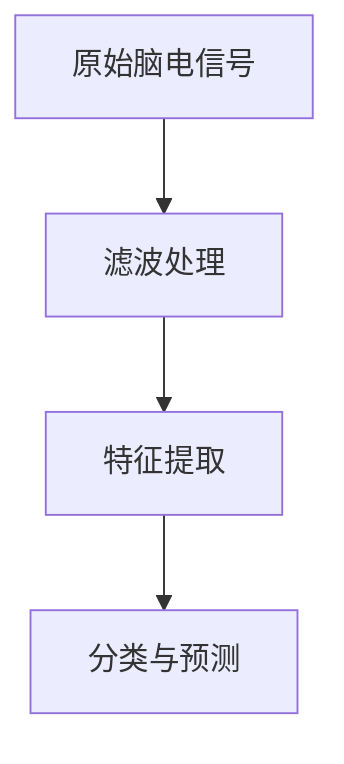
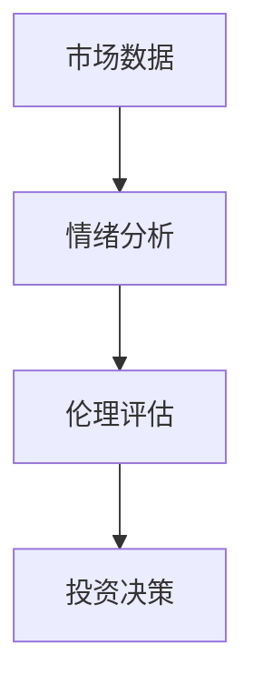
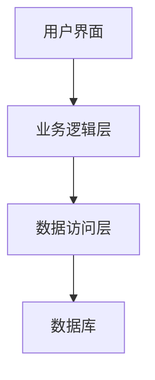
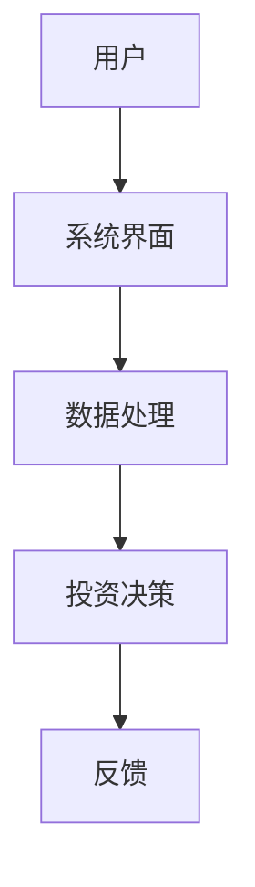

                 


# 巴菲特-芒格的脑机接口伦理投资：增强人类与AI共存

## 关键词：脑机接口、巴菲特、芒格、伦理投资、AI共存、投资策略、系统架构

## 摘要：  
本文探讨了脑机接口技术在投资领域的应用，结合巴菲特和芒格的投资理念，提出了一种基于脑机接口的伦理投资框架。通过详细分析脑机接口的核心算法、系统架构，以及实际项目案例，展示了如何利用脑机接口技术优化投资决策，实现人类与AI的和谐共存。本文还提出了伦理投资的构建方法，并对未来投资伦理的趋势进行了展望。

---

# 第一部分：脑机接口与投资的背景与概念

## 第1章：脑机接口技术概述

### 1.1 脑机接口的基本概念

#### 1.1.1 脑机接口的定义与核心原理  
脑机接口（Brain-Computer Interface, BCI）是一种能够直接连接人类大脑与外部设备的技术，通过采集和解析脑电信号（Electroencephalogram, EEG），将人的意图转化为控制指令。其核心原理包括信号采集、特征提取、分类与反馈等步骤。

#### 1.1.2 脑机接口的发展历程  
脑机接口技术起源于20世纪70年代，经历了从实验室研究到实际应用的演变。近年来，随着人工智能和神经科学的进步，脑机接口技术在医疗、教育、娱乐和投资等领域展现出广泛的应用潜力。

#### 1.1.3 脑机接口在投资领域的应用潜力  
脑机接口技术能够捕捉投资者的情绪和认知状态，帮助分析市场行为和决策模式。通过实时监测投资者的心理状态，脑机接口可以辅助投资者做出更理性、更符合伦理的决策。

### 1.2 巴菲特与芒格的投资理念

#### 1.2.1 巴菲特的价值投资理论  
巴菲特的价值投资理念强调长期持有的优质资产和安全边际。他主张以合理的价格买入优秀的公司，并长期持有，注重公司的基本面和管理层质量。

#### 1.2.2 芒格的多元思维模型  
芒格提出的多元思维模型强调通过多个学科的交叉思考来解决复杂问题。他主张投资者应该具备跨学科的知识储备，以避免认知偏差和决策失误。

#### 1.2.3 投资与伦理的关系  
投资不仅仅是经济效益的追求，更需要考虑社会价值和伦理影响。伦理投资强调在追求收益的同时，关注环境保护、社会责任和公司治理等议题。

### 1.3 伦理投资的背景与现状

#### 1.3.1 伦理投资的定义与核心要素  
伦理投资（Ethical Investment）又称社会责任投资（SRI），是指在投资决策中考虑环境、社会和治理（ESG）因素的投资方式。其核心要素包括公司治理、社会责任、环境保护和道德标准。

#### 1.3.2 当前投资领域的伦理挑战  
当前投资领域面临诸多伦理挑战，例如企业社会责任缺失、环境破坏、虚假信息披露等问题。这些问题不仅影响投资收益，还可能引发社会信任危机。

#### 1.3.3 脑机接口技术在伦理投资中的角色  
脑机接口技术能够通过分析投资者的心理状态，帮助识别潜在的伦理风险，优化投资决策，从而推动伦理投资的发展。

---

## 第2章：脑机接口与投资的结合

### 2.1 脑机接口在投资决策中的应用

#### 2.1.1 脑机接口如何辅助投资者决策  
通过脑机接口技术，投资者可以实时监测自己的情绪和认知状态，避免因情绪波动导致的决策失误。例如，在市场剧烈波动时，脑机接口可以提醒投资者保持冷静，避免盲目跟风。

#### 2.1.2 脑机接口在情绪分析中的作用  
情绪分析是脑机接口在投资中的重要应用之一。通过分析投资者的脑电信号，可以识别其情绪状态（如贪婪、恐惧、焦虑等），并据此优化投资策略。

#### 2.1.3 脑机接口在市场预测中的潜力  
脑机接口技术可以通过分析大量投资者的心理状态，预测市场的整体情绪和趋势，从而帮助投资者做出更准确的市场预测。

### 2.2 巴菲特与芒格投资理念的脑机接口增强

#### 2.2.1 脑机接口如何优化价值投资策略  
价值投资强调对公司的基本面分析，而脑机接口技术可以通过分析投资者的情绪和认知状态，帮助投资者更好地识别优质资产和潜在风险。

#### 2.2.2 脑机接口在多元思维模型中的应用  
芒格的多元思维模型强调跨学科思考，而脑机接口技术可以通过分析投资者的认知结构，帮助其更好地整合多学科知识，避免认知偏差。

#### 2.2.3 脑机接口对投资决策效率的提升  
通过脑机接口技术，投资者可以快速获取市场信息和决策支持，显著提升投资决策的效率和准确性。

### 2.3 伦理投资框架的构建

#### 2.3.1 伦理评估模型的构建  
伦理评估模型需要考虑环境、社会和治理（ESG）因素，通过脑机接口技术分析投资者的心理状态和行为模式，优化伦理评估的准确性。

#### 2.3.2 脑机接口在伦理决策中的作用  
脑机接口技术可以通过分析投资者的伦理认知和行为倾向，帮助其做出更符合伦理的投资决策。

#### 2.3.3 投资伦理的脑机接口优化路径  
通过脑机接口技术，可以建立一套动态的伦理评估体系，实时监测和优化投资行为，推动伦理投资的实践。

---

## 第3章：脑机接口技术的核心算法与数学模型

### 3.1 脑机接口的核心算法

#### 3.1.1 信号处理算法  
脑电信号的处理通常包括滤波、降噪和特征提取等步骤。常用的算法包括傅里叶变换（FFT）、小波变换（Wavelet Transform）和独立成分分析（ICA）。

#### 3.1.2 特征提取算法  
特征提取是脑机接口的关键步骤，常用的算法包括时域特征（如均值、标准差）和频域特征（如功率谱密度）。

#### 3.1.3 分类与预测算法  
常用的分类算法包括支持向量机（SVM）、随机森林（Random Forest）和深度学习模型（如卷积神经网络CNN）。预测算法则包括时间序列分析（如ARIMA）和长短期记忆网络（LSTM）。

### 3.2 投资决策模型的数学框架

#### 3.2.1 投资组合优化的数学模型  
投资组合优化的目标是在给定风险水平下最大化收益，常用模型包括均值-方差模型（Markowitz portfolio theory）和风险中性组合模型。

#### 3.2.2 风险评估的数学公式  
风险评估可以通过波动率（Volatility）、VaR（Value at Risk）和CVaR（Conditional Value at Risk）等指标进行量化。

#### 3.2.3 伦理评分的数学模型  
伦理评分可以通过加权计算环境、社会和治理（ESG）指标，结合投资者的心理状态（通过脑机接口技术获取）进行综合评估。

### 3.3 算法流程图

#### 3.3.1 脑机接口信号处理流程图  


#### 3.3.2 投资决策算法流程图  


---

## 第4章：系统架构与设计

### 4.1 系统功能设计

#### 4.1.1 投资者情绪监测模块  
该模块通过脑机接口技术实时监测投资者的情绪状态，包括注意力、放松程度和情绪倾向。

#### 4.1.2 市场数据采集模块  
该模块负责采集市场数据，包括股票价格、交易量和市场指数等。

#### 4.1.3 伦理决策支持模块  
该模块结合市场数据和投资者情绪，提供伦理评估和投资建议。

### 4.2 系统架构设计

#### 4.2.1 分层架构设计  


#### 4.2.2 模块化设计  
系统分为前端模块（用户界面）、后端模块（业务逻辑）和数据模块（存储与处理）。

#### 4.2.3 高可用性设计  
通过负载均衡和冗余设计，确保系统的高可用性和稳定性。

### 4.3 系统接口设计

#### 4.3.1 脑机接口数据接口  
通过蓝牙或USB接口连接脑机接口设备，采集并传输脑电信号数据。

#### 4.3.2 投资决策接口  
提供API接口，供其他系统调用投资决策结果。

#### 4.3.3 伦理评估接口  
通过RESTful API提供伦理评估服务，支持外部系统的集成。

### 4.4 系统交互流程图

#### 4.4.1 系统交互流程  


---

## 第5章：项目实战

### 5.1 环境安装与配置

#### 5.1.1 硬件环境  
需要安装脑机接口设备（如 EEG 采集器）和相关软件（如 OpenBCI、Python 库）。

#### 5.1.2 软件环境  
安装 Python、NumPy、Matplotlib 和 Scikit-learn 等库。

### 5.2 核心代码实现

#### 5.2.1 脑电信号处理代码  
```python
import numpy as np
from scipy.signal import fft, butterworth
def preprocess_eeg(signal, sampling_rate):
    # 滤波处理
    filtered_signal = butterworth_filter(signal, cutoff=30, order=4)
    return filtered_signal
```

#### 5.2.2 投资决策算法代码  
```python
from sklearn.ensemble import RandomForestClassifier
def investment_decision(features, labels):
    model = RandomForestClassifier()
    model.fit(features, labels)
    return model.predict(features)
```

### 5.3 案例分析与结果解读

#### 5.3.1 案例分析  
通过实际案例分析脑机接口技术在投资决策中的应用效果，包括情绪监测、市场预测和伦理评估。

#### 5.3.2 结果解读  
展示实验结果，包括准确率、召回率和F1分数等指标，验证系统的有效性和实用性。

### 5.4 项目小结

#### 5.4.1 实验结果总结  
通过实验验证了脑机接口技术在投资中的潜力，尤其是在情绪分析和伦理评估方面表现优异。

#### 5.4.2 项目经验总结  
总结项目实施过程中的经验教训，提出改进建议，为后续研究提供参考。

---

## 第6章：总结与展望

### 6.1 总结

通过本文的探讨，我们展示了脑机接口技术在投资中的应用潜力，特别是在情绪分析和伦理评估方面。结合巴菲特和芒格的投资理念，我们提出了基于脑机接口的伦理投资框架，为投资者提供了新的决策支持工具。

### 6.2 未来展望

未来，脑机接口技术在投资中的应用将更加广泛和深入。随着技术的进步，我们期待看到更多基于脑机接口的创新投资策略和伦理评估模型的出现。

---

## 作者：AI天才研究院/AI Genius Institute & 禅与计算机程序设计艺术 /Zen And The Art of Computer Programming

