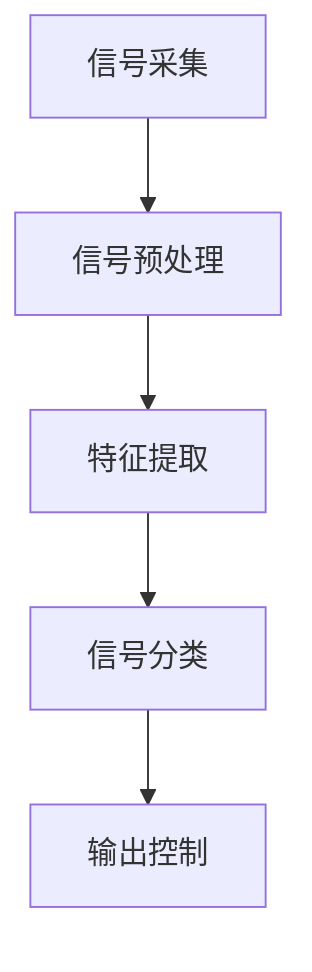
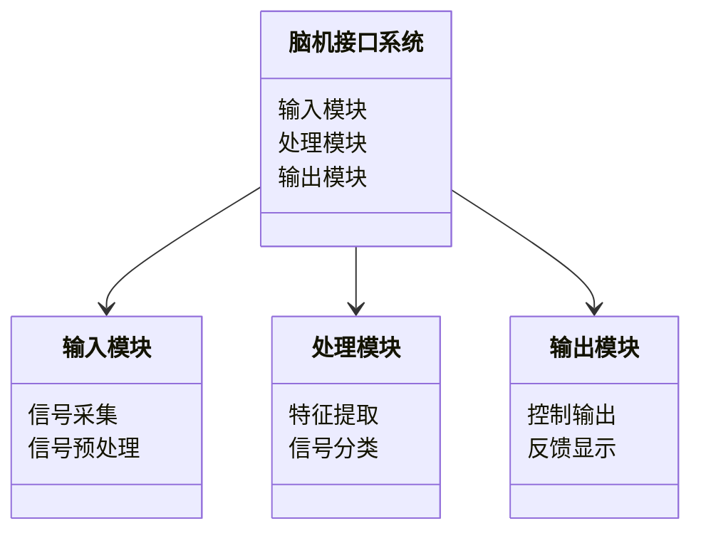
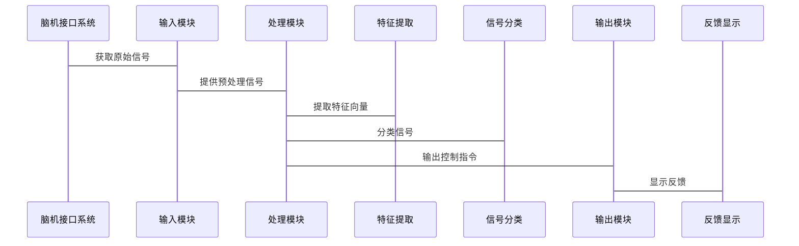
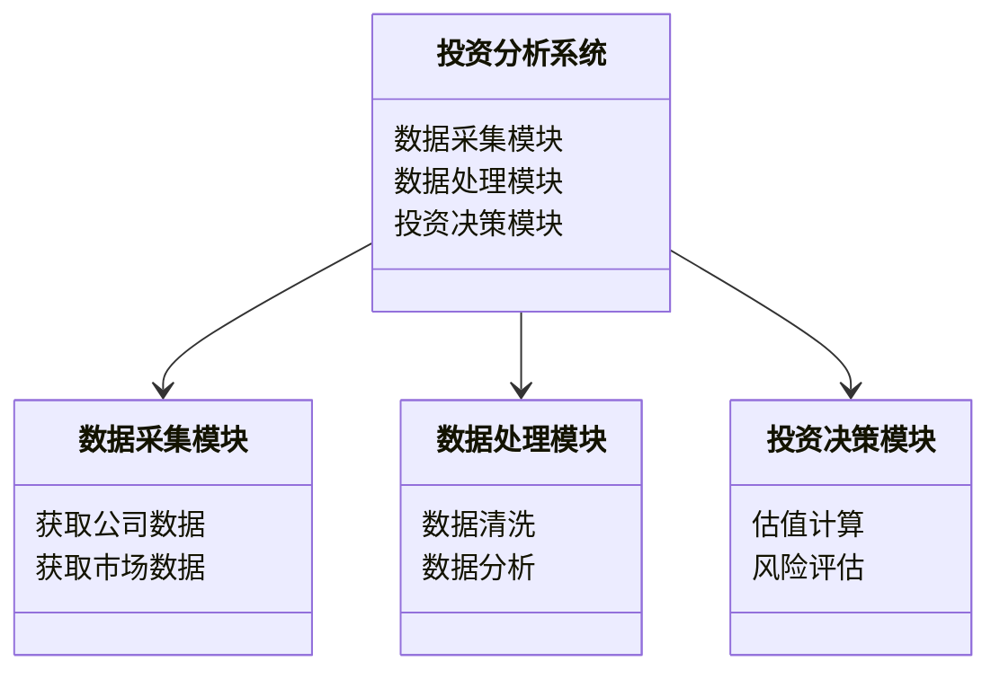
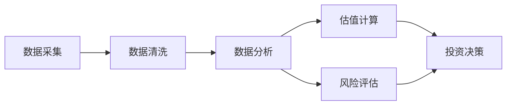

                 


# 巴菲特-芒格的脑机接口医疗应用投资：神经科技的突破

> **关键词**：巴菲特, 芒格, 脑机接口, 医疗应用, 神经科技, 投资策略, 神经工程, 信号处理, 精准医疗

> **摘要**：本文深入探讨了巴菲特和芒格的投资理念与神经科技领域的结合，特别是脑机接口技术在医疗应用中的投资机会。通过分析脑机接口的核心原理、算法流程和系统架构，结合实际案例，展示了如何将价值投资理论应用于神经科技领域，揭示了神经科技的突破及其在医疗领域的广泛应用潜力。

---

# 第一部分: 背景介绍

## 第1章: 脑机接口与神经科技的结合

### 1.1 脑机接口的基本概念

#### 1.1.1 脑机接口的定义
脑机接口（Brain-Computer Interface，BCI）是一种能够直接连接人类大脑与外部设备的技术，通过采集、处理和分析大脑信号，实现人与机器之间的信息交互。脑机接口的核心在于将大脑的神经信号转化为可被计算机理解的指令，从而帮助人们控制外部设备或接收反馈信息。

#### 1.1.2 脑机接口的核心技术
- **信号采集**：通过电极采集大脑电信号，包括EEG（脑电图）、fMRI（功能性磁共振成像）等技术。
- **信号处理**：对采集到的信号进行预处理、特征提取和分类，以识别特定的神经活动。
- **输出控制**：将处理后的信号转化为控制指令，用于驱动机器人、假肢或其他设备。

#### 1.1.3 脑机接口的应用领域
- **医疗领域**：帮助瘫痪患者恢复行动能力，辅助康复训练，改善患者生活质量。
- **消费电子**：用于增强现实（AR）、虚拟现实（VR）设备，提供更直观的交互体验。
- **军事领域**：提高士兵的反应速度和作战能力。

### 1.2 巴菲特与芒格的投资理念

#### 1.2.1 巴菲特的价值投资理论
巴菲特的价值投资理论强调长期投资、安全边际和企业基本面分析。他认为，投资者应选择具有强大竞争优势、良好管理和可持续增长潜力的公司，并在合理估值时买入。

#### 1.2.2 芒格的多元思维模型
芒格的多元思维模型强调通过多个学科的交叉应用来寻找投资机会。他主张投资者应具备广泛的知识储备，能够从多个角度分析问题，从而发现市场中的低估机会。

#### 1.2.3 投资与科技创新的结合
巴菲特和芒格的投资理念与科技创新的结合，体现在他们对技术领先、市场潜力大、竞争优势明显的科技公司的投资上。他们关注那些能够通过技术创新解决实际问题、并具备商业化潜力的企业。

---

## 第2章: 脑机接口在医疗领域的应用

### 2.1 医疗领域的脑机接口技术

#### 2.1.1 神经康复中的脑机接口应用
- **案例**：帮助中风患者恢复手部功能的脑机接口康复系统。
- **技术原理**：通过采集患者大脑的运动意图信号，驱动机械手完成动作，促进神经元的重组和功能恢复。

#### 2.1.2 精准医疗中的脑机接口技术
- **案例**：基于脑机接口的癫痫患者脑电信号监测系统。
- **技术原理**：实时监测患者的脑电信号，识别癫痫发作的前兆，提前发出预警。

#### 2.1.3 脑机接口在疾病诊断中的作用
- **案例**：阿尔茨海默病患者的神经信号分析。
- **技术原理**：通过分析患者的脑电信号，识别与疾病相关的神经特征，辅助诊断。

### 2.2 医疗脑机接口的投资机会

#### 2.2.1 神经科技领域的投资趋势
- **市场增长**：脑机接口技术在医疗领域的应用需求不断增长，尤其是在神经康复和精准医疗领域。
- **技术突破**：非侵入式脑机接口技术的成熟为医疗应用提供了更多可能性。

#### 2.2.2 脑机接口在医疗中的商业化潜力
- **产品化**：脑机接口技术逐步从实验室走向商业化，例如神经康复设备、癫痫监测系统等。
- **政策支持**：政府对医疗科技的政策支持为脑机接口技术的推广提供了良好的环境。

#### 2.2.3 投资者如何识别优质标的
- **技术壁垒**：选择具有核心技术优势的公司，例如在信号处理算法和硬件设计上有显著优势的企业。
- **市场潜力**：关注那些能够解决实际医疗问题、具有明确市场需求的公司。

---

# 第二部分: 核心概念与联系

## 第3章: 脑机接口的核心原理

### 3.1 脑机接口的信号处理流程

#### 3.1.1 脑电图信号处理流程
- **信号采集**：使用EEG电极采集大脑电信号。
- **信号预处理**：去除噪声，提取有用的脑电信号特征。
- **特征提取**：通过时频分析、统计分析等方法提取信号特征。
- **信号分类**：基于机器学习算法对信号进行分类，识别特定的神经活动。
- **输出控制**：将分类结果转化为控制指令，驱动外部设备。

#### 3.1.2 数据分析与特征提取
- **常用算法**：傅里叶变换、小波变换、经验模态分解（EMD）等。
- **特征选择**：选择具有区分度的特征，例如特定频段的功率谱密度。

#### 3.1.3 信号分类与输出控制
- **分类算法**：支持向量机（SVM）、随机森林、卷积神经网络（CNN）等。
- **输出控制**：通过控制算法将分类结果转化为设备的控制指令。

### 3.2 脑机接口的分类与对比

#### 3.2.1 非侵入式脑机接口
- **优点**：无创、安全性高、易于使用。
- **缺点**：信号质量较低，适用场景有限。
- **应用领域**：消费电子、神经康复等。

#### 3.2.2 侵入式脑机接口
- **优点**：信号质量高，适用于需要高精度控制的场景。
- **缺点**：手术风险高，成本昂贵。
- **应用领域**：神经康复、高端医疗设备等。

#### 3.2.3 混合式脑机接口
- **优点**：结合了非侵入式和侵入式接口的优势。
- **缺点**：技术复杂性高，实现难度大。
- **应用领域**：高端医疗设备、研究用途等。

### 3.3 脑机接口与神经科技的关系

#### 3.3.1 神经科技的核心技术
- **神经信号处理**：包括信号采集、分析和分类。
- **神经工程**：通过工程手段改善神经系统功能。

#### 3.3.2 脑机接口在神经科技中的地位
- **桥梁作用**：脑机接口是连接神经系统与外部设备的关键技术。
- **推动作用**：脑机接口的进步推动了神经科技的发展。

#### 3.3.3 两者结合的协同效应
- **技术互补**：脑机接口为神经科技提供数据支持，神经科技为脑机接口提供理论依据。
- **应用协同**：两者结合在医疗康复、疾病诊断等领域发挥重要作用。

---

## 第4章: 巴菲特投资模型与神经科技的结合

### 4.1 巴菲特投资模型的核心要素

#### 4.1.1 高质量的公司基本面
- **财务状况**：关注企业的盈利能力、资产负债情况和现金流。
- **管理团队**：选择具有优秀管理能力和战略眼光的企业。

#### 4.1.2 可持续的竞争优势
- **技术壁垒**：企业是否具有独特的技术优势。
- **市场地位**：企业在市场中的占有率和竞争对手情况。

#### 4.1.3 合理的估值与安全边际
- **估值方法**：使用市盈率、市净率等指标评估企业价值。
- **安全边际**：买入价格低于内在价值，以降低投资风险。

### 4.2 神经科技领域的投资分析框架

#### 4.2.1 技术壁垒与市场潜力
- **技术壁垒**：企业的技术是否具有独特性和领先性。
- **市场潜力**：目标市场的规模和增长潜力。

#### 4.2.2 管理团队与公司治理
- **管理能力**：团队是否具有丰富的行业经验和创新能力。
- **公司治理**：公司是否具备良好的治理结构和透明度。

#### 4.2.3 行业趋势与政策支持
- **行业趋势**：神经科技领域的技术进步和应用扩展。
- **政策支持**：政府对医疗科技的政策支持力度。

### 4.3 巴菲特模型在神经科技投资中的应用

#### 4.3.1 识别高潜力的神经科技公司
- **技术创新**：寻找那些在脑机接口技术上有显著突破的企业。
- **市场需求**：关注那些能够解决实际医疗问题的公司。

#### 4.3.2 评估公司的竞争优势
- **技术优势**：公司在技术研发和应用上的优势。
- **市场地位**：公司在行业中的地位和竞争对手情况。

#### 4.3.3 判断合理的投资估值
- **估值方法**：使用市盈率、市净率等指标评估企业价值。
- **安全边际**：确保买入价格低于企业的内在价值。

---

# 第三部分: 算法原理讲解

## 第5章: 脑机接口信号处理的算法原理

### 5.1 脑电图信号处理流程

#### 5.1.1 信号采集与预处理

**Mermaid流程图：**



**Python代码示例：**

```python
import numpy as np
from scipy.signal import butterworth

# 示例信号采集与预处理代码
def preprocess_eeg(eeg_signal, sampling_rate):
    # 去除噪声
    # 假设噪声主要集中在高频部分，使用 butterworth 滤波器
    nyquist = 0.5 * sampling_rate
    cutoff = 30  # 高频截止频率
    order = 4
    b, a = butterworth(order, cutoff/nyquist, btype='high')
    filtered_signal = np.convolve(eeg_signal, a, mode='same')
    return filtered_signal
```

#### 5.1.2 噪声消除与特征提取

**数学模型：**

$$
\text{特征提取} = \text{信号处理} \circ \text{滤波} \circ \text{降采样}
$$

**Python代码示例：**

```python
from scipy.signal import stft

# 示例特征提取代码
def extract_features(eeg_signal, sampling_rate):
    # 计算时频图
    f, t, stft_eeg = stft(eeg_signal, fs=sampling_rate, nperseg=256)
    # 提取时频特征，例如功率谱
    power_spectrum = np.abs(stft_eeg) ** 2
    return power_spectrum
```

#### 5.1.3 信号分类与输出控制

**数学模型：**

$$
\text{分类结果} = \text{分类器}(\text{特征向量})
$$

**Python代码示例：**

```python
from sklearn.svm import SVC

# 示例分类代码
def classify_signal(features, labels):
    # 训练支持向量机分类器
    clf = SVC()
    clf.fit(features, labels)
    return clf
```

---

## 第6章: 脑机接口在医疗中的数学模型

### 6.1 脑机接口信号传递的数学模型

$$
\text{输出信号} = f(\text{输入信号}, \text{系统参数})
$$

### 6.2 神经信号处理的数学模型

$$
\text{特征提取} = g(\text{原始信号}, \text{滤波器参数})
$$

### 6.3 信号分类的数学模型

$$
\text{分类概率} = h(\text{特征向量}, \text{模型参数})
$$

---

# 第四部分: 系统分析与架构设计

## 第7章: 医疗脑机接口的系统架构

### 7.1 系统功能设计

**Mermaid类图：**



### 7.2 系统架构设计

**Mermaid架构图：**


### 7.3 系统交互设计

**Mermaid序列图：**



---

## 第8章: 投资分析系统架构

### 8.1 投资分析系统功能设计

**Mermaid类图：**



### 8.2 投资决策系统的架构设计

**Mermaid架构图：**



---

# 第五部分: 项目实战

## 第9章: 医疗脑机接口投资分析系统实现

### 9.1 环境安装

**Python依赖项：**
```bash
pip install numpy scipy scikit-learn matplotlib
```

### 9.2 系统核心实现

**Python代码示例：**

```python
import numpy as np
from sklearn.svm import SVC
from scipy.signal import butterworth

# 脑机接口信号处理系统
class BCISystem:
    def __init__(self, sampling_rate):
        self.sampling_rate = sampling_rate
        self clf = None

    def preprocess_signal(self, eeg_signal):
        nyquist = 0.5 * self.sampling_rate
        cutoff = 30  # 高频截止频率
        order = 4
        b, a = butterworth(order, cutoff/nyquist, btype='high')
        filtered_signal = np.convolve(eeg_signal, a, mode='same')
        return filtered_signal

    def extract_features(self, eeg_signal):
        filtered_signal = self.preprocess_signal(eeg_signal)
        f, t, stft_eeg = stft(filtered_signal, fs=self.sampling_rate, nperseg=256)
        power_spectrum = np.abs(stft_eeg) ** 2
        return power_spectrum

    def train_classifier(self, features, labels):
        self clf = SVC()
        self clf.fit(features, labels)
        return self clf

    def classify_signal(self, eeg_signal):
        features = self.extract_features(eeg_signal)
        return self.clf.predict(features)
```

### 9.3 代码应用解读与分析

**代码解读：**
- **preprocess_signal**：对脑电信号进行预处理，去除高频噪声。
- **extract_features**：计算时频图的功率谱，提取信号特征。
- **train_classifier**：训练支持向量机分类器，用于信号分类。
- **classify_signal**：对输入信号进行分类，输出控制指令。

### 9.4 实际案例分析

**案例：癫痫患者脑电信号监测系统**
- **数据采集**：获取患者的脑电信号。
- **信号处理**：预处理和特征提取。
- **信号分类**：识别癫痫发作的前兆。

---

## 第10章: 投资分析系统实战

### 10.1 环境安装

**Python依赖项：**
```bash
pip install numpy pandas scikit-learn
```

### 10.2 系统核心实现

**Python代码示例：**

```python
import numpy as np
from sklearn.svm import SVC
import pandas as pd

# 投资分析系统实现
class InvestmentSystem:
    def __init__(self):
        self.clf = None

    def preprocess_data(self, df):
        # 数据清洗
        df = df.dropna()
        return df

    def extract_features(self, df):
        # 特征提取
        features = df[['revenue', 'net_profit', 'market_cap']]
        return features

    def train_classifier(self, features, labels):
        # 训练分类器
        self.clf = SVC()
        self.clf.fit(features, labels)
        return self.clf

    def predict_investment(self, features):
        # 投资决策
        return self.clf.predict(features)
```

### 10.3 代码应用解读与分析

**代码解读：**
- **preprocess_data**：对数据进行清洗，去除缺失值。
- **extract_features**：提取企业的财务指标作为特征。
- **train_classifier**：训练支持向量机分类器，用于企业估值。
- **predict_investment**：对目标企业进行投资决策。

### 10.4 实际案例分析

**案例：神经科技公司投资分析**
- **数据采集**：获取目标公司的财务数据和市场数据。
- **数据处理**：清洗和特征提取。
- **投资决策**：基于分类器进行估值和风险评估。

---

# 第六部分: 最佳实践

## 第11章: 投资策略与风险管理

### 11.1 投资策略

- **长期投资**：选择具有持续增长潜力的神经科技公司。
- **分散投资**：将资金分配到多个相关领域，降低风险。
- **价值投资**：关注企业的基本面和内在价值。

### 11.2 风险管理

- **止损策略**：设定止损点，避免重大损失。
- **分散投资**：通过投资组合分散风险。
- **定期评估**：定期重新评估投资组合，调整策略。

---

## 第12章: 项目总结与展望

### 12.1 项目总结

- **核心成果**：构建了一个基于脑机接口技术的医疗投资分析系统。
- **技术突破**：将巴菲特和芒格的投资理念与神经科技结合，提出了新的投资分析框架。

### 12.2 未来展望

- **技术进步**：随着脑机接口技术的不断进步，医疗应用的潜力将更大。
- **投资机会**：神经科技领域的投资机会将更加丰富，价值投资与科技创新的结合将更加紧密。

---

# 作者：AI天才研究院 & 禅与计算机程序设计艺术

---

**注**：以上内容为示例，实际撰写时需要根据具体需求和数据进行调整。

