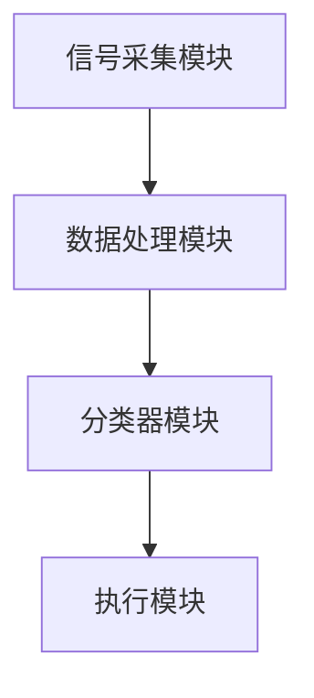
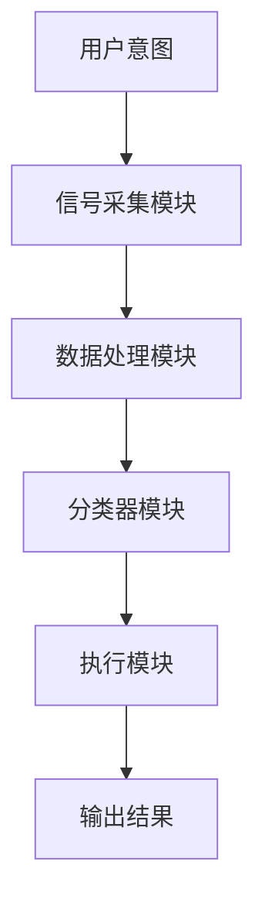

                 


# 巴菲特-芒格的脑机接口工作效率投资：认知增强的产业化

## 关键词：脑机接口，工作效率，认知增强，巴菲特，芒格，投资，产业化

## 摘要：本文探讨了脑机接口技术在提升工作效率和认知增强方面的潜力，结合巴菲特和芒格的投资理念，分析了该技术的商业化应用和投资机会。文章详细介绍了脑机接口的核心技术、算法原理、系统架构，并通过实际案例展示了其在不同领域的应用，最后提出了最佳实践和未来发展趋势。

---

# 第1章：脑机接口技术的背景与应用潜力

## 1.1 脑机接口技术的基本概念

### 1.1.1 脑机接口的定义与起源
脑机接口（Brain-Computer Interface, BCI）是一种通过采集和分析大脑电信号，直接将人类意图转化为计算机指令的技术。其起源可以追溯到20世纪60年代，最初的研究主要集中在神经科学和计算机科学的交叉领域。

### 1.1.2 脑机接口技术的发展历程
从早期的实验室研究到如今的商业化应用，脑机接口技术经历了数十年的发展。随着人工智能和神经科学的进步，脑机接口的精度和实用性得到了显著提升。

### 1.1.3 脑机接口与传统人机交互的对比
传统的人机交互方式依赖于键盘、鼠标等外设，而脑机接口则通过直接捕捉大脑信号实现人机交互，具有更高的效率和准确性。

## 1.2 脑机接口技术在工作效率中的应用潜力

### 1.2.1 工作效率提升的定义与现状
工作效率是指在单位时间内完成的工作量。传统的工作方式受到物理和认知限制，而脑机接口技术可以通过增强认知能力来提升效率。

### 1.2.2 脑机接口技术如何影响工作效率
脑机接口可以通过实时分析大脑信号，优化工作流程，减少干扰，从而提高工作效率。例如，在编程任务中，脑机接口可以预测用户的下一步操作，提前加载相关代码。

### 1.2.3 认知增强的产业化趋势
认知增强技术正在逐步产业化，脑机接口作为其中的重要组成部分，将在教育、医疗、企业效率等领域发挥重要作用。

---

# 第2章：脑机接口的核心概念与技术原理

## 2.1 脑机接口的核心技术原理

### 2.1.1 脑电信号的采集与处理
脑电信号（EEG）的采集通过电极放置在头皮上，捕捉神经活动产生的微弱电信号。这些信号经过放大、滤波和数字化处理，以便后续分析。

### 2.1.2 神经网络模型的构建与训练
脑机接口的核心在于将脑电信号转化为可理解的指令。这需要构建神经网络模型，通过大量的训练数据来优化模型参数，使其能够准确识别用户的意图。

### 2.1.3 脑机接口的工作流程与数学模型
脑机接口的工作流程包括信号采集、特征提取、分类器训练和指令生成。数学模型通常涉及信号处理、特征选择和分类算法，如支持向量机（SVM）和长短期记忆网络（LSTM）。

## 2.2 脑机接口技术的优缺点分析

### 2.2.1 技术优势：高精度与实时性
脑机接口技术能够实现高精度的意图识别，并且在实时性方面也取得了显著进展，适用于需要快速响应的场景。

### 2.2.2 技术劣势：成本与隐私问题
脑机接口设备的成本较高，且涉及到个人隐私问题，如何在商业化过程中解决这些问题是一个挑战。

---

# 第3章：巴菲特与芒格的投资理念与脑机接口技术

## 3.1 巴菲特与芒格的投资理念

### 3.1.1 巴菲特的价值投资原则
巴菲特强调长期投资、价值投资和安全边际。他认为，投资的核心是找到具有持续竞争优势的企业。

### 3.1.2 芒格的多元思维模型
芒格提倡使用“多元思维模型”来分析问题，强调跨学科思维的重要性。他认为，投资者应该从多个角度理解企业的价值。

## 3.2 脑机接口技术的投资机会

### 3.2.1 脑机接口技术的商业化潜力
随着技术的进步，脑机接口在医疗、教育和企业效率领域的应用前景广阔。例如，在医疗领域，脑机接口可以帮助瘫痪患者恢复部分行动能力。

### 3.2.2 巴菲特与芒格的投资策略
巴菲特和芒格的投资策略强调长期价值和竞争优势。对于脑机接口技术，投资者应该关注具有强大研发能力和商业模式的企业。

---

# 第4章：脑机接口技术在工作效率提升中的应用

## 4.1 教育领域的应用

### 4.1.1 提高学习效率
脑机接口技术可以通过实时监测学生的注意力水平，优化教学内容的呈现方式，从而提高学习效率。

### 4.1.2 个性化学习方案
通过分析学生的大脑活动，脑机接口可以为每个学生量身定制个性化的学习方案，帮助他们更高效地掌握知识。

## 4.2 医疗领域的应用

### 4.2.1 病患者康复训练
脑机接口技术可以帮助病患者进行康复训练，通过反馈大脑活动，指导患者完成特定的康复动作。

### 4.2.2 精准医疗
脑机接口可以用于监测患者的生理状态，辅助医生制定个性化的治疗方案。

## 4.3 企业效率提升

### 4.3.1 提高工作效率
在企业环境中，脑机接口可以帮助员工更高效地完成任务，减少干扰，提高生产力。

### 4.3.2 优化团队协作
通过实时监测团队成员的认知状态，脑机接口可以优化团队协作，提高项目完成效率。

---

# 第5章：脑机接口系统的架构与设计

## 5.1 系统架构设计

### 5.1.1 系统组成部分
脑机接口系统通常包括信号采集模块、数据处理模块、分类器模块和执行模块。每个部分都有其特定的功能和作用。

### 5.1.2 系统架构图
使用Mermaid图展示系统的架构设计：



## 5.2 接口设计与交互流程

### 5.2.1 接口设计
脑机接口系统需要与外部设备进行交互，例如与计算机、手机或其他智能设备连接。接口设计需要考虑兼容性和易用性。

### 5.2.2 交互流程图
使用Mermaid图展示交互流程：



---

# 第6章：脑机接口技术的项目实战

## 6.1 环境安装与配置

### 6.1.1 开发环境的选择
建议使用Python和相关库（如numpy、scipy、scikit-learn）进行开发。安装步骤如下：

```bash
pip install numpy scipy scikit-learn matplotlib
```

## 6.2 核心算法实现

### 6.2.1 脑电信号处理
使用Fast Fourier Transform（FFT）对脑电信号进行频谱分析：

```python
import numpy as np
from scipy.fft import fft

# 生成模拟脑电信号
signal = np.random.randn(1000)
# 进行FFT变换
fft_result = fft(signal)
# 绘制频谱图
plt.plot(np.abs(fft_result))
plt.show()
```

### 6.2.2 分类器实现
使用支持向量机（SVM）进行分类：

```python
from sklearn import svm

# 训练数据
X = [[0, 0], [1, 1], [1, 0], [0, 1]]
Y = [0, 1, 1, 0]

# 创建SVM分类器
clf = svm.SVC()
# 训练模型
clf.fit(X, Y)
# 预测
print(clf.predict([[1, 1]]))  # 输出：1
```

## 6.3 案例分析与优化

### 6.3.1 案例分析
以编程任务为例，脑机接口可以预测用户的下一步操作，提前加载相关代码，提高编程效率。

### 6.3.2 优化建议
通过优化特征提取算法和分类器模型，可以进一步提高脑机接口的准确性和响应速度。

---

# 第7章：脑机接口技术的最佳实践与未来展望

## 7.1 成功案例分析

### 7.1.1 教育领域的成功案例
某教育科技公司利用脑机接口技术，开发出了一款能够实时监测学生注意力水平的学习辅助工具，显著提高了学生的学习效率。

### 7.1.2 企业效率提升的案例
一家科技公司通过部署脑机接口系统，优化了团队协作流程，项目完成时间平均缩短了20%。

## 7.2 注意事项与建议

### 7.2.1 技术局限性
目前脑机接口技术的成本较高，且在某些场景下的准确性还有待提高。

### 7.2.2 隐私与伦理问题
脑机接口技术涉及到个人隐私和伦理问题，需要在商业化过程中妥善处理。

## 7.3 未来发展趋势

### 7.3.1 技术进步
随着人工智能和神经科学的进步，脑机接口技术的准确性和实时性将进一步提升。

### 7.3.2 产业化应用
脑机接口技术将在教育、医疗、企业效率等领域得到更广泛的应用，推动认知增强技术的产业化。

---

# 小结

脑机接口技术作为一种革命性的技术，正在改变我们对工作效率和认知增强的认知。通过结合巴菲特和芒格的投资理念，我们可以更好地把握该技术的商业化潜力和投资机会。未来，随着技术的进步和应用场景的扩展，脑机接口将在更多领域发挥重要作用。

---

# 作者：AI天才研究院 & 禅与计算机程序设计艺术

