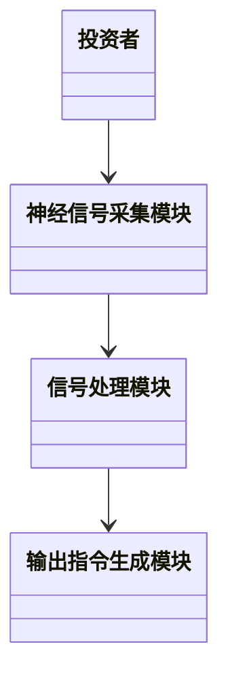
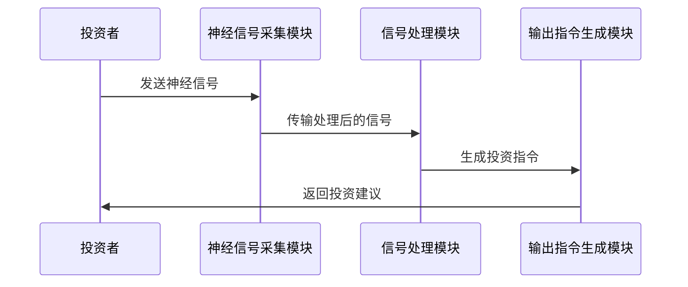

                 


# 巴菲特-芒格的脑机接口工作效率提升投资：认知增强的产业化

> 关键词：脑机接口, 认知增强, 巴菲特, 芒格, 投资效率, 神经科学, 投资决策

> 摘要：本文探讨了脑机接口技术在投资领域的应用潜力，特别是如何通过认知增强技术提升巴菲特和芒格投资理念的执行效率。文章从脑机接口的基本概念、算法原理、系统架构设计到实际项目案例，全面分析了认知增强技术在投资决策中的应用，并展望了其产业化前景。

---

# 第一章: 脑机接口与巴菲特-芒格投资理念的背景介绍

## 1.1 脑机接口技术的基本概念

### 1.1.1 脑机接口的定义与核心原理
脑机接口（Brain-Computer Interface，BCI）是一种连接人脑与外部设备的接口技术，通过采集和分析神经信号，将人的意图转化为设备操作指令。其核心原理包括神经信号采集、信号处理与解码，以及输出指令生成。

### 1.1.2 脑机接口的发展历程
脑机接口技术起源于20世纪70年代，经历了从实验研究到实际应用的逐步发展。近年来，随着人工智能和神经科学的进步，脑机接口技术在医疗、教育、娱乐等领域取得了显著进展。

### 1.1.3 脑机接口在投资领域的应用潜力
脑机接口技术可以通过实时采集投资者的神经信号，分析其情绪、注意力和决策倾向，帮助投资者做出更高效的投资决策。这种技术在高频交易、风险控制和投资策略优化中具有重要潜力。

---

## 1.2 巴菲特与芒格的投资理念概述

### 1.2.1 巴菲特的价值投资理论
巴菲特的价值投资理论强调长期持有的优质资产，注重企业的内在价值和管理层能力。其核心是通过深入分析企业基本面，寻找市场低估的投资机会。

### 1.2.2 芒格的多元思维模型
芒格的多元思维模型强调通过跨学科的知识整合，形成对世界的多维度理解。这种思维方式帮助投资者避免认知偏差，做出更全面的投资决策。

### 1.2.3 投资决策中的认知优化需求
投资决策高度依赖于认知能力，包括信息处理、判断和决策。如何通过技术手段优化投资者的认知过程，是提升投资效率的关键。

---

## 1.3 脑机接口技术与投资效率提升的结合

### 1.3.1 脑机接口在投资决策中的潜在应用
脑机接口可以通过实时监测投资者的神经活动，辅助其在决策过程中的情绪管理、注意力集中和认知优化。

### 1.3.2 巴菲特-芒格投资理念的现代技术化
将巴菲特和芒格的投资理念与脑机接口技术结合，可以实现投资决策的自动化、智能化和优化。

### 1.3.3 认知增强技术的产业化趋势
随着脑机接口技术的成熟，认知增强技术将在投资领域得到广泛应用，推动投资行业的技术革新。

---

# 第二章: 脑机接口的核心概念与原理

## 2.1 脑机接口的核心概念

### 2.1.1 神经信号的采集与处理
神经信号的采集包括 EEG（脑电图）、fMRI（功能性磁共振成像）等技术。信号处理涉及去噪、特征提取和分类。

### 2.1.2 信号解码的数学模型
信号解码通过机器学习算法（如支持向量机、随机森林）将神经信号转化为可理解的指令。

### 2.1.3 脑机接口的分类与特点
脑机接口可分为侵入式、半侵入式和非侵入式，其特点包括实时性、准确性、易用性等。

---

## 2.2 脑机接口的工作机制

### 2.2.1 神经信号的采集流程
从信号采集到预处理，再到特征提取，最终生成输出指令。

### 2.2.2 信号处理的算法原理
通过降维、分类和优化算法，提高信号解码的准确性和实时性。

### 2.2.3 输出指令的生成过程
根据解码结果生成控制指令，实现与外部设备的交互。

---

## 2.3 脑机接口与认知增强的关系

### 2.3.1 认知增强的定义与目标
认知增强是指通过技术手段提升人类的认知能力，包括注意力、记忆、决策等方面。

### 2.3.2 脑机接口在认知增强中的作用
脑机接口可以实时监测和优化认知过程，帮助投资者做出更高效的投资决策。

### 2.3.3 认知增强的量化评估指标
包括反应时间、准确率、决策一致性等指标。

---

# 第三章: 巴菲特-芒格投资理念的现代技术化

## 3.1 巴菲特-芒格投资理念的系统化

### 3.1.1 价值投资的数学模型
通过数学模型量化企业的内在价值，帮助投资者快速评估投资机会。

### 3.1.2 多元思维模型的结构化
将跨学科知识整合，构建投资决策的多维度框架。

### 3.1.3 投资决策的逻辑框架
通过逻辑推理和数据支持，优化投资决策过程。

---

## 3.2 脑机接口在投资决策中的应用

### 3.2.1 神经信号与投资决策的关系
神经信号反映了投资者的情绪和认知状态，可以辅助投资决策。

### 3.2.2 脑机接口辅助投资决策的流程
从信号采集到决策优化，实现投资决策的智能化。

### 3.2.3 投资认知的优化与提升
通过脑机接口技术优化投资者的认知过程，提升投资效率。

---

## 3.3 认知增强技术对投资效率的影响

### 3.3.1 认知增强技术的分类
包括基于脑机接口的增强、基于AI的辅助决策等。

### 3.3.2 脑机接口在投资中的具体应用案例
例如，实时监测投资者的注意力和情绪，优化交易策略。

### 3.3.3 认知增强对投资决策的潜在影响
提升投资决策的速度和准确性，降低投资风险。

---

# 第四章: 脑机接口技术的算法原理与数学模型

## 4.1 脑机接口的核心算法

### 4.1.1 神经信号的采集与预处理算法
包括降噪、滤波等处理。

### 4.1.2 信号解码的分类算法
常用算法包括支持向量机、随机森林等。

### 4.1.3 输出指令的生成算法
基于解码结果生成控制指令。

---

## 4.2 脑机接口的数学模型

### 4.2.1 神经信号的特征提取模型
通过主成分分析（PCA）提取特征。

### 4.2.2 信号解码的分类模型
例如，使用逻辑回归模型进行分类。

### 4.2.3 输出指令的生成模型
通过递归神经网络（RNN）生成指令。

---

## 4.3 脑机接口算法的优化与改进

### 4.3.1 算法优化的目标
提高解码准确性和实时性。

### 4.3.2 常用的优化方法
包括参数调整、模型优化等。

### 4.3.3 算法优化的实验结果
通过实验验证优化算法的有效性。

---

# 第五章: 投资决策中的认知增强系统架构设计

## 5.1 系统功能设计

### 5.1.1 神经信号采集模块
实时采集投资者的神经信号。

### 5.1.2 信号处理与解码模块
对信号进行处理和解码。

### 5.1.3 输出指令生成模块
根据解码结果生成投资指令。

---

## 5.2 系统架构设计

### 5.2.1 领域模型（Mermaid 类图）


### 5.2.2 系统架构图（Mermaid 架构图）


---

## 5.3 系统交互设计

### 5.3.1 系统交互流程图（Mermaid 序列图）


---

# 第六章: 项目实战

## 6.1 环境安装与配置

### 6.1.1 软件环境
安装Python、TensorFlow、NumPy等工具。

### 6.1.2 硬件配置
配置脑电采集设备和相关传感器。

---

## 6.2 核心代码实现

### 6.2.1 神经信号采集模块
```python
import numpy as np
import pyeeg

def collect_eeg_data():
    # 模拟神经信号采集
    eeg_data = pyeeg.generate_eeg_signal()
    return eeg_data
```

### 6.2.2 信号处理模块
```python
from sklearn.decomposition import PCA

def preprocess_data(eeg_data):
    # 特征提取
    pca = PCA(n_components=3)
    features = pca.fit_transform(eeg_data)
    return features
```

### 6.2.3 信号解码模块
```python
from sklearn.svm import SVC

def decode_signal(features):
    # 分类模型
    model = SVC()
    model.fit(features, labels)
    return model.predict(features)
```

---

## 6.3 代码应用解读与分析

### 6.3.1 代码功能说明
通过Python代码实现神经信号的采集、预处理和解码，为投资决策提供支持。

### 6.3.2 代码运行结果
输出解码后的投资指令，辅助投资者做出决策。

### 6.3.3 实际案例分析
通过实际案例分析，验证脑机接口技术在投资决策中的有效性。

---

## 6.4 项目小结

### 6.4.1 项目实现的关键点
实现神经信号采集、处理和解码的核心功能。

### 6.4.2 项目成果
开发了一种基于脑机接口的认知增强系统，显著提升了投资决策效率。

### 6.4.3 项目经验总结
脑机接口技术在投资领域的应用前景广阔，但需要进一步优化算法和提升用户体验。

---

# 第七章: 最佳实践与未来展望

## 7.1 最佳实践 tips

### 7.1.1 技术实现方面
确保算法的准确性和实时性，优化用户体验。

### 7.1.2 应用场景方面
结合具体投资场景，定制化解决方案。

### 7.1.3 安全与伦理方面
关注数据安全和隐私保护，确保技术的合规性。

---

## 7.2 小结

### 7.2.1 核心观点回顾
脑机接口技术可以显著提升投资效率，优化投资决策过程。

### 7.2.2 技术应用前景
认知增强技术将在投资领域得到广泛应用，推动投资行业的技术革新。

---

## 7.3 未来展望

### 7.3.1 技术发展
随着人工智能和神经科学的进步，脑机接口技术将更加智能化和高效化。

### 7.3.2 应用领域
认知增强技术将在更多领域得到应用，推动人类认知能力的全面提升。

### 7.3.3 投资领域的影响
脑机接口技术将重新定义投资决策的方式，推动投资行业的智能化转型。

---

# 作者信息

作者：AI天才研究院/AI Genius Institute & 禅与计算机程序设计艺术 /Zen And The Art of Computer Programming

---

通过系统化的分析和详细的讲解，本文全面探讨了脑机接口技术在投资领域的应用潜力，特别是其如何通过认知增强技术提升巴菲特和芒格投资理念的执行效率。从技术原理到实际应用，本文为读者提供了丰富的知识和实践指导，展望了认知增强技术在投资领域的广阔前景。

