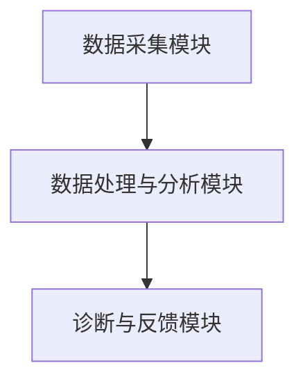
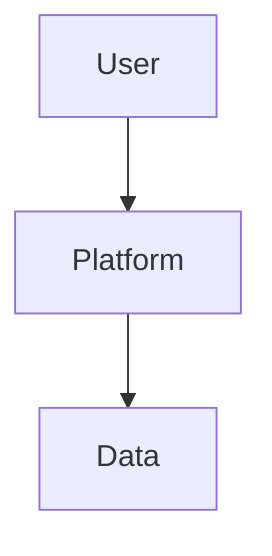
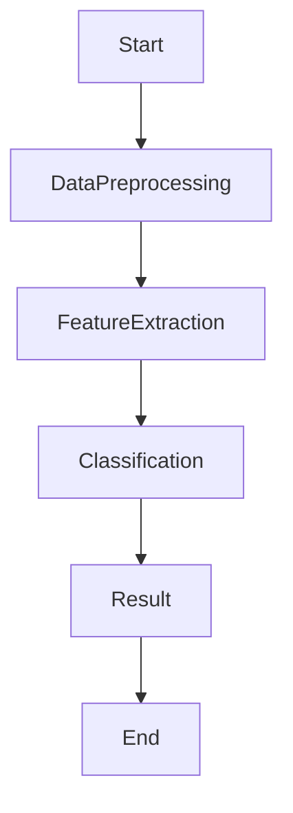
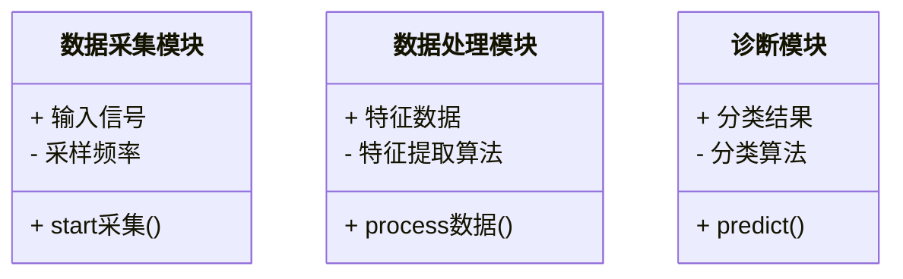
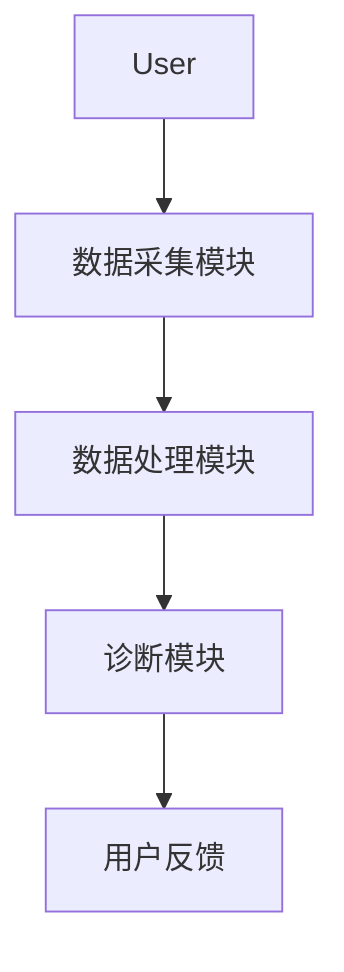
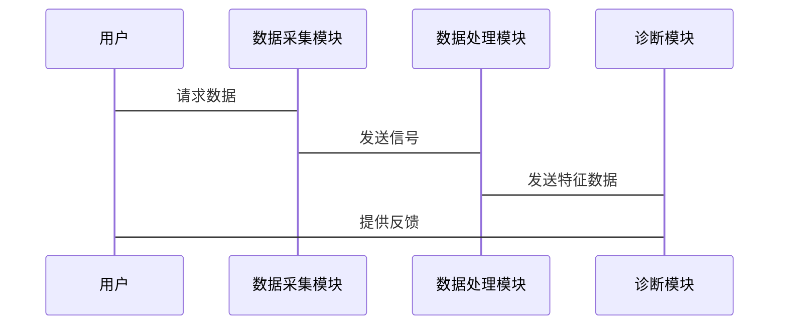

                 


# 巴菲特-芒格的脑机接口心理健康平台投资：心理医学的数字化转型

## 关键词：脑机接口，心理健康，巴菲特，芒格，投资，数字化转型

## 摘要：  
本文探讨了脑机接口技术在心理健康平台中的应用，并结合巴菲特和芒格的投资理念，分析了如何通过数字化转型推动心理医学的发展。文章详细介绍了脑机接口的核心原理、心理健康平台的功能模块，以及如何将巴菲特的价值投资理念与芒格的多元思维模型应用于这一领域的投资决策。通过系统分析与架构设计，本文展示了如何构建高效的心理健康平台，并通过实际案例分析，为投资者提供了切实可行的指导。

---

# 第1章: 引言

## 1.1 本书的核心主题  
脑机接口（BCI）技术正在 revolutionize 心理健康领域，而巴菲特和芒格的投资理念为我们提供了独特的视角，帮助我们识别和投资那些能够真正改变行业的创新平台。

## 1.2 本书的结构与目标  
本书分为几个主要部分：背景介绍、核心概念、技术实现、系统架构设计、项目实战以及未来展望。目标是为读者提供一个全面的视角，从技术到投资，再到实际应用，帮助读者理解并参与到这一变革中。

## 1.3 本章小结  
本章为读者概述了脑机接口技术与心理健康平台的结合，以及巴菲特和芒格投资理念的核心要点。

---

# 第2章: 背景介绍

## 2.1 脑机接口技术的基本概念  
### 2.1.1 脑机接口的定义与分类  
脑机接口是一种能够直接连接大脑与外部设备的技术，分为侵入式和非侵入式两种类型。  

### 2.1.2 脑机接口的核心技术原理  
脑机接口通过采集和分析脑电信号，将其转换为可被设备理解和执行的指令。  

### 2.1.3 脑机接口在医疗领域的应用现状  
目前，脑机接口技术已在神经康复、精神疾病治疗等领域展现出巨大潜力。  

## 2.2 心理健康平台的发展历程  
### 2.2.1 传统心理健康服务的局限性  
传统心理健康服务依赖于医生的主观判断，且资源有限，难以覆盖大规模人群。  

### 2.2.2 数字化心理健康平台的兴起  
随着技术的进步，数字化心理健康平台通过大数据和AI技术，实现了更高效、个性化的心理健康服务。  

### 2.2.3 脑机接口技术如何赋能心理健康平台  
脑机接口技术能够实时采集和分析用户的脑电信号，为心理健康评估和干预提供科学依据。  

## 2.3 巴菲特与芒格投资理念的现代应用  
### 2.3.1 巴菲特的价值投资理念  
巴菲特强调投资于具有长期竞争优势和良好治理的企业。  

### 2.3.2 芒格的多元思维模型  
芒格认为，投资者需要具备跨学科的知识，以全面评估企业的价值。  

### 2.3.3 如何将投资理念应用于脑机接口领域  
投资者应关注那些具备技术优势、市场需求和良好商业模式的脑机接口企业。  

## 2.4 本章小结  
本章介绍了脑机接口技术的基本概念、心理健康平台的发展历程，以及巴菲特和芒格投资理念的现代应用。

---

# 第3章: 脑机接口技术的核心原理

## 3.1 脑机接口的系统架构  
### 3.1.1 脑机接口的组成模块  
- 数据采集模块：负责采集脑电信号。  
- 数据处理与分析模块：对信号进行降噪、特征提取等处理。  
- 诊断与反馈模块：根据分析结果提供反馈或建议。  

### 3.1.2 系统架构的 Mermaid 图  


### 3.1.3 系统架构的对比表格  
| 模块 | 功能 | 输入 | 输出 |
|------|------|------|------|
| 数据采集 | 采集脑电信号 | 脑电信号 | 处理后的信号 |
| 数据处理 | 对信号进行降噪和特征提取 | 处理后的信号 | 特征数据 |
| 诊断与反馈 | 提供心理健康评估和反馈 | 特征数据 | 用户反馈 |

## 3.2 心理健康平台的功能模块  
### 3.2.1 数据采集模块  
通过 EEG 传感器采集用户的脑电信号。  

### 3.2.2 数据处理与分析模块  
利用算法对信号进行降噪、特征提取和分类。  

### 3.2.3 诊断与反馈模块  
根据分析结果，为用户提供个性化的心理健康建议。  

## 3.3 脑机接口与心理健康平台的实体关系  
### 3.3.1 实体关系的定义  
- 用户：使用平台的用户。  
- 平台：提供心理健康服务的平台。  
- 数据：用户的脑电信号数据。  

### 3.3.2 实体关系的 Mermaid 图  


### 3.3.3 实体关系的属性对比表格  
| 实体 | 属性 | 数据类型 | 示例值 |
|------|------|----------|--------|
| User | 用户ID | 整数 | 1, 2, 3 |
| Platform | 平台ID | 整数 | 1, 2, 3 |
| Data | 数据ID | 整数 | 1, 2, 3 |

---

# 第4章: 数学模型与算法原理

## 4.1 脑机接口的核心算法  
### 4.1.1 基于 EEG 的特征提取算法  
常用的特征包括功率谱密度、时域特征和小波变换特征。  

### 4.1.2 分类算法  
支持向量机（SVM）、随机森林（RF）和深度学习模型（如CNN）是常用的分类算法。  

### 4.1.3 算法的 Mermaid 流程图  


## 4.2 算法实现的 Python 代码  
```python
import numpy as np
from sklearn.svm import SVC

# 示例数据
X = np.random.randn(100, 10)
y = np.random.randint(2, size=100)

# 模型训练
model = SVC()
model.fit(X, y)

# 预测
new_data = np.random.randn(10, 10)
predicted = model.predict(new_data)
print(predicted)
```

## 4.3 算法的数学模型  
分类问题的数学模型可以表示为：  
$$ y = f(x) $$  
其中，\( y \) 是输出，\( x \) 是输入特征，\( f \) 是分类函数。

---

# 第5章: 系统分析与架构设计

## 5.1 问题场景介绍  
用户需要一个能够实时监测心理健康状况的平台。  

## 5.2 系统功能设计  
### 5.2.1 功能模块  
- 数据采集模块：采集用户的脑电信号。  
- 数据处理模块：对信号进行降噪和特征提取。  
- 诊断模块：根据特征数据进行分类，提供心理健康建议。  

### 5.2.2 功能模块的 Mermaid 类图  


## 5.3 系统架构设计  
### 5.3.1 系统架构的 Mermaid 图  


## 5.4 系统接口设计  
API 接口设计：  
- 数据采集模块提供 `get_signal()` 方法。  
- 数据处理模块提供 `process_signal()` 方法。  

## 5.5 系统交互的 Mermaid 序列图  


---

# 第6章: 项目实战

## 6.1 环境安装  
- 安装 EEG 传感器驱动。  
- 安装 Python 和相关库（如 numpy、scikit-learn）。  

## 6.2 系统核心实现源代码  
```python
import numpy as np
from sklearn.svm import SVC
from sklearn.metrics import accuracy_score

# 数据预处理
X_train = np.random.randn(100, 10)
y_train = np.random.randint(2, size=100)

# 模型训练
model = SVC()
model.fit(X_train, y_train)

# 测试数据
X_test = np.random.randn(50, 10)
y_test = np.random.randint(2, size=50)

# 预测
predicted = model.predict(X_test)
print("Accuracy:", accuracy_score(y_test, predicted))
```

## 6.3 代码应用解读与分析  
上述代码实现了基于 SVM 的 EEG 数据分类，展示了如何利用机器学习算法进行心理健康评估。  

## 6.4 实际案例分析  
假设我们有一个心理健康平台，用户通过 EEG 传感器发送数据，平台通过分类算法提供心理健康建议。  

## 6.5 项目小结  
本章通过实际案例展示了如何将脑机接口技术应用于心理健康平台，并提供了完整的代码实现。

---

# 第7章: 结论与展望

## 7.1 本章小结  
本文探讨了脑机接口技术在心理健康平台中的应用，结合巴菲特和芒格的投资理念，分析了如何通过数字化转型推动心理医学的发展。  

## 7.2 未来展望  
随着技术的进步，脑机接口在心理健康领域的应用将更加广泛，投资者应关注那些具备技术优势和市场需求的平台。  

## 7.3 投资建议  
投资者应遵循巴菲特的价值投资理念，选择那些具备长期竞争优势和良好商业模式的脑机接口企业。  

## 7.4 注意事项  
在投资过程中，应综合考虑技术风险、市场风险和政策风险，避免盲目跟风。  

## 7.5 拓展阅读  
推荐阅读《巴菲特的智慧》和《芒格的多元思维模型》以获取更多投资理念。  

---

# 作者：AI天才研究院 & 禅与计算机程序设计艺术

