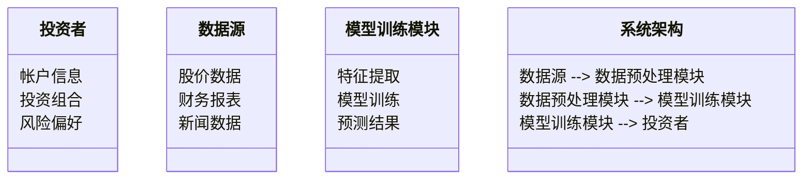
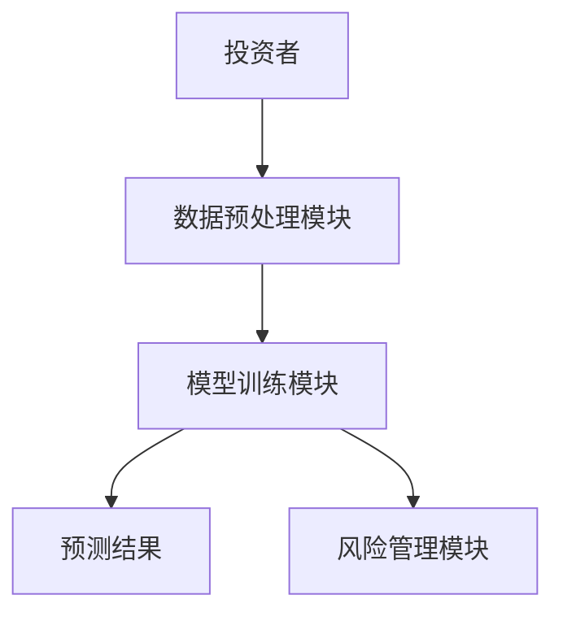

                 


# 巴菲特-芒格的自动化与人工智能投资：劳动力市场的变革

---

## 关键词：
- 巴菲特
- 芒格
- 自动化
- 人工智能
- 投资
- 劳动力市场
- 技术变革

---

## 摘要：
本文探讨了巴菲特和芒格的投资理念与人工智能及自动化技术的结合，分析了这些技术如何改变投资策略和劳动力市场。通过详细的技术分析和案例研究，文章揭示了AI在投资中的应用潜力，并展望了自动化对就业结构的深远影响。

---

# 第1章：巴菲特与芒格的投资哲学与现代AI技术的结合

## 1.1 巴菲特的价值投资原则
### 1.1.1 价值投资的核心要素
- 巴菲特的价值投资强调企业内在价值，即企业的未来现金流的现值。
- **公式**：内在价值 = ∑(CF_t / (1 + r)^t)，其中CF_t为第t年的现金流，r为折现率。
- 巴菲特寻找具有持续竞争优势和良好治理结构的企业。

### 1.1.2 芒格的多元思维模型
- 芒格强调通过多个学科的交叉应用来理解复杂问题。
- **公式**：决策 = ∑(各学科视角的影响)

### 1.1.3 AI如何增强投资决策
- AI技术可以快速分析大量数据，帮助投资者发现隐藏的模式和趋势。
- 例如，使用自然语言处理（NLP）分析企业财报和新闻，提取情感指标。

## 1.2 AI与自动化对投资领域的影响
### 1.2.1 AI在金融分析中的应用
- **算法**：使用机器学习模型预测股票价格走势。
- **代码示例**：
  ```python
  import pandas as pd
  import numpy as np
  from sklearn.linear_model import LinearRegression

  # 示例数据
  data = pd.DataFrame({'price': [100, 105, 110, 115, 120]})
  model = LinearRegression()
  model.fit(np.array(data.index).reshape(-1, 1), data['price'])
  print(model.predict([[4]]))  # 预测第5天价格
  ```

### 1.2.2 自动化交易的现状与趋势
- 算法交易通过自动化系统在毫秒级别完成交易决策。
- **系统架构图**（mermaid）：
  ```mermaid
  graph TD
      A[交易平台] --> B[订单管理系统]
      B --> C[市场数据源]
      C --> D[交易执行系统]
      D --> E[风险管理模块]
  ```

### 1.2.3抽样的算法实现
- 使用Python和TensorFlow构建一个简单的预测模型。
  ```python
  import tensorflow as tf
  model = tf.keras.Sequential([
      tf.keras.layers.Dense(64, activation='relu'),
      tf.keras.layers.Dense(1, activation='linear')
  ])
  model.compile(optimizer='adam', loss='mean_squared_error')
  model.fit(X_train, y_train, epochs=100, batch_size=32)
  ```

---

# 第2章：AI与自动化如何改变就业市场

## 2.1 AI与自动化技术的现状
### 2.1.1 当前主要的AI技术及其应用领域
- **表格对比**：AI技术与应用场景
  | 技术 | 应用领域 |
  |------|----------|
  | NLP | 股票分析 |
  | 计算机视觉 | 制造业检测 |

### 2.1.2 自动化在各行业的应用实例
- 制造业中的自动化生产线：使用工业机器人进行组装和检测。

## 2.2 劳动力市场的变革
### 2.2.1 高危职业的转型与消失
- 低技能重复性工作（如流水线工人）面临被取代的风险。

### 2.2.2 新兴职业的崛起与发展
- 数据科学家、AI训练师等新兴职业的需求激增。

### 2.2.3 职业培训与技能更新的需求
- 投资者需要不断更新技能，适应新技术环境。

---

# 第3章：AI在投资决策中的应用

## 3.1 数据驱动的投资分析
### 3.1.1 大数据分析在选股中的应用
- 使用大数据分析企业财务数据和市场情绪，识别潜在投资机会。

### 3.1.2 机器学习模型在预测市场走势中的作用
- **算法流程图**（mermaid）：
  ```mermaid
  graph TD
      A[数据输入] --> B[特征提取]
      B --> C[模型训练]
      C --> D[预测结果]
  ```

## 3.2 巴菲特与芒格的选股标准与AI的结合
### 3.2.1 企业基本面分析的自动化
- 使用AI自动分析企业的财务报表，识别具有持续竞争优势的企业。

### 3.2.2 市场情绪分析与投资决策
- 利用NLP分析社交媒体和新闻，评估市场情绪对企业价值的影响。

---

# 第4章：AI与自动化在不同行业的应用

## 4.1 制造业的自动化转型
### 4.1.1 自动化生产线的构建与优化
- 使用工业机器人和物联网技术实现生产线的智能化管理。

### 4.1.2 制造业中的AI应用案例
- 某汽车制造厂使用AI进行质量检测，减少缺陷率。

## 4.2 服务业的自动化应用
### 4.2.1 智能客服系统的实现
- 使用NLP技术处理客户咨询，提高服务效率。

### 4.2.2 自动化交易在金融服务业中的应用
- 算法交易通过自动化系统快速响应市场变化，提高交易效率。

---

# 第5章：系统分析与架构设计方案

## 5.1 问题场景介绍
- 投资者希望通过AI技术优化投资决策，降低风险。

## 5.2 项目介绍
- 开发一个基于机器学习的投资决策支持系统。

## 5.3 系统功能设计
### 5.3.1 领域模型（mermaid类图）


## 5.4 系统架构设计（mermaid架构图）


---

# 第6章：项目实战

## 6.1 环境安装
- 安装Python、TensorFlow、Keras等工具。
  ```bash
  pip install numpy pandas tensorflow keras
  ```

## 6.2 系统核心实现源代码
- 示例代码：使用机器学习预测股票价格。
  ```python
  import numpy as np
  import pandas as pd
  from sklearn.model_selection import train_test_split
  from tensorflow.keras.models import Sequential
  from tensorflow.keras.layers import Dense

  # 数据加载
  data = pd.read_csv('stock_prices.csv')
  X = data[['open', 'high', 'low', 'volume']]
  y = data['close']

  # 数据分割
  X_train, X_test, y_train, y_test = train_test_split(X, y, test_size=0.2)

  # 模型构建
  model = Sequential()
  model.add(Dense(64, activation='relu', input_dim=X.shape[1]))
  model.add(Dense(1, activation='linear'))

  # 编译模型
  model.compile(optimizer='adam', loss='mean_squared_error')

  # 训练模型
  model.fit(X_train, y_train, epochs=100, batch_size=32)

  # 预测与评估
  predictions = model.predict(X_test)
  ```

---

# 第7章：最佳实践与总结

## 7.1 总结
- AI和自动化技术正在深刻改变投资方式和劳动力市场。
- 投资者需要结合传统投资理念与新技术，优化决策过程。

## 7.2 小结
- 通过案例分析和系统设计，展示了AI在投资中的巨大潜力。
- 技术变革要求我们不断学习和适应，抓住机遇，应对挑战。

## 7.3 注意事项
- 投资者需谨慎评估AI模型的局限性，避免过度依赖技术。
- 企业应制定应对自动化影响的策略，提升员工技能。

## 7.4 拓展阅读
- 推荐阅读《机器学习实战》和《巴菲特的选股术》。

---

# 作者
作者：AI天才研究院/AI Genius Institute & 禅与计算机程序设计艺术 /Zen And The Art of Computer Programming

