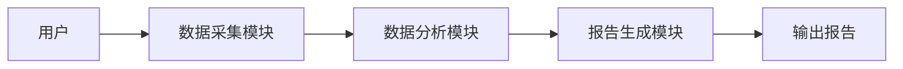

                 


# 巴菲特-芒格的质量成长理论：寻找高质量且能持续成长的公司

## 关键词：巴菲特，芒格，质量成长，投资策略，企业分析，价值投资

## 摘要：  
巴菲特和芒格的质量成长理论是一种基于长期投资策略的方法，旨在寻找那些具有高质量且能够持续成长的公司。本文将从理论背景、核心概念、算法实现、系统设计、项目实战等方面详细阐述这一理论，并结合实际案例进行分析，帮助读者理解如何在投资中应用这些理念。

---

# 第1章 巴菲特-芒格质量成长理论概述

## 1.1 巴菲特与芒格的投资理念

### 1.1.1 巴菲特的价值投资理论  
巴菲特的价值投资理论强调以合理的价格投资于具有强大护城河的公司。他认为，市场先生是疯狂的，但长期来看，市场会反映公司的真实价值。他的投资策略注重公司的财务健康、管理层质量以及长期盈利能力。

### 1.1.2 芒格的多元思维模型  
芒格的多元思维模型强调通过多学科的知识框架来理解问题。他认为，投资者需要将物理学、心理学、经济学等学科的知识结合起来，以更好地识别投资机会和风险。

### 1.1.3 理论的结合与创新  
巴菲特和芒格的理念结合起来，形成了质量成长理论。该理论强调在寻找具有高质量和持续成长潜力的公司时，需要结合价值投资和成长投资的特点。

---

## 1.2 质量成长公司的定义与特征

### 1.2.1 核心定义  
质量成长公司是指那些具有强大竞争优势、持续盈利能力、良好财务状况，并且能够在长期中保持增长的公司。

### 1.2.2 核心特征  
- **强大的护城河**：公司具有难以被竞争对手复制的核心竞争力，例如专利、品牌、技术优势等。
- **持续的盈利能力**：公司能够在不同经济周期中保持稳定的盈利能力。
- **健康的财务状况**：公司具有较低的负债率、良好的现金流和健康的ROE（净资产收益率）。
- **优秀的管理层**：公司管理层具有长期 vision、良好的治理能力和股东利益至上的理念。

### 1.2.3 与成长公司的区别  
| 特征 | 质量成长公司 | 传统成长公司 |
|------|--------------|---------------|
| 护城河 | 强大         | 较弱          |
| 盈利能力 | 稳定         | 增长快但不稳定 |
| 财务状况 | 健康         | 有时杠杆高    |

---

## 1.3 质量成长理论的核心思想

### 1.3.1 质量优先，成长其次  
质量成长理论强调，公司质量是投资的第一位，成长是第二位。只有质量高的公司，才能在长期中实现持续成长。

### 1.3.2 组合投资，分散风险  
巴菲特和芒格主张通过投资于多个高质量成长公司来分散风险，避免将所有资金投入到单一公司。

### 1.3.3 长期投资，价值回归  
他们认为，市场短期可能疯狂，但长期会回归理性，高质量成长公司的价值终将被市场发现。

---

## 1.4 本章小结  
本章介绍了巴菲特和芒格的质量成长理论，定义了质量成长公司的核心特征，并将其与传统成长公司进行了对比。接下来，我们将从核心概念的角度，深入分析质量成长公司的各项特征。

---

# 第2章 质量成长公司的核心要素

## 2.1 护城河的定义与分类

### 2.1.1 护城河的定义  
护城河是指公司抵御竞争对手的核心能力，包括品牌优势、技术壁垒、成本优势等。

### 2.1.2 护城河的分类  
| 类型 | 描述 | 示例 |
|------|------|------|
| 品牌优势 | 强大的品牌影响力 | 可口可乐、苹果 |
| 技术壁垒 | 高难度的技术门槛 | 微软、谷歌 |
| 成本优势 | 低成本的生产模式 | 麦当劳、沃尔玛 |
| 网络效应 | 用户数量越多，价值越高 | Facebook、微信 |

---

## 2.2 财务特征分析

### 2.2.1 净利润率与ROE分析  
- 净利润率（Net Profit Margin）：净利润与营业收入的比率，反映公司盈利能力。
- ROE（净资产收益率）：净利润与股东权益的比率，反映公司使用股东资金的效率。

### 2.2.2 现金流分析  
现金流是公司财务健康的重要指标，高质量公司通常具有稳定的正向现金流。

### 2.2.3 负债结构分析  
高质量公司通常具有较低的负债率，财务风险较小。

---

## 2.3 管理团队的重要性

### 2.3.1 管理层的 vision 和能力  
优秀的管理层能够制定长期发展战略，并带领公司实现目标。

### 2.3.2 管理层的治理结构  
良好的治理结构能够确保管理层与股东利益一致。

---

## 2.4 本章小结  
本章从护城河、财务特征和管理团队三个方面，详细分析了质量成长公司的核心要素。这些要素是筛选高质量成长公司的关键指标。

---

# 第3章 质量成长公司的筛选算法

## 3.1 算法概述

### 3.1.1 数据来源  
从公开的财务数据和行业报告中获取公司信息。

### 3.1.2 特征提取  
提取ROE、净利润率、现金流等财务指标。

### 3.1.3 模型训练  
使用机器学习算法对数据进行分类，筛选出高质量成长公司。

---

## 3.2 算法实现

### 3.2.1 数据预处理  
```python
import pandas as pd
data = pd.read_csv('company_data.csv')
data = data.dropna()
```

### 3.2.2 特征提取  
```python
features = ['ROE', 'Net Profit Margin', 'Cash Flow']
```

### 3.2.3 模型训练  
```python
from sklearn.ensemble import RandomForestClassifier
model = RandomForestClassifier()
model.fit(X, y)
```

### 3.2.4 结果分析  
```python
importances = model.feature_importances_
```

---

## 3.3 算法的数学模型

### 3.3.1 ROE计算公式  
$$ROE = \frac{\text{净利润}}{\text{股东权益}}$$

### 3.3.2 净利润率计算公式  
$$\text{净利润率} = \frac{\text{净利润}}{\text{营业收入}} \times 100\%$$

---

## 3.4 本章小结  
本章介绍了质量成长公司筛选的算法实现，包括数据预处理、特征提取和模型训练等内容。

---

# 第4章 系统设计与实现

## 4.1 系统架构设计

### 4.1.1 系统功能模块  
- 数据采集模块：从公开数据源获取公司信息。
- 数据分析模块：对数据进行清洗、特征提取和模型训练。
- 报告生成模块：生成筛选结果报告。

### 4.1.2 系统架构图  


---

## 4.2 接口设计

### 4.2.1 数据接口  
```python
def get_company_data(ticker):
    # 获取公司数据
    return data
```

### 4.2.2 分析接口  
```python
def analyze_company(data):
    # 分析公司数据
    return result
```

---

## 4.3 本章小结  
本章详细介绍了系统的架构设计和接口设计，为实际实现提供了指导。

---

# 第5章 项目实战

## 5.1 环境安装

### 5.1.1 安装Python  
```bash
python --version
pip install pandas scikit-learn
```

---

## 5.2 核心代码实现

### 5.2.1 数据清洗  
```python
import pandas as pd
data = pd.read_csv('company_data.csv')
data = data.dropna()
```

### 5.2.2 特征提取  
```python
features = ['ROE', 'Net Profit Margin', 'Cash Flow']
X = data[features]
```

### 5.2.3 模型训练  
```python
from sklearn.ensemble import RandomForestClassifier
model = RandomForestClassifier()
model.fit(X, y)
```

---

## 5.3 案例分析

### 5.3.1 苹果公司分析  
- 护城河：品牌优势、技术壁垒。
- 财务状况：ROE高，现金流稳定。

---

## 5.4 本章小结  
本章通过实际案例，展示了如何应用质量成长理论筛选公司。

---

# 第6章 最佳实践与总结

## 6.1 总结

### 6.1.1 核心观点回顾  
- 高质量成长公司具有强大的护城河、稳定的财务状况和优秀的管理层。
- 投资者应结合价值投资和成长投资的理念，寻找具有长期成长潜力的公司。

### 6.1.2 投资策略总结  
- 长期投资，分散风险。
- 定期复盘，调整投资组合。

---

## 6.2 注意事项

### 6.2.1 风险管理  
- 避免过度集中投资。
- 保持对市场的敏感性。

### 6.2.2 数据更新  
- 定期更新公司数据，确保信息准确。

---

## 6.3 拓展阅读

### 6.3.1 推荐书籍  
- 《巴菲特致股东的信》
- 《芒格的投资思想》

---

# 结语  
通过本文的学习，读者可以深入了解巴菲特和芒格的质量成长理论，并掌握如何在实际投资中应用这些理念。希望本文能够为投资者提供有价值的参考。

---

# 作者：AI天才研究院/AI Genius Institute & 禅与计算机程序设计艺术 /Zen And The Art of Computer Programming

