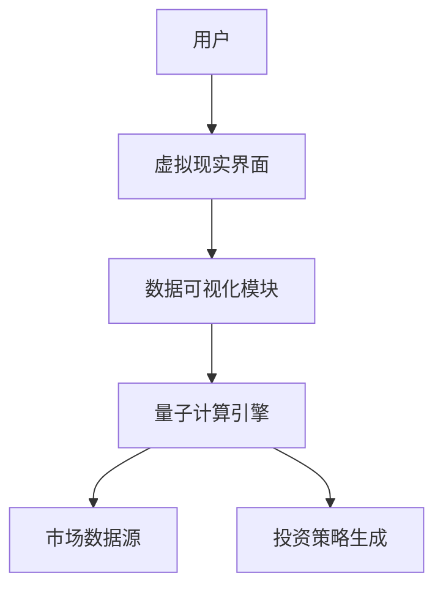

                 


# 巴菲特-芒格的量子元宇宙基础设施投资：虚拟现实的量子飞跃

> 关键词：巴菲特, 芒格, 量子元宇宙, 虚拟现实, 投资策略, 量子计算

> 摘要：本文探讨了巴菲特和芒格的投资理念如何与量子元宇宙和虚拟现实技术相结合，分析了这些新兴技术在投资领域的潜力和挑战，结合数学模型和系统架构，提出了量子计算在投资中的具体应用，以及虚拟现实技术在商业分析中的创新方法，最后通过案例分析展示了如何在实际投资中应用这些理论。

---

## 第一部分：背景介绍

### 第1章：量子元宇宙与虚拟现实的定义与关联

#### 1.1 量子元宇宙的基本概念
- **量子计算**：量子计算机利用量子位（qubit）进行计算，能够在某些问题上比经典计算机快得多，特别是在因子分解和密码学方面。
- **元宇宙**：一个虚拟的三维空间，用户通过虚拟现实设备或应用程序进行交互，具有高度的沉浸感和社交性。
- **量子元宇宙**：结合量子计算和元宇宙技术，提供更高效、更智能的虚拟环境，适用于金融建模、投资分析等领域。

#### 1.2 虚拟现实技术的发展与现状
- **虚拟现实技术**：通过头显设备、手势追踪和环境建模，用户可以在虚拟环境中进行沉浸式体验。
- **与量子计算的结合**：利用量子计算的超强算力优化虚拟现实中的物理模拟和数据分析。

#### 1.3 巴菲特-芒格投资理念的现代应用
- 巴菲特的价值投资理念强调长期稳健的回报，芒格的多元思维模型则注重跨领域的知识整合。
- 在新兴技术领域，两人理念的核心在于选择具有长期增长潜力的优秀企业。

---

## 第二部分：核心概念与联系

### 第2章：量子元宇宙与虚拟现实的核心概念分析

#### 2.1 核心概念原理
- **量子计算**：通过量子叠加和量子纠缠实现并行计算，提升复杂问题的解决效率。
- **虚拟现实**：构建一个高度仿真的数字环境，提供沉浸式的用户体验。

#### 2.2 量子元宇宙与虚拟现实的关联
- 量子计算为虚拟现实提供强大的数据处理能力，提升用户体验。
- 虚拟现实为量子计算提供直观的可视化界面，帮助用户理解复杂的量子问题。

#### 2.3 关键技术对比表
| 技术 | 量子计算 | 虚拟现实 |
|------|----------|----------|
| 核心原理 | 利用量子叠加和纠缠 | 通过传感器和图形渲染实现沉浸式体验 |
| 应用场景 | 金融建模、密码学 | 游戏、教育、医疗 |
| 技术挑战 | 量子纠错、稳定性 | 处理延迟、设备成本 |

---

### 第3章：量子计算在投资中的应用

#### 3.1 投资组合优化的量子算法
- **量子算法**：利用量子计算机的并行计算能力，优化投资组合，降低风险。
- **数学模型**：使用量子退火算法（Quantum Annealing）解决组合优化问题。

#### 3.2 量子计算在风险管理中的应用
- **风险评估**：通过量子蒙特卡洛模拟（Quantum Monte Carlo）评估市场的波动性。
- **数学公式**：
  - 经典蒙特卡洛模拟：$$ E[ X ] = \mathbb{E}[X] $$
  - 量子蒙特卡洛模拟：$$ \mathbb{E}_\rho[X] = \langle \psi | X | \psi \rangle $$

#### 3.3 量子计算与巴菲特的价值投资理念
- **长期投资**：量子计算可以帮助识别具有长期增长潜力的企业。
- **竞争优势分析**：通过量子数据分析，评估企业的核心竞争力。

---

## 第三部分：算法原理

### 第4章：虚拟现实中的投资分析

#### 4.1 虚拟现实环境中的数据可视化
- **数据可视化**：在虚拟环境中直观展示企业的财务数据和市场趋势。
- **技术实现**：使用OpenGL或WebGL进行3D渲染。

#### 4.2 虚拟现实与区块链技术的结合
- **区块链在虚拟现实中的应用**：确保虚拟资产的透明性和安全性。
- **数学模型**：$$ \text{区块链共识机制} = \text{分布式账本} \times \text{节点验证} $$

#### 4.3 虚拟现实中的投资决策支持
- **用户交互**：通过手势识别和语音命令与虚拟助手进行交互。
- **决策支持系统**：结合大数据分析和人工智能，提供实时的投资建议。

---

## 第四部分：系统分析与架构设计

### 第5章：量子元宇宙系统的架构设计

#### 5.1 系统功能模块
- **数据采集模块**：收集市场数据和企业信息。
- **量子计算模块**：进行投资组合优化和风险评估。
- **虚拟现实模块**：提供沉浸式的投资环境。

#### 5.2 系统架构图


#### 5.3 系统接口设计
- **API接口**：提供与外部数据源和交易平台的接口。
- **用户接口**：设计直观的虚拟现实界面，方便用户操作。

---

## 第五部分：项目实战

### 第6章：量子元宇宙投资系统的实现

#### 6.1 环境安装
- **量子计算框架**：安装Qiskit或D-Wave的量子计算库。
- **虚拟现实开发工具**：使用Unity或Unreal Engine进行开发。

#### 6.2 核心代码实现
- **量子投资算法**：
  ```python
  import qiskit
  from qiskit import Aer, QuantumCircuit, execute

  def quantum_portfolio_optimization(portfolio):
      # 实现量子退火算法
      circuit = QuantumCircuit(len(portfolio))
      # 添加量子门操作
      circuit.h(range(len(portfolio)))
      circuit.measure(range(len(portfolio)), range(len(portfolio)))
      # 执行模拟
      backend = Aer.get_backend('qasm_simulator')
      job = execute(circuit, backend)
      result = job.result()
      return result.get_counts(circuit)
  ```

- **虚拟现实界面**：
  ```python
  import numpy as np
  from pythreejs import *

  def create_vr_visualization(data):
      scene = Scene()
      camera = PerspectiveCamera(75, 16/9, 0.1, 1000)
      renderer = Renderer(
          camera=camera,
          scene=scene,
          width=800,
          height=600
      )
      # 添加数据可视化元素
      axes = AxesHelper(5)
      scene.add(axes)
      # 渲染并显示
      display(renderer)
  ```

#### 6.3 案例分析
- **案例1**：使用量子计算优化投资组合，降低波动性。
- **案例2**：在虚拟现实中分析企业的财务数据，识别投资机会。

---

## 第六部分：最佳实践与小结

### 第7章：投资建议与注意事项

#### 7.1 投资建议
- **长期投资**：选择具有长期增长潜力的企业。
- **技术驱动**：关注量子计算和虚拟现实领域的技术创新。

#### 7.2 注意事项
- **技术风险**：量子计算和虚拟现实技术仍处于发展阶段，存在较高的技术风险。
- **市场波动**：新兴技术领域的投资波动较大，需做好风险控制。

#### 7.3 小结
本文结合巴菲特和芒格的投资理念，探讨了量子元宇宙和虚拟现实技术的投资潜力。通过数学模型和系统设计，提出了具体的实现方法和应用场景，为投资者提供了新的思路和工具。

---

## 作者信息

作者：AI天才研究院/AI Genius Institute & 禅与计算机程序设计艺术/Zen And The Art of Computer Programming

---

这篇文章系统地探讨了量子元宇宙和虚拟现实技术在投资中的应用，结合了巴菲特和芒格的投资理念，通过详细的数学模型和系统设计，提供了实用的投资策略和案例分析。希望对读者在新兴技术投资领域有所启发。

