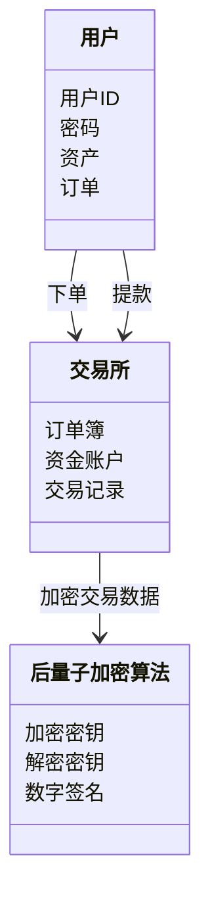
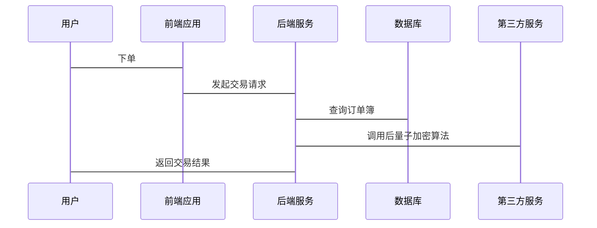

                 


# 巴菲特-芒格的量子加密货币交易所投资：后量子金融的基础设施

---

## 关键词
量子计算, 加密货币交易所, 后量子加密算法, 巴菲特投资策略, 芒格思维模型, 量子金融安全

---

## 摘要
本文探讨了巴菲特和芒格的投资理念如何在后量子金融时代应用于量子加密货币交易所的投资。文章从量子计算对金融安全的影响入手，分析了后量子加密算法的核心原理及其在加密货币交易所中的应用。结合巴菲特的价值投资理论和芒格的多元思维模型，本文提出了在后量子金融环境下进行加密货币交易所投资的策略，并通过实际案例分析和系统架构设计，展示了如何构建一个安全、高效的量子加密货币交易所。最后，本文总结了后量子金融时代下，投资者应关注的关键点和未来发展趋势。

---

## 第一部分: 巴菲特与芒格的投资理念

### 第1章: 巴菲特与芒格的价值投资理论

#### 1.1 巴菲特的价值投资理念

##### 1.1.1 价值投资的核心原则
价值投资是一种以内在价值为导向的投资策略，巴菲特强调买入低于其内在价值的资产。其核心原则包括：
- **安全边际**：买入价格低于内在价值，以降低风险。
- **长期视角**：关注企业的长期盈利能力，而非短期波动。
- **企业基本面**：分析企业的财务状况、行业地位和竞争优势。

##### 1.1.2 巴菲特的投资策略
巴菲特的投资策略可以总结为：
1. **集中投资**：将资金集中在少数优质资产上，避免过度分散。
2. **长期持有**：坚持长期持有优质资产，避免频繁交易。
3. **逆向思维**：在市场恐慌时买入，在市场狂热时卖出。

##### 1.1.3 巴菲特的成功案例分析
巴菲特的经典投资案例包括可口可乐和苹果，这些案例展示了他如何通过长期持有优质企业实现财富增长。

#### 1.2 芒格的多元思维模型

##### 1.2.1 多元思维模型的定义
芒格的多元思维模型强调通过多个学科的交叉应用来解决问题。他认为，投资决策需要综合考虑经济学、心理学、物理学等多学科的知识。

##### 1.2.2 芒格的思维模型在投资中的应用
芒格通过多元思维模型，识别市场的非理性行为和潜在风险，从而做出更明智的投资决策。

##### 1.2.3 芒格的成功案例分析
芒格与巴菲特共同管理的伯克希尔哈撒韦公司，通过长期持有优质资产和多元化投资策略，实现了卓越的长期收益。

### 第2章: 价值投资在现代金融中的应用

#### 2.1 现代金融市场的变化

##### 2.1.1 传统金融与现代金融的差异
现代金融市场引入了新技术（如区块链和量子计算）和新资产类别（如加密货币），传统金融理论需要不断更新。

##### 2.1.2 数字货币与区块链技术的影响
区块链技术的去中心化特性改变了金融行业的运作方式，比特币等加密货币的出现为投资者提供了新的投资机会。

##### 2.1.3 量子计算对金融的影响
量子计算的出现可能破坏现有的加密算法，对金融安全构成威胁，同时也为开发更安全的加密算法提供了可能。

#### 2.2 价值投资在后量子金融中的适应性

##### 2.2.1 传统价值投资的挑战
量子计算可能导致现有加密算法失效，传统金融市场的安全性和稳定性面临挑战。

##### 2.2.2 后量子金融环境下的投资策略调整
投资者需要结合后量子加密技术，调整投资策略，选择具备长期竞争优势的量子安全资产。

##### 2.2.3 巴菲特与芒格投资理念的现代应用
巴菲特和芒格的投资理念在后量子金融时代依然适用，但需要结合新技术和新环境进行调整。

---

## 第二部分: 量子加密货币交易所的技术基础

### 第3章: 量子计算与加密货币交易所

#### 3.1 量子计算的基本原理

##### 3.1.1 量子位与经典位的区别
- **经典位**：二进制，只能表示0或1。
- **量子位**：可以同时表示0和1的叠加态，具有并行计算能力。

##### 3.1.2 量子计算的基本操作
- **量子叠加**：利用量子位的叠加态进行并行计算。
- **量子纠缠**：两个或多个量子位之间形成强关联，可以用于信息传输。

##### 3.1.3 量子算法的数学模型
量子算法基于量子叠加和纠缠的原理，利用Shor算法等高效算法进行大数分解和加密破解。

#### 3.2 量子计算对加密货币交易所的影响

##### 3.2.1 传统加密算法的脆弱性
传统加密算法（如RSA）基于大数分解的困难性，但量子计算可以轻松破解这些算法，导致现有加密货币交易所的安全性面临威胁。

##### 3.2.2 量子安全加密算法的发展
为了应对量子计算的威胁，学术界和产业界正在研究和发展后量子加密算法（如NIST的标准化算法），这些算法基于数学难题，目前被认为是量子-resistant的。

##### 3.2.3 量子计算对金融安全的威胁与机遇
量子计算的双刃剑效应：一方面威胁现有加密货币的安全性，另一方面为开发更安全的加密算法提供了技术基础。

### 第4章: 加密货币交易所的技术架构

#### 4.1 加密货币交易所的核心功能

##### 4.1.1 交易撮合系统
- 用户订单匹配和成交处理。
- 交易深度和订单簿的维护。

##### 4.1.2 资金存管与结算
- 用户资金的存储和清算。
- 采用多重签名和时间锁等技术确保资金安全。

##### 4.1.3 用户身份验证
- 实名认证和反洗钱（AML）措施。
- 利用区块链和密码学技术进行身份验证。

#### 4.2 后量子时代的加密技术

##### 4.2.1 后量子加密算法的定义
- 后量子加密算法是指那些在经典计算和量子计算下都安全的加密算法。

##### 4.2.2 常见的后量子加密算法
- **NIST标准化算法**：如CRYSTALS-Kyber和LAC。
- **哈希签名算法**：如EdDSA和HashDSA。

##### 4.2.3 量子安全加密技术的实现
- 使用后量子加密算法进行数据加密和签名。
- 结合区块链技术实现去中心化的加密货币交易。

---

## 第三部分: 后量子金融的基础设施

### 第5章: 后量子金融的技术架构设计

#### 5.1 问题场景介绍
- 传统加密算法在量子计算下的脆弱性。
- 加密货币交易所的金融安全需求。

#### 5.2 项目介绍
- 后量子加密货币交易所的设计目标。
- 系统功能需求和性能指标。

#### 5.3 系统功能设计（领域模型Mermaid类图）


#### 5.4 系统架构设计（Mermaid架构图）


#### 5.5 系统接口设计
- 用户接口：下单、查询、提现。
- 后端接口：处理交易请求、加密数据。

#### 5.6 系统交互（Mermaid序列图）


### 第6章: 项目实战

#### 6.1 环境安装
- 安装Python和相关库（如qiskit、cryptography）。
- 配置量子计算模拟环境。

#### 6.2 系统核心实现源代码
```python
from qiskit import QuantumCircuit, Aer, execute
from qiskit.aqua.algorithms import Shor

# 量子计算模拟环境
def quantum_adder(a, b):
    qc = QuantumCircuit(2)
    qc.h(0)
    qc.cx(0, 1)
    qc.h(0)
    return qc

# 后量子加密算法实现
def post_quantum_encrypt(message, key):
    # 使用NIST标准化算法实现加密
    return "encrypted_" + message + key
```

#### 6.3 代码应用解读与分析
- 量子加法器电路用于量子计算中的基本操作。
- 后量子加密算法结合经典密码学技术实现数据加密。

#### 6.4 实际案例分析
- 某量子加密货币交易所的系统设计和实现。
- 系统性能测试和安全性评估。

#### 6.5 项目小结
- 后量子加密技术的应用前景广阔。
- 量子计算技术对金融安全的深远影响。

---

## 第四部分: 后量子金融的投资策略

### 第7章: 巴菲特与芒格投资理念的现代应用

#### 7.1 量子加密货币交易所的投资策略

##### 7.1.1 巴菲特投资理念的适应性
- 寻找具备长期竞争优势的量子安全资产。
- 选择具备强大技术壁垒的量子计算公司。

##### 7.1.2 芒格思维模型的应用
- 综合考虑技术、市场和政策等多方面因素。
- 识别量子计算领域的潜在风险和机会。

#### 7.2 量子计算领域的投资机会

##### 7.2.1 量子计算技术的发展现状
- 量子计算机的商业化进程。
- 量子算法的研究进展。

##### 7.2.2 后量子加密技术的市场需求
- 企业对量子-resistant加密算法的需求。
- 政府和金融机构的政策支持。

##### 7.2.3 量子计算公司的投资价值
- 技术创新能力。
- 市场份额和客户资源。

### 第8章: 量子金融安全与投资风险管理

#### 8.1 量子金融安全的核心要素

##### 8.1.1 量子-resistant加密算法
- NIST标准化算法的应用。
- 后量子加密算法的推广。

##### 8.1.2 量子安全协议
- 分布式账本技术（DLT）。
- 零知识证明（ZKP）。

#### 8.2 投资风险管理

##### 8.2.1 量子计算风险的评估
- 量子计算技术的成熟度。
- 加密货币交易所的安全性评估。

##### 8.2.2 投资组合的优化
- 结合传统资产和量子安全资产。
- 分散投资风险。

##### 8.2.3 风险控制策略
- 定期评估和调整投资组合。
- 建立风险管理机制。

---

## 第五部分: 总结与展望

### 第9章: 总结

#### 9.1 后量子金融时代的投资机遇
- 量子计算技术的快速发展。
- 后量子加密技术的应用前景。

#### 9.2 巴菲特与芒格投资理念的现代价值
- 长期价值投资策略的适用性。
- 多元思维模型的实践意义。

#### 9.3 量子加密货币交易所的未来发展方向
- 结合区块链技术和量子计算的优势。
- 推动后量子加密技术的标准化和应用。

### 第10章: 展望

#### 10.1 量子计算与金融安全的深度融合
- 量子计算技术在金融领域的广泛应用。
- 后量子加密技术成为金融安全的核心保障。

#### 10.2 量子金融投资的未来趋势
- 量子安全资产的投资热潮。
- 机构投资者对量子计算技术的关注。

#### 10.3 作者观点
- 后量子金融时代，具备量子安全特性的加密货币交易所将成为主流。
- 投资者需要结合巴菲特和芒格的投资理念，合理配置量子安全资产，把握未来的投资机遇。

---

## 作者：AI天才研究院 & 禅与计算机程序设计艺术

---

以上内容基于后量子金融时代的技术背景，结合巴菲特和芒格的投资理念，系统地分析了量子加密货币交易所的投资机会和风险。文章从理论到实践，详细阐述了后量子金融环境下的技术挑战和投资策略，为读者提供了全面的视角和深度的见解。

