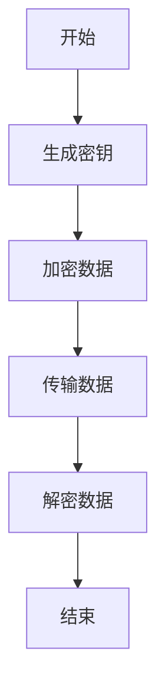

                 


# 巴菲特-芒格的量子加密通信投资：后量子时代的数据安全

## 关键词：巴菲特，芒格，量子加密通信，后量子时代，数据安全，投资策略，技术分析

## 摘要：  
在后量子时代，量子计算的崛起正在改变传统的加密技术格局。巴菲特和芒格的投资哲学为量子加密通信领域提供了独特的视角。本文将深入分析量子加密通信的技术原理、投资策略、风险管理和未来趋势，为投资者提供全面的指导。

---

# 第一部分: 巴菲特-芒格的量子加密通信投资概述

## 第1章: 量子加密通信的背景与重要性

### 1.1 量子加密通信的基本概念

#### 1.1.1 量子加密通信的定义  
量子加密通信是一种利用量子力学原理进行数据加密和传输的技术。其核心在于利用量子态的不可克隆性和纠缠性，确保信息的安全传输。

#### 1.1.2 量子加密通信的核心原理  
量子加密通信的核心原理包括：  
1. **量子叠加**：量子信息可以同时处于多个状态，这使得信息传输具有不确定性。  
2. **量子纠缠**：两个或多个量子系统之间存在纠缠关系，任何对其中一个系统的测量都会影响另一个系统。  
3. **量子密钥分发（QKD）**：通过量子态传输密钥，确保密钥的安全性。

#### 1.1.3 量子加密通信的优缺点  
- **优点**：安全性极高，难以被窃听和破解。  
- **缺点**：技术复杂，成本较高，目前仍处于发展阶段。

### 1.2 后量子时代的数据安全挑战

#### 1.2.1 后量子时代的定义  
后量子时代指的是量子计算技术成熟并广泛应用的时代，传统加密算法将面临被破解的风险。

#### 1.2.2 数据安全的现状与问题  
随着数字化进程的加快，数据安全问题日益突出。传统加密算法（如RSA、AES）虽然目前仍安全，但随着量子计算的发展，这些算法将面临被破解的风险。

#### 1.2.3 量子加密通信在后量子时代的地位  
量子加密通信被认为是后量子时代最安全的通信方式之一，能够有效应对量子计算的威胁。

### 1.3 巴菲特与芒格的投资哲学

#### 1.3.1 巴菲特的价值投资理念  
巴菲特的价值投资理念强调长期、稳健的投资，注重企业的内在价值和管理层质量。

#### 1.3.2 芒格的多元思维模型  
芒格的多元思维模型强调跨学科思考，注重从多个角度分析问题，以避免单一思维的局限性。

#### 1.3.3 两人投资风格的结合  
巴菲特和芒格的投资风格结合了长期价值投资和跨学科分析，为量子加密通信的投资提供了独特的视角。

---

## 第2章: 巴菲特与芒格的量子加密通信投资策略

### 2.1 量子加密通信的投资逻辑

#### 2.1.1 投资逻辑的核心要素  
- **技术可行性**：量子加密技术是否成熟可行。  
- **市场需求**：后量子时代对量子加密通信的需求是否足够大。  
- **企业竞争力**：相关企业的技术优势、市场占有率和管理能力。

#### 2.1.2 投资逻辑的优劣势分析  
- **优势**：量子加密通信技术具有极高的安全性，市场需求潜力巨大。  
- **劣势**：技术复杂，研发投入高，商业化周期长。

#### 2.1.3 投资逻辑的数学模型  
以下是巴菲特和芒格投资逻辑的简化数学模型：  
$$ \text{投资价值} = f(\text{技术可行性}, \text{市场需求}, \text{企业竞争力}) $$

### 2.2 巴菲特与芒格的投资决策框架

#### 2.2.1 投资决策的步骤  
1. **技术评估**：分析量子加密通信技术的成熟度和可行性。  
2. **市场分析**：评估后量子时代市场的需求和竞争格局。  
3. **企业分析**：研究相关企业的财务状况、管理团队和竞争优势。  
4. **风险评估**：识别和量化投资中的潜在风险。  
5. **决策制定**：基于综合分析做出投资决策。

#### 2.2.2 投资决策的关键指标  
- **技术指标**：量子加密通信的核心专利数量、技术团队实力。  
- **市场指标**：市场规模、增长率、竞争对手情况。  
- **财务指标**：企业盈利能力、现金流、资产负债率。

#### 2.2.3 投资决策的案例分析  
以IBM为例，其在量子计算领域的研发投入和技术积累是巴菲特和芒格投资的重要原因之一。

### 2.3 量子加密通信行业的投资机会

#### 2.3.1 行业现状与发展趋势  
量子加密通信行业目前处于快速发展阶段，但尚未完全商业化。预计未来几年将进入快速发展期。

#### 2.3.2 投资机会的识别  
- **技术驱动型公司**：拥有自主量子加密技术的企业。  
- **市场需求驱动型公司**：满足后量子时代市场需求的企业。  
- **政策支持型公司**：获得政府政策支持的量子通信企业。

#### 2.3.3 投资机会的评估  
通过技术可行性、市场需求和企业竞争力三个维度对投资机会进行评估。

---

## 第3章: 量子加密通信的技术分析

### 3.1 量子加密通信的核心技术

#### 3.1.1 量子密钥分发（QKD）  
量子密钥分发是量子加密通信的核心技术之一，通过量子态传输密钥，确保密钥的安全性。

#### 3.1.2 量子加密协议  
量子加密协议是量子加密通信的基础，包括密钥生成、加密和解密过程。

#### 3.1.3 量子纠错码  
量子纠错码用于纠正量子信息传输中的错误，确保信息的完整性。

### 3.2 量子加密通信的数学模型

#### 3.2.1 量子态的数学表示  
量子态可以表示为向量空间中的向量，例如：  
$$ |\psi\rangle = \alpha|0\rangle + \beta|1\rangle $$  

#### 3.2.2 量子纠缠的数学模型  
量子纠缠可以通过贝尔基表示为：  
$$ |\psi\rangle = \frac{|01\rangle - |10\rangle}{\sqrt{2}} $$  

#### 3.2.3 量子通信的数学公式  
量子通信的过程可以用以下公式表示：  
$$ \text{加密} = E(k, m) $$  
$$ \text{解密} = D(k, c) $$  

### 3.3 量子加密通信的算法原理

#### 3.3.1 量子加密算法的流程图  


#### 3.3.2 量子加密算法的实现代码  
```python
import numpy as np

def quantum_key_distribution(n):
    # 生成随机密钥
    key = np.random.randint(0, 2, n)
    return key

def encrypt(message, key):
    # 简单的加密算法
    encrypted = [message[i] ^ key[i] for i in range(len(message))]
    return encrypted

def decrypt(ciphertext, key):
    # 解密算法
    decrypted = [ciphertext[i] ^ key[i] for i in range(len(ciphertext))]
    return decrypted
```

#### 3.3.3 量子加密算法的优缺点  
- **优点**：安全性极高，难以被破解。  
- **缺点**：技术复杂，实现成本高。

---

## 第4章: 巴菲特与芒格的量子加密通信投资案例

### 4.1 巴菲特与芒格的经典投资案例

#### 4.1.1 IBM的投资案例  
IBM在量子计算领域的研发投入和技术积累是巴菲特和芒格投资的重要原因之一。

#### 4.1.2 英特尔的投资案例  
英特尔在量子芯片制造和量子计算研究方面的优势是吸引巴菲特和芒格投资的关键因素。

#### 4.1.3 其他相关案例分析  
包括其他在量子加密通信领域具有潜力的公司，如Google、微软等。

### 4.2 投资案例的分析与启示

#### 4.2.1 投资成功的经验总结  
- **技术领先**：投资公司必须在量子加密技术上具有领先地位。  
- **市场需求**：投资公司必须满足后量子时代的需求。  
- **财务健康**：公司财务状况稳健，具备持续研发的能力。

#### 4.2.2 投资失败的教训反思  
- **技术风险**：量子加密技术尚未完全成熟，存在失败的可能。  
- **市场风险**：市场需求可能不如预期，导致投资失败。

#### 4.2.3 投资案例的未来启示  
未来，量子加密通信技术将进一步发展，投资机会将更加多样化。

---

## 第5章: 量子加密通信的投资风险与管理

### 5.1 量子加密通信的主要风险

#### 5.1.1 技术风险  
量子加密技术尚未完全成熟，存在失败的可能。

#### 5.1.2 市场风险  
市场需求可能不如预期，导致投资失败。

#### 5.1.3 政策风险  
政策变化可能对量子加密通信行业产生重大影响。

### 5.2 投资风险的管理策略

#### 5.2.1 技术风险管理  
通过持续关注技术发展和研发投入，降低技术失败的风险。

#### 5.2.2 市场风险管理  
通过多元化投资和风险分散，降低市场波动的影响。

#### 5.2.3 政策风险管理  
通过关注政策动向和与政府沟通，降低政策变化的风险。

---

## 第6章: 结论与展望

### 6.1 结论  
量子加密通信是后量子时代数据安全的核心技术，巴菲特和芒格的投资哲学为量子加密通信的投资提供了独特的视角。

### 6.2 未来展望  
随着量子计算的快速发展，量子加密通信技术将进一步成熟，投资机会也将更加多样化。

---

## 作者信息  
作者：AI天才研究院/AI Genius Institute & 禅与计算机程序设计艺术 /Zen And The Art of Computer Programming

---

**注**：以上目录大纲和文章内容为示例，实际撰写时需根据具体需求调整内容深度和结构。

