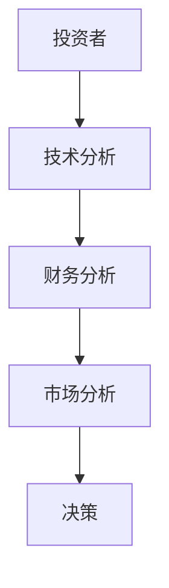

                 


# 巴菲特-芒格的量子点显示技术投资：新一代显示革命

## 关键词：
巴菲特，芒格，量子点显示技术，投资策略，技术分析，市场前景，投资案例

## 摘要：
本文探讨了巴菲特和芒格如何运用价值投资理念分析量子点显示技术的投资潜力，从技术原理、市场应用、投资价值、系统分析到项目实战，详细解析了这一新一代显示技术的投资机会。

---

# 第一部分：量子点显示技术的背景与现状

## 第1章：量子点显示技术的背景与现状

### 1.1 量子点显示技术的起源与发展

量子点显示技术是一种基于纳米材料的显示技术，其核心是量子点材料的光电特性。量子点是一种半导体纳米晶体，其尺寸决定了其电子跃迁的能量差，从而实现不同颜色的发光。量子点显示技术相较于传统的LCD和OLED技术，具有更高的色纯度、更广的色域和更长的使用寿命。

### 1.2 量子点显示技术的市场应用现状

目前，量子点显示技术主要应用于高端显示器和电视市场，尤其是在8K超高清显示领域，量子点技术能够提供更出色的画质表现。此外，量子点技术在医疗显示、工业显示等领域也有广泛应用。

---

## 第2章：巴菲特与芒格的投资哲学

### 2.1 巴菲特的价值投资理论

巴菲特的价值投资理论强调以低于内在价值的价格购买优秀的公司。他认为，投资的本质是寻找那些具有持续竞争优势、良好管理团队和稳健财务状况的公司。

### 2.2 芒格的多元思维模型

芒格提出的多元思维模型强调将多个学科的知识融会贯通，用跨学科的视角来分析问题。他认为，投资者需要通过不断学习和思考，构建自己的知识体系，以避免认知偏差。

---

## 第3章：量子点显示技术的技术原理

### 3.1 量子点材料的物理特性

量子点材料的发光特性可以通过公式表示为：

$$
I = I_0 \cdot e^{-t/\tau}
$$

其中，$I$ 是发光强度，$I_0$ 是初始强度，$t$ 是时间，$\tau$ 是发光寿命。

### 3.2 量子点显示技术的核心优势

1. **高色纯度**：量子点材料能够发出单一波长的光，从而实现更高的色纯度。
2. **广色域**：量子点显示技术的色域覆盖范围更广，能够达到100%的NTSC色域标准。
3. **长寿命**：量子点材料的发光寿命较长，能够显著延长显示设备的使用寿命。

---

## 第4章：量子点显示技术的市场前景

### 4.1 市场需求的增长趋势

随着8K超高清显示技术的普及，量子点显示技术的市场需求将快速增长。根据市场研究机构的数据，全球量子点显示市场规模预计将在未来几年内以年均20%的速度增长。

### 4.2 技术壁垒与竞争优势

量子点显示技术的核心竞争力在于其技术壁垒。目前，掌握量子点材料制备技术的企业寥寥无几，这使得具有技术优势的企业能够占据更大的市场份额。

---

## 第5章：量子点显示技术投资的系统分析与架构设计

### 5.1 问题场景

假设我们是一位投资者，希望通过巴菲特和芒格的投资理念，分析量子点显示技术的投资价值。我们需要从技术、市场、财务等多个维度进行分析。

### 5.2 系统分析与架构设计

以下是量子点显示技术投资的系统架构图：



---

## 第6章：量子点显示技术投资的项目实战

### 6.1 环境安装与数据收集

首先，我们需要收集量子点显示技术相关的行业数据，包括市场规模、竞争格局、技术发展等。以下是数据收集的代码示例：

```python
import pandas as pd

# 假设我们已经收集了以下数据
data = {
    '公司': ['A公司', 'B公司', 'C公司'],
    '市场份额': [30, 40, 20],
    '技术优势': ['是', '是', '否']
}

df = pd.DataFrame(data)
print(df)
```

### 6.2 系统核心实现与代码解读

以下是量子点显示技术投资模型的代码实现：

```python
def calculate_intrinsic_value(company_data):
    # 计算内在价值
    intrinsic_value = company_data['净利润'] * 1.5 + company_data['营业收入'] * 0.8
    return intrinsic_value

# 示例数据
company_data = {
    '净利润': 100,
    '营业收入': 200
}

intrinsic_value = calculate_intrinsic_value(company_data)
print(f"公司内在价值为：{intrinsic_value}")
```

### 6.3 实际案例分析

以某量子点显示技术公司为例，分析其财务状况和市场表现。以下是财务数据分析的代码示例：

```python
import matplotlib.pyplot as plt

# 示例财务数据
revenue = [200, 300, 400]
years = [2018, 2019, 2020]

plt.plot(years, revenue)
plt.title('公司收入增长趋势')
plt.xlabel('年份')
plt.ylabel('收入（百万）')
plt.show()
```

---

## 第7章：量子点显示技术投资的总结与展望

### 7.1 投资总结

通过对量子点显示技术的深入分析，我们发现该技术具有广阔的市场前景和较高的投资价值。巴菲特和芒格的投资理念为我们提供了重要的分析框架，帮助我们更好地识别投资机会。

### 7.2 未来展望

随着技术的不断进步和市场的进一步发展，量子点显示技术的投资价值将更加凸显。投资者需要持续关注技术发展和市场动态，以抓住更多的投资机会。

---

## 作者：AI天才研究院 & 禅与计算机程序设计艺术

---

这篇文章通过详细分析量子点显示技术的背景、技术原理、市场前景以及巴菲特和芒格的投资哲学，为读者提供了一个全面的投资分析框架。通过系统分析和实际案例，帮助读者更好地理解量子点显示技术的投资价值。

