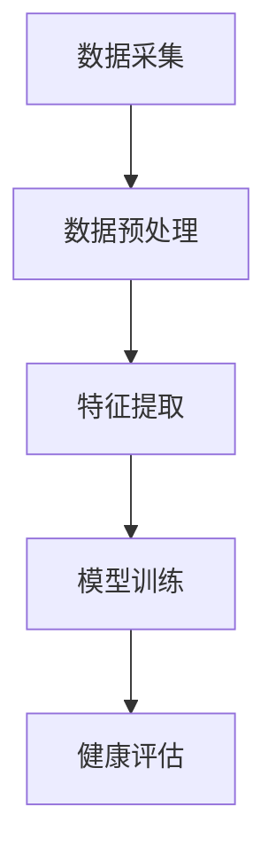
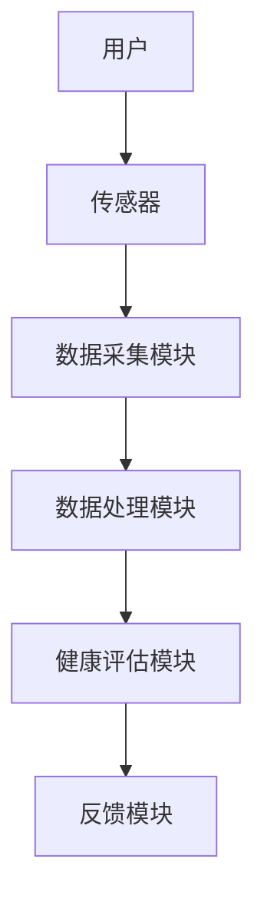

                 


# 巴菲特-芒格的量子生物传感器投资：健康监测的新范式

> 关键词：量子生物传感器，巴菲特，芒格，健康监测，投资策略

> 摘要：本文探讨了量子生物传感器在健康监测中的应用，结合巴菲特和芒格的投资哲学，分析了这一技术的投资价值和未来前景。文章从量子生物传感器的基本原理到其在健康监测中的实际应用，再到其对投资策略的影响进行了详细阐述。

---

## 第1章: 量子生物传感器的概述

### 1.1 量子生物传感器的基本概念

#### 1.1.1 量子传感器的定义与原理

量子传感器是一种利用量子力学原理进行测量的装置。它通过探测量子系统的变化来获取信息，具有极高的灵敏度和精度。量子传感器的核心在于其对量子态的操控和测量能力，例如利用量子纠缠、超冷原子或单光子干涉等技术。

在生物传感器领域，量子生物传感器将量子技术与生物检测相结合，能够实时监测生物体内的各种生理指标，如心率、体温、血糖、压力水平等。这种传感器不仅可以提供高精度的数据，还能在复杂环境中稳定工作。

#### 1.1.2 生物传感器的基本特性

生物传感器是一种能够检测生物分子或生理信号的装置，通常由生物识别元件和信号转换元件组成。生物识别元件可以是酶、抗体、核酸等生物活性物质，用于特异性地识别目标分子；信号转换元件则将生物识别元件的反应转化为可测量的信号，如电信号、光信号或化学信号。

生物传感器在医疗、环境监测和食品安全等领域有广泛应用。然而，传统生物传感器的灵敏度和选择性往往受到限制，难以满足高精度和实时监测的需求。

#### 1.1.3 量子生物传感器的优势与应用领域

量子生物传感器结合了量子技术和生物传感器的优点，具有以下优势：

1. **超高灵敏度**：量子传感器能够检测极低浓度的目标分子，适用于微量分析。
2. **快速响应**：量子传感器能够在极短时间内完成检测，适合实时监测。
3. **高选择性**：通过量子调控技术，传感器可以特异性地识别目标分子，减少干扰。
4. **小型化与便携性**：量子生物传感器体积小，适合 wearable devices 或移动医疗设备。

量子生物传感器的应用领域包括：

- **医疗健康**：实时监测患者的生理指标，如血糖、心率、体温等。
- **疾病早期预警**：通过检测生物标志物，提前发现疾病风险。
- **环境监测**：监测水、空气中的有害物质，保障公共健康。
- **食品安全**：检测食品中的有害成分，确保食品安全。

---

### 1.2 量子生物传感器的发展背景

#### 1.2.1 传统生物传感器的局限性

传统生物传感器在实际应用中面临以下挑战：

- **灵敏度不足**：传统传感器难以检测极低浓度的目标分子。
- **选择性差**：容易受到干扰物质的影响，导致误报。
- **稳定性问题**：在复杂环境中容易老化或失效。
- **成本较高**：高端生物传感器的价格昂贵，限制了其广泛应用。

#### 1.2.2 量子技术的进步与突破

近年来，量子技术的发展为生物传感器的性能提升提供了新的可能性。例如：

- **量子纠缠技术**：通过操控量子纠缠状态，提高传感器的灵敏度。
- **超冷原子技术**：利用超冷原子的量子态变化，实现高精度测量。
- **单光子探测技术**：通过单光子干涉，提高传感器的检测灵敏度。

这些技术的进步使得量子生物传感器的性能远超传统生物传感器。

#### 1.2.3 量子生物传感器的商业化进程

目前，量子生物传感器仍处于研发和测试阶段，尚未大规模商业化。但许多企业和研究机构已经在积极推动其商业化进程，特别是在医疗和健康监测领域。

---

### 1.3 量子生物传感器在健康监测中的应用

#### 1.3.1 健康监测的新范式

传统的健康监测依赖于定期体检和被动就医，而量子生物传感器的出现将推动健康监测向主动性和预防性方向发展。通过实时监测生理指标，可以提前发现潜在健康问题，实现个性化健康管理。

#### 1.3.2 量子生物传感器在医疗领域的潜力

量子生物传感器在医疗领域具有广泛的应用前景，例如：

- **实时监测慢性病患者**：如糖尿病患者的血糖监测，减少并发症风险。
- **术后康复监测**：实时跟踪患者的生理指标，优化康复方案。
- **疾病早期预警**：通过检测生物标志物，提前发现癌症、心脏病等疾病。

#### 1.3.3 投资视角下的健康监测技术

从投资角度来看，量子生物传感器的商业化将带来巨大的市场潜力。医疗健康市场规模庞大，且对创新技术的需求强烈。因此，量子生物传感器的投资价值不容忽视。

---

## 第2章: 巴菲特与芒格的投资哲学

### 2.1 巴菲特的价值投资理论

#### 2.1.1 巴菲特的价值投资理念

巴菲特的价值投资理论强调长期投资和安全边际。他认为，投资者应该投资那些具有持续竞争优势和良好管理的公司，而不是追求短期股价波动。

#### 2.1.2 芒格的多元思维模型

芒格的多元思维模型强调跨学科思考，认为投资者应该从多个角度分析问题，避免单一思维的局限性。

#### 2.1.3 长期主义与科技创新

巴菲特和芒格都强调长期投资的重要性，尤其是在科技创新领域。他们认为，具有革命性技术创新的公司能够为投资者带来长期的超额回报。

---

### 2.2 巴菲特与芒格对科技创新的关注

#### 2.2.1 科技创新在投资中的重要性

科技创新是推动经济增长的核心动力。巴菲特和芒格都意识到，那些能够持续创新的公司具有更大的投资价值。

#### 2.2.2 量子生物传感器的投资价值

量子生物传感器作为一种革命性技术，具有广阔的市场前景。其在医疗健康领域的应用将推动整个行业的发展，为投资者带来丰厚的回报。

#### 2.2.3 技术驱动型企业的识别与评估

巴菲特和芒格认为，投资者应该选择那些在技术和市场上具有竞争优势的企业。量子生物传感器领域的创新企业符合这一标准。

---

## 第3章: 量子生物传感器的核心技术原理

### 3.1 量子力学与生物传感器的结合

#### 3.1.1 量子力学的基本概念

量子力学是研究微观粒子行为的学科，主要包括波函数、量子态、量子纠缠等核心概念。

#### 3.1.2 生物传感器的工作原理

生物传感器通过生物识别元件与目标分子的特异性结合，将生物信号转化为可测量的物理信号。

#### 3.1.3 量子生物传感器的创新机制

量子生物传感器通过量子调控技术，实现了对生物分子的高精度检测。例如，利用量子纠缠状态的变化来反映目标分子的存在。

---

### 3.2 量子生物传感器的关键技术

#### 3.2.1 量子纠缠技术

量子纠缠是量子力学中的一个重要现象，两个或多个粒子可以通过纠缠状态实现信息的瞬时传递。在量子生物传感器中，纠缠状态的变化可以用来检测目标分子的存在。

#### 3.2.2 单光子探测技术

单光子探测技术利用单光子的干涉现象，实现对目标分子的高灵敏度检测。这种技术在生物传感器中的应用可以显著提高检测灵敏度。

#### 3.2.3 超冷原子技术

超冷原子技术通过冷却原子到极低温度，使其进入量子态，从而实现高精度的测量。这种技术在量子传感器中的应用为生物传感器提供了更高的灵敏度和稳定性。

---

## 第4章: 量子生物传感器的算法原理

### 4.1 量子生物传感器的信号处理算法

#### 4.1.1 数据采集与预处理

量子生物传感器的数据采集过程需要对信号进行实时采集和预处理，以消除噪声和干扰。

#### 4.1.2 基于机器学习的信号分析

通过机器学习算法，可以对量子生物传感器的数据进行深度分析，识别潜在的健康问题。

#### 4.1.3 算法流程图



---

### 4.2 量子生物传感器的数学模型

#### 4.2.1 数据分析的数学模型

量子生物传感器的数据分析可以基于以下数学模型：

$$
y = \beta x + \epsilon
$$

其中，$y$ 是目标变量，$x$ 是自变量，$\beta$ 是回归系数，$\epsilon$ 是误差项。

#### 4.2.2 机器学习模型的优化

通过优化算法（如梯度下降）可以提高机器学习模型的预测精度。

---

## 第5章: 系统架构与项目实战

### 5.1 量子生物传感器健康监测系统的设计

#### 5.1.1 系统功能设计

健康监测系统的主要功能包括：

- 数据采集与传输
- 数据分析与处理
- 健康评估与反馈

#### 5.1.2 系统架构图



---

### 5.2 项目实战

#### 5.2.1 环境配置

项目实战需要以下环境：

- 操作系统：Linux
- 开发工具：Python、TensorFlow
- 数据库：MySQL

#### 5.2.2 核心代码实现

以下是量子生物传感器数据处理的Python代码示例：

```python
import numpy as np
import pandas as pd

# 数据加载
data = pd.read_csv('sensor_data.csv')

# 数据预处理
data_processed = data.dropna()

# 特征提取
features = data_processed[['heart_rate', 'temperature']]

# 模型训练
from sklearn.linear_model import LinearRegression
model = LinearRegression()
model.fit(features, data_processed['health_score'])

# 模型预测
predictions = model.predict(features)
```

---

## 第6章: 最佳实践与投资建议

### 6.1 最佳实践 tips

- 选择具有核心技术优势的企业进行投资。
- 关注企业的研发能力和市场前景。
- 保持长期投资视角，避免短期波动影响。

### 6.2 小结

量子生物传感器作为一种革命性技术，将在健康监测领域发挥重要作用。投资者应该抓住这一技术的商业化机遇，布局相关企业。

### 6.3 注意事项

- 量子生物传感器仍处于研发阶段，存在技术和市场风险。
- 投资者需要关注企业的技术研发能力和市场竞争力。

### 6.4 拓展阅读

- 推荐阅读巴菲特和芒格的著作，深入了解他们的投资哲学。
- 关注量子计算和生物技术领域的最新进展。

---

## 第7章: 结论

量子生物传感器的出现为健康监测领域带来了新的可能性。通过结合巴菲特和芒格的投资哲学，投资者可以更好地把握这一技术的商业价值。未来，随着量子生物传感器技术的不断进步，健康监测将进入一个全新的时代。

---

## 作者：AI天才研究院/AI Genius Institute & 禅与计算机程序设计艺术 /Zen And The Art of Computer Programming

---

这篇文章详细介绍了量子生物传感器的核心原理、应用场景以及投资价值，结合了技术分析和投资哲学，为读者提供了全面的视角。

