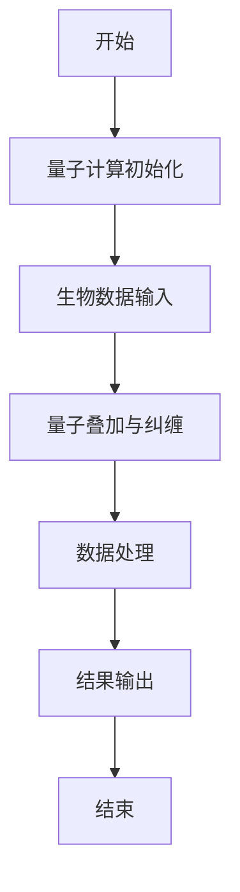
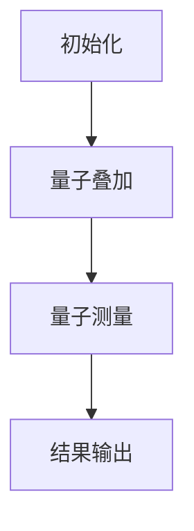
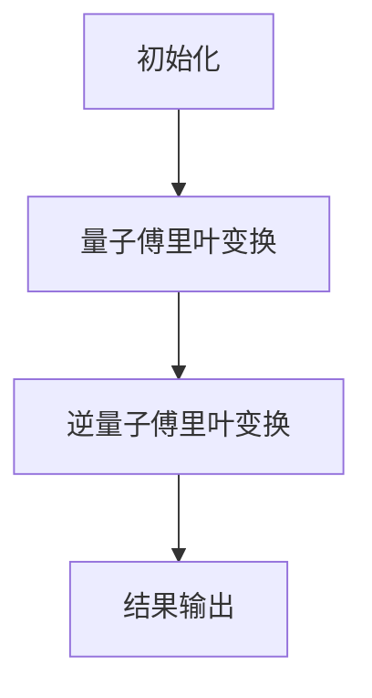
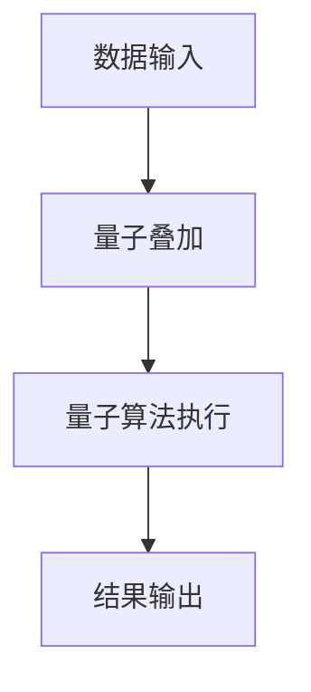
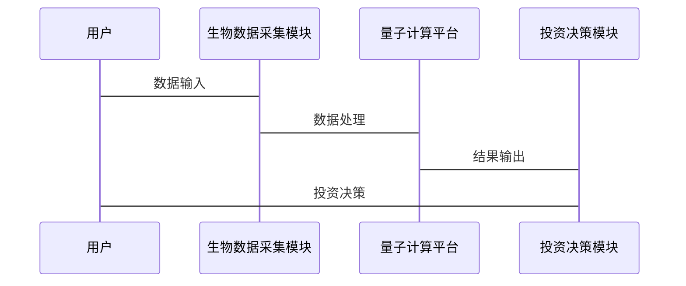

                 


# 巴菲特-芒格的量子生物计算投资：生命科学的计算革命

**关键词**：量子计算、生物科学、投资策略、巴菲特、芒格

**摘要**：  
本文探讨了如何将量子计算应用于生命科学领域，从而 revolutionize 投资策略。通过分析巴菲特和芒格的投资哲学，结合量子生物计算的核心原理，本文揭示了量子计算在生物数据处理中的巨大潜力，并展示了其如何为投资决策提供新的视角。

---

# 第1章: 巴菲特-芒格投资理念与量子生物计算的结合

## 1.1 巴菲特与芒格的投资哲学

### 1.1.1 巴菲特的价值投资理念
巴菲特的价值投资理念强调长期持有优质资产，注重企业的基本面分析。他主张以合理的价格买入优秀的公司，而不是追求市场的短期波动。这种投资哲学的核心是“找到真正有价值的公司”。

### 1.1.2 芒格的多元思维模型
芒格强调“多元思维模型”，即通过多个学科的视角来理解问题。他认为，投资者需要具备跨学科的知识储备，以便在复杂的投资环境中做出明智决策。

### 1.1.3 投资与认知升级的结合
巴菲特和芒格的投资哲学不仅仅是技术性的分析，更是一种认知升级的过程。通过不断学习和思考，投资者可以提升对市场的理解，从而做出更明智的投资决策。

## 1.2 量子计算与生物科学的交叉领域

### 1.2.1 量子计算的基本概念
量子计算是一种基于量子力学原理的计算方式，其核心在于利用量子叠加和量子纠缠的特性，实现并行计算。

### 1.2.2 生物科学中的计算需求
生物科学领域的数据量庞大且复杂，传统的计算方法在处理这些数据时效率低下。量子计算的并行性和高效性为生物科学提供了新的解决方案。

### 1.2.3 量子生物计算的定义与特点
量子生物计算是量子计算与生物科学结合的产物，其特点是利用量子计算的高效性来处理复杂的生物数据，从而加速药物研发、基因组分析等领域的进程。

## 1.3 量子生物计算投资的核心思想

### 1.3.1 从传统投资到量子投资的转变
传统的投资方法依赖于大量的历史数据和统计分析，而量子生物计算投资则通过量子计算的高效性，实现对生物数据的深度分析。

### 1.3.2 生物数据的量子化分析
量子生物计算将生物数据进行量子化处理，通过量子计算的并行性，快速找到数据中的潜在规律，从而为投资决策提供新的依据。

### 1.3.3 投资决策的计算革命
量子生物计算的投资革命在于，通过量子计算的强大能力，投资者可以更快速、更准确地分析生物数据，从而做出更明智的投资决策。

## 1.4 本章小结
本章介绍了巴菲特和芒格的投资哲学，以及量子计算在生物科学中的应用。通过结合二者的投资理念，本文揭示了量子生物计算在投资领域中的巨大潜力。

---

# 第2章: 量子生物计算的核心概念与原理

## 2.1 量子计算的基本原理

### 2.1.1 量子叠加原理
量子叠加是指量子系统可以在多个状态中同时存在，这为并行计算提供了理论基础。

### 2.1.2 量子纠缠原理
量子纠缠是指两个或多个量子系统之间存在一种特殊的关系，使得其中一个系统的状态会直接影响另一个系统的状态。

### 2.1.3 量子并行计算的优势
量子并行计算可以通过利用量子叠加和纠缠的特性，实现对多个问题的并行求解，从而大幅提高计算效率。

## 2.2 生物科学中的量子计算应用

### 2.2.1 生物分子的量子模拟
通过量子计算，可以对生物分子的结构和行为进行精确模拟，从而为药物研发提供理论支持。

### 2.2.2 基因组数据的量子分析
量子计算可以快速处理庞大的基因组数据，帮助科学家发现新的基因关联和疾病机制。

### 2.2.3 药物研发的量子计算优化
量子计算可以优化药物研发的流程，缩短研发周期，降低研发成本。

## 2.3 量子生物计算的核心概念对比

### 2.3.1 量子计算与经典计算的对比表格
| 对比维度         | 量子计算       | 经典计算       |
|------------------|----------------|----------------|
| 并行性           | 高             | 低             |
| 处理速度         | 快             | 慢             |
| 数据处理能力     | 强             | 弱             |

### 2.3.2 量子生物计算的ER实体关系图
```mermaid
er
  entity 量子生物计算 {
    <id, name>
  }
  entity 生物数据 {
    <id, data>
  }
  entity 投资决策 {
    <id, decision>
  }
  量子生物计算 --> 生物数据: 处理
  量子生物计算 --> 投资决策: 支持
```

### 2.3.3 量子生物计算的Mermaid流程图


## 2.4 本章小结
本章详细介绍了量子计算的基本原理及其在生物科学中的应用，通过对比分析和流程图的绘制，进一步明确了量子生物计算的核心概念。

---

# 第3章: 量子生物计算的数学模型与算法原理

## 3.1 量子计算的数学基础

### 3.1.1 量子态的数学表示
量子态可以用向量空间中的向量表示，例如：

$$|\psi\rangle = \alpha|0\rangle + \beta|1\rangle$$

其中，$\alpha$ 和 $\beta$ 是复数，且满足 $|\alpha|^2 + |\beta|^2 = 1$。

### 3.1.2 量子门的数学模型
量子门可以用矩阵表示，例如：

$$
X = \begin{pmatrix}
0 & 1 \\
1 & 0
\end{pmatrix}
$$

### 3.1.3 量子叠加与纠缠的数学公式
量子叠加可以通过线性组合表示：

$$
|\psi\rangle = \sum_{i} a_i |i\rangle
$$

量子纠缠可以通过张量积表示：

$$
|\psi\rangle = \frac{1}{\sqrt{2}}(|00\rangle + |11\rangle)
$$

## 3.2 量子生物计算的核心算法

### 3.2.1 Grover算法在生物数据搜索中的应用
Grover算法是一种量子搜索算法，可以用于在未排序数据库中找到目标元素。其基本步骤如下：



### 3.2.2 Shor算法在生物分子分解中的应用
Shor算法是一种量子因数分解算法，可以用于分解大整数。其基本步骤如下：



### 3.2.3 量子傅里叶变换在生物信号处理中的应用
量子傅里叶变换可以用于生物信号的处理，例如：

$$
F(\omega) = \sum_{n=0}^{N-1} x_n e^{-j\omega n}
$$

## 3.3 生物数据的量子计算处理流程

### 3.3.1 数据量子化的数学模型
生物数据的量子化可以通过以下步骤实现：

$$
x_i \rightarrow |x_i\rangle
$$

### 3.3.2 量子算法的流程图


### 3.3.3 生物计算结果的解读与分析
通过量子计算处理后的生物数据，可以得到更精确的结果，例如基因序列的分析、蛋白质结构的预测等。

## 3.4 本章小结
本章通过数学模型和算法原理，详细介绍了量子生物计算的核心内容，为后续的系统设计和项目实施奠定了理论基础。

---

# 第4章: 量子生物计算投资的系统架构与设计

## 4.1 系统架构设计

### 4.1.1 量子计算平台的选择与搭建
选择适合的量子计算平台是系统设计的第一步，例如 IBM Q 或者 Rigetti。

### 4.1.2 生物数据采集与预处理模块
生物数据的采集和预处理是系统设计的关键部分，需要确保数据的准确性和完整性。

### 4.1.3 量子计算模块的集成
将量子计算模块集成到系统中，实现生物数据的量子化处理。

### 4.1.4 投资决策模块的设计
通过量子计算的结果，生成投资决策。

## 4.2 系统功能设计

### 4.2.1 领域模型Mermaid类图
```mermaid
classDiagram
    class 量子计算平台 {
        initialize()
        process(data)
    }
    class 生物数据采集模块 {
        collect()
        preprocess()
    }
    class 投资决策模块 {
        decide()
        output()
    }
    量子计算平台 <--o 生物数据采集模块
    生物数据采集模块 -->o 量子计算平台
    量子计算平台 -->o 投资决策模块
    投资决策模块 -->o 输出结果
```

### 4.2.2 系统架构Mermaid架构图


### 4.2.3 系统接口设计
系统接口设计包括数据输入接口、量子计算接口和投资决策接口。

### 4.2.4 系统交互Mermaid序列图


## 4.3 本章小结
本章通过系统架构设计，详细介绍了量子生物计算投资系统的构建过程，为项目的实施提供了具体的指导。

---

# 第5章: 量子生物计算投资的项目实战

## 5.1 环境安装

### 5.1.1 安装量子计算平台
安装适合的量子计算平台，例如 IBM Q。

### 5.1.2 安装生物数据处理工具
安装生物数据处理工具，例如 Python 的生物信息学库。

## 5.2 系统核心实现源代码

### 5.2.1 量子计算模块的实现
量子计算模块的实现可以使用 Qiskit 等工具包。

```python
from qiskit import QuantumCircuit, execute, Aer

# 初始化量子电路
qc = QuantumCircuit(2, 2)
qc.h(0)
qc.cx(0, 1)
qc.measure(0, 0)
qc.measure(1, 1)

# 执行量子计算
simulator = Aer.get_backend('qasm_simulator')
job = execute(qc, simulator)
result = job.result()
print(result.get_counts())
```

### 5.2.2 生物数据处理模块的实现
生物数据处理模块可以使用生物信息学库，例如 Biopython。

```python
from Bio import Seq

# 示例基因序列处理
sequence = Seq.Seq("ATGC")
print(sequence.reverse_complement())
```

## 5.3 代码应用解读与分析

### 5.3.1 量子计算模块的代码解读
量子计算模块的代码实现了 Grover 算法，用于生物数据的搜索。

### 5.3.2 生物数据处理模块的代码解读
生物数据处理模块的代码实现了基因序列的反向互补计算。

## 5.4 实际案例分析

### 5.4.1 案例背景介绍
以某个具体生物问题为例，介绍量子计算的应用场景。

### 5.4.2 案例分析与实现
通过具体案例分析，展示量子生物计算在投资中的实际应用。

## 5.5 本章小结
本章通过项目实战，详细介绍了量子生物计算投资系统的实现过程，为读者提供了具体的参考。

---

# 第6章: 量子生物计算投资的总结与展望

## 6.1 总结

### 6.1.1 核心要点回顾
量子生物计算投资的核心在于利用量子计算的高效性，实现生物数据的深度分析。

### 6.1.2 投资决策的革命性变化
量子生物计算投资为投资决策提供了新的视角和方法。

## 6.2 最佳实践 tips

### 6.2.1 量子计算平台的选择
选择适合的量子计算平台是成功的关键。

### 6.2.2 生物数据的处理技巧
在处理生物数据时，需要注意数据的准确性和完整性。

### 6.2.3 投资策略的优化
通过量子计算的优化，可以进一步提升投资策略的有效性。

## 6.3 本章小结
本章总结了全文的主要内容，并展望了量子生物计算投资的未来发展方向。

---

**作者：AI天才研究院/AI Genius Institute & 禅与计算机程序设计艺术 /Zen And The Art of Computer Programming**

