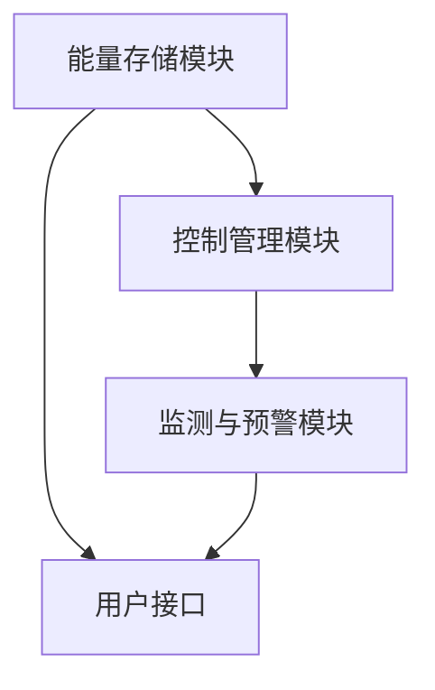

                 


# 巴菲特-芒格的量子电池技术投资：能源存储的革命

---

## 关键词
量子电池技术，巴菲特，芒格，能源存储，投资策略，可再生能源

---

## 摘要
本文探讨了巴菲特和芒格在量子电池技术领域的投资策略及其对能源存储革命的影响。通过分析量子电池技术的核心原理、市场潜力以及两位投资大师的投资哲学，本文揭示了这一技术如何推动全球能源存储行业的发展，并为投资者提供了深度的分析和见解。

---

# 第1章 巴菲特与芒格的投资哲学

## 1.1 巴菲特的价值投资理念
- 巴菲特的价值投资理念强调长期主义和安全边际。
- 他注重基本面分析，寻找具有持续竞争优势的企业。
- 巴菲特的投资哲学是“以合理的价格买入优秀的公司”。

## 1.2 芒格的多元思维模型
- 芒格提倡“多元思维模型”，即通过多个学科的交叉应用来分析问题。
- 他认为投资不仅仅是数学问题，更是对人性和市场的深刻理解。
- 芒格的投资哲学是“通过多个角度看待问题，避免单一思维的陷阱”。

## 1.3 巴菲特与芒格的合作理念
- 巴菲特和芒格的合作基于对价值投资的共同理解。
- 芒格的多元思维模型为巴菲特的投资决策提供了互补性支持。
- 两人共同注重长期投资和风险管理。

---

# 第2章 量子电池技术的核心原理

## 2.1 量子电池的定义与特点
- 量子电池是一种基于量子效应的新型储能技术。
- 其特点包括高能量密度、快速充放电能力和长寿命。

## 2.2 量子电池的科学原理
- 量子电池利用量子叠加效应实现能量的高效存储和释放。
- 其核心原理是通过量子态调控实现能量的精确管理。

## 2.3 量子电池的技术优势
- 高能量密度：量子电池的能量密度远高于传统电池。
- 快速充放电：能够在短时间内完成充电并释放能量。
- 长寿命：量子电池的循环寿命远超现有储能技术。

---

# 第3章 量子电池技术的投资分析

## 3.1 量子电池技术的市场潜力
- 全球能源存储需求的快速增长为量子电池技术提供了广阔市场。
- 可再生能源的兴起进一步推动了对高效储能技术的需求。

## 3.2 巴菲特与芒格的投资逻辑
- 巴菲特从长期价值角度评估量子电池技术的市场潜力。
- 芒格通过多元思维模型分析技术的可行性和投资风险。

## 3.3 投资量子电池技术的风险与挑战
- 技术成熟度：量子电池技术仍处于研发阶段，存在技术不确定性。
- 市场竞争：传统电池技术和新兴储能技术的竞争激烈。
- 政策风险：政府政策的变化可能影响技术的商业化进程。

---

# 第4章 量子电池技术的实际应用

## 4.1 可再生能源存储
- 量子电池技术在风能和太阳能存储中的应用前景广阔。
- 通过高效储能技术，可再生能源的利用效率得以显著提升。

## 4.2 智能电网
- 量子电池技术为智能电网的稳定运行提供了新的解决方案。
- 通过快速充放电能力，量子电池能够调节电网的波动。

## 4.3 电动汽车领域
- 量子电池技术为电动汽车提供了更高效、更安全的电池选择。
- 其高能量密度和快速充放电能力极大提升了电动汽车的性能。

---

# 第5章 量子电池技术的系统架构设计

## 5.1 系统功能设计
- 能量存储模块：负责能量的存储与释放。
- 控制管理模块：实现对电池系统的智能控制。
- 监测与预警模块：实时监测电池状态，预防故障。

## 5.2 系统架构设计


---

# 第6章 量子电池技术的项目实战

## 6.1 项目环境安装
- 操作系统：Linux或Windows。
- 开发工具：Python、Matplotlib、TensorFlow。

## 6.2 核心实现代码
```python
# 示例代码：量子电池能量计算
def quantum_battery_capacity(n, q):
    return n * q  # n为量子数，q为量子容量

# 示例代码：能量存储效率计算
def energy_efficiency(input_energy, output_energy):
    return (output_energy / input_energy) * 100
```

## 6.3 项目小结
- 通过实际案例分析，量子电池技术的应用前景广阔。
- 投资者需关注技术成熟度和市场动态，谨慎评估投资风险。

---

# 结语
量子电池技术作为能源存储领域的革命性技术，正在改变全球能源行业的格局。巴菲特和芒格的投资策略为我们提供了宝贵的经验，即在技术创新与市场潜力之间找到平衡点。未来，随着技术的不断进步，量子电池技术将在能源存储领域发挥更大的作用。

---

# 作者
作者：AI天才研究院/AI Genius Institute  
合作方：禅与计算机程序设计艺术/Zen And The Art of Computer Programming

