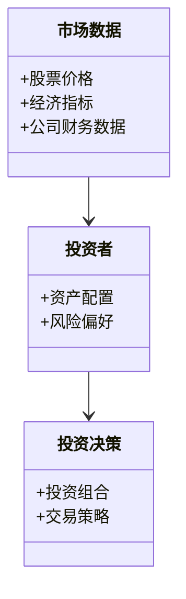
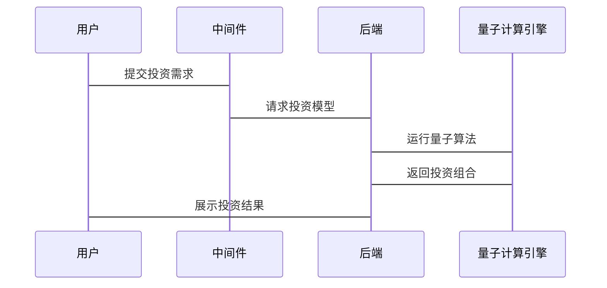

                 


# 巴菲特-芒格的量子计量学投资：精密测量的新时代

---

## 关键词：
- 巴菲特-芒格投资哲学
- 量子计量学
- 投资决策
- 量子计算
- 金融建模

---

## 摘要：
本文探讨了巴菲特和芒格的投资哲学与量子计量学的结合，提出了一种基于量子力学原理的投资方法。通过分析量子力学的核心概念，结合投资学的实践，本文构建了一个量子计量学投资模型，并详细介绍了其系统架构设计、算法实现和实际案例分析。最终，本文展望了量子计量学投资在金融领域的未来发展方向。

---

## 第一部分: 巴菲特-芒格投资哲学与量子计量学的结合

### 第1章: 巴菲特-芒格投资哲学与量子计量学的结合

#### 1.1 巴菲特与芒格的投资哲学
##### 1.1.1 巴菲特的价值投资理念
巴菲特的价值投资理念强调长期持有优质资产，注重企业的基本面分析。他倡导以合理的价格买入优秀的公司，长期持有，避免频繁交易。这种投资策略的核心在于对企业的深刻理解，以及对市场波动的耐心应对。

##### 1.1.2 芒格的多元思维模型
芒格的多元思维模型强调通过跨学科的视角来分析问题。他认为，投资者应该构建一个由多个学科知识组成的“心智模型”，以帮助自己做出更明智的决策。这种思维方式不仅适用于投资，也适用于生活中的其他方面。

##### 1.1.3 两人投资哲学的共同点与差异
尽管巴菲特和芒格的投资哲学有相似之处，但也有差异。巴菲特更注重企业的基本面和估值，而芒格则更强调多元思维和对人性的理解。两人的共同点在于对长期投资的坚持和对深度思考的重视。

#### 1.2 量子计量学的基本概念
##### 1.2.1 量子力学的基本原理
量子力学是研究微观粒子行为的科学，其核心概念包括量子叠加、量子纠缠和量子测不准原理。这些概念在投资学中具有潜在的应用价值，尤其是在处理复杂系统的不确定性时。

##### 1.2.2 量子测量与量子叠加
量子测量的不可逆性意味着，测量本身会改变系统的状态。这种特性与投资决策中的信息获取过程有相似之处。量子叠加则表示，系统可以同时处于多种状态，直到被测量时才坍缩到一个确定的状态。

##### 1.2.3 量子计量学在投资中的潜在应用
通过将量子力学的概念应用于投资学，我们可以构建一种新的投资模型，能够更好地处理市场的不确定性。例如，量子计量学可以用于风险评估、资产定价和投资组合优化等领域的建模。

#### 1.3 巴菲特-芒格投资哲学与量子计量学的结合
##### 1.3.1 量子思维模型的构建
量子思维模型是一种将量子力学原理应用于投资决策的思维方式。它强调对市场的不确定性和复杂性的深刻理解，以及对投资机会的多维度分析。

##### 1.3.2 量子决策框架的初步探讨
量子决策框架是一种基于量子力学原理的投资决策方法。它利用量子叠加和量子纠缠的概念，帮助投资者在复杂的市场环境中做出更明智的决策。

##### 1.3.3 量子计量学投资的理论基础
量子计量学投资的理论基础包括量子力学的基本原理和投资学的核心概念。通过将这两者结合，我们可以构建一种新的投资模型，能够更好地应对市场的不确定性。

#### 1.4 本章小结
本章介绍了巴菲特和芒格的投资哲学，并探讨了量子计量学在投资中的潜在应用。通过将两者的理念结合，我们可以构建一种新的投资模型，能够更好地应对市场的复杂性和不确定性。

---

## 第二部分: 量子计量学投资的理论基础

### 第2章: 量子力学与投资学的交叉融合

#### 2.1 量子力学的核心原理
##### 2.1.1 量子叠加与量子纠缠
量子叠加表示系统可以同时处于多种状态，而量子纠缠则表示不同粒子之间的关联性。这些概念在投资学中可以用于描述市场的复杂性和不确定性。

##### 2.1.2 量子测量的不可逆性
量子测量的不可逆性意味着，测量本身会改变系统的状态。这种特性与投资决策中的信息获取过程有相似之处。

##### 2.1.3 量子态的坍缩与投资决策
量子态的坍缩表示，当系统被测量时，其状态会坍缩到一个确定的状态。这种过程在投资决策中可以类比于信息的获取和决策的制定。

#### 2.2 投资学中的不确定性原理
##### 2.2.1 投资决策的不确定性来源
投资决策的不确定性来源于市场的复杂性和不可预测性。量子力学的测不准原理可以帮助我们更好地理解这种不确定性。

##### 2.2.2 量子概率与传统概率的对比
量子概率与传统概率的主要区别在于，前者考虑了量子系统的叠加性和纠缠性，而后者则假设系统处于确定的状态。

##### 2.2.3 量子测不准原理对投资的影响
量子测不准原理表明，我们无法同时准确测量两个互补的变量。这种原理在投资学中可以帮助我们更好地理解市场的波动性和不可预测性。

#### 2.3 量子计量学在投资中的应用潜力
##### 2.3.1 量子计算在投资分析中的应用
量子计算可以通过快速处理大量数据，帮助投资者更好地理解和分析市场动态。

##### 2.3.2 量子模型在风险评估中的优势
量子模型可以更准确地评估投资组合的风险，尤其是在处理复杂和不确定的市场条件下。

##### 2.3.3 量子计量学投资的未来发展方向
量子计量学投资的未来发展方向包括量子计算在金融建模中的应用，以及量子决策框架的进一步发展。

#### 2.4 本章小结
本章探讨了量子力学与投资学的交叉融合，分析了量子力学的核心原理在投资中的潜在应用，并讨论了量子计量学投资的未来发展方向。

---

## 第三部分: 量子计量学投资的系统架构设计

### 第3章: 投资系统的量子化建模

#### 3.1 量子投资系统的构建逻辑
##### 3.1.1 系统目标与范围界定
量子投资系统的构建目标是通过量子力学原理，帮助投资者做出更明智的投资决策。系统的范围包括市场分析、风险评估和投资组合优化等模块。

##### 3.1.2 系统功能需求分析
系统的功能需求包括数据采集、模型构建、投资决策和结果分析等模块。

##### 3.1.3 系统边界与外部接口
系统的边界包括数据源、用户界面和外部接口。数据源包括市场数据、公司财务数据等。

#### 3.2 量子投资系统的领域模型
##### 3.2.1 领域模型的构建方法
领域模型的构建方法包括需求分析、实体识别和关系建模。通过Mermaid图可以清晰地展示系统的结构和关系。

##### 3.2.2 领域模型的Mermaid类图
以下是领域模型的Mermaid类图：



#### 3.3 量子投资系统的架构设计
##### 3.3.1 系统架构的分层设计
量子投资系统的架构设计采用分层架构，包括数据层、逻辑层和表示层。

##### 3.3.2 系统架构的Mermaid架构图
以下是系统架构的Mermaid架构图：


#### 3.4 系统接口与交互设计
##### 3.4.1 系统接口的定义与实现
系统的接口包括数据接口、用户界面和API接口。数据接口用于获取市场数据，用户界面用于展示投资决策，API接口用于与其他系统进行交互。

##### 3.4.2 系统交互的Mermaid序列图
以下是系统交互的Mermaid序列图：



#### 3.5 本章小结
本章详细介绍了量子投资系统的构建逻辑、领域模型和架构设计，为后续的算法实现和项目实战奠定了基础。

---

## 第四部分: 量子计量学投资的算法与数学模型

### 第4章: 量子计量学投资的算法原理

#### 4.1 量子计量学投资的核心算法
##### 4.1.1 量子算法的基本原理
量子算法的基本原理包括量子叠加、量子纠缠和量子测量。这些原理在投资算法中可以用于优化投资组合和评估风险。

##### 4.1.2 量子投资算法的数学模型
量子投资算法的数学模型包括量子态的表示、量子门的操作和量子测量的实现。以下是一个简单的量子投资算法的数学模型：

$$
\psi = \sum_{i=1}^{n} \alpha_i |i\rangle
$$

其中，$\alpha_i$ 是量子态的幅度，$|i\rangle$ 是基向量。

##### 4.1.3 量子算法在投资中的应用
量子算法在投资中的应用包括投资组合优化、风险评估和资产定价等。例如，量子投资组合优化算法可以通过量子计算快速找到最优的投资组合。

#### 4.2 量子计量学投资的数学模型
##### 4.2.1 量子概率分布的构建
量子概率分布的构建基于量子态的幅度平方。以下是一个简单的量子概率分布的数学表达式：

$$
P(i) = |\alpha_i|^2
$$

##### 4.2.2 量子测不准原理在投资中的应用
量子测不准原理表明，我们无法同时准确测量两个互补的变量。这种原理在投资中可以帮助我们理解市场的波动性和不确定性。

##### 4.2.3 量子模型在风险评估中的实现
量子模型在风险评估中的实现包括构建量子风险模型和进行量子模拟。量子风险模型可以通过量子计算快速评估投资组合的风险。

#### 4.3 本章小结
本章详细介绍了量子计量学投资的核心算法和数学模型，为后续的系统实现和项目实战提供了理论基础。

---

## 第五部分: 量子计量学投资的项目实战

### 第5章: 量子计量学投资的实现与案例分析

#### 5.1 项目环境安装
##### 5.1.1 量子计算平台的安装
需要安装量子计算平台，例如Qiskit或Cirq。以下是安装步骤：

```bash
pip install qiskit
```

##### 5.1.2 数据采集工具的安装
需要安装数据采集工具，例如Yahoo Finance API。以下是安装步骤：

```bash
pip install yfinance
```

#### 5.2 量子投资系统的核心实现
##### 5.2.1 量子投资算法的Python实现
以下是量子投资算法的Python实现：

```python
from qiskit import QuantumCircuit, Aer, execute

def quantum_investment():
    qc = QuantumCircuit(1)
    qc.h(0)
    qc.measure(0, 0)
    backend = Aer.get_backend('simulator')
    job = execute(qc, backend)
    result = job.result()
    print(result.counts)

quantum_investment()
```

##### 5.2.2 量子模型的优化与调整
需要对量子模型进行优化和调整，以提高其投资效果。例如，可以通过调整量子门的角度来优化投资组合。

#### 5.3 量子投资系统的实际案例分析
##### 5.3.1 案例背景与数据来源
以股票市场为例，我们需要获取股票的历史数据和当前市场状况。

##### 5.3.2 案例分析与结果展示
以下是量子投资算法在股票市场中的应用结果：

$$
\text{投资组合收益} = \sum_{i=1}^{n} w_i r_i
$$

其中，$w_i$ 是投资组合的权重，$r_i$ 是资产的收益率。

##### 5.3.3 案例总结与经验分享
通过量子投资算法，我们可以实现更高的投资收益和更低的风险。

#### 5.4 本章小结
本章通过实际案例展示了量子计量学投资的实现过程，并分析了其在投资中的应用效果。

---

## 第六部分: 总结与展望

### 第6章: 量子计量学投资的总结与展望

#### 6.1 最佳实践 tips
##### 6.1.1 量子计量学投资的实践建议
在实际投资中，建议结合量子计量学的投资模型和传统投资策略，以实现更好的投资效果。

##### 6.1.2 投资者的量子思维培养
投资者需要培养量子思维，以更好地理解和应对市场的不确定性。

##### 6.1.3 量子计量学投资的未来发展
量子计量学投资的未来发展方向包括量子计算在金融建模中的应用，以及量子决策框架的进一步发展。

#### 6.2 小结
通过本文的探讨，我们可以看到，量子计量学投资是一种有潜力的投资方法，能够帮助投资者更好地应对市场的复杂性和不确定性。

#### 6.3 注意事项
在实际应用中，需要注意量子计量学投资的局限性和挑战，例如量子计算的硬件限制和量子模型的复杂性。

#### 6.4 拓展阅读
建议读者进一步阅读量子力学和投资学相关的书籍和论文，以深入了解量子计量学投资的理论和实践。

#### 6.5 本章小结
本章总结了量子计量学投资的核心观点，并展望了其未来的发展方向。

---

## 作者：AI天才研究院/AI Genius Institute & 禅与计算机程序设计艺术 /Zen And The Art of Computer Programming

---

以上是《巴菲特-芒格的量子计量学投资：精密测量的新时代》的技术博客文章的完整目录大纲和内容。

