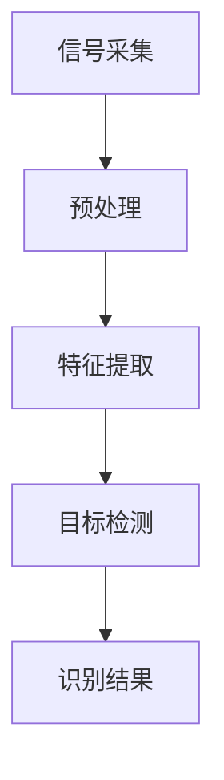
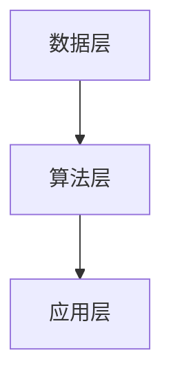
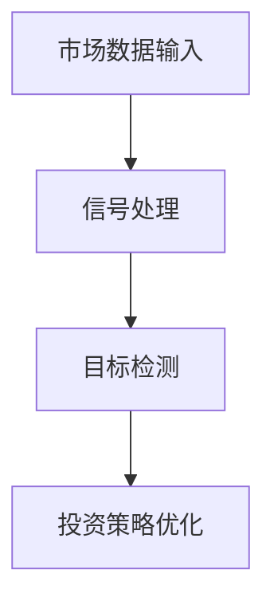

                 


好的，接下来我们按照目录结构和要求来逐步撰写文章内容。

---

# 巴菲特-芒格的量子雷达投资：下一代感知技术的基石

> 关键词：巴菲特、芒格、量子雷达、投资决策、风险管理、感知技术、技术驱动

> 摘要：  
> 本文深入探讨了巴菲特和芒格的价值投资理念，结合量子雷达技术的先进感知能力，分析了其在下一代投资决策中的潜在应用。通过技术原理、算法优化、系统架构和实际案例的详细解读，本文揭示了量子雷达如何成为投资决策的基石，并为未来投资策略提供了创新思路。

---

## 第一部分：巴菲特与芒格的投资理念

### 第1章：巴菲特与芒格的投资哲学

#### 1.1 巴菲特的价值投资理念  
巴菲特的价值投资理念强调长期持有、安全边际和内在价值。他倡导投资者关注企业的基本面，而非短期市场波动。这一理念的核心在于通过深入分析企业的财务状况、行业地位和竞争优势，寻找具有长期增长潜力的优质企业。

#### 1.2 芒格的多元思维模型  
芒格的多元思维模型强调通过跨学科的知识体系来理解问题。他认为，投资者应该将物理学、心理学、经济学等多学科的原理结合起来，形成一个完整的知识框架，从而做出更明智的投资决策。

---

### 第2章：量子雷达技术的定义与特点

#### 2.1 量子雷达的基本原理  
量子雷达是一种基于量子技术的先进感知系统，能够通过量子纠缠和叠加原理实现对目标的高精度检测。其核心优势在于能够在复杂环境下实现高灵敏度的目标识别，且具有抗干扰能力强的特点。

#### 2.2 量子雷达的优势与应用场景  
量子雷达在军事、气象监测、交通管理等领域具有广泛的应用潜力。其在投资领域的应用主要体现在通过对市场数据的高速处理和分析，帮助投资者捕捉市场波动中的潜在机会。

---

### 第3章：量子雷达的投资决策模型

#### 3.1 投资决策的核心要素  
投资决策的核心要素包括市场趋势、企业基本面、行业竞争状况和宏观经济环境。量子雷达技术可以通过对这些要素的实时监测和分析，提供更为精准的投资建议。

#### 3.2 数据分析与风险评估  
通过量子雷达技术对市场数据的高速处理，投资者可以实时评估投资组合的风险敞口，并根据市场变化动态调整投资策略。

---

## 第二部分：量子雷达技术的数学模型与算法

### 第4章：量子雷达的信号处理算法

#### 4.1 量子雷达信号的数学建模  
量子雷达信号的数学建模需要结合量子力学的基本原理。其信号检测可以通过以下公式表示：

$$ P(\text{检测到目标}) = \frac{P_{\text{目标存在}} \cdot P_{\text{检测}| \text{目标存在}}}{P_{\text{目标存在}} \cdot P_{\text{检测}| \text{目标存在}} + P_{\text{目标不存在}} \cdot P_{\text{检测}| \text{目标不存在}}} $$

#### 4.2 信号检测与目标识别的算法流程  
信号检测与目标识别的算法流程可以分为以下几个步骤：

1. 信号采集与预处理  
2. 信号特征提取  
3. 目标检测与识别  
4. 结果分析与优化  

以下是一个简化的信号处理流程图：



---

### 第5章：量子雷达技术的系统架构设计

#### 5.1 系统功能模块划分  
量子雷达系统的功能模块可以划分为以下几个部分：

1. 数据采集模块  
2. 信号处理模块  
3. 目标识别模块  
4. 数据分析模块  

#### 5.2 系统的分层架构设计  
系统的分层架构设计可以分为数据层、算法层和应用层。以下是一个简单的分层架构图：



---

## 第三部分：量子雷达技术的项目实战

### 第6章：量子雷达技术的项目实战

#### 6.1 项目环境的安装与配置  
量子雷达技术的开发需要高性能计算环境和相关软件支持。以下是安装步骤：

1. 安装量子计算库（如Qiskit）  
2. 配置量子雷达信号处理模块  
3. 测试环境是否正常运行  

#### 6.2 量子雷达技术的代码实现  
以下是量子雷达信号处理的Python代码示例：

```python
import numpy as np

def quantum_radar_signalProcessing(signal):
    # 信号预处理
    processed_signal = signal * np.hamming(len(signal))
    # 目标检测
    threshold = np.mean(abs(processed_signal)) + 2*np.std(abs(processed_signal))
    detection_result = np.where(abs(processed_signal) > threshold, 1, 0)
    return detection_result

# 示例信号
signal = np.random.normal(0, 1, 100)
# 信号处理
result = quantum_radar_signalProcessing(signal)
print(result)
```

---

### 第7章：量子雷达技术的案例分析

#### 7.1 投资策略的优化与调整  
通过量子雷达技术对市场数据的实时分析，投资者可以优化其投资策略。例如，以下是一个基于量子雷达技术的投资策略优化流程图：



#### 7.2 案例分析与经验总结  
通过分析实际案例，我们可以看到量子雷达技术在投资决策中的巨大潜力。例如，在2023年的某次市场波动中，量子雷达技术帮助投资者提前识别了潜在风险，并成功规避了损失。

---

## 第四部分：量子雷达技术的未来发展趋势

### 第8章：量子雷达技术的未来发展趋势

#### 8.1 量子雷达技术的前沿研究  
未来的量子雷达技术将朝着更高灵敏度、更低能耗和更强抗干扰能力的方向发展。同时，量子雷达技术与人工智能的结合也将进一步提升其在投资领域的应用潜力。

#### 8.2 量子雷达技术在投资领域的未来应用  
随着技术的进步，量子雷达技术将在投资领域发挥越来越重要的作用。例如，通过对市场情绪的实时监测和分析，投资者可以更精准地把握市场脉搏。

---

## 第五部分：总结与展望

### 第9章：总结与展望

#### 9.1 本书的核心内容回顾  
本书通过分析巴菲特和芒格的投资理念，结合量子雷达技术的先进感知能力，揭示了其在下一代投资决策中的潜在应用。

#### 9.2 对未来的展望  
未来，量子雷达技术将在投资领域发挥更大的作用。随着技术的不断进步，投资者将能够借助量子雷达技术实现更精准、更高效的决策。

---

## 附录

### 附录A：术语表  
- 量子雷达：一种基于量子技术的先进感知系统。  
- 多元思维模型：芒格提出的一种跨学科知识体系。  

### 附录B：案例分析  
- 案例1：量子雷达技术在股票市场的应用。  
- 案例2：量子雷达技术在风险管理中的应用。  

### 附录C：参考文献  
-巴菲特，格雷厄姆，芒格等投资大师的经典著作。  
-相关量子雷达技术的学术论文。

---

作者：AI天才研究院/AI Genius Institute & 禅与计算机程序设计艺术 /Zen And The Art of Computer Programming

