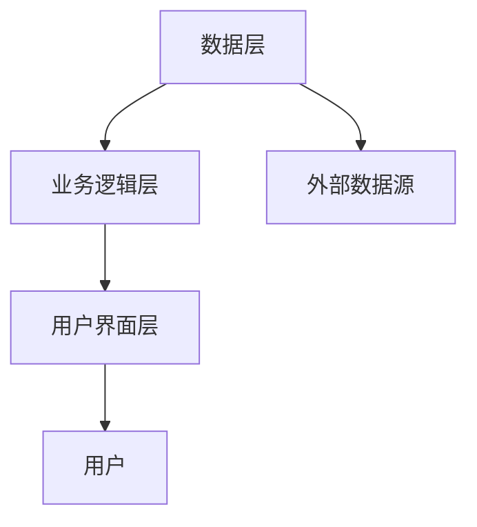
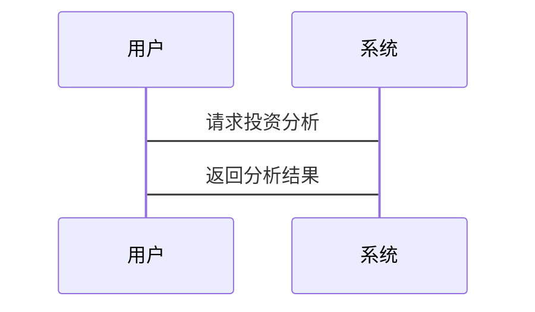

                 


# 巴菲特-芒格的长寿经济投资：人口老龄化带来的机遇

> 关键词：巴菲特，芒格，长寿经济，人口老龄化，投资策略，系统分析

> 摘要：本文将从巴菲特和芒格的投资理念出发，结合人口老龄化带来的长寿经济机遇，分析如何通过系统化的投资策略和技术手段，抓住这一经济趋势中的投资机会。文章将涵盖背景介绍、核心概念、算法原理、系统分析、项目实战等内容，帮助读者理解并应用这一投资策略。

---

## 第1章: 长寿经济的背景与定义

### 1.1 人口老龄化趋势的全球分析

#### 1.1.1 人口老龄化的基本概念
人口老龄化是指65岁及以上人口占总人口比例不断上升的趋势。这一现象在全球范围内普遍存在，尤其是在发达国家和发展中国家中尤为明显。

#### 1.1.2 全球人口老龄化现状与趋势
根据联合国数据，2020年全球65岁及以上人口数量为10亿，预计到2050年将增加到16亿。这一趋势将对全球经济和社会结构产生深远影响。

#### 1.1.3 中国与发达国家人口老龄化对比
中国的老龄化速度远超发达国家，预计将在未来几十年内成为老龄化最严重的国家之一。与发达国家相比，中国在医疗技术和社会福利方面仍有差距。

### 1.2 长寿经济的定义与特征

#### 1.2.1 长寿经济的定义
长寿经济是指在人口老龄化背景下，围绕老年人口需求而产生的经济活动。包括医疗、养老、健康等相关产业。

#### 1.2.2 长寿经济的核心特征
- **需求多样化**：老年人需要医疗、护理、住房等多方面支持。
- **长期性**：长寿经济是一个长期持续的过程，涉及多代人。
- **政策驱动**：政府政策对长寿经济的发展起着关键作用。

#### 1.2.3 长寿经济与传统经济模式的区别
| 特性        | 长寿经济              | 传统经济            |
|-------------|-----------------------|--------------------|
| 主要驱动力  | 人口老龄化            | 经济增长            |
| 消费群体    | 老年人为主            | 全体人口            |
| 关键领域    | 医疗、养老、健康      | 制造业、服务业      |

### 1.3 巴菲特与芒格的投资理念

#### 1.3.1 巴菲特的价值投资理论
巴菲特强调长期价值投资，注重企业的基本面和护城河。他认为，投资成功的前提是选择具备长期竞争优势的企业。

#### 1.3.2 芒格的多元思维模型
芒格提倡用跨学科的思维方式来分析问题，强调在复杂决策中运用多种知识框架。

#### 1.3.3 两人投资理念的结合
巴菲特和芒格的理念结合在一起，形成了注重长期价值、基本面分析和多元思维的投资策略。

---

## 第2章: 长寿经济的核心驱动因素

### 2.1 长寿经济的主要驱动因素

#### 2.1.1 医疗技术进步
医疗技术的进步延长了人类寿命，同时降低了医疗成本。例如，基因编辑和人工智能在医疗领域的应用。

#### 2.1.2 人均寿命延长
人均寿命的延长直接推动了长寿经济的发展，老年人口的需求将推动相关产业的增长。

#### 2.1.3 社会福利制度的完善
完善的福利制度为老年人提供了经济保障，进一步刺激了长寿经济的发展。

### 2.2 巴菲特与芒格视角下的长寿经济

#### 2.2.1 长寿经济中的投资机会
- **医疗健康行业**：投资于具备技术优势和品牌优势的医疗企业。
- **养老服务行业**：关注具备连锁化、标准化能力的企业。
- **人寿保险与再保险行业**：保险业务与老龄化密切相关，具有长期稳定的收益。

#### 2.2.2 长寿经济中的风险因素
- **政策风险**：政府政策的变化可能对行业产生重大影响。
- **技术风险**：医疗技术的快速迭代可能导致部分企业被淘汰。
- **财务风险**：老龄化可能导致政府财政压力增加，进而影响社会福利支出。

#### 2.2.3 长寿经济与企业长期价值的关系
通过分析企业的财务健康状况、管理层能力和市场地位，巴菲特和芒格能够识别出具备长期竞争优势的企业。

---

## 第3章: 长寿经济中的投资策略分析

### 3.1 巴菲特与芒格投资策略的核心要素

#### 3.1.1 企业护城河的重要性
护城河是企业抵御竞争的核心能力，包括专利、品牌、成本优势等。

#### 3.1.2 企业的财务健康状况
关注企业的盈利能力、资产负债表和现金流情况，选择财务健康的企业进行投资。

#### 3.1.3 管理层的诚信与能力
管理层的决策能力和诚信是企业长期发展的关键因素。

### 3.2 长寿经济中的具体投资领域

#### 3.2.1 医疗健康行业
- **投资方向**：基因编辑、人工智能医疗、远程医疗等。
- **案例分析**：投资于具备技术领先优势的医疗科技公司。

#### 3.2.2 养老服务行业
- **投资方向**：连锁化养老服务、智慧养老技术。
- **案例分析**：选择具备标准化服务和强大品牌影响力的企业。

#### 3.2.3 人寿保险与再保险行业
- **投资方向**：长期寿险产品、健康险业务。
- **案例分析**：投资于具有稳定保费收入和良好赔付记录的保险公司。

### 3.3 投资策略的数学模型与分析

#### 3.3.1 多因素投资模型
通过多元回归分析，将多个因素（如企业基本面、行业趋势、政策环境）进行综合评估。

$$ \text{投资价值} = \beta_1 \times \text{企业基本面} + \beta_2 \times \text{行业趋势} + \beta_3 \times \text{政策环境} $$

#### 3.3.2 风险调整后的收益分析
使用夏普比率（Sharpe Ratio）来评估投资组合的风险调整后收益。

$$ \text{夏普比率} = \frac{\text{投资组合收益} - \text{无风险利率}}{\text{投资组合标准差}} $$

---

## 第4章: 系统分析与架构设计方案

### 4.1 问题场景介绍
在长寿经济背景下，投资者需要构建一个系统化的投资分析框架，以应对复杂多变的市场环境。

### 4.2 系统功能设计
- **数据采集模块**：收集企业基本面数据、行业趋势和政策信息。
- **数据分析模块**：运用多元回归分析模型进行投资评估。
- **风险评估模块**：计算投资组合的风险调整后收益。

### 4.3 系统架构设计
使用分层架构，包括数据层、业务逻辑层和用户界面层。



### 4.4 系统接口设计
- **数据接口**：与金融数据源（如 Bloomberg）对接。
- **用户接口**：提供直观的分析结果展示。

### 4.5 系统交互设计
使用序列图展示用户与系统之间的交互流程。



---

## 第5章: 项目实战

### 5.1 环境安装
- 安装Python和相关库（如 numpy、pandas、scikit-learn）。
- 安装金融数据分析工具（如 Pandas DataReader）。

### 5.2 核心代码实现

```python
import numpy as np
import pandas as pd
from sklearn.linear_model import LinearRegression

# 数据准备
X = df[['企业基本面', '行业趋势', '政策环境']]
y = df['投资价值']

# 建立模型
model = LinearRegression()
model.fit(X, y)

# 预测
predictions = model.predict(X)
```

### 5.3 案例分析
以某地区为例，分析其长寿经济投资机会，结合模型预测结果提出投资建议。

---

## 第6章: 总结与展望

### 6.1 最佳实践
- **长期视角**：关注企业的长期价值，而非短期波动。
- **多元化投资**：分散投资以降低风险。
- **持续学习**：关注行业动态和技术进步。

### 6.2 小结
通过系统化的分析和投资策略，投资者可以在人口老龄化背景下，抓住长寿经济带来的投资机遇。

### 6.3 注意事项
- **政策风险**：密切关注政府政策变化。
- **技术风险**：保持对新技术的关注和应用。

### 6.4 拓展阅读
推荐阅读巴菲特和芒格的经典著作，以及相关领域的学术研究。

---

## 作者

作者：AI天才研究院/AI Genius Institute & 禅与计算机程序设计艺术 /Zen And The Art of Computer Programming

