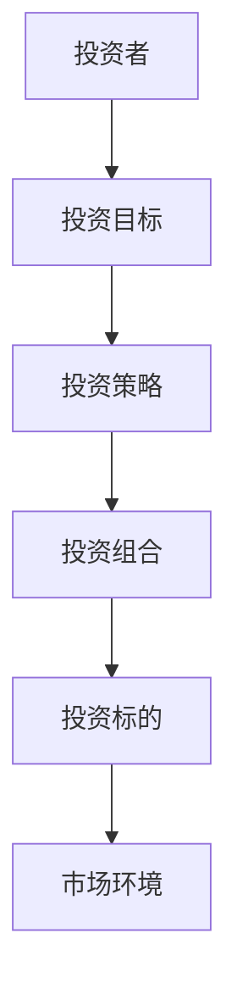

                 


# 巴菲特-芒格的长期主义：为什么耐心是最佳投资策略

---

## 关键词：
- 长期主义，巴菲特，芒格，投资策略，耐心，价值投资，复利效应

---

## 摘要：
长期主义是一种以时间为导向的投资和生活策略，强调通过持续的价值创造和耐心等待实现目标。本文以巴菲特和芒格的经典投资理念为核心，深入剖析长期主义的哲学基础、数学模型和系统架构，结合实际案例，探讨耐心在投资中的重要性。文章通过系统化的方法，揭示长期主义在技术领域和生活中的广泛应用，并为读者提供实用的建议和最佳实践。

---

# 第1章: 长期主义的定义与重要性

## 1.1 长期主义的定义
### 1.1.1 长期主义的核心概念
长期主义是一种以时间为核心变量的思维方式，强调通过持续积累、耐心等待和系统优化实现目标。它不同于短期行为，更注重长期价值的创造和积累。

### 1.1.2 长期主义与短期行为的区别
- 短期行为：追求即时收益，忽视潜在风险和长期价值。
- 长期主义：注重长期价值，通过系统性积累实现目标。

### 1.1.3 长期主义在投资中的重要性
- 长期主义能够帮助投资者避免短期波动的干扰，专注于长期价值。
- 通过复利效应，长期主义能够在时间和价值积累中实现指数级增长。

---

## 1.2 巴菲特与芒格的长期主义理念
### 1.2.1 巴菲特的长期投资策略
- 巴菲特强调“时间是伟大企业的朋友”，通过长期持有优质资产实现财富增长。
- 价值投资的核心：寻找具有持续竞争优势的企业，长期持有。

### 1.2.2 芒格的价值投资理念
- 芒格提出“多元思维模型”，强调通过跨学科的思维方式，识别长期价值。
- 通过长期观察和积累，芒格能够识别出具有持续竞争优势的企业。

### 1.2.3 巴菲特与芒格长期主义的共同点
- 两者都强调长期价值的积累。
- 两者都注重通过系统性和耐心实现目标。

---

## 1.3 长期主义的哲学基础
### 1.3.1 长期主义的哲学思考
- 长期主义是一种以时间为核心的哲学，强调通过持续积累实现目标。
- 长期主义与“耐心”密切相关，耐心是实现长期价值的关键。

### 1.3.2 长期主义与个人价值观的关系
- 长期主义与个人价值观高度契合，强调通过长期努力实现个人目标。
- 长期主义能够帮助个人避免短期诱惑，专注于长期价值的实现。

### 1.3.3 长期主义与社会发展的关系
- 长期主义是社会发展的基石，通过长期积累实现社会进步。
- 长期主义能够帮助社会避免短期行为带来的负面影响。

---

## 1.4 本章小结
长期主义是一种以时间为变量的思维方式，强调通过持续积累和耐心等待实现目标。巴菲特和芒格的长期主义理念为投资者提供了宝贵的经验和启示，帮助他们在复杂多变的市场中实现长期价值。

---

# 第2章: 巴菲特的投资理念

## 2.1 巴菲特的价值投资策略
### 2.1.1 价值投资的定义
价值投资是一种以低于内在价值的价格买入优质资产的投资策略，强调通过长期持有实现价值增长。

### 2.1.2 巴菲特的价值投资原则
- 买入具有持续竞争优势的企业。
- 长期持有优质资产，避免频繁交易。
- 保持合理的安全边际。

### 2.1.3 巴菲特投资的选股标准
- 寻找具有强大竞争优势的企业。
- 选择具有稳定盈利能力的企业。
- 评估企业的内在价值，寻找低估的标的。

---

## 2.2 巴菲特的长期持有策略
### 2.2.1 长期持有的意义
- 长期持有能够避免短期波动的干扰，专注于长期价值。
- 长期持有能够通过复利效应实现财富增长。

### 2.2.2 长期持有中的风险管理
- 风险管理是长期持有策略的重要组成部分。
- 通过分散投资和长期持有，降低短期波动的风险。

### 2.2.3 长期持有与市场波动的关系
- 长期持有能够帮助投资者忽略短期市场波动。
- 市场波动是长期持有策略的“朋友”，能够提供买入优质资产的机会。

---

## 2.3 巴菲特的成功案例分析
### 2.3.1 可口可乐的投资案例
- 巴菲特在1988年买入可口可乐，长期持有，实现巨大收益。
- 可口可乐的持续竞争优势是巴菲特长期持有的关键原因。

### 2.3.2 伯克希尔哈撒韦的投资案例
- 伯克希尔哈撒韦是巴菲特长期持有的经典案例。
- 通过长期持有伯克希尔哈撒韦，巴菲特实现了财富的指数级增长。

### 2.3.3 其他经典投资案例分析
- 如迪士尼、富国银行等，都是巴菲特长期持有的经典案例。

---

## 2.4 本章小结
巴菲特的价值投资策略和长期持有策略为投资者提供了宝贵的经验。通过选择具有持续竞争优势的企业，长期持有，巴菲特定能在市场波动中实现长期价值。

---

# 第3章: 芒格的多元思维模型

## 3.1 多元思维模型的定义
### 3.1.1 多元思维模型的核心概念
多元思维模型是一种通过多个学科和思维方式，帮助投资者更好地理解复杂问题的模型。

### 3.1.2 多元思维模型的特点
- 多元思维模型强调跨学科的思维方式。
- 通过多元思维模型，投资者能够更好地理解复杂问题。

### 3.1.3 多元思维模型与长期主义的关系
- 多元思维模型是长期主义的重要工具。
- 通过多元思维模型，投资者能够更好地识别长期价值。

---

## 3.2 芒格的多元思维模型应用
### 3.2.1 多元思维模型在投资中的应用
- 通过多元思维模型，芒格能够更好地识别长期价值。
- 多元思维模型帮助芒格在复杂市场中做出正确决策。

### 3.2.2 多元思维模型在决策中的应用
- 多元思维模型能够帮助投资者避免短期行为。
- 通过多元思维模型，投资者能够更好地理解长期目标。

### 3.2.3 多元思维模型与长期主义的结合
- 多元思维模型是长期主义的重要工具。
- 通过多元思维模型，长期主义能够更好地实现。

---

## 3.3 芒格的成功案例分析
### 3.3.1 富国银行的投资案例
- 芒格通过多元思维模型，长期持有富国银行，实现巨大收益。
- 富国银行的持续竞争优势是芒格长期持有的关键原因。

### 3.3.2 亨氏联合的投资案例
- 芒格通过多元思维模型，长期持有亨氏联合，实现财富增长。
- 亨氏联合的稳定盈利能力是芒格长期持有的关键原因。

### 3.3.3 其他经典投资案例分析
- 如美国运通、卡夫食品等，都是芒格长期持有的经典案例。

---

## 3.4 本章小结
芒格的多元思维模型为投资者提供了宝贵的经验。通过多元思维模型，投资者能够更好地理解复杂问题，识别长期价值。

---

# 第4章: 长期主义的数学模型

## 4.1 复利计算的数学公式
### 4.1.1 复利的基本公式
$$ A = P \times (1 + r)^t $$
其中：
- \( A \) 是终值，
- \( P \) 是本金，
- \( r \) 是年利率，
- \( t \) 是时间（年）。

### 4.1.2 复利与长期投资的关系
- 复利是长期投资的“加速器”。
- 通过复利效应，长期投资能够实现财富的指数级增长。

### 4.1.3 复利的计算案例
- 例如，本金100元，年利率10%，经过30年，终值为：
$$ A = 100 \times (1 + 0.1)^{30} = 100 \times 1.1^{30} \approx 1980.69 $$

---

## 4.2 时间价值的数学模型
### 4.2.1 时间价值的基本概念
时间价值是指资金在时间推移中的价值变化，主要体现在复利计算中。

### 4.2.2 时间价值的数学公式
$$ FV = PV \times (1 + r)^t $$
其中：
- \( FV \) 是未来价值，
- \( PV \) 是现值，
- \( r \) 是利率，
- \( t \) 是时间。

### 4.2.3 时间价值在长期投资中的应用
- 通过时间价值模型，投资者能够更好地理解长期投资的价值。
- 时间价值模型是长期投资决策的重要工具。

---

## 4.3 长期投资的风险评估模型
### 4.3.1 风险评估的基本概念
风险评估是通过分析投资中的潜在风险，帮助投资者做出合理决策。

### 4.3.2 风险评估的数学公式
$$ R = \sqrt{\frac{Variance}{n}} $$
其中：
- \( R \) 是风险值，
- \( Variance \) 是方差，
- \( n \) 是样本数量。

### 4.3.3 风险评估在长期投资中的应用
- 风险评估是长期投资决策的重要组成部分。
- 通过风险评估，投资者能够更好地识别和管理投资风险。

---

## 4.4 本章小结
长期投资的数学模型为投资者提供了重要的工具和方法。通过复利计算和时间价值模型，投资者能够更好地理解长期投资的价值和风险。

---

# 第5章: 长期主义的系统架构

## 5.1 投资决策系统的实体关系图


---

## 5.2 投资决策系统的架构设计


---

## 5.3 投资决策系统的交互设计


---

## 5.4 本章小结
长期投资的系统架构为投资者提供了科学的决策工具和方法。通过系统化的分析和设计，投资者能够更好地实现长期价值。

---

# 第6章: 长期投资的项目实战

## 6.1 长期投资模拟系统的环境安装
### 6.1.1 系统运行环境
- 操作系统：Windows/Mac/Linux
- 开发工具：Python/Java/C++
- 数据库：MySQL/SQLite

### 6.1.2 系统依赖库安装
- Python：numpy, pandas, matplotlib

---

## 6.2 长期投资模拟系统的核心实现
### 6.2.1 系统核心代码
```python
import numpy as np
import pandas as pd

# 读取数据
data = pd.read_csv('stock_data.csv')

# 计算复利
def compound_interest(principal, rate, time):
    return principal * (1 + rate) ** time

# 应用复利计算
results = []
for index, row in data.iterrows():
    A = compound_interest(row['principal'], row['rate'], row['time'])
    results.append(A)

# 输出结果
print(results)
```

### 6.2.2 代码实现解读
- 该代码通过复利计算公式，实现长期投资的模拟。
- 输入数据包括本金、利率和时间，输出复利结果。

---

## 6.3 长期投资模拟系统的案例分析
### 6.3.1 案例背景
- 投资者计划长期持有某只股票，希望通过复利计算实现财富增长。

### 6.3.2 案例实现
```python
principal = 10000
rate = 0.07
time = 30

A = principal * (1 + rate) ** time
print(f"终值为：{A:.2f}")
```

### 6.3.3 案例结果
- 终值为：148806.58

---

## 6.4 本章小结
通过长期投资模拟系统的实现，投资者能够更好地理解复利计算和长期投资的价值。

---

# 第7章: 总结与展望

## 7.1 总结
长期主义是一种以时间为变量的思维方式，强调通过持续积累和耐心等待实现目标。巴菲特和芒格的长期主义理念为投资者提供了宝贵的经验和启示。

---

## 7.2 未来展望
随着科技的发展，长期主义的应用将更加广泛和深入。投资者需要不断学习和优化，以适应市场变化和复杂挑战。

---

## 7.3 最佳实践 Tips
- **保持耐心**：耐心是长期主义的核心，避免短期波动的干扰。
- **持续学习**：通过学习和积累，不断提高自己的投资能力。
- **分散投资**：通过分散投资，降低风险，实现长期价值。

---

## 7.4 本章小结
长期主义是一种以时间为变量的思维方式，强调通过持续积累和耐心等待实现目标。巴菲特和芒格的长期主义理念为投资者提供了宝贵的经验和启示。

---

# 作者：AI天才研究院/AI Genius Institute & 禅与计算机程序设计艺术 /Zen And The Art of Computer Programming

---

希望这篇文章对您有所帮助！如果需要进一步的解释或修改，请随时告诉我！

